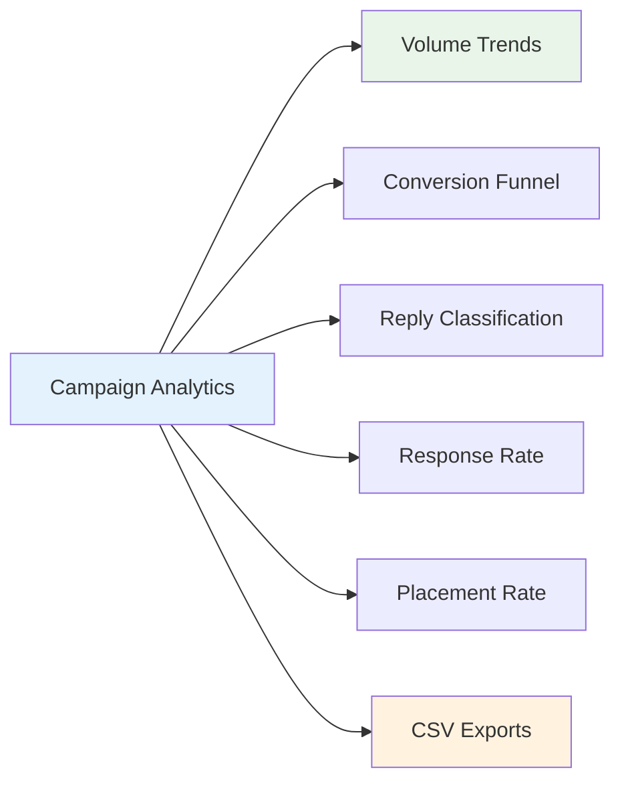

# Analytics

Track campaign performance with built-in analytics including send volume trends, conversion funnels, reply classification breakdowns, and CSV exports.

## Dashboard Overview

The analytics tab provides a comprehensive view of your outreach performance:



## Metrics

### Send Volume Trends

A line chart showing daily email send volume over a configurable time window (7, 14, 30, or 90 days).

- **X-axis**: Date.
- **Y-axis**: Number of emails sent.
- **Use case**: Spot trends, ensure consistent outreach cadence, stay within daily caps.

### Conversion Funnel

A bar chart showing lead counts at each status stage:

| Stage | Description |
|---|---|
| Discovered | Total leads found. |
| Contacted | Leads that received an outreach email. |
| Replied | Leads that responded (interested or neutral). |
| Placed | Leads that resulted in a published backlink. |

- **Use case**: Identify bottlenecks in your outreach pipeline.

### Reply Classification

A breakdown of auto-classified replies:

| Classification | Color | Meaning |
|---|---|---|
| Interested | Green | Positive response — follow up! |
| Not interested | Red | Declined — auto-suppressed. |
| Out of office | Yellow | Auto-responder — schedule follow-up. |
| Replied | Blue | General response — needs review. |

### Response Rate

Percentage of sent emails that received any reply:

```
Response Rate = (Total Replies / Total Sent) × 100
```

### Placement Rate

Percentage of contacted leads that resulted in a published backlink:

```
Placement Rate = (Placed Leads / Contacted Leads) × 100
```

## Analytics API

### Campaign Analytics

**API:** `GET /api/v1/backlink-outreach/campaigns/{campaign_id}/analytics`

**Query parameters:**

| Parameter | Type | Default | Description |
|---|---|---|---|
| `days` | int | `30` | Number of days to include in trends. |

**Response:**

```json
{
  "total_leads": 150,
  "leads_by_status": {
    "discovered": 80,
    "contacted": 45,
    "replied": 18,
    "placed": 7,
    "bounced": 5
  },
  "total_attempts": 52,
  "total_replies": 23,
  "replies_by_classification": {
    "interested": 12,
    "not_interested": 5,
    "out_of_office": 3,
    "replied": 3
  },
  "response_rate": 0.44,
  "placement_rate": 0.16,
  "daily_send_volume": [
    {"date": "2025-01-15", "count": 8},
    {"date": "2025-01-16", "count": 12}
  ]
}
```

### Reporting Snapshot

Cross-campaign analytics across all campaigns for the authenticated user.

**API:** `GET /api/v1/backlink-outreach/reporting/snapshot`

**Response:**

```json
{
  "total_campaigns": 5,
  "total_sends": 342,
  "total_replies": 87,
  "total_placements": 14,
  "overall_response_rate": 0.25,
  "overall_placement_rate": 0.04
}
```

!!! note "Reply counting"
    The reporting snapshot counts `OutreachReply` records (not `status == "replied"` on attempts). This ensures accuracy — a lead marked "replied" manually without an actual reply record won't inflate the count.

## CSV Exports

Export campaign data as CSV files for CRM import, spreadsheet analysis, or client reporting.

### Export Leads

**API:** `GET /api/v1/backlink-outreach/campaigns/{campaign_id}/export/leads`

### Export Attempts

**API:** `GET /api/v1/backlink-outreach/campaigns/{campaign_id}/export/attempts`

### Export Replies

**API:** `GET /api/v1/backlink-outreach/campaigns/{campaign_id}/export/replies`

### CSV Safety

All exports include these safety measures:

| Measure | Purpose |
|---|---|
| Explicit fieldnames | Only expected columns are included. |
| `extrasaction="ignore"` | Unexpected fields are silently dropped. |
| Formula injection sanitization | Cells starting with `=`, `+`, `-`, `@` are prefixed with a single quote to prevent formula injection in spreadsheets. |

!!! warning "Export loading"
    Exports may take a few seconds for large campaigns. The UI shows an "Exporting..." state with a disabled button while the download is in progress.

## UI Features

### Time Window Selector

Choose from 7, 14, 30, or 90 days for trend charts. The analytics data is re-fetched when the window changes.

### Separate Loading States

Each data section (attempts, replies, analytics) has its own loading indicator, so slow analytics queries don't block the entire page.

### Error Handling

If analytics or export requests fail, a toast notification shows the error message. On 5xx server errors, the store automatically retries read operations once with exponential backoff.

---

*Next: [API Reference](api-reference.md) — full endpoint documentation.*
