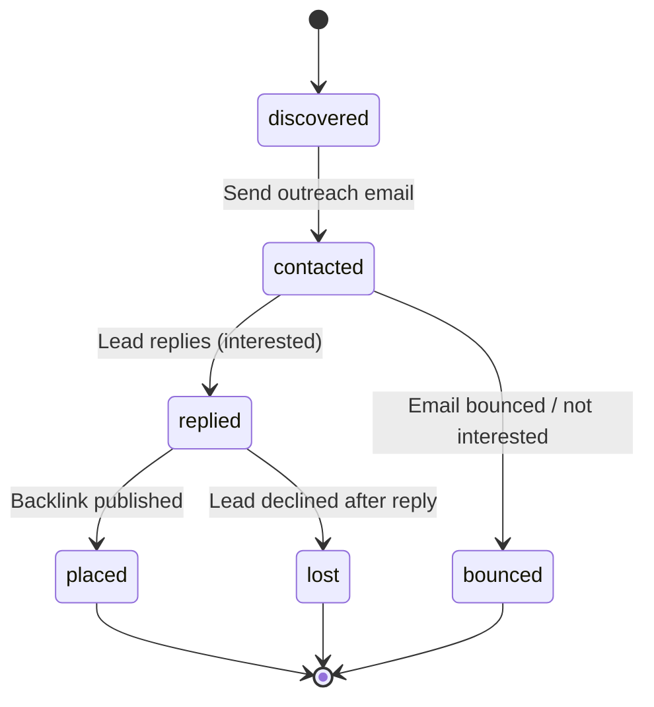

# Campaign Management

Campaigns are the top-level organizational unit for backlink outreach. Every lead, email, attempt, reply, and analytics data point belongs to a campaign.

## Creating a Campaign

A campaign requires only a name. Add a description and keywords to make discovery and reporting easier.

**API:** `POST /api/v1/backlink-outreach/campaigns`

```json
{
  "name": "SaaS Growth Blogs Q3",
  "description": "Outreach to SaaS marketing blogs for guest post placements",
  "keywords": ["SaaS", "growth marketing", "B2B"]
}
```

**UI:** Navigate to **Backlink Outreach → Campaigns → + New Campaign**.

!!! tip "Naming conventions"
    Use a consistent naming scheme like `[Vertical] [Content Type] [Period]` — e.g., "Fitness Guest Posts June" or "AI Startups Roundup Q3".

## Campaign List View

The campaign list shows:
- **Name** and description
- **Lead count** broken down by status
- **Creation date**
- **Quick actions**: Add leads, view analytics, manage templates

## Campaign Detail View

Click a campaign to see its full detail:
- **Leads tab**: All leads with status, quality score, and actions.
- **Email tab**: Compose and preview outreach emails.
- **Outreach tab**: Send emails, view attempts, manage follow-ups.
- **Inbox tab**: Replies with auto-classification tags.
- **Analytics tab**: Campaign-specific charts and metrics.

## Managing Leads

### Adding Leads

**Single lead:**
`POST /api/v1/backlink-outreach/campaigns/{campaign_id}/leads`

```json
{
  "website_url": "https://example.com",
  "website_title": "Example Marketing Blog",
  "contact_email": "editor@example.com",
  "quality_score": 0.85,
  "relevance_score": 0.72,
  "guest_post_likelihood": 0.65,
  "source": "manual"
}
```

**Bulk add:**
`POST /api/v1/backlink-outreach/campaigns/{campaign_id}/leads/bulk`

Send an array of lead objects to add multiple leads at once.

### Updating Lead Status

Lead status lifecycle:



**Single update:** Click the status button on a lead card.

**Bulk update:** Select multiple leads → choose new status → confirm.

!!! warning "Bulk status updates"
    Bulk updates may partially fail. If some leads can't be updated, the response includes a `failed` list and the UI shows a warning toast with the count of failures.

## Deleting a Campaign

`DELETE /api/v1/backlink-outreach/campaigns/{campaign_id}`

!!! warning "Irreversible"
    Deleting a campaign removes all associated leads, attempts, replies, and analytics data. This action cannot be undone.

## Campaign Organization Best Practices

| Practice | Why |
|---|---|
| One campaign per vertical | Keeps leads relevant and analytics clean. |
| Add keywords at creation | Powers better discovery queries later. |
| Review leads before sending | Avoid wasting daily caps on low-quality leads. |
| Archive completed campaigns | Keeps the campaign list manageable. |
| Use consistent naming | Easier to find and compare campaigns later. |

---

*Next: [Discovery](discovery.md) — finding opportunities with AI-powered search.*
