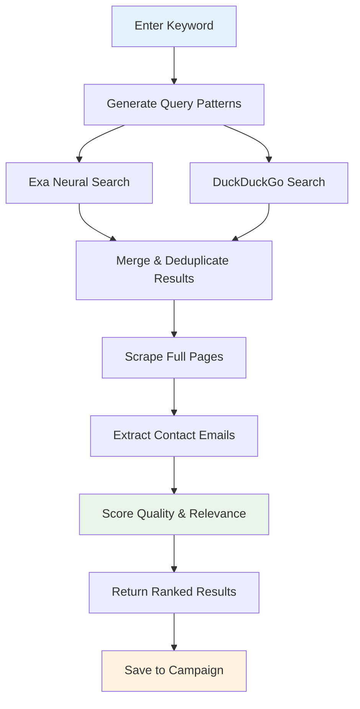

# Discovery

The discovery system finds websites that accept guest posts in your niche using AI-powered search across multiple engines.

## How It Works



## Search Engines

### Exa Neural Search

Exa uses semantic understanding to find pages that *mean* what you're looking for, not just pages that contain the keywords.

- **Strength**: High-relevance results, understands context.
- **Limitation**: Requires `EXA_API_KEY` environment variable.
- **Best for**: Niche-specific discovery, finding high-quality sites.

### DuckDuckGo Search

DuckDuckGo provides broad coverage with traditional keyword matching.

- **Strength**: No API key required, broad coverage.
- **Limitation**: Less semantic understanding.
- **Best for**: Broad discovery, supplementing Exa results.

## Query Patterns

The system automatically generates multiple search queries from your keyword:

| Pattern | Example (keyword: "AI marketing") |
|---|---|
| `{keyword} write for us` | "AI marketing write for us" |
| `{keyword} guest post` | "AI marketing guest post" |
| `{keyword} contribute` | "AI marketing contribute" |
| `{keyword} submit article` | "AI marketing submit article" |
| `{keyword} become a contributor` | "AI marketing become a contributor" |
| `{keyword} guest contributor guidelines` | "AI marketing guest contributor guidelines" |

## Deep Discovery

Deep discovery goes beyond search results by:

1. **Scraping full pages** — not just snippets, but the complete HTML.
2. **Extracting contact emails** — parses `mailto:` links, contact pages, and author bios.
3. **Detecting guest post guidelines** — identifies pages with "write for us" or submission instructions.
4. **Scoring quality** — assigns a 0-1 quality score based on relevance, authority signals, and content quality.
5. **Scoring confidence** — assigns a 0-1 confidence score for guest-post likelihood.

**API:** `POST /api/v1/backlink-outreach/discover/deep`

```json
{
  "keyword": "AI marketing",
  "campaign_id": "uuid-of-campaign",
  "max_results": 20,
  "save_to_campaign": true
}
```

!!! note "Automatic saving"
    When `save_to_campaign` is `true`, discovered leads are automatically saved to the specified campaign. The response includes `saved_to_campaign` and `save_failed` counts.

## Result Scoring

Each result is scored on two dimensions:

### Quality Score (0-1)

How relevant and authoritative is the site for your keyword?

| Factor | Weight |
|---|---|
| Keyword relevance in title/URL | High |
| Domain authority signals | Medium |
| Content freshness | Low |
| Site structure (blog section) | Medium |

### Confidence Score (0-1)

How likely is the site to accept guest posts?

| Factor | Weight |
|---|---|
| "Write for us" page found | Very High |
| Guest post guidelines detected | High |
| Contact email found | High |
| Previous guest posts on site | Medium |
| Blog section exists | Low |

## Reviewing Results

After discovery, review each result:

| Badge | Meaning |
|---|---|
| **Email found** | A contact email was extracted from the page. |
| **Has guidelines** | A guest post guidelines page was detected. |
| **High quality** | Quality score > 0.7. |
| **High confidence** | Confidence score > 0.7. |

!!! tip "Prioritize leads"
    Focus on leads with both "Email found" and "Has guidelines" badges — these have the highest conversion potential.

## Saving to Campaign

Results can be saved to a campaign in two ways:

1. **Automatic**: Set `save_to_campaign: true` in the deep discovery request.
2. **Manual**: Select results in the UI and click **Save to Campaign**.

Duplicate leads (same `website_url` in the same campaign) are automatically skipped.

---

*Next: [Email Composer](email-composer.md) — AI-powered email generation and personalization.*
