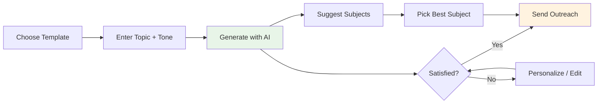

# Email Composer

The AI email composer generates personalized outreach emails, subject lines, and follow-ups using large language models.

## AI Generation Modes

### Generate

Create a complete email (subject + body) from a topic and tone.

**API:** `POST /api/v1/backlink-outreach/emails/generate`

```json
{
  "topic": "Guest post about AI marketing trends",
  "tone": "professional",
  "template_id": "optional-template-uuid"
}
```

**Available tones:**

| Tone | Style |
|---|---|
| `professional` | Formal, business-appropriate language. |
| `friendly` | Warm, approachable, conversational. |
| `casual` | Relaxed, informal, peer-to-peer. |
| `formal` | Highly structured, traditional business correspondence. |

### Personalize

Tailor an email to a specific lead using their name, website, and content.

**API:** `POST /api/v1/backlink-outreach/emails/personalize`

```json
{
  "base_email": "I'd love to contribute a guest post...",
  "lead_name": "Jane",
  "lead_website": "techblog.example.com",
  "content_topic": "AI Marketing Trends 2025"
}
```

### Subject Line Suggestions

Get 5-10 AI-generated subject line variants for A/B testing.

**API:** `POST /api/v1/backlink-outreach/emails/subject-suggestions`

```json
{
  "topic": "Guest post about AI marketing trends",
  "tone": "professional"
}
```

### Follow-up Draft

Generate a polite follow-up email referencing the original outreach.

**API:** `POST /api/v1/backlink-outreach/emails/follow-up`

```json
{
  "original_subject": "Guest Post: AI Marketing Trends",
  "original_body": "I'd love to contribute...",
  "tone": "friendly"
}
```

## Template System

Templates let you save and reuse winning email structures with variable placeholders.

### Creating a Template

**API:** `POST /api/v1/backlink-outreach/emails/templates`

```json
{
  "name": "Standard Guest Post Pitch",
  "subject": "Guest Post: {topic}",
  "body": "Hi {name},\n\nI've been following {website} and really enjoyed your recent posts...",
  "category": "guest-post"
}
```

### Supported Placeholders

| Placeholder | Replaced With |
|---|---|
| `{name}` | Lead's contact name. |
| `{website}` | Lead's website URL. |
| `{topic}` | Your content topic. |
| `{your_name}` | Your name (from sender config). |
| `{your_site}` | Your website URL (from sender config). |

!!! tip "Template best practices"
    - Use `{name}` for personalization — emails with names get 26% higher open rates.
    - Keep subject lines under 50 characters.
    - Include a clear call-to-action in every template.
    - Test multiple templates and track which gets the best response rate.

### Managing Templates

| Action | Endpoint |
|---|---|
| List templates | `GET /api/v1/backlink-outreach/emails/templates` |
| Get template | `GET /api/v1/backlink-outreach/emails/templates/{template_id}` |
| Delete template | `DELETE /api/v1/backlink-outreach/emails/templates/{template_id}` |

## Email Composer UI

The composer provides:

- **Topic input**: Describe what you want to write about.
- **Tone selector**: Choose the writing style.
- **Template picker**: Start from a saved template.
- **Generate button**: Create AI email from inputs.
- **Personalize button**: Tailor the current email to a specific lead.
- **Subject Suggest button**: Get subject line variants.
- **Live preview**: See the rendered email as you edit.



## Writing Effective Outreach Emails

### Subject Lines

- Be specific: "Guest Post: 5 AI Marketing Trends for 2025" > "Collaboration?"
- Keep it short: Under 50 characters for best open rates.
- Avoid spam triggers: ALL CAPS, excessive punctuation, "free", "guaranteed".

### Email Body

- **First line**: Reference their content specifically (proves you read their site).
- **Value proposition**: What's in it for them (free quality content, fresh perspective).
- **Credentials**: Brief mention of your expertise or published work.
- **Call-to-action**: One clear next step (reply with interest, check your draft).
- **Signature**: Professional sign-off with links to your published work.

### Follow-ups

- Wait 3-5 business days before following up.
- Reference the original email date and subject.
- Add new value (a specific article idea, a data point).
- Keep it shorter than the original.
- Maximum 2 follow-ups per lead.

---

*Next: [Outreach Operations](outreach-operations.md) — sending, policy validation, and suppression.*
