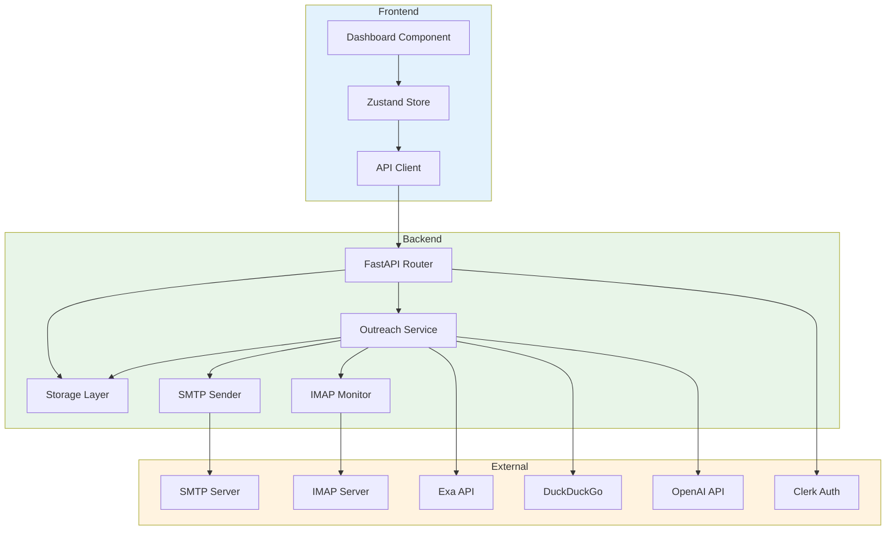
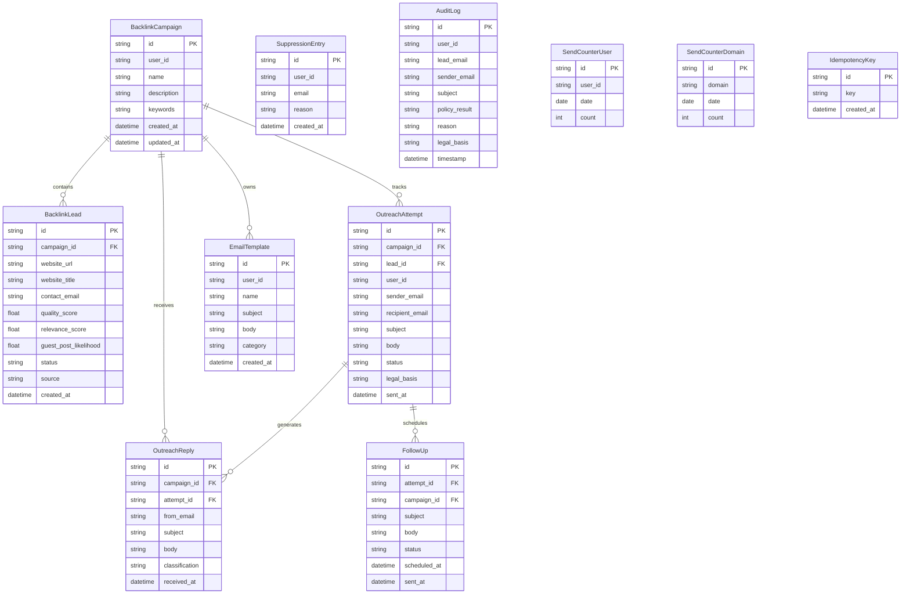
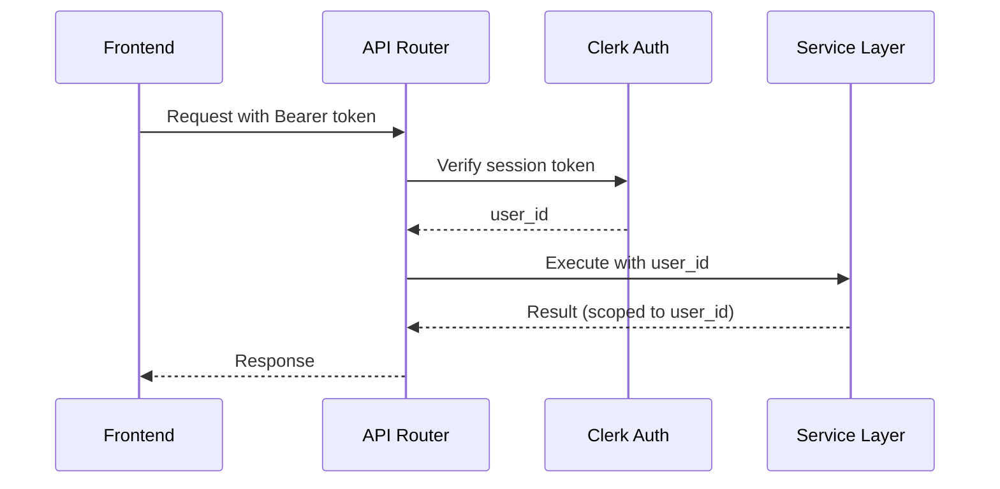

# Implementation Overview

Architecture, database schema, service layer, and authentication flow for the Backlink Outreach feature.

## Architecture



## File Structure

```
backend/
├── routers/
│   └── backlink_outreach.py          # 18+ API endpoints
├── services/
│   ├── backlink_outreach_service.py  # Business logic, policy, analytics
│   ├── backlink_outreach_storage.py  # SQLite CRUD operations
│   ├── backlink_outreach_sender.py   # SMTP email delivery
│   ├── backlink_outreach_reply_monitor.py  # IMAP reply polling
│   └── backlink_outreach_models.py   # Pydantic request/response models
├── models/
│   └── backlink_outreach_models.py   # SQLAlchemy models + indexes

frontend/src/
├── components/
│   └── BacklinkOutreach/
│       └── BacklinkOutreachDashboard.tsx  # Main UI component
├── stores/
│   └── backlinkOutreachStore.ts      # Zustand state management
└── api/
    └── backlinkOutreachApi.ts        # API client functions
```

## Database Schema



### Unique Indexes

| Table | Unique Constraint | Purpose |
|---|---|---|
| `SendCounterUser` | `(user_id, date)` | Atomic daily cap per user. |
| `SendCounterDomain` | `(domain, date)` | Atomic daily cap per domain. |

These enable `INSERT ... ON CONFLICT DO UPDATE` for atomic counter increments.

## Service Layer

### Outreach Service (`backlink_outreach_service.py`)

Core business logic:

- `_infer_region(domain)` — Maps 25+ EU TLDs + UK/CA/AU to region codes.
- `_determine_legal_basis(recipient_email)` — EU/UK/CA/AU → `consent`, others → `legitimate_interest`.
- `validate_policy(...)` — Runs all policy checks, returns approval/block with reasons.
- `send_outreach_email(...)` — Orchestrates policy → attempt → SMTP → counters → idempotency.
- `deep_discover(...)` — Exa + DuckDuckGo search, page scraping, email extraction, scoring.
- `generate_email(...)` — LLM-based email generation with topic + tone.
- `personalize_email(...)` — LLM-based personalization for a specific lead.
- `get_campaign_analytics(...)` — Aggregates campaign metrics.
- `get_reporting_snapshot(...)` — Cross-campaign summary.
- `export_leads_csv(...)` / `export_attempts_csv(...)` / `export_replies_csv(...)` — CSV generation with formula injection sanitization.

### Storage Layer (`backlink_outreach_storage.py`)

SQLite CRUD operations with 20+ methods:

- Campaign CRUD: `create_campaign`, `list_backlink_campaigns`, `get_campaign`, `delete_campaign`.
- Lead management: `add_campaign_lead`, `add_campaign_leads_bulk`, `update_lead_status`, `bulk_update_lead_status`.
- Outreach: `create_outreach_attempt`, `list_outreach_attempts`, `get_lead_attempts`.
- Replies: `store_reply`, `find_attempt_by_from_email`, `reply_exists`, `list_replies`, `count_replies`.
- Follow-ups: `create_follow_up`, `list_follow_ups`.
- Suppression: `add_suppression`, `list_suppression`, `is_suppressed`.
- Counters: `increment_user_counter`, `increment_domain_counter` (atomic ON CONFLICT).
- Idempotency: `check_idempotency`, `mark_idempotency`.
- Audit: `log_audit_entry`.
- Templates: `create_email_template`, `list_email_templates`, `get_email_template`, `delete_email_template`.

All methods call `_ensure_tables()` on first use to auto-create the SQLite schema.

### SMTP Sender (`backlink_outreach_sender.py`)

Handles email delivery:

1. Creates SSL context with `ssl.create_default_context()`.
2. Connects to SMTP host.
3. Sends `EHLO` greeting.
4. Upgrades with `STARTTLS`.
5. Sends `EHLO` again (RFC 3207 requirement).
6. Authenticates with credentials.
7. Sends email with configurable timeout (`SMTP_SEND_TIMEOUT`).
8. Cleanly closes the connection.

### Reply Monitor (`backlink_outreach_reply_monitor.py`)

Handles IMAP reply processing:

1. Connects to IMAP over SSL.
2. Sanitizes search terms (prevents IMAP injection).
3. Searches for messages matching the outreach sender.
4. Fetches up to `IMAP_FETCH_LIMIT` messages.
5. Checks for duplicates via `reply_exists()`.
6. Matches replies to attempts via `find_attempt_by_from_email()`.
7. Classifies replies based on content analysis.
8. Stores reply records.

## Authentication Flow



Key principles:

- **All 18+ endpoints** require `Depends(get_current_user)`.
- **User identity** is derived from the Clerk session, never from the request body.
- **Workspace isolation**: Data is scoped by `user_id` (from Clerk) or `workspace_id` (from request, defaults to `user_id`).
- **No client-controlled user_id**: The `GenerateEmailRequest` and `EmailTemplateRequest` models do not include a `user_id` field — it's always derived from auth.

## Frontend Architecture

### State Management (Zustand)

The `backlinkOutreachStore` manages all client state:

- **Campaign data**: List, selected campaign, leads.
- **UI state**: Active tab, loading flags (`isAttemptsLoading`, `isRepliesLoading`, `isAnalyticsLoading`, `isStatusUpdating`, `isExporting`).
- **Async operations**: All store actions with proper error handling and state clearing.
- **Retry logic**: `withRetry` helper auto-retries read operations once on 5xx with exponential backoff.

### User Feedback

All user-facing feedback uses `showToastNotification` from `utils/toastNotifications.ts`:

- Success toasts on completed actions.
- Error toasts on failed API calls (with error message extraction).
- Warning toasts on partial failures (bulk operations).
- Loading states on buttons (`isStatusUpdating`, `isExporting`).

### Analytics Loading

Analytics data loading uses an inline `useEffect` with a cancel flag to prevent stale closure issues:

```typescript
useEffect(() => {
  let cancelled = false;
  const loadAnalytics = async () => {
    if (!cancelled) { /* set state */ }
  };
  loadAnalytics();
  return () => { cancelled = true; };
}, [analyticsDays]);
```

---

*This concludes the Backlink Outreach documentation. Start with the [Overview](overview.md) or [Workflow Guide](workflow-guide.md).*
