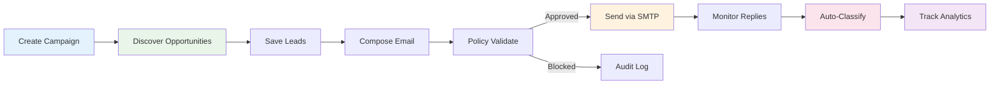

# Backlink Outreach Overview

Backlink Outreach is an AI-powered guest post outreach platform that takes you from opportunity discovery to published backlink — with smart email composition, policy-safe sending, IMAP reply monitoring, and full campaign analytics.

## What you do in the product

1. **Create a campaign** to group leads, emails, and analytics together.
2. **Discover opportunities** using AI-powered search across Exa neural search and DuckDuckGo.
3. **Compose outreach emails** with AI generation, personalization, and subject-line suggestions.
4. **Send outreach** through SMTP with built-in policy validation, suppression checks, and idempotency.
5. **Monitor replies** via IMAP with auto-classification (interested, not interested, out of office).
6. **Track analytics** — send volume trends, conversion funnels, reply classification breakdown, and CSV exports.

## What you see in the UI

- Campaign list with status and lead counts.
- Discovery results with quality/confidence scores and email detection badges.
- AI email composer with tone selector, template library, and live preview.
- Lead cards with status lifecycle buttons (discovered → contacted → replied → placed).
- Reply inbox with auto-classification tags.
- Analytics tab with line charts, bar charts, and export controls.
- Toast notifications for every action outcome (success or failure).

## Feature status matrix

| Capability | Status | Notes |
|---|---|---|
| Campaign CRUD | **Implemented** | Create, list, get detail with leads. |
| AI-powered deep discovery | **Implemented** | Exa neural search + DuckDuckGo with full-page scraping and email extraction. |
| Lead management | **Implemented** | Add, bulk-add, update status, bulk status update. |
| AI email generation | **Implemented** | Topic-based generation, personalization, subject-line suggestions, follow-up drafts. |
| Template CRUD | **Implemented** | Create, list, get, delete email templates with `{placeholder}` variable substitution. |
| SMTP email sending | **Implemented** | TLS with certificate verification, EHLO, configurable timeout. |
| Policy validation | **Implemented** | Daily caps, domain caps, suppression list, idempotency, region-aware legal basis (EU → consent). |
| IMAP reply monitoring | **Implemented** | Configurable fetch limit, auto-classification, deduplication. |
| Follow-up scheduling | **Implemented** | Schedule and track follow-up emails. |
| Campaign analytics | **Implemented** | Volume trends, conversion funnel, reply classification, response/placement rates. |
| CSV export | **Implemented** | Leads, attempts, replies — with formula injection sanitization. |
| Audit logging | **Implemented** | Every policy check is recorded with reasons and outcome. |
| Suppression management | **Implemented** | Add and list suppressed recipients. |
| Clerk auth on all endpoints | **Implemented** | 18 protected endpoints + user-scoped data isolation. |
| Reporting snapshot | **Implemented** | Cross-campaign send volume, reply count, placement conversion. |

## How It Works

## Who Benefits Most

### For SEO Professionals
- **Scalable outreach**: Send up to 100 emails/day per user with domain-level caps.
- **Policy compliance**: Built-in GDPR-aware legal basis, suppression, and audit trail.
- **Performance tracking**: Real-time analytics with conversion funnel and reply breakdown.

### For Content Marketers
- **AI email composer**: Generate personalized outreach emails in seconds, not hours.
- **Template library**: Save and reuse winning email templates across campaigns.
- **Reply triage**: Auto-classified replies let you focus on interested leads first.

### For Agencies
- **Multi-campaign management**: Organize outreach by client or vertical.
- **CSV exports**: Download leads, attempts, and replies for client reporting.
- **Audit trail**: Every send decision is logged for compliance and accountability.

## Getting Started

1. **[Workflow Guide](workflow-guide.md)** - Step-by-step walkthrough from campaign creation to analytics.
2. **[Campaign Management](campaign-management.md)** - Creating and organizing campaigns.
3. **[Discovery](discovery.md)** - AI-powered opportunity search.
4. **[Email Composer](email-composer.md)** - AI email generation and personalization.
5. **[Outreach Operations](outreach-operations.md)** - Sending, policy, suppression.
6. **[Reply Inbox](reply-inbox.md)** - IMAP monitoring and classification.
7. **[Analytics](analytics.md)** - Charts, funnels, and exports.
8. **[API Reference](api-reference.md)** - Full endpoint documentation.
9. **[Configuration](configuration.md)** - Environment variables and deployment.
10. **[Implementation Overview](implementation-overview.md)** - Architecture and internals.

## Related Features

- **[SEO Dashboard](../seo-dashboard/overview.md)** - Comprehensive SEO tools and GSC integration.
- **[Blog Writer](../blog-writer/overview.md)** - Create content to earn backlinks organically.
- **[Content Strategy](../content-strategy/overview.md)** - Strategic planning for link-building campaigns.
- **[Subscription](../subscription/overview.md)** - Plan limits and billing.

---

*Ready to start building backlinks? Check out the [Workflow Guide](workflow-guide.md) to get started!*
