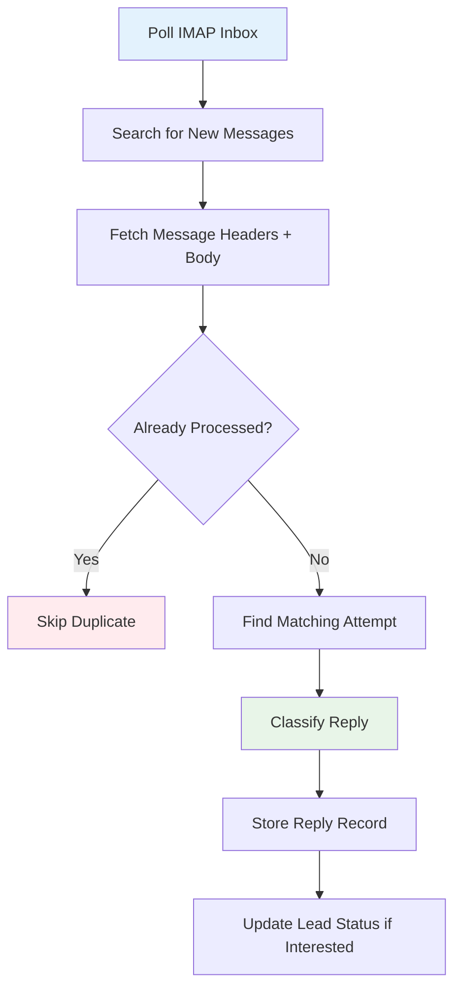

# Reply Inbox

The reply inbox monitors your outreach mailbox via IMAP, automatically classifies replies, and deduplicates incoming messages.

## How It Works

## IMAP Configuration

| Setting | Env Var | Default |
|---|---|---|
| IMAP host | `IMAP_HOST` | — (required) |
| IMAP port | `IMAP_PORT` | `993` |
| IMAP username | `IMAP_USER` | — (required) |
| IMAP password | `IMAP_PASS` | — (required) |
| Fetch limit | `IMAP_FETCH_LIMIT` | `50` |

!!! tip "Fetch limit"
    `IMAP_FETCH_LIMIT` controls how many messages are processed per poll cycle. Increase for high-volume mailboxes, decrease to reduce IMAP load. Default is 50.

## Polling for Replies

**API:** `POST /api/v1/backlink-outreach/replies/poll`

The reply monitor:

1. Connects to IMAP over SSL.
2. Sanitizes the `sent_from_email` before searching (prevents IMAP injection).
3. Searches for messages sent to your outreach address.
4. Fetches up to `IMAP_FETCH_LIMIT` recent messages.
5. For each message, checks if it's already been processed (deduplication).
6. Matches the reply to an existing outreach attempt by sender email.
7. Classifies the reply and stores it.

### Reply Matching

Replies are matched to outreach attempts using the `from_email` field:

- The system looks up `find_attempt_by_from_email(from_email)` to find the most recent outreach attempt sent to that email address.
- If no match is found, the reply is still stored but not linked to an attempt.

### Deduplication

The system checks `reply_exists(from_email, subject)` before storing a new reply. This prevents duplicate entries when the same message appears in multiple IMAP folders or is fetched in overlapping poll cycles.

## Auto-Classification

Replies are automatically classified based on content analysis:

| Classification | Signals |
|---|---|
| **Interested** | "sounds good", "tell me more", "interested", "let's do it", "I'd love to" |
| **Not interested** | "not interested", "no thanks", "unsubscribe", "remove me", "stop sending" |
| **Out of office** | "out of office", "auto-reply", "automated response", "on vacation" |
| **Replied** | General reply that doesn't match other categories |

!!! note "Manual override"
    Auto-classification is a best-effort guess. You can manually reclassify any reply in the UI by clicking the classification tag and selecting a different one.

### Auto-Suppression on "Not Interested"

When a reply is classified as "not interested", the sender's email is **automatically added to the suppression list** to prevent future outreach.

## Reply Inbox UI

The inbox shows:

- **From**: Sender name and email.
- **Subject**: Email subject line.
- **Classification tag**: Color-coded auto-classification badge.
- **Date**: When the reply was received.
- **Linked attempt**: The outreach attempt this reply matches (if any).
- **Lead status**: Current status of the associated lead.

### Actions

| Action | Description |
|---|---|
| **View** | Read the full reply body. |
| **Reclassify** | Change the auto-classification. |
| **Update lead status** | Move the lead to "replied" or "placed". |
| **Compose follow-up** | Open the email composer pre-filled with a follow-up draft. |

## Monitoring Best Practices

1. **Poll regularly**: Set up a scheduled job to call the poll endpoint every 5-15 minutes.
2. **Review unclassified**: Check "Replied" (generic) classifications and manually tag them.
3. **Act on interested leads quickly**: Respond within 24 hours for best conversion.
4. **Check out-of-office dates**: Schedule follow-ups for after the return date.
5. **Review suppression entries**: Periodically audit the suppression list for accidental additions.

---

*Next: [Analytics](analytics.md) — campaign performance tracking and exports.*
