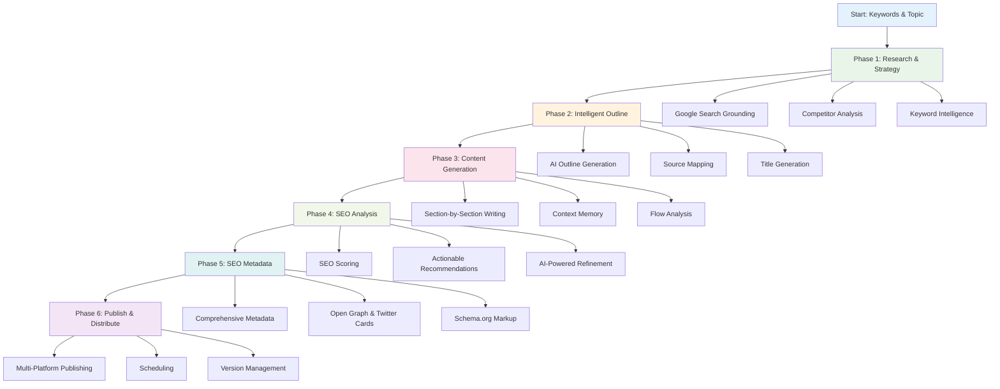
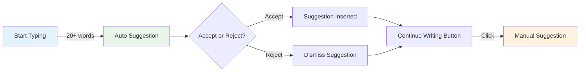

# Blog Writer Overview

The ALwrity Blog Writer is a powerful AI-driven content creation tool that helps you generate high-quality, SEO-optimized blog posts with minimal effort. It's designed for users with medium to low technical knowledge, making professional content creation accessible to everyone.

## Key Features

### 🤖 AI-Powered Content Generation
- **Research Integration**: Automated web research with source verification
- **Smart Outlines**: AI-generated content outlines that you can customize
- **Section-by-Section Writing**: Generate content one section at a time
- **Multiple Writing Styles**: Choose from different tones and styles

### 📊 Research & Analysis
- **Web Research**: Real-time research with source citations
- **Fact Checking**: Built-in hallucination detection and verification
- **Content Optimization**: AI-powered content improvement suggestions
- **SEO Integration**: Built-in SEO analysis and recommendations

### 🎯 User-Friendly Features
- **Visual Editor**: Easy-to-use WYSIWYG editor with markdown support
- **Progress Tracking**: Real-time progress monitoring for long tasks
- **Title Suggestions**: AI-generated title options to choose from
- **Publishing Tools**: Direct publishing to various platforms

## How It Works

### Complete 6-Phase Workflow

ALwrity Blog Writer transforms your ideas into publish-ready content through a sophisticated, AI-powered workflow that ensures quality, accuracy, and SEO optimization at every step.

#### Phase 1: Research & Strategy
AI-powered comprehensive research with Google Search grounding, competitor analysis, and keyword intelligence.

#### Phase 2: Intelligent Outline
AI-generated outlines with source mapping, grounding insights, and optimization recommendations.

#### Phase 3: Content Generation
Section-by-section content generation with SEO optimization, context memory, and engagement improvements.

#### Phase 4: SEO Analysis
Advanced SEO analysis with actionable recommendations and AI-powered optimization.

#### Phase 5: SEO Metadata
Optimized metadata generation for titles, descriptions, Open Graph, Twitter Cards, and structured data.

#### Phase 6: Publish & Distribute
Direct publishing to WordPress, Wix, Medium, and other platforms with scheduling capabilities.

### Phase Features At a Glance

| Phase | Key Features | Target Benefits | Best For |
|-------|-------------|-----------------|----------|
| **Phase 1: Research** | Google Search grounding, Competitor analysis, Keyword intelligence, Content angles | Comprehensive data, Time savings, Market insights | All content creators |
| **Phase 2: Outline** | AI generation, Source mapping, Interactive refinement, Title suggestions | Structured content, SEO foundation, Editorial flexibility | Professional writers |
| **Phase 3: Content** | Context-aware writing, Flow analysis, Source integration, Medium mode | High quality, Consistency, Citation accuracy | Content teams |
| **Phase 4: SEO** | Multi-dimensional scoring, Actionable recommendations, AI refinement | Search visibility, Competitive edge, Performance tracking | SEO professionals |
| **Phase 5: Metadata** | Comprehensive SEO tags, Social optimization, Schema markup, Multi-format export | Complete optimization, Rich snippets, Cross-platform readiness | Digital marketers |
| **Phase 6: Publish** | Multi-platform support, Scheduling, Version management, Analytics integration | Efficiency, Strategic timing, Quality control | Solopreneurs & teams |

### What Happens Behind the Scenes

The Blog Writer leverages sophisticated AI orchestration to ensure quality at every stage:

- **Research Phase**: AI searches the web using Gemini's native Google Search integration for current, credible information and sources
- **Outline Generation**: Creates logical structure with headings, key points, and source mapping using parallel processing
- **Content Writing**: Generates engaging, context-aware content for each section with continuity tracking and flow analysis
- **SEO Optimization**: Runs comprehensive analysis with parallel non-AI analyzers plus AI insights for actionable recommendations
- **Metadata Generation**: Creates complete SEO metadata package with social media optimization in 2 AI calls maximum
- **Publishing**: Formats content for your chosen platform with scheduling and version management

### User-Friendly Features

- **Progress Tracking**: See real-time progress for all long-running tasks with detailed status updates
- **Visual Editor**: Easy-to-use WYSIWYG interface with markdown support and live preview
- **Title Suggestions**: Multiple AI-generated, SEO-scored title options to choose from
- **SEO Integration**: Comprehensive analysis with one-click "Apply Recommendations" for instant optimization
- **Context Memory**: Intelligent continuity tracking across sections for consistent, flowing content
- **Source Attribution**: Automatic citation integration with research source mapping

## Content Types

### Blog Posts
- **How-to Guides**: Step-by-step tutorials
- **Listicles**: Numbered list articles
- **Case Studies**: Real-world examples
- **Opinion Pieces**: Thought leadership content

### Long-form Content
- **Comprehensive Guides**: In-depth resources
- **White Papers**: Professional documents
- **E-books**: Extended content pieces
- **Research Reports**: Data-driven content

## SEO Features

### Keyword Optimization
- **Primary Keywords**: Main topic keywords
- **Secondary Keywords**: Supporting terms
- **Long-tail Keywords**: Specific phrases
- **LSI Keywords**: Semantically related terms

### Content Structure
- **Headings**: H1, H2, H3 hierarchy
- **Paragraphs**: Optimal length and structure
- **Lists**: Bulleted and numbered lists
- **Images**: Alt text and captions

### Meta Optimization
- **Title Tags**: SEO-optimized titles
- **Meta Descriptions**: Compelling descriptions
- **URL Structure**: Clean, readable URLs
- **Schema Markup**: Structured data

## Writing Styles

### Professional
- **Business Content**: Corporate communications
- **Technical Writing**: Industry-specific content
- **Academic Style**: Research-based content
- **Formal Tone**: Professional language

### Conversational
- **Blog Style**: Casual, engaging tone
- **Social Media**: Platform-optimized content
- **Personal Brand**: Authentic voice
- **Community Content**: Community-focused writing

## Integration Features

### Google Search Console
- **Performance Data**: Real search performance
- **Keyword Insights**: Actual search queries
- **Click-through Rates**: CTR optimization
- **Search Rankings**: Position tracking

### Analytics Integration
- **Google Analytics**: Traffic analysis
- **Content Performance**: Engagement metrics
- **User Behavior**: Reader interaction data
- **Conversion Tracking**: Goal completion

## Best Practices

### Content Quality
1. **Research Thoroughly**: Use multiple sources
2. **Original Content**: Avoid plagiarism
3. **Fact-checking**: Verify all information
4. **Regular Updates**: Keep content current

### SEO Optimization
1. **Keyword Density**: Natural keyword usage
2. **Content Length**: Optimal word count
3. **Internal Linking**: Strategic link placement
4. **External Links**: Authoritative sources

### User Experience
1. **Readable Format**: Clear structure
2. **Visual Elements**: Images and graphics
3. **Mobile Optimization**: Responsive design
4. **Loading Speed**: Fast page loads

## Advanced Features

### ✨ Assistive Writing & Quick Edits
- **Continue Writing**: AI-powered contextual suggestions as you type
- **Smart Typing Assist**: Automatic suggestions after 20+ words
- **Quick Edit Options**: Improve, expand, shorten, professionalize, add transitions, add data
- **Real-time Assistance**: Instant writing help without interrupting your flow
- **Cost-Optimized**: First suggestion automatic, then manual "Continue Writing" for efficiency
- **One-Click Improvements**: Select text and apply quick edits instantly

### 🔍 Fact-Checking & Quality Assurance
- **Hallucination Detection**: AI-powered verification of claims and facts
- **Source Verification**: Automatic cross-checking against research sources
- **Claim Analysis**: Detailed assessment of each verifiable statement
- **Evidence Support**: Links to supporting or refuting sources
- **Quality Scoring**: Overall confidence metrics for content accuracy

### 🖼️ Image Generation
- **Section-Specific Images**: Generate images per blog section from the outline
- **AI-Powered Prompts**: Auto-suggest images based on section content
- **Advanced Options**: Stability AI, Hugging Face, Gemini
- **Blog Optimization**: Sizes and formats for platform publishing
- **Integrated Workflow**: Generate inside the outline editor

### 📝 SEO Metadata Generation
- **Comprehensive Package**: Title, description, tags, categories, hashtags in 2 AI calls
- **Social Optimization**: Open Graph & Twitter Cards
- **Structured Data**: Schema.org JSON-LD for rich snippets
- **Multi-Format Export**: WordPress, Wix, HTML, JSON-LD
- **Live Preview**: Google, Facebook, Twitter

### Automation & Integration
- **Multi-Platform Publishing**: One-click to WordPress, Wix, Medium
- **Version Management**: Track changes and revisions
- **Scheduled Publishing**: Set future publish dates
- **Google Analytics Integration**: Track content performance
- **Search Console**: Monitor search visibility

## Who Benefits Most

### For Technical Content Writers
- **Research Automation**: Save hours of manual research with AI-powered Google Search grounding
- **Source Attribution**: Automatic citation management and credibility scoring
- **Quality Assurance**: Built-in fact-checking and hallucination detection
- **Citation Integration**: Seamless source references throughout content

### For Solopreneurs
- **Time Efficiency**: Complete blog creation workflow in minutes instead of hours
- **SEO Expertise**: Professional-grade optimization without hiring specialists
- **Multi-Platform Publishing**: One workflow, multiple destinations (WordPress, Wix, Medium)
- **Scheduling & Automation**: Strategic content distribution and timing optimization

### For Digital Marketing & SEO Professionals
- **Comprehensive SEO**: Multi-dimensional scoring with actionable insights
- **Competitive Intelligence**: AI-powered competitor analysis and content gap identification
- **Performance Tracking**: Integration with Google Analytics and Search Console
- **ROI Optimization**: Data-driven content strategy and performance analytics

## How to Use Advanced Features

### Using Assistive Writing (Continue Writing)

**Quick Steps - Continue Writing:**
1. Type 20+ words in any blog section
2. First suggestion appears automatically below your text
3. Click **"Accept"** to insert or **"Dismiss"** to skip
4. Use **"✍️ Continue Writing"** for more suggestions
5. Suggestions include source citations for fact-checking

**Quick Steps - Text Selection Edits:**
1. Select any text in your content
2. Context menu appears automatically
3. Choose quick edit: **Improve**, **Expand**, **Shorten**, **Professionalize**, **Add Transition**, or **Add Data**
4. Text updates instantly with your selected improvement

### Using Fact-Checking
1. Select a paragraph or claim in your blog content
2. Right-click to open context menu
3. Click **"🔍 Fact Check"**
4. Wait 15-30 seconds for analysis
5. Review results: claims, confidence, supporting/refuting sources
6. Click **"Apply Fix"** to insert source links

### Using Image Generation
1. In **Phase 2: Intelligent Outline**, click **"🖼️ Generate Image"** on any section
2. Modal opens with auto-generated prompt (editable)
3. Click **"Suggest Prompt"** for AI-optimized suggestions
4. Optionally open **"Advanced Image Options"**
5. Generate image (Stability AI, Hugging Face, or Gemini)
6. Image auto-inserts into outline and metadata

### Using SEO Metadata Generation
1. In **Phase 5: SEO Metadata**, open the modal
2. Click **"Generate All Metadata"** (max 2 AI calls)
3. Review tabs: Preview, Core, Social, Structured Data
4. Edit any field; previews update live
5. Copy formats for WordPress, Wix, or custom
6. Images from Phase 2 auto-fill Open Graph

## Getting Started

1. **[Research Integration](research.md)** - Comprehensive Phase 1 research capabilities
2. **[Workflow Guide](workflow-guide.md)** - Step-by-step 6-phase workflow walkthrough
3. **[SEO Analysis](seo-analysis.md)** - Phase 4 & 5 optimization strategies
4. **[Implementation Spec](implementation-spec.md)** - Technical architecture and API details
5. **[Best Practices](../../guides/best-practices.md)** - Advanced optimization tips

## Related Features

- **[SEO Dashboard](../seo-dashboard/overview.md)** - Comprehensive SEO tools
- **[Content Strategy](../content-strategy/overview.md)** - Strategic planning
- **[LinkedIn Writer](../linkedin-writer/overview.md)** - Social content
- **[AI Features](../ai/assistive-writing.md)** - Advanced AI capabilities

---

*Ready to create amazing blog content? Check out our [Research Integration Guide](research.md) to get started!*
