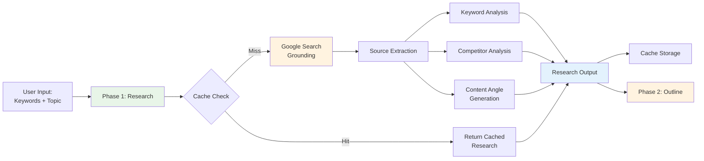

# Phase 1: Research & Strategy

ALwrity's Blog Writer Phase 1 provides powerful AI-powered research capabilities that automatically gather, analyze, and verify information to create well-researched, accurate, and comprehensive blog content. This foundation phase sets the stage for all subsequent content creation.

## Overview

Phase 1: Research & Strategy leverages Gemini's native Google Search grounding to conduct comprehensive topic research in a single API call, delivering competitor intelligence, keyword analysis, and content angles to inform your entire blog creation process.

### Key Benefits

- **Comprehensive Research**: Gather information from multiple reliable sources with Google Search grounding
- **Competitive Intelligence**: Identify content gaps and opportunities through competitor analysis
- **Keyword Intelligence**: Discover primary, secondary, and long-tail keyword opportunities
- **Content Angles**: AI-generated unique content angles for maximum engagement
- **Time Efficiency**: Complete research in 30-60 seconds with intelligent caching

## Research Data Flow



## Research Process

### 1. Topic Analysis

#### Initial Research Setup
- **Topic Understanding**: AI analyzes your topic and identifies key aspects
- **Research Scope**: Determines the breadth and depth of research needed
- **Source Selection**: Identifies relevant and authoritative sources
- **Research Strategy**: Develops a comprehensive research approach

#### Research Parameters
```json
{
  "topic": "AI in Digital Marketing",
  "research_depth": "comprehensive",
  "sources": ["web", "academic", "industry"],
  "language": "en",
  "date_range": "last_12_months",
  "fact_checking": true
}
```

### 2. Google Search Grounding (Gemini Integration)

Phase 1 leverages Gemini's native Google Search grounding to access real-time web data with a single API call, eliminating the need for complex multi-source integrations.

#### Single API Call Efficiency
- **One Request**: Comprehensive research in a single Gemini API call with Google Search grounding
- **Live Web Data**: Real-time access to current information from the web
- **No Multi-Source Setup**: Eliminates need for multiple API integrations
- **Cost Effective**: Optimized token usage with focused research prompts
- **Caching Intelligence**: Automatic cache storage for repeat keyword research

#### Research Sources (via Google Search)
The research prompt instructs Gemini to gather information from:
- **Current News**: Latest industry news and developments (2024-2025)
- **Industry Reports**: Market research and industry analysis
- **Expert Articles**: Authoritative blogs and professional content
- **Academic Sources**: Research papers and studies
- **Case Studies**: Real-world examples and implementations
- **Statistics**: Key data points and numerical insights
- **Trends**: Current market trends and forecasts

#### Google Search Grounding Example
```python
research_prompt = """
Research the topic "AI in Digital Marketing" in the technology industry for digital marketers.

Provide comprehensive analysis including:
1. Current trends and insights (2024-2025)
2. Key statistics and data points with sources
3. Industry expert opinions and quotes
4. Recent developments and news
5. Market analysis and forecasts
6. Best practices and case studies
7. Keyword analysis: primary, secondary, and long-tail opportunities
8. Competitor analysis: top players and content gaps
9. Content angle suggestions: 5 compelling angles for blog posts

Focus on factual, up-to-date information from credible sources.
"""
```

### 3. Competitor Analysis

The research phase automatically identifies competing content and discovers content gaps where your blog can stand out.

#### Content Gap Identification
- **Top Competitors**: Identifies the most authoritative content on your topic
- **Coverage Analysis**: Maps what competitors have covered thoroughly vs. superficially
- **Gap Opportunities**: Highlights underexplored angles and missing information
- **Unique Positioning**: Suggests how to differentiate your content
- **Competitive Advantages**: Identifies areas where you can exceed competitor quality

#### Competitive Intelligence
- **Content Depth**: Analyzes how thoroughly competitors cover topics
- **Keyword Usage**: Identifies keyword strategies in competitor content
- **Content Structure**: Evaluates how competitors organize information
- **Engagement Patterns**: Notes what formats and angles work best
- **Market Positioning**: Understands where competitors sit in the market

### 4. Keyword Intelligence

Phase 1 provides comprehensive keyword analysis to optimize your content for search engines.

#### Primary, Secondary & Long-Tail Keywords
- **Primary Keywords**: Main topic keywords with highest search volume
- **Secondary Keywords**: Supporting terms that reinforce the main topic
- **Long-Tail Keywords**: Specific, less competitive phrases with high intent
- **Semantic Keywords**: Related terms that search engines associate with your topic
- **Search Intent**: Categorizes keywords by intent (informational, transactional, navigational)

#### Keyword Clustering & Grouping
- **Topic Clusters**: Groups related keywords for comprehensive coverage
- **Thematic Organization**: Organizes keywords by content themes
- **Density Recommendations**: Suggests optimal keyword usage throughout content
- **Priority Ranking**: Identifies which keywords to prioritize
- **Competition Analysis**: Assesses difficulty for ranking on each keyword

### 5. Content Angle Generation

AI generates unique content angles that make your blog stand out and engage your audience.

#### AI-Generated Angle Suggestions
- **5 Unique Angles**: Provides multiple distinct approaches to your topic
- **Trending Topics**: Identifies currently popular angles and discussions
- **Audience Pain Points**: Maps audience challenges to content angles
- **Viral Potential**: Assesses which angles have high shareability
- **Expert Opinions**: Synthesizes industry expert viewpoints into angles

#### Content Angle Example
For a topic like "AI in Marketing," research might suggest:
1. **Case Study Angle**: "10 Marketing Agencies Using AI to Double ROI"
2. **Practical Guide Angle**: "Implementing AI Marketing Tools in 2025: A Step-by-Step Roadmap"
3. **Trend Analysis Angle**: "The Future of AI Marketing: What Industry Leaders Predict"
4. **Problem-Solution Angle**: "Common AI Marketing Failures and How to Avoid Them"
5. **Debunking Angle**: "AI Marketing Myths Debunked: What Actually Works in 2025"

### 6. Information Processing

#### Data Collection & Extraction
- **Source Extraction**: Automatically extracts 10-20 credible sources from Google Search
- **Fact Identification**: Identifies key facts, statistics, and claims with citations
- **Quote Collection**: Gathers relevant expert quotes with attribution
- **Trend Identification**: Highlights current trends and patterns
- **Search Query Tracking**: Tracks AI-generated search queries for transparency

#### Source Credibility & Verification
- **Automatic Citation**: Extracts source URLs, titles, and metadata for proper attribution
- **Grounding Metadata**: Includes detailed grounding support scores and chunks
- **Source Diversity**: Ensures mix of authoritative sources (academic, industry, news)
- **Credibility Scoring**: Evaluates source authority and reliability
- **Cross-Reference**: Cross-references key facts across multiple sources

## Research Output Structure

### Comprehensive Research Results

Phase 1 returns a complete research package that feeds into all subsequent phases:

#### Structured Data Package
- **Sources**: 10-20 credible research sources with full metadata
- **Keyword Analysis**: Primary, secondary, long-tail, and semantic keywords
- **Competitor Analysis**: Top competing content and identified gaps
- **Content Angles**: 5 unique, AI-generated content approaches
- **Search Queries**: AI-generated search terms for transparency
- **Grounding Metadata**: Detailed grounding support scores and chunks

#### Research Summary Example
```json
{
  "success": true,
  "sources": [
    {
      "url": "https://example.com/research",
      "title": "AI Marketing Trends 2025",
      "credibility_score": 0.92
    }
  ],
  "keyword_analysis": {
    "primary": ["AI marketing", "artificial intelligence digital marketing"],
    "secondary": ["machine learning marketing", "automated advertising"],
    "long_tail": ["how to implement AI marketing tools"],
    "search_intent": "informational"
  },
  "competitor_analysis": {
    "top_competitors": [...],
    "content_gaps": ["practical implementation guides", "cost-benefit analysis"]
  },
  "suggested_angles": [
    "10 Marketing Agencies Using AI to Double ROI",
    "Implementing AI Marketing Tools: A Step-by-Step Roadmap"
  ]
}
```

## Use Cases for Different Audiences

### For Technical Content Writers
**Scenario**: Writing a technical deep-dive on "React Performance Optimization"

**Phase 1 Delivers**:
- Latest React documentation updates and best practices
- GitHub discussions and Stack Overflow solutions for optimization challenges
- Academic research on frontend performance optimization
- Real-world case studies from major tech companies
- Technical keyword opportunities: "React performance hooks", "memoization strategies"

**Value**: Eliminates hours of manual research across GitHub, documentation, and forums

### For Solopreneurs
**Scenario**: Creating content on "Starting an E-commerce Business in 2025"

**Phase 1 Delivers**:
- Current e-commerce market trends and statistics
- Competitor analysis of top e-commerce success stories
- Content gap: most content focuses on "how to start" but lacks "common pitfalls"
- Unique angle: "The 5 Mistakes That Kill 90% of New E-commerce Businesses"
- Long-tail keywords: "start ecommerce business 2025", "ecommerce business ideas"

**Value**: Provides business intelligence without expensive consultants

### For Digital Marketing & SEO Professionals
**Scenario**: Content strategy for "Local SEO Best Practices"

**Phase 1 Delivers**:
- Competitor analysis of top-ranking local SEO content
- Keyword gaps: competitors missing "Google Business Profile optimization"
- Trending angles: "Voice search local optimization" and "AI-powered local listings"
- Data-backed insights: "73% of local searches result in store visits"
- Content opportunity: "Local SEO Audit Template" (high search, low competition)

**Value**: Delivers competitive intelligence and keyword strategy in one research pass

## Performance & Caching

### Intelligent Caching System

Phase 1 implements a dual-layer caching strategy to optimize performance and reduce costs.

#### Cache Storage
- **Persistent Cache**: SQLite database stores research results for exact keyword matches
- **Memory Cache**: In-process cache for faster repeated access within a session
- **Cache Key**: Based on exact keyword match, industry, and target audience
- **Cache Duration**: Results stored indefinitely until invalidated

#### Cache Benefits
- **Cost Reduction**: Avoids redundant API calls for same topics
- **Speed**: Instant results for cached research (0-5 seconds vs. 30-60 seconds)
- **Consistency**: Ensures reproducible research results for same queries
- **Transparency**: Progress messages indicate cache hits: "✅ Using cached research"

### Performance Metrics

**Typical Research Timing**:
- **Cache Hit**: 0-5 seconds (instant return)
- **Fresh Research**: 30-60 seconds (Google Search + AI processing)
- **Sources Found**: 10-20 credible sources per research
- **Search Queries**: 5-10 AI-generated search terms tracked

## Best Practices

### Effective Research Setup

#### Keyword Strategy
1. **Be Specific**: Use 3-5 focused keywords rather than broad topics
2. **Industry Context**: Always specify industry for better context
3. **Audience Definition**: Define target audience clearly for tailored research
4. **Topic Clarity**: Provide a clear, concise topic description
5. **Word Count Target**: Set realistic word count goals (1000-3000 words optimal)

#### Research Quality Optimization
1. **Review Sources**: Always review the returned sources for credibility
2. **Use Content Angles**: Leverage AI-generated angles for unique positioning
3. **Explore Competitor Gaps**: Focus on content gaps for competitive advantage
4. **Keyword Variety**: Review all keyword types (primary, secondary, long-tail)
5. **Leverage Caching**: Reuse research for related topics to save time and cost

### Research-to-Content Pipeline

#### Phase 1 to Phase 2 Transition
1. **Validate Research**: Ensure research has 10+ credible sources before proceeding
2. **Review Angles**: Select compelling content angles for outline inspiration
3. **Check Keywords**: Verify keyword analysis aligns with your SEO goals
4. **Analyze Gaps**: Use competitor analysis to inform unique content positioning
5. **Source Quality**: Confirm grounding metadata shows high credibility scores (0.8+)

#### Research Output Utilization
1. **Source Mapping**: Use sources strategically across different sections
2. **Keyword Integration**: Naturally integrate primary and secondary keywords
3. **Angles to Sections**: Transform content angles into distinct content sections
4. **Gaps to Value**: Convert content gaps into unique selling propositions
5. **Trend Integration**: Weave current trends naturally throughout content

## Troubleshooting

### Common Issues & Solutions

#### Low-Quality Research Results
**Problem**: Research returns fewer than 10 sources or low credibility scores

**Solutions**:
- **Refine Keywords**: Use more specific, focused keywords
- **Expand Topic**: Broaden topic slightly to increase source pool
- **Adjust Industry**: Ensure industry classification is accurate
- **Check Cache**: Clear cache if you're getting stale results
- **Retry Research**: Google Search grounding may need a second attempt

#### Insufficient Keyword Analysis
**Problem**: Limited keyword variety or missing long-tail opportunities

**Solutions**:
- **Add Topic Context**: Provide more detailed topic description
- **Specify Audience**: Better audience definition improves keyword targeting
- **Increase Word Count**: Target 2000+ words for richer keyword analysis
- **Review Persona Settings**: Industry and audience persona affects keyword discovery

#### Missing Competitor Data
**Problem**: Competitor analysis lacks depth or opportunities

**Solutions**:
- **Use Specific Keywords**: More targeted keywords reveal better competitors
- **Expand Industry Context**: Broad industry understanding improves competitive mapping
- **Review Content Angles**: Angles often highlight what competitors are NOT doing
- **Manual Review**: Top sources list shows main competitors worth reviewing

#### Cache Not Working
**Problem**: Research taking full time even for duplicate keywords

**Solutions**:
- **Check Exact Match**: Keywords, industry, and audience must match exactly
- **Verify Cache**: Check if persistent cache is enabled
- **Clear and Retry**: Sometimes clearing cache helps if data is corrupted
- **Check Logs**: Look for cache hit/miss messages in progress updates

### Getting Help

#### Support Resources
- **Workflow Guide**: [Complete 6-phase walkthrough](workflow-guide.md)
- **API Reference**: [Research API endpoints](api-reference.md)
- **Implementation Spec**: [Technical architecture](implementation-spec.md)
- **Best Practices**: [Advanced optimization tips](../../guides/best-practices.md)

#### Performance Optimization
- **Use Caching**: Leverage intelligent caching for repeat research
- **Keyword Precision**: More specific keywords yield better results
- **Industry Context**: Always provide industry for better data quality
- **Monitor Progress**: Review progress messages for efficiency insights
- **Batch Research**: Plan multiple blogs to maximize cache benefits

---

## Next Steps

Now that you understand Phase 1: Research & Strategy, move to the next phase:

- **[Phase 2: Intelligent Outline](workflow-guide.md#phase-2-intelligent-outline)** - Transform research into structured content plans
- **[Complete Workflow Guide](workflow-guide.md)** - End-to-end 6-phase walkthrough
- **[Blog Writer Overview](overview.md)** - Overview of all 6 phases
- **[Getting Started Guide](../../getting-started/quick-start.md)** - Quick start for new users

---

*Ready to leverage Phase 1 research capabilities? Check out the [Workflow Guide](workflow-guide.md) to see how research flows into outline generation and beyond!*
