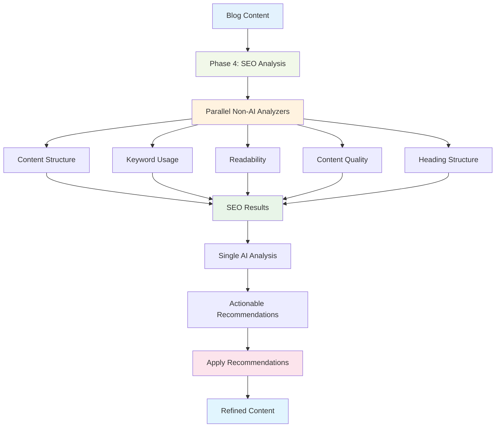
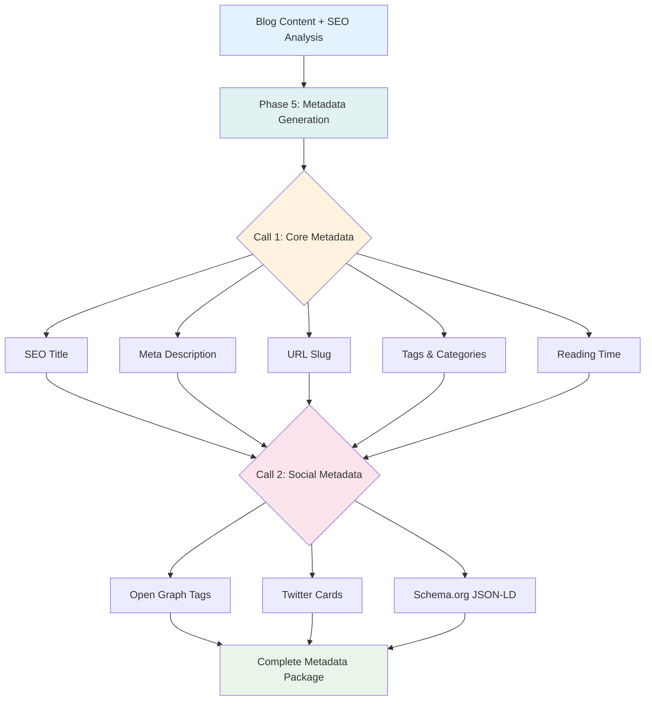

# SEO Analysis & Optimization (Phase 4 & 5)

ALwrity's Blog Writer includes comprehensive SEO analysis and metadata generation capabilities across Phases 4 and 5, automatically optimizing your content for search engines and preparing it for publication across platforms.

## Overview

SEO optimization in the Blog Writer happens in two complementary phases:
- **Phase 4: SEO Analysis** - Comprehensive scoring, recommendations, and AI-powered content refinement
- **Phase 5: SEO Metadata** - Complete metadata generation including Open Graph, Twitter Cards, and Schema.org markup

### Key Benefits

#### Phase 4: SEO Analysis
- **Multi-Dimensional Scoring**: Comprehensive SEO evaluation across 5 key categories
- **Actionable Recommendations**: Priority-ranked improvement suggestions with specific fixes
- **AI-Powered Refinement**: One-click "Apply Recommendations" for instant optimization
- **Parallel Processing**: Fast analysis using parallel non-AI analyzers plus AI insights
- **Performance Tracking**: Track SEO improvements and measure impact

#### Phase 5: SEO Metadata
- **Comprehensive Metadata**: Complete SEO metadata package in 2 AI calls maximum
- **Social Optimization**: Open Graph and Twitter Cards for rich social previews
- **Structured Data**: Schema.org markup for enhanced search results and rich snippets
- **Multi-Format Export**: Ready-to-use formats for WordPress, Wix, and custom platforms
- **Platform Integration**: One-click copy and direct platform publishing support

## Phase 4: SEO Analysis

Phase 4 provides comprehensive SEO evaluation with actionable recommendations and AI-powered content refinement.

### Parallel Processing Architecture

Phase 4 uses a sophisticated parallel processing approach for speed and accuracy:



### Multi-Dimensional SEO Scoring

Phase 4 evaluates your content across 5 key categories:

#### Overall SEO Score
- **Composite Rating**: Overall score (0-100) based on weighted category scores
- **Grade Assignment**: Automatically assigns grades (Excellent/Good/Needs Improvement)
- **Trend Tracking**: Compares to previous analysis to track improvements
- **Visual Feedback**: Color-coded UI provides instant visual assessment

#### Category Breakdown
- **Structure Score**: Heading hierarchy, content organization, section balance
- **Keywords Score**: Keyword density, placement, variation, long-tail usage
- **Readability Score**: Reading level, sentence complexity, clarity assessment
- **Quality Score**: Content depth, engagement potential, value delivery
- **Headings Score**: H1-H3 distribution, keyword integration in headings

### Actionable Recommendations

Phase 4 generates specific, priority-ranked recommendations for improvement.

#### Recommendation Categories
- **High Priority**: Critical SEO issues impacting search visibility
- **Medium Priority**: Significant improvements that boost rankings
- **Low Priority**: Nice-to-have optimizations for fine-tuning

#### Example Recommendations
1. **Structure**: "Add more H2 subheadings to improve content scannability and keyword distribution"
2. **Keywords**: "Increase primary keyword density from 0.8% to 1.5% for optimal SEO performance"
3. **Readability**: "Simplify complex sentences; aim for average 15-20 words per sentence"
4. **Content**: "Add more specific examples and case studies to support key arguments"
5. **Meta**: "Reduce meta description to 155 characters for better search result display"

### AI-Powered Content Refinement

The "Apply Recommendations" feature uses AI to automatically improve your content based on SEO analysis.

#### Intelligent Rewriting
- **Smart Application**: Applies recommendations while preserving your original intent
- **Natural Integration**: Optimizes keywords and structure without sounding forced
- **Context Preservation**: Maintains research accuracy and source alignment
- **Quality Maintenance**: Ensures readability while improving SEO metrics

#### Application Process


### Content Analysis Process

#### Initial Assessment
- **Content Structure**: Analyzes heading hierarchy, paragraph distribution, list usage
- **Keyword Distribution**: Maps keyword density and placement across sections
- **Readability Metrics**: Calculates Flesch Reading Ease, sentence length, complexity
- **Quality Indicators**: Evaluates depth, engagement potential, value delivery
- **Technical Elements**: Checks heading structure, meta elements, content length

#### Parallel Analysis Details
Each analyzer processes content independently:
- **ContentAnalyzer**: Structure, organization, section balance
- **KeywordAnalyzer**: Density, placement, variation, semantic coverage
- **ReadabilityAnalyzer**: Reading level, sentence complexity, word choice
- **QualityAnalyzer**: Depth, engagement, value, completeness
- **HeadingAnalyzer**: Hierarchy, distribution, keyword integration

Results are combined with AI insights for comprehensive recommendations.

## Phase 5: SEO Metadata Generation

Phase 5 generates comprehensive SEO metadata in maximum 2 AI calls, creating a complete optimization package ready for publication.

### Efficient Two-Call Architecture

Phase 5 minimizes AI calls for cost efficiency while delivering comprehensive metadata:



### Core Metadata Generation

#### SEO-Optimized Elements
- **SEO Title** (50-60 chars): Front-loaded primary keyword, compelling, click-worthy
- **Meta Description** (150-160 chars): Keyword-rich with strong CTA in first 120 chars
- **URL Slug**: Clean, hyphenated, 3-5 words with primary keyword
- **Blog Tags** (5-8): Mix of primary, semantic, and long-tail keywords
- **Blog Categories** (2-3): Industry-standard classification
- **Social Hashtags** (5-10): Industry-specific with trending terms
- **Reading Time**: Calculated from word count (200 words/minute)
- **Focus Keyword**: Main SEO keyword selection

#### Metadata Personalization
Metadata is dynamically tailored based on:
- Research keywords and search intent
- Target audience and industry
- SEO analysis recommendations
- Blog content structure and outline
- Tone and writing style preferences

### Social Media Optimization

#### Open Graph Tags
- **og:title**: Optimized for social sharing
- **og:description**: Compelling social preview text
- **og:image**: Recommended image dimensions and sources
- **og:type**: Article/blog classification
- **og:url**: Canonical URL reference

#### Twitter Cards
- **twitter:card**: Summary card with large image support
- **twitter:title**: Concise, engaging headline
- **twitter:description**: Twitter-optimized summary
- **twitter:image**: Twitter-specific image optimization
- **twitter:site**: Website Twitter handle integration

### Structured Data (Schema.org)

#### Article Schema
```json
{
  "@context": "https://schema.org",
  "@type": "BlogPosting",
  "headline": "SEO-optimized title",
  "description": "Meta description",
  "author": {
    "@type": "Organization",
    "name": "Your Brand"
  },
  "datePublished": "2025-01-20",
  "dateModified": "2025-01-20",
  "mainEntityOfPage": {
    "@type": "WebPage"
  }
}
```

#### Additional Schema Types
- **Organization Markup**: Brand and publisher information
- **Breadcrumb Schema**: Navigation structure for rich snippets
- **FAQ Schema**: Q&A structured data for featured snippets
- **Review Schema**: Ratings and review markup

### Multi-Format Export

Phase 5 outputs metadata in multiple formats for different platforms:

#### HTML Meta Tags
```html
<meta property="og:title" content="AI in Medical Diagnosis: Transforming Healthcare">
<meta name="description" content="Discover how AI is revolutionizing medical diagnosis...">
<meta name="keywords" content="AI healthcare, medical diagnosis, healthcare technology">
```

#### JSON-LD Structured Data
Ready-to-paste structured data for search engines

#### WordPress Export
WordPress-specific format with Yoast SEO compatibility

#### Wix Integration
Direct Wix blog API format for seamless publishing

## Analysis Results

### Phase 4 Output Structure

Phase 4 returns comprehensive analysis results:

```json
{
  "overall_score": 82,
  "grade": "Good",
  "category_scores": {
    "structure": 85,
    "keywords": 88,
    "readability": 78,
    "quality": 80,
    "headings": 84
  },
  "actionable_recommendations": [
    {
      "category": "Structure",
      "priority": "High",
      "recommendation": "Add H2 subheadings to improve scannability",
      "impact": "Better keyword distribution and user experience"
    },
    {
      "category": "Readability",
      "priority": "Medium",
      "recommendation": "Simplify complex sentences (average 20 words)",
      "impact": "Improved readability score and engagement"
    }
  ],
  "keyword_analysis": {
    "primary_keyword_density": 1.2,
    "semantic_keyword_count": 15,
    "long_tail_usage": 8,
    "optimization_status": "Good"
  }
}
```

## Use Cases for Different Audiences

### For Technical Content Writers
**Scenario**: Creating a technical deep-dive on "React Server Components"

**Phase 4 Delivers**:
- Structure score analysis: Identifies need for more code examples in H3 sections
- Readability assessment: Detects overly complex technical jargon
- Keyword optimization: Suggests semantic keywords like "React SSR" and "Next.js 13"
- Actionable fix: "Add 'why it matters' explanations for React Server Component concepts"

**Phase 5 Delivers**:
- SEO title: "React Server Components Explained: Complete 2025 Guide"
- Meta description: Includes CTA like "Master RSC implementation with practical examples"
- JSON-LD: Code schema markup for search engine code indexing
- Social tags: #React #WebDevelopment #Programming

**Value**: Technical content optimized for both search engines and developer audiences

### For Solopreneurs
**Scenario**: Blog on "Starting an Online Course Business"

**Phase 4 Delivers**:
- Quality score: Identifies missing CTA elements in conclusion
- Readability: Highlights need to simplify business jargon
- Keyword gaps: Discovers missing long-tail "online course pricing strategy"
- High-priority fix: "Add specific revenue examples to build credibility"

**Phase 5 Delivers**:
- SEO title: "Start Online Course Business: Ultimate 2025 Guide" (56 chars)
- Social hashtags: #OnlineCourses #PassiveIncome #Entrepreneurship
- Schema.org: EducationalCourse schema for course-related rich snippets
- Reading time: "15 minutes" for appropriate audience expectation

**Value**: Professional SEO without hiring expensive consultants

### For Digital Marketing & SEO Professionals
**Scenario**: Strategy content on "Local SEO for Small Businesses"

**Phase 4 Delivers**:
- Comprehensive scoring across all 5 categories with detailed breakdown
- Competitor analysis integration from Phase 1 research
- High-priority recommendations: "Missing Google Business Profile optimization section"
- Metrics: Keyword density at 0.9%, target 1.5-2% for competitive keywords

**Phase 5 Delivers**:
- Complete metadata package with local SEO schema markup
- Location-based Open Graph tags for local business visibility
- Multi-format export for WordPress with Yoast compatibility
- Structured data including LocalBusiness schema for local SERP features

**Value**: Enterprise-grade SEO optimization with detailed analytics

## Best Practices

### Phase 4: SEO Analysis Best Practices

#### Pre-Analysis Preparation
1. **Complete Content**: Ensure all sections are finalized before analysis
2. **Research Integration**: Verify Phase 1 research data includes keywords
3. **Word Count**: Target 1000-3000 words for optimal SEO analysis
4. **Structure Review**: Confirm proper heading hierarchy (H1, H2, H3)
5. **Content Quality**: Ensure content is factually accurate and complete

#### Using "Apply Recommendations"
1. **Review First**: Always review recommendations before applying
2. **Selective Application**: Consider applying high-priority fixes first
3. **Edit After**: Manually refine AI-applied changes for your voice
4. **Preserve Intent**: Verify AI preserved your original meaning
5. **Re-Analyze**: Run Phase 4 again after applying to track improvement

### Phase 5: Metadata Generation Best Practices

#### Metadata Optimization
1. **Title Length**: Keep SEO titles to 50-60 characters for SERP display
2. **Meta Descriptions**: Write 150-160 character descriptions with CTA in first 120 chars
3. **Keyword Placement**: Front-load primary keyword in title and first 120 chars of description
4. **Uniqueness**: Ensure metadata is unique for each blog post
5. **Brand Consistency**: Include brand name where appropriate without exceeding length limits

#### Social Media Optimization
1. **Image Planning**: Prepare 1200x630px images for Open Graph sharing
2. **Twitter Cards**: Ensure Twitter Card images are 1200x600px minimum
3. **Hashtag Strategy**: Mix industry-specific, trending, and branded hashtags
4. **Platform-Specific**: Review Open Graph vs Twitter Card differences
5. **Testing**: Use Facebook Debugger and Twitter Card Validator before publishing

### SEO Workflow Integration

#### Phase 4 to Phase 5 Flow
1. **Score First**: Always complete Phase 4 analysis before metadata generation
2. **Apply Fixes**: Use "Apply Recommendations" to improve scores to 80+
3. **Generate Metadata**: Run Phase 5 with optimized content
4. **Review Metadata**: Verify metadata reflects SEO improvements
5. **Export & Publish**: Copy metadata formats for your platform

#### Performance Optimization
1. **Cache Utilization**: Leverage research caching from Phase 1 for related topics
2. **Batch Analysis**: Analyze multiple blog drafts in one session to improve learning
3. **Score Tracking**: Monitor SEO score trends across multiple posts
4. **A/B Testing**: Test different metadata variations for CTR optimization
5. **Analytics Integration**: Connect to Google Analytics/Search Console post-publish

## Troubleshooting

### Common Issues & Solutions

#### Low SEO Scores (< 70)
**Problem**: Overall SEO score below 70 or grade showing "Needs Improvement"

**Solutions**:
- **Check Category Scores**: Review individual category breakdowns to identify weak areas
- **Apply High-Priority Recommendations**: Focus on critical fixes first
- **Verify Content Length**: Ensure 1000+ words for comprehensive analysis
- **Review Heading Structure**: Confirm proper H1/H2/H3 hierarchy
- **Re-run Analysis**: After fixing issues, re-analyze to track improvements

#### Keyword Analysis Issues
**Problem**: Low keyword scores or missing keyword recommendations

**Solutions**:
- **Verify Phase 1 Research**: Ensure Phase 1 keyword analysis completed successfully
- **Check Keyword Density**: Primary keyword should be 1-2% of total content
- **Review Placement**: Ensure keywords appear in title, first paragraph, and subheadings
- **Add Semantic Keywords**: Integrate related terms naturally throughout content
- **Consider Long-Tail**: Include 3-5 long-tail keyword variations

#### "Apply Recommendations" Not Working
**Problem**: Content doesn't update or changes seem minimal

**Solutions**:
- **Check Recommendations**: Verify actionable recommendations are actually present
- **Review Normalization**: Check if AI properly matched section IDs
- **Refresh UI**: Try closing and reopening the SEO Analysis modal
- **Manual Review**: Compare original vs. updated sections for subtle changes
- **Re-Analyze**: Run Phase 4 again to see if scores improved

#### Metadata Generation Issues
**Problem**: Phase 5 generates incomplete or low-quality metadata

**Solutions**:
- **Content Completeness**: Ensure blog content is finalized before metadata generation
- **Title/Slug Issues**: Generate metadata after choosing final blog title
- **Length Constraints**: Verify SEO titles (50-60) and descriptions (150-160) are respected
- **Re-run Phase 5**: If results are suboptimal, regenerate with clearer content
- **Manual Refinement**: Edit generated metadata for brand voice consistency

### Getting Help

#### Support Resources
- **[Workflow Guide](workflow-guide.md)**: Complete 6-phase walkthrough
- **[Blog Writer Overview](overview.md)**: Overview of all phases
- **[API Reference](api-reference.md)**: Technical API documentation
- **[Best Practices](../../guides/best-practices.md)**: Advanced optimization tips

#### Performance Tips
- **Batch Processing**: Analyze multiple drafts in one session for efficiency
- **Cache Benefits**: Reuse research from Phase 1 to speed up workflow
- **Score Tracking**: Monitor SEO improvements across multiple blog posts
- **Metadata Testing**: Use Facebook Debugger and Twitter Card Validator
- **Analytics Setup**: Connect Google Analytics/Search Console for post-publish tracking

---

## Next Steps

Now that you understand Phase 4 & 5, explore the complete workflow:

- **[Phase 1: Research](research.md)** - Comprehensive research capabilities
- **[Complete Workflow Guide](workflow-guide.md)** - End-to-end 6-phase walkthrough
- **[Blog Writer Overview](overview.md)** - All phases overview
- **[Getting Started Guide](../../getting-started/quick-start.md)** - Quick start for new users

---

*Ready to optimize your content for search engines? Check out the [Workflow Guide](workflow-guide.md) to see how Phase 4 & 5 integrate into the complete blog creation process!*
