# Content Calendar Overview

ALwrity Content Calendar is a sophisticated AI-powered content planning and scheduling platform that helps creators, marketers, and teams organize, plan, and execute comprehensive content strategies. From strategic planning to automated scheduling, Content Calendar provides the tools needed to create consistent, engaging content across all platforms.

## What is Content Calendar?

Content Calendar is ALwrity's intelligent content planning system that combines AI-powered strategy development, automated scheduling, and performance analytics to streamline the entire content creation process. Whether you're a solopreneur managing multiple platforms or a team coordinating complex content campaigns, Content Calendar provides the structure and insights needed for content success.

### Key Benefits

- **Strategic Planning**: AI-powered content strategy development with audience insights
- **Automated Scheduling**: Intelligent posting times based on audience behavior and platform algorithms
- **Multi-Platform Management**: Unified calendar for all social media, blog, and video content
- **Performance Tracking**: Real-time analytics and optimization recommendations
- **Team Collaboration**: Shared calendars with approval workflows and role-based access
- **Content Repurposing**: Automated suggestions for adapting content across platforms

## Target Users

### Primary: Content Creators & Marketers
- Bloggers and content creators managing multiple platforms
- Social media managers coordinating brand presence
- Marketing professionals planning content campaigns
- Agencies managing client content calendars

### Secondary: Small Businesses & Entrepreneurs
- Business owners creating consistent brand content
- Consultants building thought leadership presence
- E-commerce businesses planning product content
- Local businesses managing community engagement

### Tertiary: Content Teams & Enterprises
- Marketing teams coordinating multi-channel campaigns
- Content agencies managing multiple client calendars
- Large organizations with distributed content teams
- Enterprises requiring content governance and compliance

## Core Features

```mermaid
graph TD
    A[Content Calendar Hub] --> B[📋 Strategic Planning]
    A --> C[📅 Calendar Management]
    A --> D[🤖 AI Generation]
    A --> E[📊 Analytics & Reporting]
    A --> F[👥 Team Collaboration]

    B --> G[Content Strategy]
    B --> H[Audience Analysis]
    B --> I[Platform Planning]
    B --> J[Goal Setting]

    C --> K[Event Scheduling]
    C --> L[Content Types]
    C --> M[Platform Integration]
    C --> N[Automated Timing]

    D --> O[Calendar Wizard]
    D --> P[Content Suggestions]
    D --> Q[Repurposing Ideas]
    D --> R[Performance Prediction]

    E --> S[Engagement Tracking]
    E --> T[ROI Measurement]
    E --> U[Content Performance]
    E --> V[Optimization Insights]

    F --> W[Shared Calendars]
    F --> X[Approval Workflows]
    F --> Y[Role Permissions]
    F --> Z[Collaboration Tools]

    style A fill:#e3f2fd
    style B fill:#e8f5e8
    style C fill:#fff3e0
    style D fill:#fce4ec
    style E fill:#f1f8e9
    style F fill:#f3e5f5
```

## AI-Powered Calendar Generation

### Intelligent Planning Process

**Strategic Analysis:**

- **Goal Alignment**: Content calendar aligned with business objectives and KPIs
- **Audience Understanding**: Deep insights into audience preferences and behaviors
- **Platform Strategy**: Optimized content distribution across relevant platforms
- **Performance Prediction**: AI forecasting of content success potential

### Calendar Wizard Features

**Smart Content Planning:**
- **Content Pillars**: Identify and develop core content themes and topics
- **Content Mix**: Balance promotional, educational, and entertainment content
- **Seasonal Planning**: Adapt content strategy to holidays and events
- **Trend Integration**: Incorporate current trends and viral opportunities

**Automated Scheduling:**
- **Optimal Timing**: AI-determined best posting times for each platform
- **Audience Time Zones**: Schedule content for global audience availability
- **Content Sequencing**: Logical flow and spacing of related content
- **Capacity Planning**: Realistic content creation workload distribution

## Content Types & Platforms

### Supported Content Types
- **Blog Posts**: Articles, guides, and thought leadership content
- **Social Media**: Posts, stories, reels, and carousels for all major platforms
- **Video Content**: YouTube videos, TikTok, Instagram Reels, and LinkedIn videos
- **Email Newsletters**: Newsletter content and automated sequences
- **Podcasts**: Episode planning and release scheduling
- **Webinars/Events**: Live event promotion and follow-up content

### Platform Integration
- **Facebook**: Posts, stories, events, and groups
- **Instagram**: Feed posts, stories, reels, and IGTV
- **LinkedIn**: Articles, posts, videos, and newsletters
- **Twitter/X**: Threads, posts, and media content
- **TikTok**: Videos, duets, and trending challenges
- **YouTube**: Videos, shorts, and playlist management
- **Pinterest**: Pins, boards, and idea content
- **Blog Platforms**: WordPress, Medium, Substack integration

## Calendar Management

### Visual Calendar Interface

**Multiple View Options:**
- **Monthly View**: High-level content planning and overview
- **Weekly View**: Detailed scheduling and content sequencing
- **Daily View**: Precise timing and execution planning
- **Timeline View**: Gantt-style project management visualization

**Interactive Features:**
- **Drag & Drop Scheduling**: Easy rescheduling of content events
- **Bulk Operations**: Select and modify multiple content items
- **Quick Actions**: Fast publishing, editing, and status updates
- **Color Coding**: Visual organization by content type and status

### Content Event Management

**Event Properties:**
- **Content Details**: Title, description, content type, and target platform
- **Timing Information**: Scheduled date, time, and duration
- **Status Tracking**: Draft, scheduled, published, performance tracking
- **Assignment**: Team member responsibility and approval status

**Advanced Features:**
- **Recurring Content**: Automated scheduling of regular content types
- **Content Series**: Multi-part content with automatic sequencing
- **Dependency Management**: Link related content items and campaigns
- **Template Usage**: Apply saved content templates and structures

## Analytics & Performance Tracking

### Real-Time Analytics

**Content Performance:**
- **Engagement Metrics**: Likes, comments, shares, and saves
- **Reach & Impressions**: Content visibility and audience exposure
- **Click-Through Rates**: Link performance and conversion tracking
- **Completion Rates**: Video views and content consumption metrics

**Platform-Specific Insights:**
- **Algorithm Performance**: Understanding platform-specific success factors
- **Audience Demographics**: Viewer characteristics and behavior patterns
- **Optimal Timing**: Best posting times and frequency analysis
- **Content Type Performance**: Which formats perform best for your audience

### ROI Measurement

**Business Impact Tracking:**
- **Lead Generation**: Content-driven prospect creation and nurturing
- **Sales Attribution**: Revenue impact from content marketing efforts
- **Brand Awareness**: Sentiment analysis and brand mention tracking
- **Customer Acquisition**: Cost per acquisition and conversion metrics

**Advanced Analytics:**
- **Attribution Modeling**: Multi-touch attribution for content campaigns
- **Content Lifecycle**: Long-term performance and evergreen content value
- **Competitive Benchmarking**: Performance comparison against industry standards
- **Predictive Analytics**: Forecasting content success and optimization opportunities

## Team Collaboration Features

### Shared Calendar Management

**Access Control:**
- **Role-Based Permissions**: Viewer, editor, and administrator access levels
- **Team Workspaces**: Separate calendars for different brands or campaigns
- **Client Portals**: External access for clients and stakeholders
- **Audit Logging**: Complete activity tracking and change history

**Collaboration Tools:**
- **Comments & Feedback**: In-calendar discussion and approval processes
- **Task Assignment**: Content creation and review responsibility delegation
- **Progress Tracking**: Team-wide visibility into content pipeline status
- **Notification System**: Automated alerts for deadlines and status changes

### Approval Workflows

**Content Governance:**
- **Multi-Step Approvals**: Configurable approval chains for different content types
- **Quality Checklists**: Automated quality assurance and brand compliance
- **Legal Review**: Content clearance for regulatory and legal requirements
- **Brand Standards**: Automated checking against brand guidelines and voice

**Workflow Automation:**
- **Conditional Routing**: Automatic routing based on content type or budget
- **SLA Management**: Service level agreements for review turnaround times
- **Escalation Rules**: Automatic escalation for overdue approvals
- **Template-Based Workflows**: Standardized processes for common content types

## Integration Ecosystem

### ALwrity Platform Integration
- **Content Creation Tools**: Seamless integration with Blog Writer, Video Studio, and social tools
- **SEO Dashboard**: Content performance tracking and optimization recommendations
- **Analytics Integration**: Unified reporting across all content and platforms
- **Copilot Assistance**: AI-powered calendar optimization and content suggestions

### Third-Party Integrations
- **Social Media Management**: Hootsuite, Buffer, Sprout Social integration
- **CMS Platforms**: WordPress, Medium, Ghost, and other publishing platforms
- **Email Marketing**: Mailchimp, ConvertKit, Klaviyo integration
- **Analytics Tools**: Google Analytics, Facebook Insights, platform-specific analytics

## Technical Architecture

### Data Management

**Calendar Data Structure:**
- **Event Model**: Comprehensive content event with all metadata
- **Relationship Mapping**: Links between content, platforms, and campaigns
- **Version Control**: Content iteration tracking and approval history
- **Backup & Recovery**: Automatic data backup and disaster recovery

**Performance Optimization:**
- **Efficient Queries**: Optimized database queries for large calendars
- **Caching Strategy**: Intelligent caching for frequently accessed data
- **Background Processing**: Async operations for heavy computations
- **Scalable Architecture**: Support for enterprise-scale content operations

### API & Automation

**RESTful API:**
- **Calendar Operations**: CRUD operations for events and calendars
- **Bulk Operations**: Batch processing for multiple content items
- **Integration Endpoints**: Third-party service connections
- **Webhook Support**: Real-time notifications and automation triggers

**Automation Features:**
- **Scheduled Publishing**: Automatic content publishing at optimal times
- **Content Repurposing**: Automated adaptation of content across platforms
- **Performance Alerts**: Automated notifications for content performance issues
- **Workflow Triggers**: Event-driven automation based on content status

## Getting Started

### Quick Setup (5 minutes)
1. **Access Content Calendar**: Navigate to `/content-calendar` in your ALwrity dashboard
2. **Create New Calendar**: Set up your first content calendar with basic information
3. **Run Calendar Wizard**: Use AI to generate your initial content strategy
4. **Customize Schedule**: Adjust timing and content types based on your goals
5. **Connect Platforms**: Link your social media and publishing accounts

### Content Planning Workflow
1. **Strategy Definition**: Define your content goals, audience, and platforms
2. **Calendar Generation**: Use AI wizard to create comprehensive content plans
3. **Content Creation**: Assign and create content using integrated ALwrity tools
4. **Scheduling & Publishing**: Set optimal timing and automate publishing
5. **Performance Monitoring**: Track results and optimize future content

## Best Practices

### Strategic Planning
- **Goal-Oriented Planning**: Align all content with specific business objectives
- **Audience-Centric Strategy**: Create content that serves your audience's needs
- **Platform-Appropriate Content**: Tailor content for each platform's unique audience
- **Consistent Branding**: Maintain brand voice and visual identity across all content

### Operational Excellence
- **Realistic Workload**: Plan achievable content creation capacity
- **Quality Over Quantity**: Focus on high-impact content rather than volume
- **Content Repurposing**: Maximize content value by adapting across platforms
- **Performance-Driven Iteration**: Use data to continuously improve content strategy

### Team Collaboration
- **Clear Roles & Responsibilities**: Define who creates, reviews, and publishes content
- **Communication Protocols**: Establish clear communication channels and expectations
- **Feedback Loops**: Regular review and improvement of content processes
- **Knowledge Sharing**: Document successful strategies and share learnings

## Success Metrics

Track your Content Calendar success:

- **Content Consistency**: Regular publishing cadence and brand alignment
- **Engagement Growth**: Increasing audience interaction and participation
- **Lead Generation**: Content-driven prospect creation and conversion
- **ROI Achievement**: Return on investment from content marketing efforts
- **Team Productivity**: Content creation efficiency and collaboration effectiveness

## Enterprise Features

### Advanced Governance
- **Content Compliance**: Automated checking for regulatory and legal requirements
- **Brand Asset Management**: Centralized control of logos, templates, and guidelines
- **Multi-Brand Support**: Separate calendars and guidelines for multiple brands
- **Enterprise Security**: Advanced security and access control features

### Advanced Analytics
- **Predictive Modeling**: Forecast content performance and audience behavior
- **Competitive Intelligence**: Benchmark against industry and competitor performance
- **Custom Reporting**: Tailored dashboards and executive reporting
- **Integration Analytics**: Cross-platform content performance measurement

---

*Ready to take control of your content strategy? Start with the [Calendar Wizard](calendar-wizard.md) and let ALwrity Content Calendar transform your content planning process!*

[:octicons-arrow-right-24: Calendar Wizard](calendar-wizard.md)
[:octicons-arrow-right-24: Event Management](event-management.md)
[:octicons-arrow-right-24: Analytics Dashboard](analytics-dashboard.md)