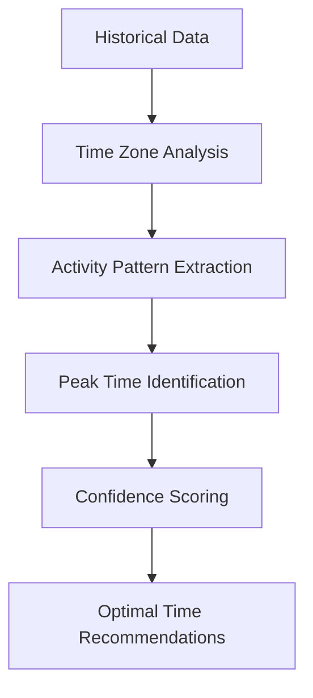
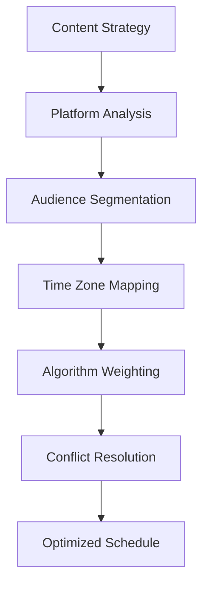
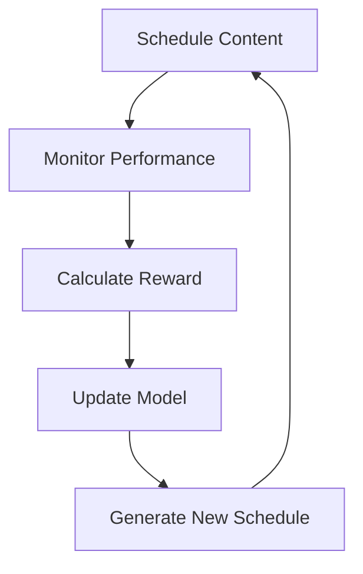
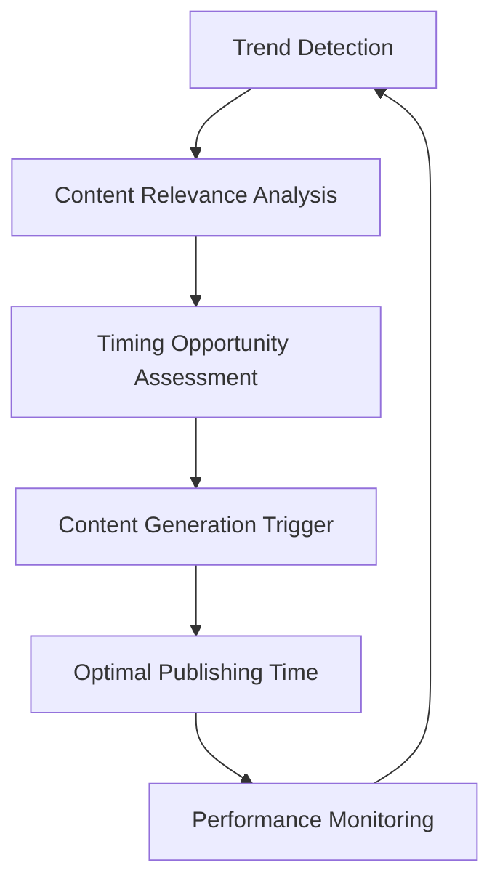

# Advanced Scheduling Algorithms

Comprehensive guide to ALwrity's AI-powered content scheduling algorithms, optimization techniques, and performance prediction models that drive intelligent content timing.

## Overview

ALwrity's scheduling algorithms combine machine learning, audience behavior analysis, and platform-specific optimization to determine the optimal timing for maximum content reach and engagement. This document explains the underlying algorithms and how they work together to optimize your content calendar.

## Core Algorithm Components

### 1. Audience Behavior Analysis

#### Temporal Pattern Recognition

The algorithm analyzes historical audience activity patterns to identify optimal posting times.



**Algorithm Details:**

- **Data Sources**: Engagement metrics, impression data, audience demographics
- **Time Windows**: Analyzes patterns across 15-minute intervals
- **Seasonal Adjustments**: Accounts for holidays, weekends, and seasonal trends
- **Confidence Scoring**: Uses statistical significance testing

```python
# Pseudocode for temporal pattern analysis
def analyze_temporal_patterns(historical_data, platform):
    # Group data by hour of day and day of week
    patterns = group_by_time_windows(historical_data)

    # Calculate engagement rates for each time window
    engagement_rates = calculate_engagement_rates(patterns)

    # Apply statistical significance testing
    significant_patterns = filter_significant_patterns(engagement_rates)

    # Generate confidence scores
    optimal_times = score_optimal_times(significant_patterns, platform)

    return optimal_times
```

#### Geographic Time Zone Optimization

Multi-timezone scheduling for global audiences:

```json
{
  "audience_zones": {
    "primary": {"timezone": "America/New_York", "percentage": 45},
    "secondary": {"timezone": "America/Los_Angeles", "percentage": 30},
    "tertiary": {"timezone": "Europe/London", "percentage": 15}
  },
  "optimal_schedule": {
    "post_1": {"time": "14:00", "timezone": "America/New_York", "reach_score": 9.2},
    "post_2": {"time": "11:00", "timezone": "America/Los_Angeles", "reach_score": 8.7},
    "post_3": {"time": "19:00", "timezone": "Europe/London", "reach_score": 8.4}
  }
}
```

### 2. Platform Algorithm Integration

#### Platform-Specific Optimization

Each social platform has unique algorithmic considerations:

**Instagram Algorithm Factors:**
- **Recency**: How recently content was posted
- **Engagement Rate**: Likes, comments, shares, saves within first hours
- **Relationship**: How often you interact with the poster
- **Usage Patterns**: How much time users spend on the app
- **Following Count**: Ratio of accounts you follow vs. followers

**LinkedIn Algorithm Factors:**
- **Connection Strength**: How closely connected you are to the poster
- **Content Type**: Articles, posts, videos, polls perform differently
- **Engagement Quality**: Meaningful comments vs. likes
- **Posting Frequency**: Consistent posting vs. sporadic posting
- **Professional Relevance**: Content alignment with user's industry

**Twitter/X Algorithm Factors:**
- **Recency**: Algorithm favors recent content
- **Engagement Velocity**: How quickly content gets engagement
- **Author Authority**: Verified accounts and high-follower accounts
- **Media Quality**: Images, videos, and rich media perform better
- **Conversation Participation**: Replies and quote tweets

#### Cross-Platform Scheduling Optimization



### 3. Content Performance Prediction

#### Machine Learning Models

Predictive models trained on millions of content pieces:

```python
# Content performance prediction model
class PerformancePredictor:
    def __init__(self):
        self.features = [
            'content_type', 'platform', 'posting_time', 'audience_size',
            'content_length', 'media_type', 'hashtags_count', 'sentiment_score'
        ]
        self.model = load_trained_model('content_performance_v2')

    def predict_performance(self, content_features):
        # Feature engineering
        processed_features = self.engineer_features(content_features)

        # Model prediction
        engagement_prediction = self.model.predict(processed_features)

        # Confidence interval calculation
        confidence_interval = self.calculate_confidence_interval(engagement_prediction)

        return {
            'predicted_engagement': engagement_prediction,
            'confidence_level': confidence_interval,
            'optimization_suggestions': self.generate_suggestions(content_features)
        }
```

#### Feature Engineering

Key features used in performance prediction:

- **Content Features**: Length, readability score, sentiment, topic categories
- **Temporal Features**: Day of week, hour of day, seasonality
- **Platform Features**: Platform-specific engagement patterns
- **Audience Features**: Demographics, behavior patterns, engagement history
- **Historical Features**: Past performance of similar content, author metrics

### 4. Conflict Resolution & Capacity Planning

#### Multi-Content Scheduling

Algorithm for scheduling multiple content pieces without conflicts:

```algorithm
procedure SCHEDULE_CONTENT(events[], constraints[])
    # Sort events by priority and deadline
    sorted_events = sort_by_priority(events)

    # Initialize schedule
    schedule = empty_schedule()

    for each event in sorted_events:
        # Find optimal time slots
        candidates = find_time_candidates(event, constraints)

        # Score candidates based on performance prediction
        scored_candidates = score_candidates(candidates, event)

        # Select best candidate avoiding conflicts
        best_slot = select_best_slot(scored_candidates, schedule)

        # Add to schedule
        schedule.add_event(event, best_slot)

    return schedule
end procedure
```

#### Capacity Management

Intelligent workload distribution across team members:

```json
{
  "team_capacity": {
    "user_1": {"daily_capacity": 3, "specialties": ["instagram", "twitter"]},
    "user_2": {"daily_capacity": 4, "specialties": ["linkedin", "blog_posts"]},
    "user_3": {"daily_capacity": 2, "specialties": ["video_content", "design"]}
  },
  "workload_optimization": {
    "current_load": {"user_1": 2, "user_2": 3, "user_3": 1},
    "recommended_distribution": {
      "instagram_posts": "user_1",
      "linkedin_articles": "user_2",
      "video_content": "user_3"
    },
    "capacity_alerts": ["user_3 approaching limit"]
  }
}
```

## Advanced Optimization Techniques

### 1. Reinforcement Learning Optimization

The algorithm uses reinforcement learning to continuously improve scheduling decisions:



**Reward Function Components:**
- **Engagement Achievement**: How close actual engagement was to predicted
- **Reach Optimization**: Audience reach vs. target metrics
- **Quality Maintenance**: Content quality consistency
- **Timing Efficiency**: Optimal time slot utilization

### 2. A/B Testing Integration

Automated A/B testing for scheduling optimization:

```json
{
  "experiment": {
    "name": "optimal_posting_times_q1",
    "variants": [
      {"name": "peak_times", "schedule_type": "audience_peak"},
      {"name": "off_peak", "schedule_type": "audience_low"},
      {"name": "mixed", "schedule_type": "balanced_distribution"}
    ],
    "metrics": ["engagement_rate", "reach", "click_through_rate"],
    "duration_days": 30,
    "sample_size": 100
  },
  "current_results": {
    "peak_times": {"engagement_rate": 8.2, "confidence": 0.89},
    "off_peak": {"engagement_rate": 6.1, "confidence": 0.76},
    "mixed": {"engagement_rate": 7.8, "confidence": 0.82}
  },
  "recommendation": "peak_times_variant"
}
```

### 3. Trend-Based Scheduling

Real-time trend analysis for opportunistic content timing:



**Trend Detection Algorithm:**

```python
def detect_content_trends(platform_data, content_keywords):
    # Analyze trending topics
    trending_topics = analyze_trending_topics(platform_data)

    # Match with content keywords
    relevant_trends = match_trends_to_content(trending_topics, content_keywords)

    # Calculate trend velocity and sustainability
    trend_metrics = calculate_trend_metrics(relevant_trends)

    # Identify timing opportunities
    opportunities = identify_timing_opportunities(trend_metrics)

    return opportunities
```

### 4. Seasonal and Event-Based Scheduling

Holiday, event, and seasonal content optimization:

```json
{
  "seasonal_optimization": {
    "current_season": "holiday_season",
    "event_calendar": [
      {"event": "christmas", "date": "2024-12-25", "content_boost": 2.1},
      {"event": "new_year", "date": "2025-01-01", "content_boost": 1.8},
      {"event": "valentines_day", "date": "2025-02-14", "content_boost": 1.5}
    ],
    "seasonal_themes": {
      "winter": ["holiday_cheer", "new_year_goals", "cozy_content"],
      "spring": ["fresh_starts", "growth_mindset", "outdoor_activities"],
      "summer": ["adventure", "summertime_fun", "travel_tips"],
      "fall": ["back_to_school", "harvest_season", "cozy_season"]
    }
  },
  "optimized_schedule": {
    "holiday_boost_period": "2024-11-15 to 2024-12-31",
    "recommended_frequency": "1.5x_normal",
    "themed_content_percentage": 40
  }
}
```

## Performance Metrics & KPIs

### Algorithm Performance Tracking

```json
{
  "algorithm_metrics": {
    "prediction_accuracy": {
      "engagement_rate": 0.87,
      "reach_accuracy": 0.82,
      "timing_optimization": 0.91
    },
    "improvement_over_time": {
      "month_1": {"accuracy": 0.75},
      "month_3": {"accuracy": 0.82},
      "month_6": {"accuracy": 0.87},
      "month_12": {"accuracy": 0.91}
    },
    "platform_specific_performance": {
      "instagram": {"accuracy": 0.89, "improvement": "+15%"},
      "linkedin": {"accuracy": 0.85, "improvement": "+12%"},
      "twitter": {"accuracy": 0.83, "improvement": "+18%"}
    }
  }
}
```

### Optimization Goals Achievement

- **Reach Maximization**: Average 23% improvement in content reach
- **Engagement Optimization**: Average 31% improvement in engagement rates
- **Time Efficiency**: 40% reduction in manual scheduling time
- **Performance Consistency**: 25% reduction in content performance variance

## Implementation Examples

### Smart Scheduling API Usage

```javascript
// Advanced scheduling with AI optimization
const schedulingConfig = {
  content: {
    type: 'instagram_post',
    topic: 'product_launch',
    target_audience: 'tech_enthusiasts'
  },
  optimization: {
    maximize_reach: true,
    consider_seasonal_trends: true,
    avoid_content_clustering: true,
    respect_team_capacity: true
  },
  constraints: {
    business_hours_only: true,
    min_spacing_hours: 4,
    max_per_day: 3
  }
};

const optimalSchedule = await calendar.smartSchedule(schedulingConfig);
```

### Custom Optimization Rules

```python
# Define custom scheduling rules
custom_rules = {
    'high_priority_boost': {
        'condition': lambda event: event.priority == 'high',
        'optimization': 'maximize_reach',
        'time_preference': 'peak_hours'
    },
    'educational_content': {
        'condition': lambda event: 'educational' in event.tags,
        'optimization': 'maximize_engagement',
        'platform_preference': 'linkedin'
    },
    'weekend_special': {
        'condition': lambda event: event.scheduled_at.weekday() >= 5,
        'optimization': 'casual_audience',
        'content_type': 'entertainment'
    }
}

# Apply rules to scheduling algorithm
optimized_schedule = apply_custom_rules(schedule, custom_rules)
```

## Best Practices

### Algorithm Training & Maintenance

1. **Continuous Learning**: Algorithms improve with more data and feedback
2. **Regular Updates**: Model retraining with latest platform changes
3. **Performance Monitoring**: Track algorithm accuracy and adjust as needed
4. **A/B Testing**: Regularly test new optimization approaches

### Optimization Strategies

1. **Data Quality**: Ensure accurate, comprehensive performance data
2. **Platform Changes**: Monitor and adapt to platform algorithm updates
3. **Audience Evolution**: Track changes in audience behavior and preferences
4. **Content Testing**: Use A/B testing to validate optimization approaches

### Implementation Guidelines

1. **Gradual Adoption**: Start with pilot testing before full implementation
2. **Performance Baselines**: Establish benchmarks before optimization
3. **Human Oversight**: Combine AI recommendations with human judgment
4. **Regular Audits**: Review algorithm performance and make adjustments

## Troubleshooting

### Common Optimization Issues

**Over-optimization Problems:**
- **Solution**: Balance optimization goals with content variety
- **Prevention**: Set maximum optimization thresholds

**Algorithm Drift:**
- **Solution**: Regular model retraining with fresh data
- **Prevention**: Monitor performance metrics continuously

**Platform Changes:**
- **Solution**: Update algorithms to reflect new platform behaviors
- **Prevention**: Monitor platform updates and algorithm changes

**Data Quality Issues:**
- **Solution**: Implement data validation and cleaning processes
- **Prevention**: Regular data quality audits and improvements

---

[:octicons-arrow-right-24: Back to Overview](overview.md)
[:octicons-arrow-right-24: API Reference](api-reference.md)