# Copilot + Blog Writer Integration

The Blog Writer with Copilot integration provides intelligent, conversational assistance for creating high-quality, SEO-optimized blog content. Instead of navigating complex forms, you can simply describe your topic and let Copilot guide you through the entire 6-phase blog creation process.

## Overview

When Copilot is enabled in Blog Writer, you get:
- **Conversational Topic Development**: Describe your blog idea in plain English
- **Automated Research**: Copilot handles keyword research and competitor analysis
- **Guided Content Creation**: Step-by-step assistance through outlining and writing
- **Real-time SEO Optimization**: Continuous optimization suggestions
- **Smart Publishing**: Automated formatting and platform optimization

## Getting Started

### Enable Blog Writer Copilot
1. Navigate to `/blog-writer` in your ALwrity dashboard
2. Look for the **Copilot toggle** in the header or sidebar
3. Click to enable Copilot mode
4. The Copilot panel will appear with contextual suggestions

### Your First Blog Post with Copilot
```typescript
You: "Help me write a blog post about remote work productivity tips"
Copilot: "I'd be happy to help you create that blog post! Let me guide you through the process.

First, I need to understand your audience and goals:
- Who is your target audience? (freelancers, managers, executives)
- What's your main goal? (engagement, leads, thought leadership)
- What's your word count preference? (800-1200 words typical)

Based on your answers, I'll create a comprehensive blog post with research, outline, content, and SEO optimization."
```

## Conversational Workflow

```mermaid
flowchart TD
    A[💬 User Request<br/>'Help me write a blog post'] --> B[🎯 Intent Recognition<br/>Blog writing request]
    B --> C[🔍 Research Phase<br/>Keyword analysis, competitor research]
    C --> D[📝 Outline Generation<br/>Structure creation, SEO optimization]
    D --> E[✍️ Content Writing<br/>Section-by-section generation]
    E --> F[🎯 SEO Enhancement<br/>Real-time optimization suggestions]
    F --> G[📤 Publishing Prep<br/>Format and platform optimization]

    H[💭 User Feedback] --> I{Accept/Modify?}
    I -->|Accept| J[✅ Continue Process]
    I -->|Modify| K[🔄 Refine Content]

    J --> L[📊 Track Performance]
    K --> L

    style A fill:#e3f2fd
    style C fill:#e8f5e8
    style E fill:#fff3e0
    style G fill:#f3e5f5
```



### Phase 1: Topic & Strategy Development
```typescript
User: "I want to write about AI tools for content creators"
Copilot: "Great topic! Let me help you develop this. Here's what I'll do:

🔍 **Research Phase**: I'll analyze current AI content tools, search trends, and competitor content
📊 **Keyword Strategy**: Find optimal keywords like 'best AI writing tools 2024', 'content creation AI'
🎯 **Audience Analysis**: Target content marketers, bloggers, and small business owners
📈 **Content Strategy**: Position this as a comprehensive guide vs. basic list

Should I proceed with the research, or would you like to adjust the focus?"
```

### Phase 2: Intelligent Outline Creation
```typescript
Copilot: "Based on my research, here's your optimized outline:

📝 **Blog Post Structure**
- **Introduction**: Hook with compelling AI adoption trends
- **Current AI Landscape**: Overview of major categories (writing, image, video)
- **Top Tools Review**: 8-10 essential tools with pros/cons
- **Implementation Guide**: How to integrate AI into workflow
- **Future Trends**: What's coming in AI content creation
- **Conclusion**: Actionable next steps

This structure targets 2,400 monthly searches and has high engagement potential. Should I generate the content, or would you like to modify the outline?"
```

### Phase 3: Content Generation
```typescript
Copilot: "I'll now write your blog post section by section. This ensures quality and allows you to provide feedback.

✍️ **Writing Introduction...**

'The landscape of content creation has been revolutionized by artificial intelligence. Industry studies show growing adoption of AI tools in marketing workflows...'

Does this introduction work for you? I can make it more conversational, add specific statistics, or adjust the tone."
```

## Advanced Features

### Real-time SEO Optimization
```typescript
Copilot: "As you write, I continuously optimize for SEO:

✅ **Primary Keyword**: 'AI content creation tools' (2,100 monthly searches)
✅ **Secondary Keywords**: 'best AI writing tools', 'content marketing AI'
✅ **LSI Keywords**: Automatically incorporated (workflow, automation, efficiency)
⚠️ **Suggestion**: Add internal link to your SEO guide
📈 **Readability Score**: Currently 72/100 (aiming for 80+)

Would you like me to optimize this paragraph further?"
```

### Content Enhancement Suggestions
```typescript
Copilot: "I notice this section could be stronger. Here are my suggestions:

🎯 **Add Credibility**: Include Gartner research on AI adoption rates
📊 **Visual Enhancement**: Suggest adding a comparison chart
🔗 **Internal Linking**: Link to your related AI strategy article
📈 **Engagement**: Add a question to increase reader interaction

Should I implement these improvements?"
```

### Research Integration
```typescript
User: "Add some statistics about AI adoption"
Copilot: "I'll research and add relevant statistics:

🔍 **Research Results**:
- Industry reports show growing AI adoption in content teams
- Organizations increasingly plan to invest in AI tools
- HubSpot: AI saves average of 4.1 hours per week per marketer

I've added these to your content with proper citations. The statistics are from credible sources published within the last 6 months."
```

## Best Practices

### Effective Blog Writing Prompts
- **Specific Topics**: "Write about sustainable fashion marketing for Gen Z consumers"
- **Audience Focus**: "Create content for B2B SaaS companies about lead generation"
- **Goals Oriented**: "Write an educational post that drives newsletter signups"
- **Platform Optimized**: "Create a LinkedIn-friendly blog post about leadership"

### Maximizing Copilot Value
- **Iterative Feedback**: Provide feedback on each section for better results
- **Specific Instructions**: "Make this more conversational" or "Add technical depth"
- **Context Sharing**: Mention your brand voice or previous content style
- **Research Requests**: Ask for specific data or examples to include

### Quality Assurance
- **Review Suggestions**: Always review AI-generated content before publishing
- **Fact Check**: Verify statistics and claims, especially time-sensitive data
- **Brand Alignment**: Ensure content matches your brand voice and values
- **SEO Validation**: Check that optimization doesn't compromise readability

## Integration with Other Tools

### Research Integration
```typescript
Copilot: "I can integrate research from your Research tool. I see you have saved research on 'AI marketing trends'. Should I incorporate those findings into this blog post?"
```

### Image Studio Integration
```typescript
Copilot: "For this blog post about AI tools, I can suggest relevant images:

🖼️ **Recommended Images**:
- Hero image: AI brain concept with content creation icons
- Section images: Tool screenshots and workflow diagrams
- Social cards: Optimized for LinkedIn and Twitter sharing

Should I generate these images using your Image Studio?"
```

### SEO Dashboard Integration
```typescript
Copilot: "After publishing, I can help you track performance:

📊 **SEO Tracking Setup**:
- Monitor target keywords ranking
- Track organic traffic increases
- Measure engagement metrics
- Set up conversion goal tracking

Would you like me to configure SEO tracking for this post?"
```

## Troubleshooting

### Common Issues

**Copilot suggestions not appearing:**
- Ensure Copilot is enabled (blue toggle active)
- Check internet connection
- Refresh the page and try again

**Content quality concerns:**
- Provide more specific instructions about tone and audience
- Review and provide feedback on initial drafts
- Use the "Continue writing" feature for refinement

**SEO suggestions too aggressive:**
- Ask Copilot to "balance SEO with readability"
- Specify your preferred keyword density
- Request "natural optimization" approach

### Getting Better Results
- **Start Specific**: "Write a 1,200-word guide about AI for small business marketing"
- **Provide Context**: "Write in our brand voice - professional but approachable"
- **Give Examples**: "Similar to our previous post about social media automation"
- **Set Goals**: "Optimize for newsletter signups and lead generation"

## Success Metrics

Track your Blog Writer + Copilot success:

- **Writing Speed**: Faster time from idea to published post
- **Content Quality**: Engagement rates, time on page, social shares
- **SEO Performance**: Keyword rankings, organic traffic growth
- **Conversion Impact**: Newsletter signups, lead generation, sales

## Enterprise Features

### Team Collaboration
- **Shared Outlines**: Team members can collaborate on blog outlines
- **Brand Reviews**: Automated brand voice compliance checking
- **Approval Workflows**: Guided review and approval processes
- **Performance Analytics**: Team-wide content performance tracking

### Advanced Customization
- **Brand Voice Training**: Teach Copilot your specific brand guidelines
- **Custom Templates**: Organization-specific blog post templates
- **Integration APIs**: Connect with your CMS and publishing platforms
- **Analytics Integration**: Pull data from Google Analytics and Search Console

---

*Ready to create amazing blog content conversationally? Enable Copilot in Blog Writer and start with "Help me write a blog post about..."*

[:octicons-arrow-right-24: Getting Started](getting-started.md)
[:octicons-arrow-right-24: Advanced SEO Integration](seo-dashboard.md)