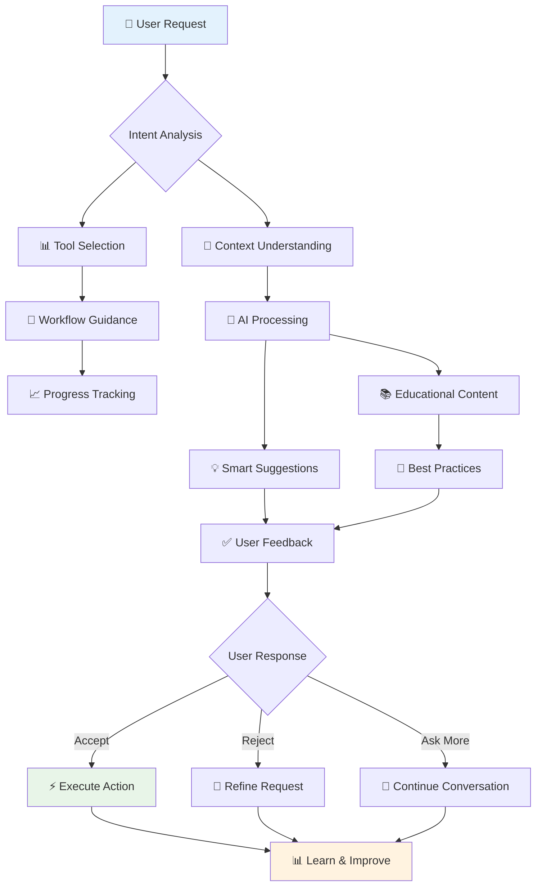

# Alwrity Copilot Overview

Alwrity Copilot is an intelligent AI assistant that transforms how you interact with ALwrity's content creation tools. Built on CopilotKit, it provides conversational AI assistance across all ALwrity features, making advanced content creation accessible to everyone.

## What is Alwrity Copilot?

Alwrity Copilot is your intelligent AI content strategist and assistant that understands your goals, learns your preferences, and guides you through complex workflows with natural language conversations. Built on CopilotKit, it transforms how you interact with ALwrity's powerful AI features by providing:

- **Conversational AI Interface**: Ask questions in plain English instead of navigating complex forms
- **Context-Aware Assistance**: Understands your current workflow and provides relevant suggestions
- **Workflow Automation**: Completes multi-step processes through simple conversations
- **Personalized Learning**: Adapts to your business type, experience level, and content preferences

### Key Capabilities

- **Conversational Interface**: Ask questions in plain English and get contextual help
- **Workflow Automation**: Complete multi-step processes through simple conversations
- **Real-time Assistance**: Get help exactly when you need it in any tool
- **Personalized Guidance**: Adapts to your business type, experience level, and preferences
- **Cross-Tool Integration**: Seamlessly works across all ALwrity features

## How It Works

ALwrity Copilot integrates with CopilotKit to provide intelligent assistance across these core areas:

### 🤖 **AI-Powered Assistance**
- **Context Awareness**: Understands your current task and provides relevant suggestions
- **Natural Language Processing**: Responds to conversational requests and questions
- **Learning Adaptation**: Improves recommendations based on your usage patterns

### 🎯 **Workflow Guidance**
- **Step-by-Step Guidance**: Breaks down complex processes into manageable steps
- **Smart Tool Selection**: Automatically recommends the right tools for your goals
- **Progress Tracking**: Monitors your progress and suggests next steps

### 📚 **Educational Support**
- **On-Demand Learning**: Explains concepts when you encounter them
- **Personalized Tutorials**: Adapts explanations to your experience level
- **Best Practice Recommendations**: Suggests industry-standard approaches

## Integrated Tools

Alwrity Copilot works seamlessly with all major ALwrity features:

### Content Creation
- **Blog Writer**: AI-assisted blog post creation with real-time suggestions
- **LinkedIn Writer**: Professional social media content with tone optimization
- **Facebook Writer**: Engaging social media posts with audience targeting
- **Story Writer**: Creative storytelling assistance and plot development

### SEO & Analytics
- **SEO Dashboard**: Comprehensive SEO analysis with actionable recommendations
- **Research Integration**: Automated research with fact-checking and source verification
- **Performance Tracking**: Real-time analytics and optimization suggestions

### Media & Visuals
- **Image Studio**: AI-powered image creation and editing assistance
- **Video Studio**: Video content creation with script and editing help
- **Instagram Editor**: Social media content optimization and scheduling

### Strategy & Planning
- **Content Strategy**: AI-driven strategy development and persona creation
- **Content Calendar**: Automated calendar generation and content planning
- **Persona System**: Personalized writing assistant development

## Getting Started

### Quick Start
1. **Enable Copilot**: Look for the Copilot toggle in any ALwrity tool
2. **Ask Questions**: Start with simple requests like "Help me create a blog post"
3. **Follow Guidance**: Let Copilot guide you through the process
4. **Learn Gradually**: Copilot adapts to your experience level

### Best Practices
- **Be Specific**: Clear requests get better results (e.g., "Create LinkedIn content about AI trends for tech executives")
- **Use Context**: Copilot remembers your previous interactions and preferences
- **Ask for Help**: Don't hesitate to ask questions about any feature
- **Provide Feedback**: Help Copilot learn by accepting or rejecting suggestions

## Technical Architecture

### CopilotKit Integration
Alwrity Copilot is built on CopilotKit, providing:

**Core Components:**
- **State Management**: Persistent context across sessions with Zustand
- **Action System**: Executable functions triggered by natural language
- **Streaming Responses**: Real-time conversational interactions
- **Multi-Modal Support**: Text, images, and structured data handling
- **Provider Abstraction**: Unified interface across multiple AI providers

**Backend Integration:**
- **Service Layer**: Dedicated CopilotKit services for each feature area
- **API Endpoints**: RESTful endpoints for Copilot actions and workflows
- **Task Management**: Background processing for complex operations
- **Cache Layer**: Intelligent caching for improved performance

**Frontend Implementation:**
- **React Components**: Modular Copilot UI components
- **Context Providers**: Feature-specific Copilot contexts
- **Hook System**: Custom hooks for Copilot state management
- **Type Safety**: Full TypeScript integration with CopilotKit types

### Security & Privacy
- **Data Encryption**: All conversations are encrypted in transit and at rest
- **No Data Retention**: Conversations are not stored permanently
- **Privacy Controls**: Users can clear conversation history anytime
- **Enterprise Compliance**: SOC 2 and GDPR compliant

## Use Cases

### For Content Creators
*"Help me write a blog post about sustainable fashion trends"*
- Generates outline, research sources, and content suggestions
- Provides SEO optimization recommendations
- Suggests related social media content

### For Marketing Teams
*"Create a content strategy for our SaaS product launch"*
- Develops comprehensive content plans
- Generates content calendars
- Sets up performance tracking

### For Business Owners
*"I need social media content for my restaurant this week"*
- Creates platform-optimized posts
- Suggests optimal posting times
- Generates image and video ideas

### For Agencies
*"Plan content for our client's e-commerce brand"*
- Creates multi-platform content strategies
- Manages client personas and brand voices
- Tracks campaign performance

## Advanced Features

### Custom Actions
Create custom Copilot actions for specific workflows and business processes.

### Team Collaboration
Share Copilot conversations and learnings across team members.

### Analytics Integration
Track Copilot usage and effectiveness across your organization.

### API Access
Integrate Copilot capabilities into your own applications and workflows.

### Enterprise Features (Enterprise)
- **Team Conversations**: Share insights across team members
- **Brand Guidelines**: Enforce consistent messaging
- **Approval Workflows**: Guide content through review processes
- **Analytics Integration**: Track Copilot usage and effectiveness
- **Custom Actions**: Build organization-specific Copilot capabilities
- **SSO Integration**: Enterprise authentication and access control
- **Audit Logging**: Complete compliance and usage tracking
- **Multi-Tenant Support**: Separate Copilot instances per team/department

## Success Metrics

### User Adoption
- **Daily Active Users**: Percentage of users engaging with Copilot daily
- **Feature Utilization**: Which Copilot features are most used
- **Task Completion Rate**: Percentage of initiated tasks completed successfully
- **Time to Value**: Average time from first use to productive workflows

### Performance Impact
- **Time Savings**: Reduced time spent on content creation tasks
- **Quality Improvement**: Content quality and engagement metrics
- **Error Reduction**: Decrease in user errors and support tickets
- **Productivity Gains**: Output volume and efficiency improvements

### Business Outcomes
- **Content Velocity**: Increase in content production speed
- **Cost Efficiency**: Reduction in content creation costs
- **User Satisfaction**: NPS and satisfaction survey results
- **Feature Adoption**: Percentage of available features actively used

---

*Ready to experience conversational AI content creation? Enable Copilot in any ALwrity tool and start with a simple request like "Help me create content"*

[:octicons-arrow-right-24: Getting Started Guide](getting-started.md)
[:octicons-arrow-right-24: SEO Copilot Guide](seo-dashboard.md)