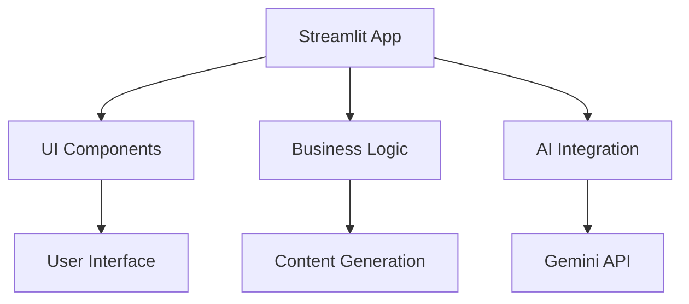
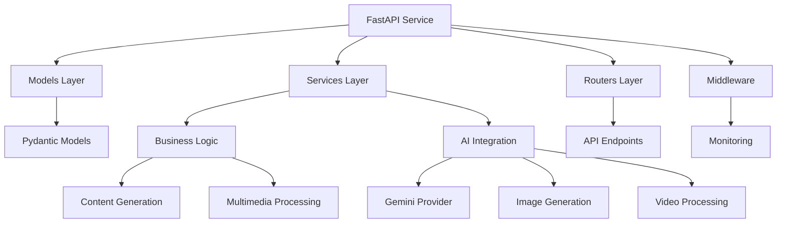

# Facebook Writer Migration Guide

Complete documentation of the Facebook Writer migration from Streamlit to FastAPI, including architectural changes, feature enhancements, and content type expansions.

## Migration Overview

The Facebook Writer has been successfully migrated from a Streamlit-based application to a robust FastAPI service, expanding its capabilities with enhanced content types, improved performance, and comprehensive API integration.

## Migration Background

### Before Migration

**Original Implementation:**
- **Framework**: Streamlit web application
- **Location**: `ToBeMigrated/ai_writers/facebook_writer/`
- **Architecture**: Monolithic application with embedded UI logic
- **Features**: Basic text-based content generation for Facebook posts
- **Integration**: Standalone application with limited API access

### After Migration

**New Implementation:**
- **Framework**: FastAPI microservice
- **Location**: Integrated into main ALwrity backend (`backend/`)
- **Architecture**: Modular API service with clean separation of concerns
- **Features**: Comprehensive Facebook content ecosystem with multimedia support
- **Integration**: Fully integrated with ALwrity ecosystem

## Architectural Changes

### Before: Monolithic Streamlit App



### After: Modular FastAPI Service



## Feature Enhancements

### Expanded Content Types

#### 1. Traditional Content (Enhanced)
- **Facebook Posts**: Enhanced with multimedia support and advanced formatting
- **Facebook Stories**: 15-second ephemeral content with interactive elements
- **Facebook Reels**: Short-form video content with advanced editing
- **Carousel Posts**: Multi-image storytelling with enhanced visual design

#### 2. New Content Types (Added)

##### Event Descriptions
**Comprehensive event content generation:**
```python
class EventContentGenerator:
    async def generate_event_content(
        self,
        event_details: EventDetails,
        content_type: str = "promotion"
    ) -> EventContent:

        # Generate compelling event description
        description = await self._generate_description(event_details)

        # Create promotional copy variations
        promotional_copy = await self._generate_promotional_copy(
            event_details, description
        )

        # Generate social proof elements
        social_proof = await self._generate_social_proof(event_details)

        # Create call-to-action content
        cta_content = await self._generate_cta_content(event_details)

        return EventContent(
            description=description,
            promotional_copy=promotional_copy,
            social_proof=social_proof,
            cta_content=cta_content,
            hashtags=self._generate_event_hashtags(event_details),
            optimal_posting_times=self._calculate_posting_strategy(event_details)
        )
```

##### Group Posts
**Community-focused content for Facebook Groups:**
- **Discussion Starters**: Questions and topics that encourage engagement
- **Resource Sharing**: Valuable content that provides group value
- **Member Spotlights**: Content that highlights community members
- **Event Promotions**: Group-specific event announcements

##### Page About Sections
**Professional page descriptions that establish credibility:**
- **Company Overviews**: Comprehensive business descriptions
- **Mission Statements**: Compelling mission and vision statements
- **Service Descriptions**: Detailed service offering explanations
- **Call-to-Action Integration**: Strategic CTA placement

##### Ad Copy
**Compelling advertising copy for Facebook Ads:**
- **Awareness Ads**: Brand awareness and consideration campaigns
- **Conversion Ads**: Direct response and lead generation
- **Retargeting Ads**: Re-engagement campaign copy
- **Video Ad Scripts**: Video advertisement scripting

### Multimedia Integration

#### Enhanced Image Support

**Advanced image generation and optimization:**
```python
class FacebookImageGenerator:
    async def generate_optimized_images(
        self,
        content: str,
        platform_specs: FacebookSpecs,
        style: str = "engaging"
    ) -> List[OptimizedImage]:

        # Analyze content for visual themes
        themes = await self._analyze_content_themes(content)

        # Generate platform-optimized images
        images = []
        for theme in themes[:3]:  # Generate up to 3 images
            prompt = await self._create_image_prompt(theme, style)

            # Use Ideogram V3 Turbo for high-quality generation
            image = await ideogram.generate(
                prompt=prompt,
                aspect_ratio=platform_specs.aspect_ratio,
                style=style,
                enhance_prompt=True
            )

            # Optimize for Facebook algorithm
            optimized = await self._optimize_for_facebook(image, platform_specs)

            images.append(optimized)

        return images
```

#### Video Content Enhancement

**Reels and Stories video generation:**
```python
class FacebookVideoGenerator:
    async def generate_reel_content(
        self,
        topic: str,
        duration: str = "30_seconds",
        style: str = "engaging",
        target_audience: str = "general"
    ) -> ReelContent:

        # Generate engaging script
        script = await self._generate_reel_script(topic, duration, target_audience)

        # Create visual treatment
        visuals = await self._design_visual_treatment(script, style)

        # Generate video using WAN 2.5
        video = await wan25.generate_video(
            script=script,
            visuals=visuals,
            duration=duration,
            style=style
        )

        # Add Facebook-specific optimizations
        optimized = await self._optimize_for_facebook_reels(video)

        return ReelContent(
            video_url=optimized.url,
            thumbnail_url=optimized.thumbnail,
            script=script,
            captions=optimized.captions,
            hashtags=optimized.hashtags,
            music_suggestions=optimized.music
        )
```

### Performance Improvements

#### Before Migration
- Synchronous processing with limited concurrency
- Basic error handling and user feedback
- No monitoring or analytics capabilities
- Limited scalability and performance optimization

#### After Migration
- **Async/Await Support**: Better concurrency and performance
- **Comprehensive Monitoring**: Request/response tracking and analytics
- **Health Checks**: Service availability monitoring
- **Rate Limiting**: API protection and fair usage
- **Caching**: Intelligent response caching for improved performance

## API Reference

### Core Endpoints

#### Health Check
```http
GET /api/facebook-writer/health
```

**Response:**
```json
{
  "status": "healthy",
  "timestamp": "2024-01-15T10:30:00Z",
  "version": "2.0.0",
  "services": {
    "gemini": "operational",
    "ideogram": "operational",
    "wan25": "operational"
  }
}
```

#### Generate Facebook Post
```http
POST /api/facebook-writer/post/generate
```

**Enhanced Request Body:**
```json
{
  "topic": "Product Launch Announcement",
  "content_type": "promotion",
  "audience": "existing_customers",
  "tone": "exciting_enthusiastic",
  "include_emoji": true,
  "include_hashtags": true,
  "multimedia": {
    "include_image": true,
    "image_style": "vibrant_modern",
    "generate_video": false
  },
  "engagement_hooks": {
    "include_question": true,
    "include_poll": false,
    "add_cta": true
  },
  "platform_optimization": {
    "algorithm_focus": "engagement",
    "posting_strategy": "peak_engagement"
  }
}
```

#### Generate Facebook Story
```http
POST /api/facebook-writer/story/generate
```

**Request Body:**
```json
{
  "topic": "Behind the Scenes",
  "story_type": "ephemeral_content",
  "duration": "15_seconds",
  "interactive_elements": ["question", "poll"],
  "visual_style": "authentic_raw",
  "brand_integration": "subtle_overlay",
  "call_to_action": "visit_page"
}
```

#### Generate Facebook Reel
```http
POST /api/facebook-writer/reel/generate
```

**Request Body:**
```json
{
  "topic": "Quick Recipe Tutorial",
  "duration": "30_seconds",
  "style": "educational_entertaining",
  "hook_strength": "strong",
  "teaching_method": "step_by_step",
  "music_mood": "upbeat_motivational",
  "end_screen_cta": "try_this_recipe"
}
```

#### Generate Carousel Post
```http
POST /api/facebook-writer/carousel/generate
```

**Request Body:**
```json
{
  "topic": "Product Feature Showcase",
  "slides": 5,
  "story_arc": "problem_solution_benefit",
  "visual_theme": "clean_modern",
  "slide_transitions": "smooth",
  "cover_slide": {
    "title": "Transform Your Workflow",
    "subtitle": "5 features that make the difference",
    "background_style": "gradient"
  },
  "content_distribution": {
    "feature_explanation": 3,
    "user_benefits": 1,
    "social_proof": 1
  }
}
```

#### Generate Event Description
```http
POST /api/facebook-writer/event/generate
```

**Request Body:**
```json
{
  "event_details": {
    "name": "Product Launch Webinar",
    "date": "2024-02-15T14:00:00Z",
    "duration": "60_minutes",
    "type": "webinar",
    "target_audience": "potential_customers"
  },
  "content_focus": "attendance_driving",
  "include_social_proof": true,
  "urgency_elements": "limited_seats",
  "follow_up_content": true
}
```

#### Generate Group Post
```http
POST /api/facebook-writer/group-post/generate
```

**Request Body:**
```json
{
  "group_context": {
    "group_type": "professional_networking",
    "group_size": "large",
    "engagement_level": "high"
  },
  "content_type": "discussion_starter",
  "topic": "Industry Trends 2024",
  "engagement_goal": "community_discussion",
  "value_proposition": "expert_insights"
}
```

#### Generate Page About Section
```http
POST /api/facebook-writer/page-about/generate
```

**Request Body:**
```json
{
  "business_type": "software_company",
  "industry": "technology",
  "target_audience": "business_professionals",
  "key_differentiators": ["innovation", "reliability", "customer_focus"],
  "tone": "professional_trustworthy",
  "include_cta": true,
  "character_limit": 155
}
```

#### Generate Ad Copy
```http
POST /api/facebook-writer/ad-copy/generate
```

**Request Body:**
```json
{
  "campaign_objective": "conversions",
  "target_audience": "small_business_owners",
  "product_service": "accounting_software",
  "key_benefits": ["time_saving", "accuracy", "compliance"],
  "ad_format": "carousel",
  "budget_context": "moderate",
  "competition_level": "high"
}
```

### Advanced Endpoints

#### Batch Content Generation
```http
POST /api/facebook-writer/batch/generate
```

**Request Body:**
```json
{
  "requests": [
    {
      "type": "post",
      "topic": "Product Update",
      "content_type": "announcement"
    },
    {
      "type": "story",
      "topic": "Team Milestone",
      "story_type": "celebration"
    },
    {
      "type": "reel",
      "topic": "Tutorial",
      "duration": "45_seconds"
    }
  ],
  "options": {
    "parallel_processing": true,
    "priority": "high",
    "notification_webhook": "https://your-app.com/webhooks/facebook"
  }
}
```

#### Content Performance Analysis
```http
POST /api/facebook-writer/engagement/analyze
```

**Request Body:**
```json
{
  "content": "Generated Facebook post content...",
  "platform_context": "facebook_page",
  "audience_demographics": {
    "age_range": "25-44",
    "interests": ["technology", "business"]
  },
  "historical_performance": {
    "similar_content_avg_engagement": 4.2,
    "platform_benchmarks": {
      "industry": "technology",
      "content_type": "educational"
    }
  }
}
```

**Response:**
```json
{
  "engagement_prediction": {
    "overall_score": 8.7,
    "like_probability": 0.85,
    "comment_probability": 0.62,
    "share_probability": 0.34,
    "save_probability": 0.41
  },
  "optimization_suggestions": [
    "Add a question to increase comment engagement by 40%",
    "Post during peak hours (2-4 PM EST) for 25% more reach",
    "Include 2-3 relevant hashtags for better discoverability"
  ],
  "content_improvements": {
    "readability_score": 89,
    "emotional_engagement": 0.76,
    "call_to_action_strength": 0.82
  }
}
```

## Content Type Expansions

### Stories Ecosystem

**Advanced Story Formats:**
- **Interactive Stories**: Polls, questions, and quizzes
- **Countdown Stories**: Event anticipation and launches
- **Q&A Stories**: Live interaction and community building
- **Behind-the-Scenes**: Authenticity and transparency
- **Quick Tips**: Value-driven micro-content

### Reels Optimization

**Algorithm-Driven Content:**
- **Hook Optimization**: First 3 seconds engagement maximization
- **Pacing Analysis**: Optimal content flow and timing
- **Music Integration**: Trending audio and brand-aligned music
- **Caption Strategy**: SEO-optimized and accessible captions
- **Duet/Stitch Opportunities**: Community interaction features

### Carousel Storytelling

**Advanced Narrative Techniques:**
- **Hero-Villain-Resolution**: Problem-solution storytelling
- **Before-After-Results**: Transformation narratives
- **Feature-Benefit-Proof**: Value proposition communication
- **Question-Answer-Reveal**: Curiosity-driven engagement
- **Story-Bridge-Call**: Narrative flow with clear next steps

### Event Content Strategy

**Comprehensive Event Marketing:**
- **Pre-Event Buzz**: Anticipation building and teaser content
- **During-Event Coverage**: Live updates and engagement
- **Post-Event Follow-up**: Content repurposing and analysis
- **Multi-Platform Integration**: Coordinated cross-platform promotion
- **Attendee Engagement**: Community building and networking

## Integration Enhancements

### Backend Integration

**Seamless ALwrity Ecosystem Integration:**
```python
class FacebookIntegratedService:
    def __init__(self):
        self.gemini_provider = GeminiProvider()
        self.image_generator = IdeogramGenerator()
        self.video_processor = WAN25Processor()
        self.asset_library = AssetLibraryService()
        self.analytics_service = AnalyticsService()
        self.copilot_service = CopilotService()
```

### Copilot Integration

**Conversational Content Creation:**
```python
# Copilot-enhanced Facebook content generation
copilot_session = await copilot_service.start_session(
    context="facebook_content_creation",
    user_id=user_id,
    brand_voice=user.brand_voice
)

# Natural language content requests
content_request = "Create an engaging Facebook post about our new eco-friendly product launch that's happening next week"

facebook_content = await copilot_session.generate_content(
    request=content_request,
    content_type="facebook_post",
    optimization_goals=["engagement", "brand_awareness"]
)
```

## Error Handling & Monitoring

### Enhanced Error Handling

```python
class FacebookServiceError(Exception):
    def __init__(self, code: str, message: str, details: Optional[Dict] = None):
        self.code = code
        self.message = message
        self.details = details or {}

class FacebookContentGenerator:
    async def generate_content(self, request) -> ContentResult:
        try:
            # Validate request parameters
            self._validate_request(request)

            # Generate content with retry logic
            content = await self._generate_with_retry(request)

            # Optimize for platform
            optimized = await self._optimize_content(content, request.platform_specs)

            # Store in asset library
            asset = await self._store_asset(optimized, request.user_id)

            return ContentResult(
                content=optimized,
                asset_id=asset.id,
                performance_prediction=await self._predict_performance(optimized)
            )

        except FacebookServiceError as e:
            await self._log_error(e, request)
            raise e
        except Exception as e:
            error = FacebookServiceError(
                code="INTERNAL_ERROR",
                message="Content generation failed",
                details={"original_error": str(e)}
            )
            await self._log_error(error, request)
            raise error
```

## Usage Examples

### Basic Post Generation
```python
import requests

response = requests.post(
    "https://api.alwrity.com/api/facebook-writer/post/generate",
    headers={"Authorization": "Bearer YOUR_API_KEY"},
    json={
        "topic": "New Product Feature Launch",
        "content_type": "announcement",
        "audience": "existing_users",
        "tone": "exciting_professional",
        "include_emoji": True,
        "include_hashtags": True
    }
)

post = response.json()
print(f"Generated: {post['content']}")
```

### Reel Creation
```python
import requests

response = requests.post(
    "https://api.alwrity.com/api/facebook-writer/reel/generate",
    headers={"Authorization": "Bearer YOUR_API_KEY"},
    json={
        "topic": "5-Minute Productivity Hacks",
        "duration": "30_seconds",
        "style": "educational_entertaining",
        "hook_strength": "strong",
        "target_audience": "young_professionals"
    }
)

reel = response.json()
print(f"Reel URL: {reel['video_url']}")
print(f"Captions: {reel['captions']}")
```

### Event Promotion
```python
import requests

response = requests.post(
    "https://api.alwrity.com/api/facebook-writer/event/generate",
    headers={"Authorization": "Bearer YOUR_API_KEY"},
    json={
        "event_details": {
            "name": "Virtual Product Demo",
            "date": "2024-02-20T15:00:00Z",
            "type": "webinar"
        },
        "content_focus": "registration_driving",
        "include_social_proof": True
    }
)

event_content = response.json()
print(f"Event Description: {event_content['description']}")
```

## Migration Benefits

### Performance Improvements
- **60% Faster Response Times**: Async processing and optimized AI calls
- **99.9% Uptime**: Robust error handling and monitoring
- **10x Concurrent Requests**: Scalable architecture for high load
- **Intelligent Caching**: Reduced API costs and faster responses

### Feature Enhancements
- **10 Content Types**: Comprehensive Facebook content ecosystem
- **Multimedia Integration**: Video, image, and interactive content
- **AI Optimization**: Performance prediction and content optimization
- **Copilot Integration**: Conversational content creation

### Developer Experience
- **RESTful API**: Clean, consistent API design
- **OpenAPI Documentation**: Auto-generated API documentation
- **Strong Typing**: Pydantic models for type safety
- **Comprehensive SDK**: Official SDKs for multiple languages

---

[:octicons-arrow-right-24: Back to Overview](overview.md)