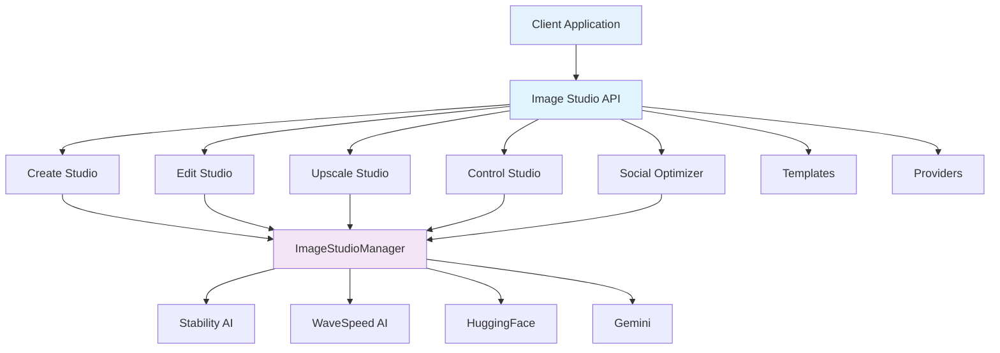

# Image Studio API Reference

Complete API documentation for Image Studio, including all endpoints, request/response models, authentication, and usage examples.

## Base URL

All Image Studio endpoints are prefixed with `/api/image-studio`

## Authentication

All endpoints require authentication via Bearer token:

```http
Authorization: Bearer YOUR_ACCESS_TOKEN
```

The token is obtained through the standard ALwrity authentication flow. See [Authentication Guide](../api/authentication.md) for details.

## API Architecture



## Endpoint Categories

### Create Studio
- [Generate Image](#generate-image)
- [Get Templates](#get-templates)
- [Search Templates](#search-templates)
- [Recommend Templates](#recommend-templates)
- [Get Providers](#get-providers)
- [Estimate Cost](#estimate-cost)

### Edit Studio
- [Process Edit](#process-edit)
- [Get Edit Operations](#get-edit-operations)

### Upscale Studio
- [Upscale Image](#upscale-image)

### Control Studio
- [Process Control](#process-control)
- [Get Control Operations](#get-control-operations)

### Social Optimizer
- [Optimize for Social](#optimize-for-social)
- [Get Platform Formats](#get-platform-formats)

### Platform Specifications
- [Get Platform Specs](#get-platform-specs)

### Health Check
- [Health Check](#health-check)

---

## Create Studio Endpoints

### Generate Image

Generate one or more images from text prompts.

**Endpoint**: `POST /api/image-studio/create`

**Request Body**:

```json
{
  "prompt": "Modern minimalist workspace with laptop",
  "template_id": "linkedin_post",
  "provider": "auto",
  "model": null,
  "width": null,
  "height": null,
  "aspect_ratio": null,
  "style_preset": "photographic",
  "quality": "standard",
  "negative_prompt": "blurry, low quality",
  "guidance_scale": null,
  "steps": null,
  "seed": null,
  "num_variations": 1,
  "enhance_prompt": true,
  "use_persona": false,
  "persona_id": null
}
```

**Request Fields**:

| Field | Type | Required | Description |
|-------|------|----------|-------------|
| `prompt` | string | Yes | Image generation prompt |
| `template_id` | string | No | Template ID to use |
| `provider` | string | No | Provider: auto, stability, wavespeed, huggingface, gemini |
| `model` | string | No | Specific model to use |
| `width` | integer | No | Image width in pixels |
| `height` | integer | No | Image height in pixels |
| `aspect_ratio` | string | No | Aspect ratio (e.g., '1:1', '16:9') |
| `style_preset` | string | No | Style preset |
| `quality` | string | No | Quality: draft, standard, premium (default: standard) |
| `negative_prompt` | string | No | Negative prompt |
| `guidance_scale` | float | No | Guidance scale |
| `steps` | integer | No | Number of inference steps |
| `seed` | integer | No | Random seed |
| `num_variations` | integer | No | Number of variations (1-10, default: 1) |
| `enhance_prompt` | boolean | No | Enhance prompt with AI (default: true) |
| `use_persona` | boolean | No | Use persona for brand consistency (default: false) |
| `persona_id` | string | No | Persona ID |

**Response**:

```json
{
  "success": true,
  "request": {
    "prompt": "Modern minimalist workspace with laptop",
    "enhanced_prompt": "Modern minimalist workspace with laptop, professional photography, high quality",
    "template_id": "linkedin_post",
    "template_name": "LinkedIn Post",
    "provider": "wavespeed",
    "model": "ideogram-v3-turbo",
    "dimensions": "1200x628",
    "quality": "standard"
  },
  "results": [
    {
      "image_base64": "iVBORw0KGgoAAAANS...",
      "width": 1200,
      "height": 628,
      "provider": "wavespeed",
      "model": "ideogram-v3-turbo",
      "variation": 1
    }
  ],
  "total_generated": 1,
  "total_failed": 0
}
```

**Response Fields**:

| Field | Type | Description |
|-------|------|-------------|
| `success` | boolean | Operation success status |
| `request` | object | Request details with applied settings |
| `results` | array | Generated images with base64 data |
| `total_generated` | integer | Number of successfully generated images |
| `total_failed` | integer | Number of failed generations |

**Error Responses**:

- `400 Bad Request`: Invalid request parameters
- `401 Unauthorized`: Authentication required
- `500 Internal Server Error`: Generation failed

---

### Get Templates

Get available image templates, optionally filtered by platform or category.

**Endpoint**: `GET /api/image-studio/templates`

**Query Parameters**:

| Parameter | Type | Required | Description |
|-----------|------|----------|-------------|
| `platform` | string | No | Filter by platform (instagram, facebook, twitter, etc.) |
| `category` | string | No | Filter by category (social_media, blog_content, etc.) |

**Example Request**:

```http
GET /api/image-studio/templates?platform=instagram
```

**Response**:

```json
{
  "templates": [
    {
      "id": "instagram_feed_square",
      "name": "Instagram Feed Post (Square)",
      "category": "social_media",
      "platform": "instagram",
      "aspect_ratio": {
        "ratio": "1:1",
        "width": 1080,
        "height": 1080,
        "label": "Square"
      },
      "description": "Perfect for Instagram feed posts",
      "recommended_provider": "ideogram",
      "style_preset": "photographic",
      "quality": "premium",
      "use_cases": ["Product showcase", "Lifestyle posts", "Brand content"]
    }
  ],
  "total": 4
}
```

---

### Search Templates

Search templates by query string.

**Endpoint**: `GET /api/image-studio/templates/search`

**Query Parameters**:

| Parameter | Type | Required | Description |
|-----------|------|----------|-------------|
| `query` | string | Yes | Search query |

**Example Request**:

```http
GET /api/image-studio/templates/search?query=linkedin
```

**Response**: Same format as Get Templates

---

### Recommend Templates

Get template recommendations based on use case.

**Endpoint**: `GET /api/image-studio/templates/recommend`

**Query Parameters**:

| Parameter | Type | Required | Description |
|-----------|------|----------|-------------|
| `use_case` | string | Yes | Use case description |
| `platform` | string | No | Optional platform filter |

**Example Request**:

```http
GET /api/image-studio/templates/recommend?use_case=product+showcase&platform=instagram
```

**Response**: Same format as Get Templates

---

### Get Providers

Get available AI providers and their capabilities.

**Endpoint**: `GET /api/image-studio/providers`

**Response**:

```json
{
  "providers": {
    "stability": {
      "name": "Stability AI",
      "models": ["ultra", "core", "sd3.5-large"],
      "capabilities": ["generation", "editing", "upscaling"],
      "max_resolution": "2048x2048",
      "cost_range": "3-8 credits"
    },
    "wavespeed": {
      "name": "WaveSpeed AI",
      "models": ["ideogram-v3-turbo", "qwen-image"],
      "capabilities": ["generation"],
      "max_resolution": "1024x1024",
      "cost_range": "1-6 credits"
    }
  }
}
```

---

### Estimate Cost

Estimate cost for image generation operations.

**Endpoint**: `POST /api/image-studio/estimate-cost`

**Request Body**:

```json
{
  "provider": "wavespeed",
  "model": "ideogram-v3-turbo",
  "operation": "generate",
  "num_images": 1,
  "width": 1200,
  "height": 628
}
```

**Request Fields**:

| Field | Type | Required | Description |
|-------|------|----------|-------------|
| `provider` | string | Yes | Provider name |
| `model` | string | No | Model name |
| `operation` | string | No | Operation type (default: generate) |
| `num_images` | integer | No | Number of images (default: 1) |
| `width` | integer | No | Image width |
| `height` | integer | No | Image height |

**Response**:

```json
{
  "estimated_cost": 5,
  "currency": "credits",
  "provider": "wavespeed",
  "model": "ideogram-v3-turbo",
  "operation": "generate",
  "num_images": 1
}
```

---

## Edit Studio Endpoints

### Process Edit

Perform Edit Studio operations on images.

**Endpoint**: `POST /api/image-studio/edit/process`

**Request Body**:

```json
{
  "image_base64": "data:image/png;base64,iVBORw0KGgo...",
  "operation": "remove_background",
  "prompt": null,
  "negative_prompt": null,
  "mask_base64": null,
  "search_prompt": null,
  "select_prompt": null,
  "background_image_base64": null,
  "lighting_image_base64": null,
  "expand_left": 0,
  "expand_right": 0,
  "expand_up": 0,
  "expand_down": 0,
  "provider": null,
  "model": null,
  "style_preset": null,
  "guidance_scale": null,
  "steps": null,
  "seed": null,
  "output_format": "png",
  "options": {}
}
```

**Request Fields**:

| Field | Type | Required | Description |
|-------|------|----------|-------------|
| `image_base64` | string | Yes | Primary image (base64 or data URL) |
| `operation` | string | Yes | Operation: remove_background, inpaint, outpaint, search_replace, search_recolor, general_edit |
| `prompt` | string | No | Primary prompt/instruction |
| `negative_prompt` | string | No | Negative prompt |
| `mask_base64` | string | No | Optional mask image (base64) |
| `search_prompt` | string | No | Search prompt for replace operations |
| `select_prompt` | string | No | Select prompt for recolor operations |
| `background_image_base64` | string | No | Reference background image |
| `lighting_image_base64` | string | No | Reference lighting image |
| `expand_left` | integer | No | Outpaint expansion left (pixels) |
| `expand_right` | integer | No | Outpaint expansion right (pixels) |
| `expand_up` | integer | No | Outpaint expansion up (pixels) |
| `expand_down` | integer | No | Outpaint expansion down (pixels) |
| `provider` | string | No | Explicit provider override |
| `model` | string | No | Explicit model override |
| `style_preset` | string | No | Style preset |
| `guidance_scale` | float | No | Guidance scale |
| `steps` | integer | No | Inference steps |
| `seed` | integer | No | Random seed |
| `output_format` | string | No | Output format (default: png) |
| `options` | object | No | Advanced provider-specific options |

**Response**:

```json
{
  "success": true,
  "operation": "remove_background",
  "provider": "stability",
  "image_base64": "data:image/png;base64,iVBORw0KGgo...",
  "width": 1200,
  "height": 628,
  "metadata": {
    "operation": "remove_background",
    "processing_time": 2.5
  }
}
```

---

### Get Edit Operations

Get metadata for all available Edit Studio operations.

**Endpoint**: `GET /api/image-studio/edit/operations`

**Response**:

```json
{
  "operations": {
    "remove_background": {
      "label": "Remove Background",
      "description": "Isolate the main subject",
      "provider": "stability",
      "fields": {
        "prompt": false,
        "mask": false,
        "negative_prompt": false,
        "search_prompt": false,
        "select_prompt": false,
        "background": false,
        "lighting": false,
        "expansion": false
      }
    },
    "inpaint": {
      "label": "Inpaint & Fix",
      "description": "Edit specific regions using prompts and optional masks",
      "provider": "stability",
      "fields": {
        "prompt": true,
        "mask": true,
        "negative_prompt": true,
        "search_prompt": false,
        "select_prompt": false,
        "background": false,
        "lighting": false,
        "expansion": false
      }
    }
  }
}
```

---

## Upscale Studio Endpoints

### Upscale Image

Upscale an image using AI-powered upscaling.

**Endpoint**: `POST /api/image-studio/upscale`

**Request Body**:

```json
{
  "image_base64": "data:image/png;base64,iVBORw0KGgo...",
  "mode": "conservative",
  "target_width": null,
  "target_height": null,
  "preset": "print",
  "prompt": "High fidelity upscale preserving original details"
}
```

**Request Fields**:

| Field | Type | Required | Description |
|-------|------|----------|-------------|
| `image_base64` | string | Yes | Image to upscale (base64 or data URL) |
| `mode` | string | No | Mode: fast, conservative, creative, auto (default: auto) |
| `target_width` | integer | No | Target width in pixels |
| `target_height` | integer | No | Target height in pixels |
| `preset` | string | No | Named preset: web, print, social |
| `prompt` | string | No | Prompt for conservative/creative modes |

**Response**:

```json
{
  "success": true,
  "mode": "conservative",
  "image_base64": "data:image/png;base64,iVBORw0KGgo...",
  "width": 3072,
  "height": 2048,
  "metadata": {
    "preset": "print",
    "original_width": 768,
    "original_height": 512,
    "upscale_factor": 4.0
  }
}
```

---

## Control Studio Endpoints

### Process Control

Perform Control Studio operations (sketch-to-image, style transfer, etc.).

**Endpoint**: `POST /api/image-studio/control/process`

**Request Body**:

```json
{
  "control_image_base64": "data:image/png;base64,iVBORw0KGgo...",
  "operation": "sketch",
  "prompt": "Modern office interior",
  "style_image_base64": null,
  "negative_prompt": null,
  "control_strength": 0.8,
  "fidelity": null,
  "style_strength": null,
  "composition_fidelity": null,
  "change_strength": null,
  "aspect_ratio": null,
  "style_preset": null,
  "seed": null,
  "output_format": "png"
}
```

**Request Fields**:

| Field | Type | Required | Description |
|-------|------|----------|-------------|
| `control_image_base64` | string | Yes | Control image (sketch/structure/style) |
| `operation` | string | Yes | Operation: sketch, structure, style, style_transfer |
| `prompt` | string | Yes | Text prompt for generation |
| `style_image_base64` | string | No | Style reference image (for style_transfer) |
| `negative_prompt` | string | No | Negative prompt |
| `control_strength` | float | No | Control strength 0.0-1.0 (for sketch/structure) |
| `fidelity` | float | No | Style fidelity 0.0-1.0 (for style operation) |
| `style_strength` | float | No | Style strength 0.0-1.0 (for style_transfer) |
| `composition_fidelity` | float | No | Composition fidelity 0.0-1.0 (for style_transfer) |
| `change_strength` | float | No | Change strength 0.0-1.0 (for style_transfer) |
| `aspect_ratio` | string | No | Aspect ratio (for style operation) |
| `style_preset` | string | No | Style preset |
| `seed` | integer | No | Random seed |
| `output_format` | string | No | Output format (default: png) |

**Response**:

```json
{
  "success": true,
  "operation": "sketch",
  "provider": "stability",
  "image_base64": "data:image/png;base64,iVBORw0KGgo...",
  "width": 1024,
  "height": 1024,
  "metadata": {
    "operation": "sketch",
    "control_strength": 0.8
  }
}
```

---

### Get Control Operations

Get metadata for all available Control Studio operations.

**Endpoint**: `GET /api/image-studio/control/operations`

**Response**: Similar format to Edit Operations

---

## Social Optimizer Endpoints

### Optimize for Social

Optimize an image for multiple social media platforms.

**Endpoint**: `POST /api/image-studio/social/optimize`

**Request Body**:

```json
{
  "image_base64": "data:image/png;base64,iVBORw0KGgo...",
  "platforms": ["instagram", "facebook", "linkedin"],
  "format_names": {
    "instagram": "Feed Post (Square)",
    "facebook": "Feed Post",
    "linkedin": "Post"
  },
  "show_safe_zones": false,
  "crop_mode": "smart",
  "focal_point": null,
  "output_format": "png"
}
```

**Request Fields**:

| Field | Type | Required | Description |
|-------|------|----------|-------------|
| `image_base64` | string | Yes | Source image (base64 or data URL) |
| `platforms` | array | Yes | List of platforms to optimize for |
| `format_names` | object | No | Specific format per platform |
| `show_safe_zones` | boolean | No | Include safe zone overlay (default: false) |
| `crop_mode` | string | No | Crop mode: smart, center, fit (default: smart) |
| `focal_point` | object | No | Focal point for smart crop (x, y as 0-1) |
| `output_format` | string | No | Output format: png or jpg (default: png) |

**Response**:

```json
{
  "success": true,
  "results": [
    {
      "platform": "instagram",
      "format": "Feed Post (Square)",
      "image_base64": "data:image/png;base64,iVBORw0KGgo...",
      "width": 1080,
      "height": 1080
    },
    {
      "platform": "facebook",
      "format": "Feed Post",
      "image_base64": "data:image/png;base64,iVBORw0KGgo...",
      "width": 1200,
      "height": 630
    }
  ],
  "total_optimized": 2
}
```

---

### Get Platform Formats

Get available formats for a specific social media platform.

**Endpoint**: `GET /api/image-studio/social/platforms/{platform}/formats`

**Path Parameters**:

| Parameter | Type | Required | Description |
|-----------|------|----------|-------------|
| `platform` | string | Yes | Platform name (instagram, facebook, etc.) |

**Response**:

```json
{
  "formats": [
    {
      "name": "Feed Post (Square)",
      "width": 1080,
      "height": 1080,
      "ratio": "1:1",
      "safe_zone": {
        "top": 0.15,
        "bottom": 0.15,
        "left": 0.1,
        "right": 0.1
      },
      "file_type": "PNG",
      "max_size_mb": 5.0
    }
  ]
}
```

---

## Platform Specifications Endpoints

### Get Platform Specs

Get specifications and requirements for a specific platform.

**Endpoint**: `GET /api/image-studio/platform-specs/{platform}`

**Path Parameters**:

| Parameter | Type | Required | Description |
|-----------|------|----------|-------------|
| `platform` | string | Yes | Platform name |

**Response**:

```json
{
  "name": "Instagram",
  "formats": [
    {
      "name": "Feed Post (Square)",
      "ratio": "1:1",
      "size": "1080x1080"
    }
  ],
  "file_types": ["JPG", "PNG"],
  "max_file_size": "30MB"
}
```

---

## Health Check

### Health Check

Check Image Studio service health.

**Endpoint**: `GET /api/image-studio/health`

**Response**:

```json
{
  "status": "healthy",
  "service": "image_studio",
  "version": "1.0.0",
  "modules": {
    "create_studio": "available",
    "templates": "available",
    "providers": "available"
  }
}
```

---

## Error Handling

### Error Response Format

All errors follow this format:

```json
{
  "detail": "Error message description"
}
```

### HTTP Status Codes

- `200 OK`: Successful request
- `400 Bad Request`: Invalid request parameters
- `401 Unauthorized`: Authentication required
- `404 Not Found`: Resource not found
- `500 Internal Server Error`: Server error

### Common Error Scenarios

**Invalid Image Format**:
```json
{
  "detail": "Invalid base64 image payload"
}
```

**Missing Required Field**:
```json
{
  "detail": "Prompt is required for inpainting"
}
```

**Provider Error**:
```json
{
  "detail": "Image generation failed: Provider error message"
}
```

**Authentication Error**:
```json
{
  "detail": "Authenticated user required for image operations."
}
```

---

## Rate Limiting

Image Studio API follows standard ALwrity rate limiting:

- **Rate Limits**: Based on subscription tier
- **Headers**: Rate limit information in response headers
- **Retry**: Use exponential backoff for rate limit errors

See [Rate Limiting Guide](../api/rate-limiting.md) for details.

---

## Best Practices

### Image Encoding

- **Base64 Format**: All images should be base64 encoded
- **Data URLs**: Support for `data:image/png;base64,...` format
- **Size Limits**: Recommended under 10MB for best performance
- **Format**: PNG or JPG supported

### Request Optimization

1. **Use Templates**: Templates optimize settings automatically
2. **Batch Operations**: Generate multiple variations in one request
3. **Estimate Costs**: Use cost estimation before large operations
4. **Error Handling**: Implement retry logic for transient errors

### Response Handling

1. **Base64 Images**: Decode base64 images in responses
2. **Metadata**: Use metadata for tracking and organization
3. **Error Messages**: Display user-friendly error messages
4. **Progress**: For long operations, implement polling if needed

---

## Code Examples

### Python Example

```python
import requests
import base64

# Generate Image
url = "https://api.alwrity.com/api/image-studio/create"
headers = {
    "Authorization": "Bearer YOUR_TOKEN",
    "Content-Type": "application/json"
}
data = {
    "prompt": "Modern office workspace",
    "template_id": "linkedin_post",
    "quality": "standard"
}
response = requests.post(url, json=data, headers=headers)
result = response.json()

# Decode image
image_data = base64.b64decode(result["results"][0]["image_base64"])
with open("generated_image.png", "wb") as f:
    f.write(image_data)
```

### JavaScript Example

```javascript
// Generate Image
const response = await fetch('https://api.alwrity.com/api/image-studio/create', {
  method: 'POST',
  headers: {
    'Authorization': 'Bearer YOUR_TOKEN',
    'Content-Type': 'application/json'
  },
  body: JSON.stringify({
    prompt: 'Modern office workspace',
    template_id: 'linkedin_post',
    quality: 'standard'
  })
});

const result = await response.json();

// Display image
const img = document.createElement('img');
img.src = `data:image/png;base64,${result.results[0].image_base64}`;
document.body.appendChild(img);
```

### cURL Example

```bash
curl -X POST https://api.alwrity.com/api/image-studio/create \
  -H "Authorization: Bearer YOUR_TOKEN" \
  -H "Content-Type: application/json" \
  -d '{
    "prompt": "Modern office workspace",
    "template_id": "linkedin_post",
    "quality": "standard"
  }'
```

---

## Related Documentation

- [Create Studio Guide](create-studio.md) - User guide for image generation
- [Edit Studio Guide](edit-studio.md) - User guide for image editing
- [Upscale Studio Guide](upscale-studio.md) - User guide for upscaling
- [Social Optimizer Guide](social-optimizer.md) - User guide for social optimization
- [Providers Guide](providers.md) - Provider selection guide
- [Cost Guide](cost-guide.md) - Cost management guide
- [Implementation Overview](implementation-overview.md) - Technical architecture

---

*For authentication details, see the [API Authentication Guide](../api/authentication.md). For rate limiting, see the [Rate Limiting Guide](../api/rate-limiting.md).*

