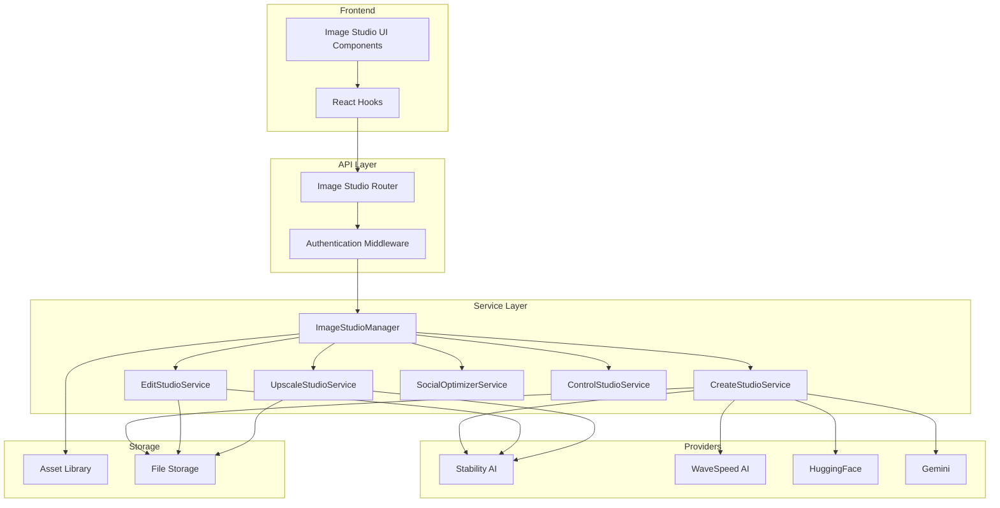
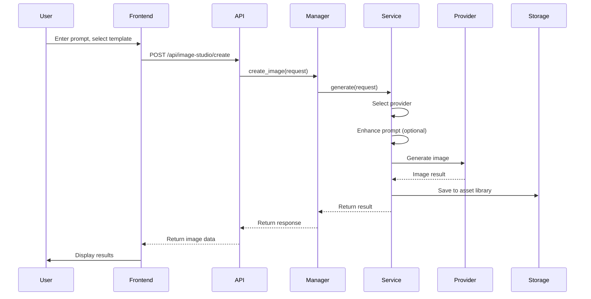
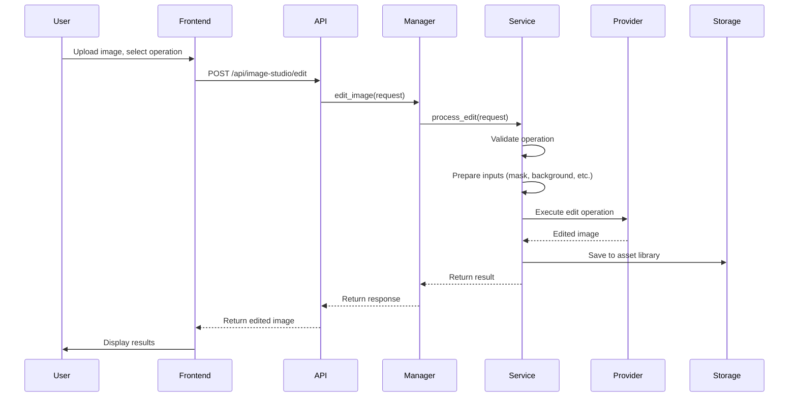
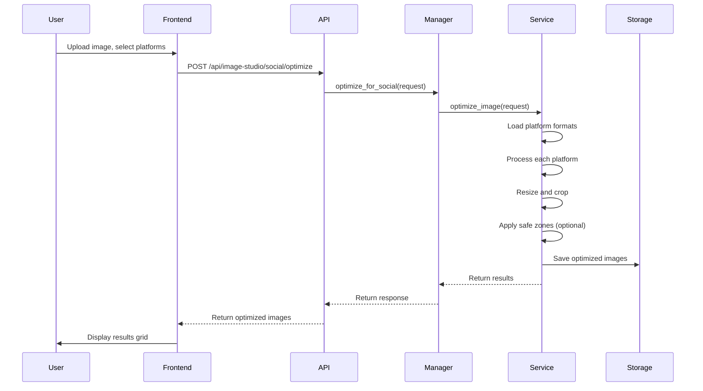

# Image Studio Implementation Overview

This document provides a technical overview of the Image Studio implementation, including architecture, backend services, frontend components, and data flow.

## Architecture Overview

Image Studio follows a modular architecture with clear separation between backend services, API endpoints, and frontend components.



## Backend Architecture

### Service Layer

#### ImageStudioManager
**Location**: `backend/services/image_studio/studio_manager.py`

The main orchestration service that coordinates all Image Studio operations.

**Responsibilities**:
- Initialize all module services
- Route requests to appropriate services
- Provide unified interface for all operations
- Manage templates and platform specifications
- Cost estimation and validation

**Key Methods**:
- `create_image()`: Delegate to CreateStudioService
- `edit_image()`: Delegate to EditStudioService
- `upscale_image()`: Delegate to UpscaleStudioService
- `optimize_for_social()`: Delegate to SocialOptimizerService
- `get_templates()`: Retrieve available templates
- `get_platform_formats()`: Get platform-specific formats
- `estimate_cost()`: Calculate operation costs

#### CreateStudioService
**Location**: `backend/services/image_studio/create_service.py`

Handles image generation with multi-provider support.

**Features**:
- Provider selection (auto or manual)
- Template-based generation
- Prompt enhancement
- Batch generation (1-10 variations)
- Quality level mapping
- Persona support

**Provider Support**:
- Stability AI (Ultra, Core, SD3.5)
- WaveSpeed (Ideogram V3, Qwen)
- HuggingFace (FLUX models)
- Gemini (Imagen)

#### EditStudioService
**Location**: `backend/services/image_studio/edit_service.py`

Manages image editing operations.

**Operations**:
- Remove background
- Inpaint & Fix
- Outpaint
- Search & Replace
- Search & Recolor
- General Edit

**Features**:
- Optional mask support
- Multiple input handling (base, mask, background, lighting)
- Provider abstraction
- Operation metadata

#### UpscaleStudioService
**Location**: `backend/services/image_studio/upscale_service.py`

Handles image upscaling operations.

**Modes**:
- Fast 4x upscale
- Conservative 4K upscale
- Creative 4K upscale

**Features**:
- Quality presets
- Optional prompt support
- Provider-specific optimization

#### SocialOptimizerService
**Location**: `backend/services/image_studio/social_optimizer_service.py`

Optimizes images for social media platforms.

**Features**:
- Platform format specifications
- Smart cropping algorithms
- Safe zone visualization
- Batch export
- Image processing with PIL

**Supported Platforms**:
- Instagram, Facebook, Twitter, LinkedIn, YouTube, Pinterest, TikTok

#### ControlStudioService
**Location**: `backend/services/image_studio/control_service.py`

Advanced generation controls (planned).

**Planned Features**:
- Sketch-to-image
- Style transfer
- Structure control

### Template System

**Location**: `backend/services/image_studio/templates.py`

**Components**:
- `TemplateManager`: Manages template loading and retrieval
- `ImageTemplate`: Template data structure
- `Platform`: Platform enumeration
- `TemplateCategory`: Category enumeration

**Template Structure**:
- Platform-specific dimensions
- Aspect ratios
- Style recommendations
- Provider suggestions
- Quality settings

### API Layer

#### Image Studio Router
**Location**: `backend/routers/image_studio.py`

**Endpoints**:

##### Create Studio
- `POST /api/image-studio/create` - Generate images
- `GET /api/image-studio/templates` - Get templates
- `GET /api/image-studio/templates/search` - Search templates
- `GET /api/image-studio/templates/recommend` - Get recommendations
- `GET /api/image-studio/providers` - Get available providers

##### Edit Studio
- `POST /api/image-studio/edit` - Edit images
- `GET /api/image-studio/edit/operations` - List available operations

##### Upscale Studio
- `POST /api/image-studio/upscale` - Upscale images

##### Social Optimizer
- `POST /api/image-studio/social/optimize` - Optimize for social platforms
- `GET /api/image-studio/social/platforms/{platform}/formats` - Get platform formats

##### Utility
- `POST /api/image-studio/estimate-cost` - Estimate operation costs
- `GET /api/image-studio/platform-specs/{platform}` - Get platform specifications
- `GET /api/image-studio/health` - Health check

**Authentication**:
- All endpoints require authentication via `get_current_user` middleware
- User ID validation for all operations

**Error Handling**:
- Comprehensive error messages
- Provider fallback logic
- Retry mechanisms
- Logging for debugging

## Frontend Architecture

### Component Structure

```
frontend/src/components/ImageStudio/
├── ImageStudioLayout.tsx          # Shared layout wrapper
├── ImageStudioDashboard.tsx       # Main dashboard
├── CreateStudio.tsx                # Image generation
├── EditStudio.tsx                  # Image editing
├── UpscaleStudio.tsx               # Image upscaling
├── SocialOptimizer.tsx             # Social optimization
├── AssetLibrary.tsx                # Asset management
├── TemplateSelector.tsx            # Template selection
├── ImageResultsGallery.tsx         # Results display
├── EditImageUploader.tsx           # Image upload
├── ImageMaskEditor.tsx             # Mask creation
├── EditOperationsToolbar.tsx       # Operation selection
├── EditResultViewer.tsx           # Edit results
├── CostEstimator.tsx               # Cost calculation
└── ui/                             # Shared UI components
    ├── GlassyCard.tsx
    ├── SectionHeader.tsx
    ├── StatusChip.tsx
    ├── LoadingSkeleton.tsx
    └── AsyncStatusBanner.tsx
```

### Shared Components

#### ImageStudioLayout
**Purpose**: Consistent layout wrapper for all Image Studio modules

**Features**:
- Unified navigation
- Consistent styling
- Responsive design
- Glassmorphic theme

#### Shared UI Components
- **GlassyCard**: Glassmorphic card component
- **SectionHeader**: Consistent section headers
- **StatusChip**: Status indicators
- **LoadingSkeleton**: Loading states
- **AsyncStatusBanner**: Async operation status

### React Hooks

#### useImageStudio
**Location**: `frontend/src/hooks/useImageStudio.ts`

**Functions**:
- `generateImage()`: Create images
- `processEdit()`: Edit images
- `processUpscale()`: Upscale images
- `optimizeForSocial()`: Optimize for social platforms
- `getPlatformFormats()`: Get platform formats
- `loadEditOperations()`: Load available edit operations
- `estimateCost()`: Estimate operation costs

**State Management**:
- Loading states
- Error handling
- Result caching
- Cost tracking

#### useContentAssets
**Location**: `frontend/src/hooks/useContentAssets.ts`

**Functions**:
- `getAssets()`: Fetch assets with filters
- `toggleFavorite()`: Mark/unmark favorites
- `deleteAsset()`: Delete assets
- `trackUsage()`: Track asset usage
- `refetch()`: Refresh asset list

## Data Flow

### Image Generation Flow



### Image Editing Flow



### Social Optimization Flow



## Provider Integration

### Stability AI
- **Endpoints**: Multiple endpoints for generation, editing, upscaling
- **Authentication**: API key based
- **Rate Limiting**: Credit-based system
- **Error Handling**: Retry logic with exponential backoff

### WaveSpeed AI
- **Endpoints**: Image generation (Ideogram V3, Qwen)
- **Authentication**: API key based
- **Rate Limiting**: Request-based
- **Error Handling**: Standard HTTP error responses

### HuggingFace
- **Endpoints**: FLUX model inference
- **Authentication**: API token based
- **Rate Limiting**: Free tier limits
- **Error Handling**: Standard HTTP error responses

### Gemini
- **Endpoints**: Imagen generation
- **Authentication**: API key based
- **Rate Limiting**: Quota-based
- **Error Handling**: Standard HTTP error responses

## Asset Management

### Content Asset Service
**Location**: `backend/services/content_asset_service.py`

**Features**:
- Automatic asset tracking
- Search and filtering
- Favorites management
- Usage tracking
- Bulk operations

### Asset Tracking
**Location**: `backend/utils/asset_tracker.py`

**Integration Points**:
- Image Studio: All generated/edited images
- Story Writer: Scene images, audio, videos
- Blog Writer: Generated images
- Other modules: All ALwrity tools

## Cost Management

### Cost Estimation
- Pre-flight validation before operations
- Real-time cost calculation
- Credit system integration
- Subscription tier validation

### Credit System
- Operations consume credits based on complexity
- Provider-specific credit costs
- Quality level affects credit consumption
- Batch operations aggregate costs

## Error Handling

### Backend Error Handling
- Comprehensive error messages
- Provider fallback logic
- Retry mechanisms
- Detailed logging

### Frontend Error Handling
- User-friendly error messages
- Retry options
- Error state management
- Graceful degradation

## Performance Optimization

### Backend
- Async operations for long-running tasks
- Caching for templates and platform specs
- Connection pooling for providers
- Efficient image processing

### Frontend
- Lazy loading of components
- Image optimization
- Result caching
- Debounced search

## Security

### Authentication
- All endpoints require authentication
- User ID validation
- Subscription checks

### Data Protection
- Secure API key storage
- Base64 encoding for images
- File validation
- Size limits

## Testing

### Backend Testing
- Unit tests for services
- Integration tests for API endpoints
- Provider mock testing
- Error scenario testing

### Frontend Testing
- Component unit tests
- Hook testing
- Integration tests
- E2E tests for workflows

## Deployment

### Backend
- FastAPI application
- Environment-based configuration
- Docker containerization
- Health check endpoints

### Frontend
- React application
- Build optimization
- CDN deployment
- Route configuration

---

*For API reference, see [API Reference](api-reference.md). For module-specific guides, see the individual module documentation.*

