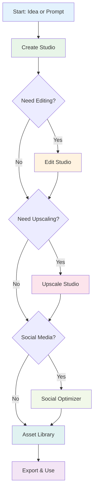

# Image Studio Overview

The ALwrity Image Studio is a comprehensive AI-powered image creation, editing, and optimization platform designed specifically for digital marketers and content creators. It provides a unified hub for all image-related operations, from generation to social media optimization, making professional visual content creation accessible to everyone.

## What is Image Studio?

Image Studio is ALwrity's centralized platform that consolidates all image operations into one seamless workflow. It combines existing AI capabilities (Stability AI, HuggingFace, Gemini) with new WaveSpeed AI features to provide a complete image creation, editing, and optimization solution.

### Key Benefits

- **Unified Platform**: All image operations in one place - no need to switch between multiple tools
- **Complete Workflow**: Create → Edit → Upscale → Optimize → Export in a single interface
- **Multi-Provider AI**: Access to Stability AI, WaveSpeed (Ideogram V3, Qwen), HuggingFace, and Gemini
- **Social Media Ready**: One-click optimization for all major platforms
- **Professional Quality**: Enterprise-grade results without the complexity
- **Cost-Effective**: Subscription-based pricing with transparent cost estimation

## Target Users

### Primary: Digital Marketers & Content Creators
- Need professional visuals for campaigns
- Require platform-optimized content
- Want to scale content production
- Value time and cost efficiency

### Secondary: Solopreneurs & Small Businesses
- Can't afford dedicated designers
- Need DIY professional images
- Require consistent brand visuals
- Want to reduce content creation costs

### Tertiary: Content Teams & Agencies
- Manage multiple client campaigns
- Need batch processing capabilities
- Require asset organization
- Want collaborative workflows

## Core Modules

Image Studio consists of **7 core modules** that cover the complete image workflow:

### 1. **Create Studio** ✅
Generate stunning images from text prompts using multiple AI providers. Features include platform templates, style presets, batch generation, and cost estimation.

**Status**: Fully implemented and live  
**Route**: `/image-generator`

### 2. **Edit Studio** ✅
AI-powered image editing with operations like background removal, inpainting, outpainting, object replacement, and color transformation. Includes a reusable mask editor.

**Status**: Fully implemented and live  
**Route**: `/image-editor`

### 3. **Upscale Studio** ✅
Enhance image resolution with fast 4x upscaling, conservative 4K upscaling, and creative 4K upscaling. Includes quality presets and side-by-side comparison.

**Status**: Fully implemented and live  
**Route**: `/image-upscale`

### 4. **Social Optimizer** ✅
Optimize images for all major social platforms (Instagram, Facebook, Twitter, LinkedIn, YouTube, Pinterest, TikTok) with smart cropping, safe zones, and batch export.

**Status**: Fully implemented and live  
**Route**: `/image-studio/social-optimizer`

### 5. **Asset Library** ✅
Unified content archive for all ALwrity tools. Features include search, filtering, favorites, bulk operations, and usage tracking across all generated content.

**Status**: Fully implemented and live  
**Route**: `/image-studio/asset-library`

### 6. **Transform Studio** 🚧
Convert images into videos, create talking avatars, and generate 3D models. Features include image-to-video, make avatar, and image-to-3D capabilities.

**Status**: Planned for future release

### 7. **Control Studio** 🚧
Advanced generation controls including sketch-to-image, style transfer, and structure control. Provides fine-grained control over image generation.

**Status**: Planned for future release

## Key Features

### AI-Powered Generation
- **Multi-Provider Support**: Stability AI (Ultra/Core/SD3), WaveSpeed (Ideogram V3, Qwen), HuggingFace, Gemini
- **Platform Templates**: Pre-configured templates for Instagram, LinkedIn, Facebook, Twitter, and more
- **Style Presets**: 40+ built-in styles (photographic, digital-art, 3d-model, etc.)
- **Batch Generation**: Create 1-10 variations in a single request
- **Prompt Enhancement**: AI-powered prompt improvement for better results

### Professional Editing
- **Background Operations**: Remove, replace, or relight backgrounds
- **Object Manipulation**: Erase, inpaint, outpaint, search & replace, search & recolor
- **Mask Editor**: Visual mask creation for precise editing control
- **Conversational Editing**: Natural language image modifications

### Quality Enhancement
- **Fast Upscaling**: 4x upscaling in ~1 second
- **4K Upscaling**: Conservative and creative modes for different use cases
- **Quality Presets**: Web, print, and social media optimizations
- **Comparison Tools**: Side-by-side before/after previews

### Social Media Optimization
- **Platform Formats**: Automatic sizing for all major platforms
- **Smart Cropping**: Preserve important content with intelligent cropping
- **Safe Zones**: Visual overlays for text-safe areas
- **Batch Export**: Generate optimized versions for multiple platforms simultaneously

### Asset Management
- **Unified Archive**: All generated content in one place
- **Advanced Search**: Filter by type, module, date, status, and more
- **Favorites**: Mark and organize favorite assets
- **Bulk Operations**: Download, delete, or share multiple assets at once
- **Usage Tracking**: Monitor asset usage and performance

## How It Works

### Complete Workflow

### Typical Use Cases

#### 1. Social Media Campaign
1. **Create**: Generate campaign visuals using platform templates
2. **Edit**: Remove backgrounds or adjust colors
3. **Optimize**: Export for Instagram, Facebook, LinkedIn simultaneously
4. **Organize**: Save to Asset Library for easy access

#### 2. Blog Post Images
1. **Create**: Generate featured images with blog post templates
2. **Upscale**: Enhance resolution for high-quality display
3. **Optimize**: Resize for social media sharing
4. **Track**: Monitor usage in Asset Library

#### 3. Product Photography
1. **Create**: Generate product images with specific styles
2. **Edit**: Remove backgrounds or add product variations
3. **Transform**: Convert to video for product showcases (coming soon)
4. **Export**: Optimize for e-commerce platforms

## Technical Architecture

### Backend Services
- **ImageStudioManager**: Main orchestration service
- **CreateStudioService**: Image generation logic
- **EditStudioService**: Image editing operations
- **UpscaleStudioService**: Resolution enhancement
- **SocialOptimizerService**: Platform optimization
- **ContentAssetService**: Asset management

### Frontend Components
- **ImageStudioLayout**: Shared layout wrapper
- **CreateStudio**: Image generation interface
- **EditStudio**: Image editing interface
- **UpscaleStudio**: Upscaling interface
- **SocialOptimizer**: Social media optimization
- **AssetLibrary**: Asset management interface

### API Endpoints
- `POST /api/image-studio/create` - Generate images
- `POST /api/image-studio/edit` - Edit images
- `POST /api/image-studio/upscale` - Upscale images
- `POST /api/image-studio/social/optimize` - Optimize for social media
- `GET /api/content-assets/` - Access asset library

## Getting Started

### Quick Start
1. Navigate to Image Studio from the main dashboard
2. Choose a module based on your needs (Create, Edit, Upscale, etc.)
3. Follow the module-specific guides for detailed instructions
4. Access your generated assets in the Asset Library

### Next Steps
- Read the [Modules Guide](modules.md) for detailed module information
- Check the [Implementation Overview](implementation-overview.md) for technical details
- Explore module-specific guides for Create, Edit, Upscale, Social Optimizer, and Asset Library
- Review the [Workflow Guide](workflow-guide.md) for end-to-end workflows

## Cost Management

Image Studio uses a credit-based system with transparent cost estimation:

- **Pre-Flight Validation**: See costs before generating
- **Credit System**: Operations consume credits based on complexity
- **Cost Estimation**: Real-time cost calculation for all operations
- **Subscription Tiers**: Different credit allocations per plan

For detailed cost information, see the [Cost Guide](cost-guide.md).

## Support & Resources

- **Documentation**: Comprehensive guides for each module
- **API Reference**: Complete API documentation
- **Provider Guide**: When to use each AI provider
- **Template Library**: Available templates and presets
- **Best Practices**: Tips for optimal results

---

*For more information, explore the module-specific documentation or check the [API Reference](api-reference.md).*

