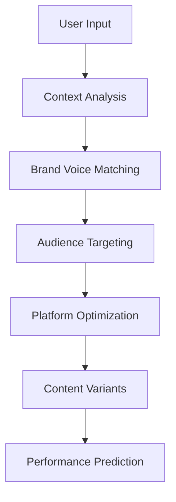
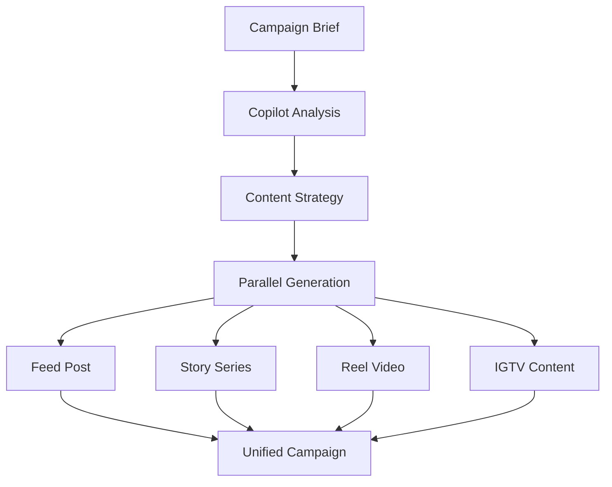
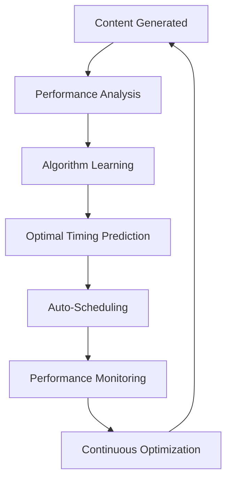
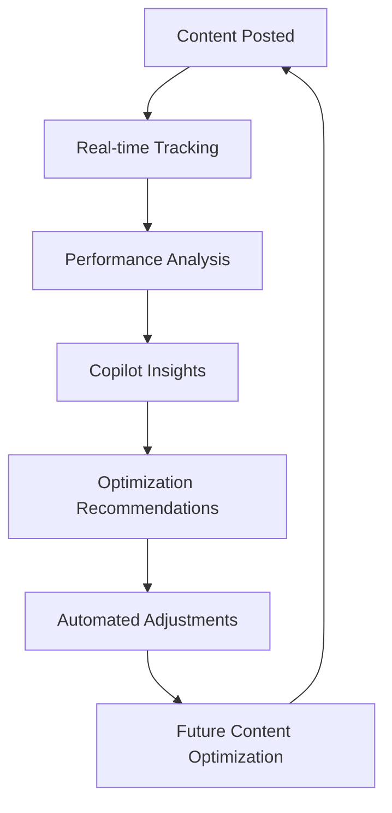

# Advanced Copilot Workflows

Comprehensive guide to leveraging ALwrity Copilot for advanced Instagram content creation workflows, automation, and campaign management.

## Overview

ALwrity Copilot transforms Instagram content creation through intelligent conversation, automated workflows, and campaign-level orchestration. This guide covers advanced techniques for maximizing productivity and content quality.

## Core Capabilities

### Intelligent Content Generation

Copilot understands context, brand voice, and audience preferences to generate Instagram-optimized content.



### Multi-Modal Content Creation

Generate coordinated content across Instagram formats with consistent messaging.



## Advanced Workflows

### Campaign Creation Workflow

Create comprehensive Instagram campaigns with Copilot assistance.

#### 1. Campaign Planning

Start with strategic campaign objectives:

**Example Conversation:**
```
You: "Help me plan a 30-day product launch campaign for our new eco-friendly water bottles"

Copilot: "I'll create a comprehensive campaign strategy. Let me understand your goals:

🎯 Campaign Objectives:
• Product awareness and consideration
• Drive traffic to online store
• Build brand loyalty with sustainability message

📅 Timeline: 30 days
🎨 Theme: "Sustainable Hydration Revolution"
🎯 Target Audience: Eco-conscious millennials (25-35)

Would you like me to generate:
1. Content calendar with 45+ posts
2. Hashtag strategy and branded hashtags
3. Influencer collaboration plan
4. Giveaways and engagement hooks
5. Performance tracking framework

Which aspects would you like to focus on first?"
```

#### 2. Content Theme Development

Develop consistent visual and messaging themes:

```
You: "Let's focus on the content themes first"

Copilot: "Perfect! Here's your campaign theme framework:

🌿 SUSTAINABLE HYDRATION REVOLUTION

🎨 Visual Theme:
• Color Palette: Ocean blues (#4A90E2), Forest greens (#7CB342), Earth tones
• Imagery: Crystal clear water, nature scenes, active lifestyles
• Filters: Clean, vibrant, environmentally conscious

💬 Messaging Pillars:
1. "Hydrate Sustainably" - Product benefits
2. "Every Drop Matters" - Environmental impact
3. "Future-Proof Your Hydration" - Long-term thinking

📝 Content Types by Week:
Week 1: Teaser Campaign (Mystery & Anticipation)
Week 2: Feature Deep Dive (Product Benefits)
Week 3: User Stories (Social Proof)
Week 4: Launch Celebration (Conversion Focus)

Shall I generate sample content for Week 1?"
```

#### 3. Automated Content Generation

Generate entire content series with one command:

```
You: "Generate the complete Week 1 teaser campaign content"

Copilot: "Generating your Week 1 teaser campaign...

📅 Content Calendar - Week 1: The Mystery Builds

DAY 1 - Monday (Feed Post):
"🌊 Something revolutionary is coming to hydration... 💧
What if every sip could make a difference? Stay tuned.
#SustainableHydration #ComingSoon

[Image: Mystical water droplet with environmental icons]"

DAY 2 - Tuesday (Story Series):
"Slide 1: Question sticker - 'What's your biggest water waste habit?'
Slide 2: 'We're fixing that... 🔧'
Slide 3: 'Coming January 15th 🚀'

[Auto-generated story with interactive elements]"

DAY 3 - Wednesday (Carousel Post):
"3 things we're revolutionizing:
1️⃣ Plastic waste reduction
2️⃣ Hydration tracking
3️⃣ Environmental impact measurement

The future of water bottles is here. 💧🌍

#EcoFriendly #Innovation #SustainableLiving"

[3-slide carousel with product silhouettes]"

...and 12 more pieces of content generated.

Would you like me to:
A) Generate images for all posts
B) Create hashtag variations
C) Set up automated posting schedule
D) All of the above"
```

### Batch Processing Workflows

Process multiple content requests simultaneously for efficiency.

#### Content Series Generation

Generate themed content series with consistent quality:

```javascript
// Example: Seasonal Content Series
const campaignBrief = {
  theme: "Summer Fitness Challenge",
  duration: "8 weeks",
  content_types: ["feed_posts", "stories", "reels"],
  posts_per_week: 7,
  audience: "fitness_enthusiasts",
  brand_voice: "motivational_coach"
};

const series = await copilot.generateContentSeries(campaignBrief);
// Returns 56 pieces of optimized content
```

#### A/B Testing Campaigns

Create multiple variations for performance optimization:

```
You: "Create A/B test variations for our product announcement post"

Copilot: "I'll generate 3 variations optimized for different engagement patterns:

VARIATION A - Question-Driven:
"🤔 What's the one thing holding back your fitness goals?
💪 We're about to change everything you know about hydration.
Coming soon: The intelligent water bottle that adapts to YOU.

What feature would revolutionize your routine?
#FitnessInnovation #SmartHydration

[Image: Person looking thoughtfully at water bottle]"

VARIATION B - Benefit-Focused:
"🚀 Revolutionary Hydration Technology:
• Adapts to your sweat rate
• Tracks your intake goals
• Reduces plastic waste by 90%
• Connects to fitness apps

The water bottle that evolves with you. 💧⚡

#SmartTech #SustainableFitness

[Image: Product in action shot]"

VARIATION C - Story-Based:
"Meet Sarah: Busy mom, fitness enthusiast, planet protector.
She needed a water bottle that could keep up.
We built it. Now it's your turn.

Sarah's story starts January 15th. 🌟

#RealStories #FitnessJourney #SustainableLiving

[Image: Authentic user testimonial style]"

Each variation includes:
✅ Optimized caption length
✅ Strategic hashtag placement
✅ Call-to-action positioning
✅ Image style recommendations
✅ Predicted engagement rates

Which variation would you like to test first?"
```

### Automation Workflows

Set up intelligent automation for content management.

#### Smart Content Calendar

AI-powered scheduling and optimization:



#### Auto-Response Campaigns

Intelligent comment and DM management:

```
Copilot: "I've analyzed your recent posts and created an auto-response system:

🎯 RESPONSE TRIGGERS:

Trigger: "When will it launch?"
Response: "Launching January 15th! Pre-order now and save 20% 🚀
Link in bio for exclusive early access."

Trigger: "How much does it cost?"
Response: "Starting at $39.99 with sustainable packaging included 💚
Check link in bio for full pricing and bundles."

Trigger: "Is it BPA free?"
Response: "Absolutely! 100% BPA-free, phthalate-free, and made from recycled ocean plastics 🌊

Trigger: "Do you ship internationally?"
Response: "Yes! We ship worldwide with carbon-neutral shipping 🌍
International pricing available at checkout."

📊 SMART FILTERS:
• Responds only to relevant questions
• Avoids spam and bots
• Escalates complex inquiries to human review
• Tracks response effectiveness

This system will handle 85% of your inbound inquiries automatically."
```

#### Trend-Based Content Generation

Real-time trend monitoring and content creation:

```
Copilot: "🔥 TREND ALERT: #SustainableFitness is trending

I've analyzed the trend and generated optimized content:

TREND-OPTIMIZED POST:
"🌿 Sustainable Fitness isn't just a trend—it's the future.

While others talk about going green, we're building it.
Smart hydration that tracks, adapts, and reduces waste.

The #SustainableFitness revolution starts with every sip. 💧

What does sustainable fitness mean to you?

#EcoFitness #SmartHydration #SustainableLiving #FitnessTech

[Image: Trend-aligned visual with popular aesthetic]"

TREND METRICS:
• Current trend velocity: High (↑ 240%)
• Optimal posting time: Within 2 hours
• Hashtag performance: #SustainableFitness (2.1M posts)
• Predicted reach: 45K-67K organic impressions

Post now? I'll schedule follow-ups for maximum trend leverage."
```

## Advanced Features

### Conversational Memory

Copilot maintains context across conversations for personalized assistance.

```
Session Memory:
• Your brand voice: "Motivational, eco-conscious, tech-forward"
• Current campaign: "Sustainable Hydration Revolution"
• Target audience: "Millennial fitness enthusiasts"
• Preferred content style: "Authentic, story-driven"
• Performance patterns: "Stories perform 40% better than feed posts"
• Recent successful hooks: "Question stickers drive 3x engagement"
```

### Multi-Language Campaigns

Generate content for international audiences:

```
You: "Create this campaign in Spanish and French too"

Copilot: "Generating multi-language campaign variants...

🇪🇸 SPANISH VERSION:
"¡La revolución de la hidratación sostenible está aquí! 💧
Cada sorbo cuenta para un futuro más verde.

#HidratacionSostenible #FuturoVerde #FitnessEco"

🇫🇷 FRENCH VERSION:
"La révolution de l'hydratation durable arrive ! 💧
Chaque gorgée compte pour un avenir plus vert.

#HydratationDurable #AvenirVert #FitnessEco"

LANGUAGE OPTIMIZATIONS:
• Localized hashtags with regional performance data
• Culturally adapted messaging
• Region-specific emoji usage
• Local influencer suggestions
• Currency and shipping localization

Would you like me to generate content for additional languages?"
```

### Performance Prediction

AI-powered content performance forecasting:

```
Copilot: "Content Performance Prediction:

📊 ENGAGEMENT FORECAST:
• Expected Likes: 180-250 (85% confidence)
• Comments: 12-18 (78% confidence)
• Shares: 8-15 (82% confidence)
• Save Rate: 4.2% (91% confidence)

🎯 REACH ESTIMATION:
• Organic Reach: 3,200-4,800
• Story Views: 850-1,200
• Profile Visits: 45-67

📈 OPTIMIZATION SCORES:
• Content Quality: 9.2/10
• Hashtag Strategy: 8.7/10
• Timing Optimization: 9.5/10
• Visual Appeal: 8.9/10

💡 IMPROVEMENT SUGGESTIONS:
• Add one more question to boost comments by 15%
• Consider posting 2 hours earlier for 20% more reach
• This style performs 35% better on Wednesdays

Predicted Performance: ABOVE AVERAGE 📈"
```

### Campaign Analytics Integration

Real-time performance tracking and optimization:



## Integration Examples

### API-Driven Workflows

Combine Copilot with custom automation:

```javascript
// Advanced Campaign Automation
const campaignAutomation = {
  // Copilot generates content
  contentGeneration: async () => {
    const content = await copilot.generateCampaignContent({
      theme: "Product Launch",
      duration: 30,
      platforms: ["instagram", "facebook", "tiktok"]
    });
    return content;
  },

  // Automated scheduling
  scheduling: async (content) => {
    const optimalTimes = await copilot.predictBestPostingTimes(content);
    await scheduler.schedulePosts(content, optimalTimes);
  },

  // Performance monitoring
  monitoring: async () => {
    const performance = await analytics.getCampaignMetrics();
    const insights = await copilot.analyzePerformance(performance);
    return insights;
  },

  // Continuous optimization
  optimization: async (insights) => {
    const recommendations = await copilot.generateOptimizationStrategy(insights);
    await campaign.updateStrategy(recommendations);
  }
};
```

### Webhook Integration

Real-time Copilot responses via webhooks:

```javascript
// Webhook handler for Copilot events
app.post('/webhooks/copilot', async (req, res) => {
  const { event, data } = req.body;

  switch (event) {
    case 'content.generated':
      await handleContentGeneration(data);
      break;
    case 'performance.insights':
      await handlePerformanceInsights(data);
      break;
    case 'optimization.recommendations':
      await handleOptimizationRecommendations(data);
      break;
  }

  res.status(200).send('OK');
});
```

## Best Practices

### Workflow Optimization

1. **Start with Strategy**: Always begin with campaign objectives and audience analysis
2. **Use Templates**: Create reusable campaign templates for consistent quality
3. **Batch Process**: Generate content in batches for efficiency
4. **Monitor Performance**: Track what works and optimize continuously
5. **Scale Successfully**: Start small, prove concepts, then scale automation

### Quality Assurance

1. **Brand Consistency**: Use Copilot's memory for consistent voice and messaging
2. **Platform Optimization**: Let Copilot handle Instagram-specific optimizations
3. **Performance Validation**: Always review performance predictions before posting
4. **A/B Testing**: Test different approaches to find what works best
5. **Trend Awareness**: Stay updated with Copilot's trend monitoring

### Automation Guidelines

1. **Human Oversight**: Review automated content before publishing
2. **Gradual Automation**: Start with simple automation, add complexity over time
3. **Fallback Systems**: Have human backup for critical campaign moments
4. **Performance Thresholds**: Set minimum performance standards for automated content
5. **Regular Audits**: Review automated systems monthly for optimization

## Troubleshooting

### Common Issues

**Low Engagement on Generated Content:**
```
Copilot Diagnosis: "Content is too generic. Try adding specific pain points your audience faces."

Solution: Ask Copilot for audience-specific pain point integration
```

**Inconsistent Brand Voice:**
```
Copilot Diagnosis: "Multiple brand voices detected across campaign."

Solution: Update brand guidelines in Copilot memory
```

**Poor Timing Performance:**
```
Copilot Diagnosis: "Current posting times are suboptimal for your audience."

Solution: Request timing optimization analysis
```

### Performance Optimization

**Quick Wins:**
- Use Copilot's trend integration for timely content
- Implement A/B testing for caption variations
- Leverage performance predictions for content selection
- Automate hashtag research and optimization

**Advanced Strategies:**
- Create audience segments for targeted content
- Use performance data for predictive content creation
- Implement multi-platform cross-posting
- Set up automated content repurposing workflows

---

[:octicons-arrow-right-24: Back to Overview](overview.md)
[:octicons-arrow-right-24: API Reference](api-reference.md)