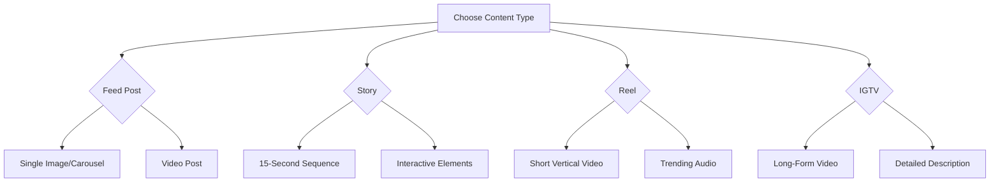

# Instagram Editor Getting Started Guide

Welcome to ALwrity Instagram Editor! This comprehensive guide will help you create professional Instagram content in minutes, not hours. Whether you're an influencer, business owner, or social media manager, this guide covers everything you need to get started.

## Quick Setup (3 minutes)

### Step 1: Access Instagram Editor
1. Navigate to `/instagram-editor` in your ALwrity dashboard
2. You'll see the main editor interface with content type options
3. Enable ALwrity Copilot for AI-powered assistance

### Step 2: Connect Your Instagram Account (Optional)
1. Click "Connect Instagram" in the top-right corner
2. Choose your account type (Business or Creator account recommended)
3. Grant necessary permissions for enhanced features
4. Verify connection with a test post

### Step 3: Configure Your Brand Settings
1. Go to Settings → Brand Profile
2. Upload your logo and brand colors
3. Set your brand voice and tone preferences
4. Define content guidelines and restrictions

## Your First Instagram Post

### Choose Content Type
ALwrity Instagram Editor supports all major Instagram formats:



### Create a Feed Post with Copilot

```typescript
You: "Help me create an Instagram post about my coffee shop's new menu"
Copilot: "Perfect! I'll help you create an engaging Instagram post for your coffee shop. Let me guide you through the process:

🎯 **Content Strategy**: For a coffee shop menu reveal, I recommend:
- Carousel post (3-5 images) showing different menu items
- Engaging caption with menu highlights
- Call-to-action for in-store visits or delivery

📸 **Visual Plan**:
1. Hero shot of your signature drink
2. Food items or pastries
3. Menu board or chalkboard menu
4. Cozy interior with menu visible

✍️ **Caption Draft**:
'☕ Exciting news! We've expanded our menu with seasonal specials just for you! From our classic espresso to new matcha lattes, there's something for everyone.

🍰 New Additions:
• Pumpkin Spice Latte (seasonal)
• Avocado Toast Bowl
• Gluten-Free Pastries
• Cold Brew Flight

Come taste the difference! Link in bio for full menu 📍 [Location]

#CoffeeShop #NewMenu #LocalEats #CoffeeLovers'

🎯 **Hashtags**: #CoffeeShop #NewMenu #LocalCoffee #CoffeeCulture #SeasonalDrinks

Would you like me to generate the images for this carousel or adjust the caption?'"
```

## Content Creation Workflow

### Step-by-Step Process

#### 1. **Idea Generation**
```typescript
Copilot: "What type of content are you creating today?
• Product showcase
• Behind-the-scenes
• Customer testimonial
• Educational content
• Promotional post
• Lifestyle content"
```

#### 2. **Visual Creation**
- **AI Image Generation**: Describe what you want in natural language
- **Stock Photo Integration**: Search and license professional images
- **Brand Asset Library**: Use your existing branded visuals
- **Template Application**: Apply Instagram-optimized design templates

#### 3. **Content Optimization**
```typescript
Copilot: "Let me optimize your content for maximum engagement:

📝 **Caption Enhancement**:
- Added emoji for visual interest
- Included call-to-action
- Optimized length for Instagram algorithm

🏷️ **Hashtag Strategy**:
- Mix of popular and niche hashtags
- Location-based tags for local discovery
- Branded hashtags for community building

⏰ **Posting Time**: Best time for your audience is 7-9 AM weekdays
📍 **Location Tag**: Added your business location
👥 **User Tags**: Tagged relevant accounts for increased reach"
```

#### 4. **Preview & Testing**
- **Instagram Preview**: See exactly how your post will appear
- **A/B Testing**: Create multiple variations to test performance
- **Engagement Prediction**: AI estimates potential reach and engagement

## Advanced Features

### Copilot-Powered Workflows

#### Batch Content Creation
```typescript
User: "Create a week's worth of Instagram content for my bakery"
Copilot: "I'll create a comprehensive content plan for your bakery. This includes:

📅 **Content Calendar**:
- Monday: Product showcase (croissants)
- Tuesday: Behind-the-scenes (baking process)
- Wednesday: Customer spotlight
- Thursday: Recipe tutorial (Story series)
- Friday: Weekend specials
- Saturday: Community event
- Sunday: Weekly recap

🎨 **Visual Themes**:
- Warm, golden lighting
- Fresh baked goods focus
- Community and craftsmanship emphasis

📊 **Posting Strategy**:
- Mix of feed posts, stories, and reels
- Optimal timing for bakery audience
- Hashtag strategy for local food discovery

Shall I start creating the content for this week?'"
```

#### Story Sequence Planning
```typescript
User: "Create an engaging Instagram Story series about my new product launch"
Copilot: "I'll design a compelling 5-part story series for your product launch:

📖 **Story Arc**:
1. **Teaser**: Mysterious product silhouette with 'Coming Soon'
2. **Build Hype**: Feature hints and customer anticipation
3. **Reveal**: Dramatic product unveiling
4. **Benefits**: Key features and value propositions
5. **Call-to-Action**: How to purchase and limited-time offer

🎭 **Interactive Elements**:
- Poll: 'Excited for our new product?'
- Question: 'What feature are you most looking forward to?'
- Countdown: 'Launch in 3 days!'
- Swipe up link to product page

🎨 **Visual Consistency**:
- Unified color scheme
- Branded stickers and fonts
- Product-focused imagery
- High-energy transitions

Would you like me to create the individual story slides?'"
```

### Performance Optimization

#### Real-Time Analytics
- **Live Engagement Tracking**: Monitor likes, comments, shares, saves
- **Reach & Impression Metrics**: Track content visibility and growth
- **Audience Demographics**: Understand who engages with your content
- **Optimal Timing Insights**: Learn when your audience is most active

#### AI-Powered Optimization
```typescript
Copilot: "Based on your recent performance data, here are optimization recommendations:

📈 **Performance Analysis**:
- Carousel posts typically perform better than single images
- Stories with questions encourage more responses
- Optimal posting times can improve engagement

🎯 **Recommendations**:
1. Consider increasing carousel usage for better engagement
2. Add more interactive story elements
3. Optimize posting times based on audience data
4. Test trending audio in Reels for higher reach

Would you like me to adjust your content strategy based on these insights?'"
```

## Best Practices

### Content Strategy
- **Post Consistency**: Maintain regular posting schedule (3-7 times/week)
- **Content Variety**: Mix promotional, educational, and entertainment content
- **Audience Engagement**: Respond to comments within 24 hours
- **Trend Integration**: Incorporate relevant trending topics and challenges

### Visual Excellence
- **Brand Consistency**: Use consistent colors, fonts, and filters
- **High-Quality Images**: Ensure all visuals are professional and well-lit
- **Mobile Optimization**: Test content appearance on mobile devices
- **Instagram Aesthetics**: Follow platform design trends and preferences

### Community Building
- **Authentic Engagement**: Show genuine personality and values
- **User-Generated Content**: Feature customer photos and testimonials
- **Interactive Content**: Use polls, questions, and Q&A stickers
- **Value-Driven Posting**: Provide genuine value beyond just promotion

## Troubleshooting

### Common Issues

**Copilot not responding:**
- Ensure Copilot is enabled in the Instagram Editor
- Check your internet connection
- Refresh the page and try again

**Instagram connection failed:**
- Verify your Instagram account is a Business or Creator account
- Check app permissions in Instagram settings
- Re-authorize the connection

**Content not posting:**
- Verify caption length (under 2,200 characters)
- Check image/video specifications
- Ensure account has posting permissions

**Low engagement:**
- Review optimal posting times for your audience
- Test different content types and formats
- Analyze successful posts from similar accounts
- Engage consistently with your community

## Success Metrics

Track your Instagram growth:

- **Engagement Rate**: (Likes + Comments + Shares + Saves) / Reach × 100
- **Reach Growth**: New accounts reached per post
- **Follower Growth**: Net new followers per week
- **Story Views**: Average views per story
- **Save Rate**: Posts saved as percentage of reach

## Advanced Tips

### Algorithm Optimization
- **Post When Audience is Active**: Use insights to find optimal times
- **Mix Content Types**: Balance feed posts, stories, and reels
- **Engage Immediately**: Respond to comments within first hour
- **Use Instagram Features**: Leverage reels, live, and shopping features

### Growth Strategies
- **Hashtag Strategy**: Mix popular, medium, and niche hashtags
- **Cross-Promotion**: Promote Instagram content on other platforms
- **Collaborations**: Partner with complementary brands or influencers
- **User-Generated Content**: Encourage and feature customer content

### Analytics-Driven Improvement
- **Content Audit**: Review top-performing posts monthly
- **A/B Testing**: Test different captions, visuals, and posting times
- **Competitor Analysis**: Study successful accounts in your niche
- **Trend Adaptation**: Incorporate emerging platform trends

---

*Ready to create Instagram content that converts? Enable ALwrity Copilot and start your first post - the AI will guide you every step of the way!*

[:octicons-arrow-right-24: Content Creation Guide](content-creation.md)
[:octicons-arrow-right-24: Copilot Integration](copilot-integration.md)
[:octicons-arrow-right-24: Performance Analytics](analytics.md)