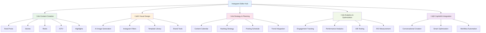

# Instagram Editor Overview

ALwrity Instagram Editor is a comprehensive, AI-powered content creation suite designed specifically for Instagram creators, influencers, businesses, and social media managers. Built with CopilotKit integration and advanced AI capabilities, it transforms Instagram content creation from manual processes to intelligent, automated workflows.

## What is Instagram Editor?

Instagram Editor is ALwrity's specialized platform for creating, optimizing, and managing Instagram content across all formats. It combines AI-powered content generation, CopilotKit conversational assistance, and Instagram-specific optimization tools to help creators produce professional-quality content that drives engagement and growth.

### Key Benefits

- **Instagram-Native Design**: Built specifically for Instagram's unique content ecosystem
- **AI-Powered Creation**: Generate captions, hashtags, and visuals with advanced AI
- **[Alwrity Copilot](../copilot/overview.md) Integration**: Conversational AI assistance for all Instagram workflows
- **Multi-Format Support**: Feed posts, Stories, Reels, IGTV, and Highlights optimization
- **Performance Analytics**: Real-time engagement tracking and optimization insights
- **Brand Consistency**: Maintain visual and messaging consistency across all content

## Target Users

### Primary: Instagram Influencers & Creators
- Content creators with 10K+ followers seeking professional tools
- Influencers managing multiple brand partnerships
- Lifestyle, fashion, and niche content creators
- Those wanting to scale content production efficiently

### Secondary: Business Accounts & Brands
- Small businesses building Instagram presence
- E-commerce brands showcasing products
- Local businesses connecting with communities
- Startups establishing brand identity on Instagram

### Tertiary: Social Media Agencies & Managers
- Agencies managing multiple client accounts
- Social media managers handling brand campaigns
- Marketing professionals optimizing engagement
- Teams requiring collaborative content workflows

## Core Features



## Content Format Support

### Feed Posts
- **Single Images**: 1:1, 4:5, 16:9 aspect ratios with AI optimization
- **Carousels**: Multi-image posts (2-10 images) with sequencing intelligence
- **Video Posts**: Short-form video content with engagement optimization
- **Text Posts**: Caption-focused posts with visual enhancement

### Stories
- **15-Second Sequences**: Interactive story creation with multiple slides
- **Interactive Elements**: Polls, questions, quizzes, and countdowns
- **Sticker Integration**: Location, mention, and custom branded stickers
- **Music & Effects**: Trending sounds and AR filters

### Reels
- **Short-Form Video**: Vertical video optimization for maximum reach
- **Audio Integration**: Trending sounds and original audio tracks
- **Text Overlays**: Animated text and captions
- **Effects & Transitions**: Professional editing tools

### IGTV & Highlights
- **Long-Form Content**: Extended video descriptions and optimization
- **Highlight Curation**: Themed story collections and organization
- **Series Planning**: Multi-part content planning and sequencing

## AI-Powered Features

### Content Intelligence


- **Smart Caption Generation**: Instagram-optimized captions with emoji intelligence
- **Hashtag Strategy**: AI-powered hashtag recommendations based on trends and competition
- **Engagement Optimization**: Content tweaks for maximum interaction
- **A/B Testing**: Multiple content variations for optimal performance

### Visual Creation
- **AI Image Generation**: Create Instagram-ready visuals from text descriptions
- **Style Transfer**: Apply Instagram aesthetic filters and trends
- **Brand Consistency**: Maintain visual identity across all content
- **Aspect Ratio Intelligence**: Automatic cropping and formatting for each format

## [Alwrity Copilot](../copilot/overview.md) Integration

### Conversational Content Creation
```typescript
User: "Help me create an Instagram post about my new coffee shop"
Copilot: "I'd be happy to help you create engaging Instagram content for your coffee shop! Let me guide you through the process:

🎯 **Content Strategy**: Based on your coffee shop theme, I recommend:
- Feed post with aesthetic product photos
- Story series showing behind-the-scenes
- Reel demonstrating your brewing process

üìù **Let's start with a feed post:**
'What type of post are you thinking? (Product showcase, customer testimonial, behind-the-scenes, or something else?)'"

Copilot: "Great choice! Let me create an aesthetic product showcase post:

‚òï **Generated Caption**:
'Starting your day with the perfect brew ‚òï‚ú®
Our signature espresso blend, roasted to perfection just for you.
Available now at [Your Location] #CoffeeLovers #LocalCoffee #MorningRitual'

üé® **Visual Suggestions**:
1. Close-up of coffee cup with steam
2. Coffee beans and grinder setup
3. Cozy interior shot
4. 'Now Open' branded overlay

üìä **Hashtag Strategy**:
• Primary: #CoffeeShop #LocalCoffee #CoffeeLovers
• Trending: #CoffeeCulture #MorningCoffee #CoffeeAddict
• Niche: #SpecialtyCoffee #ArtisanCoffee

Would you like me to generate the images or refine the caption?'"
```

### Smart Optimization
- **Real-time Performance**: Monitor engagement as content performs
- **Optimization Suggestions**: AI recommendations for improvement
- **Trend Integration**: Incorporate current Instagram trends
- **Competitor Analysis**: Learn from successful similar accounts

## Technical Architecture

### Frontend Architecture
- **React-Based Editor**: Modern, responsive interface built for creators
- **Instagram Preview**: Real-time preview of how content appears on Instagram
- **CopilotKit Integration**: Seamless conversational AI assistance
- **Performance Analytics**: Real-time engagement tracking and insights

### AI Integration
- **Multi-Model Support**: Integration with various AI providers for optimal results
- **Instagram API**: Direct integration with Instagram's official APIs
- **Content Analysis**: AI-powered analysis of trending content and hashtags
- **Performance Prediction**: ML models predicting content success potential

### Data & Analytics
- **Real-time Metrics**: Live engagement tracking and performance data
- **Historical Analysis**: Long-term trend identification and optimization
- **Competitor Insights**: Anonymous competitor performance benchmarking
- **Audience Intelligence**: Demographic and behavioral audience analysis

## Integration Ecosystem

### ALwrity Platform Integration
- **Image Studio**: Enhanced visual creation with Instagram-specific tools
- **Video Studio**: Reel and Story video creation and optimization
- **Content Strategy**: Instagram-specific content planning and calendar
- **SEO Dashboard**: Instagram performance tracking and optimization

### Third-Party Integrations
- **Instagram Business API**: Official integration for enhanced features
- **Social Media Management**: Integration with Hootsuite, Buffer, and similar tools
- **E-commerce Platforms**: Direct integration with Shopify, WooCommerce
- **Analytics Tools**: Google Analytics, Facebook Insights integration

## Getting Started

### Quick Start (5 minutes)
1. **Access Instagram Editor**: Navigate to `/instagram-editor` in your ALwrity dashboard
2. **Connect Account**: Link your Instagram business account (optional for enhanced features)
3. **Enable Copilot**: Activate ALwrity Copilot for AI assistance
4. **Create First Post**: Choose content type and let AI guide you
5. **Publish & Track**: Post directly or schedule with performance tracking

### Best Practices
- **Start with Copilot**: Enable conversational assistance for guided creation
- **Use Templates**: Leverage pre-built templates for consistent branding
- **Test & Optimize**: Use A/B testing to find what works best for your audience
- **Track Performance**: Monitor engagement and adjust strategy based on data
- **Stay Consistent**: Maintain brand voice and visual style across all content

## Success Metrics

Track your Instagram Editor success:

- **Content Velocity**: Faster content creation with AI assistance
- **Engagement Growth**: Improved likes, comments, and shares
- **Follower Growth**: Enhanced follower acquisition through optimized content
- **Content Quality**: Better content aesthetic and messaging with AI optimization
- **Time Savings**: Reduced content creation and posting time

## Use Cases

### For Influencers
- **Brand Collaborations**: Professional content for sponsored partnerships
- **Audience Engagement**: Interactive content that drives community interaction
- **Content Series**: Themed content collections that build loyal followings
- **Cross-Platform Promotion**: Instagram-optimized content for multi-platform promotion

### For Businesses
- **Product Showcases**: Aesthetic product photography and demonstration
- **Brand Storytelling**: Narrative content that builds emotional connections
- **Customer Engagement**: Interactive content that encourages user participation
- **Lead Generation**: Content designed to drive website traffic and conversions

### For Agencies
- **Client Management**: Multi-client content creation and management
- **Brand Consistency**: Unified content across multiple brand accounts
- **Performance Reporting**: Comprehensive analytics and ROI measurement
- **Scalable Production**: Efficient content creation for large client portfolios

## Enterprise Features

### Team Collaboration
- **Shared Workspaces**: Team-based content creation and review
- **Brand Guidelines**: Enforced brand standards across all content
- **Approval Workflows**: Multi-step content approval and publishing
- **Performance Attribution**: Track individual and team content performance

### Advanced Analytics
- **Competitive Analysis**: Anonymous competitor performance benchmarking
- **Trend Forecasting**: Predictive analytics for content trends
- **Audience Segmentation**: Detailed audience demographic analysis
- **ROI Tracking**: Comprehensive return on investment measurement

---

*Ready to transform your Instagram content creation? Start with the [Getting Started Guide](getting-started.md) and let ALwrity Copilot guide you to Instagram success!*

[:octicons-arrow-right-24: Getting Started Guide](getting-started.md)
[:octicons-arrow-right-24: Content Creation](content-creation.md)
[:octicons-arrow-right-24: Copilot Integration](copilot-integration.md)