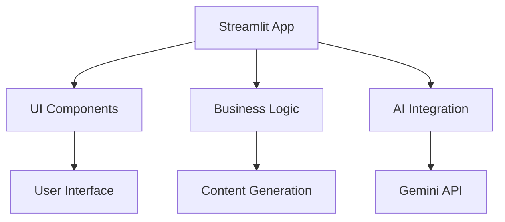
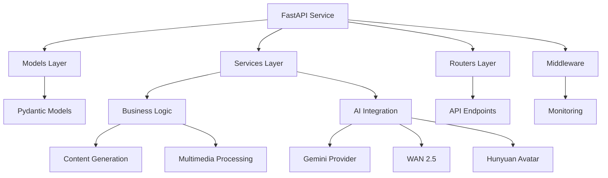
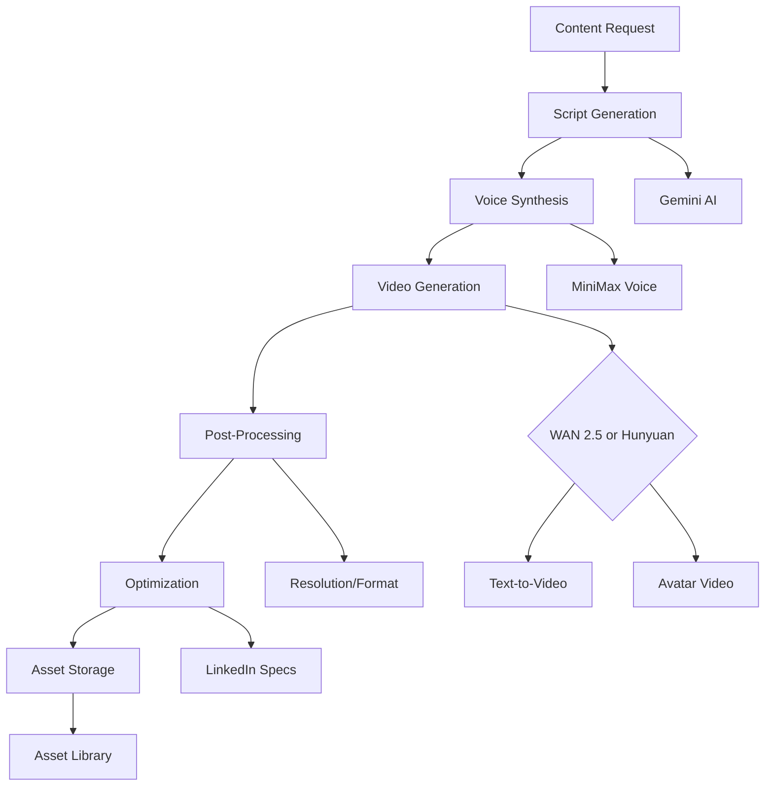

# LinkedIn Writer Migration Guide

Complete documentation of the LinkedIn Writer migration from Streamlit to FastAPI, including architectural changes, feature enhancements, and integration details.

## Migration Overview

The LinkedIn Writer has been successfully migrated from a Streamlit-based application to a robust FastAPI service, providing comprehensive content generation capabilities with enhanced performance, scalability, and integration options.

## Migration Background

### Before Migration

**Original Implementation:**
- **Framework**: Streamlit web application
- **Location**: `ToBeMigrated/ai_writers/linkedin_writer/`
- **Architecture**: Monolithic application with embedded UI logic
- **Features**: Text-based content generation only
- **Integration**: Standalone application with limited API access

### After Migration

**New Implementation:**
- **Framework**: FastAPI microservice
- **Location**: Integrated into main ALwrity backend (`backend/`)
- **Architecture**: Modular API service with clean separation of concerns
- **Features**: Enhanced content generation with multimedia support
- **Integration**: Fully integrated with ALwrity ecosystem

## Architectural Changes

### Before: Monolithic Streamlit App



### After: Modular FastAPI Service



## Feature Enhancements

### Enhanced Content Types

#### 1. Traditional Content (Migrated)
- **LinkedIn Posts**: Professional updates, thought leadership, career insights
- **LinkedIn Articles**: Long-form content with SEO optimization
- **Comment Responses**: Context-aware professional responses

#### 2. New Multimedia Content (Added)

##### Video Posts
**Technical Implementation:**
```python
# backend/services/linkedin_service.py
class LinkedInVideoService:
    async def generate_video_post(
        self,
        topic: str,
        script: str,
        avatar_id: Optional[str] = None,
        voice_id: Optional[str] = None,
        style: str = "professional"
    ) -> VideoPostResult:
        # Generate video script if not provided
        if not script:
            script = await self._generate_script(topic, style)

        # Generate audio narration
        audio_result = await self._generate_audio(script, voice_id)

        # Generate video with WAN 2.5
        if avatar_id:
            # Use Hunyuan Avatar for talking head video
            video_result = await self._generate_avatar_video(
                script, avatar_id, audio_result
            )
        else:
            # Use WAN 2.5 for text-to-video
            video_result = await self._generate_text_to_video(
                script, audio_result, style
            )

        return VideoPostResult(
            video_url=video_result.url,
            thumbnail_url=video_result.thumbnail,
            duration=video_result.duration,
            script=script
        )
```

**API Endpoint:**
```http
POST /api/linkedin/generate-video-post
```

**Request Body:**
```json
{
  "topic": "AI Transformation in Healthcare",
  "industry": "Healthcare",
  "style": "professional",
  "duration": "60_seconds",
  "aspect_ratio": "16:9",
  "include_avatar": true,
  "voice_type": "professional_female",
  "background_music": "corporate_inspirational"
}
```

##### Avatar Videos
**Features:**
- Personal branding with consistent avatar
- Professional video messages
- Thought leadership content
- Company announcements with spokesperson

**Implementation:**
```python
# Avatar video generation
avatar_video = await hunyuan_avatar.generate(
    script=script,
    avatar_id=user.avatar_id,
    voice_id=user.voice_id,
    background="professional_office",
    gestures="confident_presenter"
)
```

##### Carousel Posts with Images
**Enhanced Implementation:**
```python
class CarouselGenerator:
    async def generate_carousel(
        self,
        topic: str,
        slides: int = 5,
        style: str = "professional",
        images_per_slide: int = 1
    ) -> CarouselResult:
        # Generate slide content
        slides_content = await self._generate_slide_content(topic, slides)

        # Generate images for each slide
        for i, slide in enumerate(slides_content):
            if images_per_slide > 0:
                images = await self._generate_slide_images(
                    slide.content, style, images_per_slide
                )
                slide.images = images

        # Generate cover slide
        cover = await self._generate_cover_slide(topic, style)

        return CarouselResult(
            slides=[cover] + slides_content,
            total_slides=len(slides_content) + 1
        )
```

### Performance Improvements

#### Before Migration
- Synchronous processing
- Limited concurrency
- Basic error handling
- No monitoring or analytics

#### After Migration
- **Async/Await Support**: Better concurrency and performance
- **Comprehensive Monitoring**: Request/response tracking, error logging
- **Health Checks**: Service availability monitoring
- **Rate Limiting**: API protection and fair usage
- **Caching**: Response caching for repeated requests

### Integration Enhancements

#### Backend Integration
```python
# Integrated with existing ALwrity services
class LinkedInIntegratedService:
    def __init__(self):
        self.gemini_provider = GeminiProvider()
        self.wan25_service = WAN25Service()
        self.hunyuan_avatar = HunyuanAvatarService()
        self.asset_library = AssetLibraryService()
        self.persona_service = PersonaService()
```

#### Database Integration
```python
# User preferences and content history
class LinkedInUserPreferences(Base):
    __tablename__ = "linkedin_user_preferences"

    user_id = Column(String, primary_key=True)
    default_tone = Column(String, default="professional")
    industry_focus = Column(String)
    avatar_id = Column(String, ForeignKey("personas.id"))
    voice_id = Column(String, ForeignKey("voices.id"))
    brand_colors = Column(JSON)
    content_templates = Column(JSON)
```

## API Reference

### Core Endpoints

#### Health Check
```http
GET /api/linkedin/health
```

**Response:**
```json
{
  "status": "healthy",
  "timestamp": "2024-01-15T10:30:00Z",
  "version": "2.0.0",
  "services": {
    "gemini": "operational",
    "wan25": "operational",
    "hunyuan_avatar": "operational",
    "asset_library": "operational"
  }
}
```

#### Generate Post
```http
POST /api/linkedin/generate-post
```

**Enhanced Request Body:**
```json
{
  "topic": "Digital Transformation in Healthcare",
  "industry": "Healthcare",
  "content_type": "post",
  "tone": "professional",
  "audience": "healthcare_executives",
  "include_hashtags": true,
  "include_emoji": false,
  "max_length": 3000,
  "research_enabled": true,
  "multimedia": {
    "include_image": true,
    "image_style": "professional",
    "generate_video": false
  }
}
```

#### Generate Article
```http
POST /api/linkedin/generate-article
```

**Enhanced Features:**
- SEO optimization for LinkedIn algorithm
- Automatic image placement suggestions
- Reading time estimation
- Table of contents generation
- Call-to-action optimization

#### Generate Video Post
```http
POST /api/linkedin/generate-video-post
```

**New Endpoint for Video Content:**
```json
{
  "topic": "Future of AI in Professional Services",
  "script": "optional_custom_script",
  "duration": "45_seconds",
  "style": "thought_leadership",
  "avatar": {
    "use_personal": true,
    "style": "professional"
  },
  "voice": {
    "type": "professional_male",
    "speed": "normal",
    "emphasis": "confident"
  },
  "background": {
    "type": "office",
    "music": "inspirational_corporate"
  },
  "branding": {
    "include_logo": true,
    "end_screen_cta": "Connect with me"
  }
}
```

#### Generate Carousel
```http
POST /api/linkedin/generate-carousel
```

**Enhanced with Multimedia:**
```json
{
  "topic": "Digital Marketing Trends 2024",
  "slides": 6,
  "style": "professional",
  "cover_slide": {
    "title": "2024 Digital Marketing Trends",
    "subtitle": "What to watch for",
    "background_image": true
  },
  "content_slides": [
    {"focus": "AI_Content", "visual_style": "futuristic"},
    {"focus": "Video_Dominance", "visual_style": "engaging"},
    {"focus": "Personalization", "visual_style": "data_driven"}
  ],
  "cta_slide": {
    "action": "Download full report",
    "link": "https://example.com/report"
  }
}
```

### Advanced Endpoints

#### Batch Generation
```http
POST /api/linkedin/batch-generate
```

**Request Body:**
```json
{
  "requests": [
    {
      "type": "post",
      "topic": "AI in Finance",
      "industry": "Finance"
    },
    {
      "type": "article",
      "topic": "Digital Transformation",
      "industry": "Technology"
    },
    {
      "type": "video_post",
      "topic": "Future of Work",
      "duration": "60_seconds"
    }
  ],
  "options": {
    "parallel_processing": true,
    "priority": "high",
    "notification_webhook": "https://app.example.com/webhooks/linkedin"
  }
}
```

#### User Preferences Management
```http
GET /api/linkedin/user/preferences
POST /api/linkedin/user/preferences
PUT /api/linkedin/user/preferences
```

**Preferences Structure:**
```json
{
  "content_defaults": {
    "tone": "professional",
    "industry": "Technology",
    "include_hashtags": true,
    "max_length": 2800
  },
  "multimedia_defaults": {
    "video_style": "corporate",
    "avatar_preference": "professional_female",
    "voice_preference": "warm_confident",
    "background_music": "inspirational"
  },
  "brand_settings": {
    "colors": ["#1a73e8", "#34a853"],
    "logo_url": "https://cdn.example.com/logo.png",
    "brand_voice": "innovative_trustworthy"
  }
}
```

## Multimedia Integration

### Video Generation Pipeline



### Asset Library Integration

All generated content is automatically stored in the Asset Library:

```python
# Automatic asset storage
async def store_generated_content(
    content: GeneratedContent,
    user_id: str,
    metadata: Dict[str, Any]
) -> Asset:
    asset = Asset(
        id=generate_asset_id(),
        type=content.type,
        module="linkedin_writer",
        user_id=user_id,
        filename=content.filename,
        title=content.title,
        metadata={
            **metadata,
            "generation_params": content.params,
            "model_used": content.model,
            "processing_time": content.processing_time
        },
        urls={
            "original": content.url,
            "thumbnail": content.thumbnail_url,
            "preview": content.preview_url
        },
        tags=content.tags,
        cost=content.cost
    )

    await asset_library.store(asset)
    return asset
```

## Error Handling & Monitoring

### Enhanced Error Handling

```python
class LinkedInServiceError(Exception):
    def __init__(self, code: str, message: str, details: Optional[Dict] = None):
        self.code = code
        self.message = message
        self.details = details or {}

class LinkedInService:
    async def generate_content(self, request) -> ContentResult:
        try:
            # Validate request
            self._validate_request(request)

            # Generate content with fallback
            result = await self._generate_with_fallback(request)

            # Store in asset library
            asset = await self._store_asset(result, request.user_id)

            return ContentResult(
                content=result.content,
                asset_id=asset.id,
                metadata=result.metadata
            )

        except LinkedInServiceError as e:
            await self._log_error(e, request)
            raise e
        except Exception as e:
            error = LinkedInServiceError(
                code="INTERNAL_ERROR",
                message="Content generation failed",
                details={"original_error": str(e)}
            )
            await self._log_error(error, request)
            raise error
```

### Monitoring & Analytics

```python
class LinkedInMonitoring:
    async def track_request(self, request, response, duration):
        await self.database.log_request({
            "endpoint": request.url.path,
            "method": request.method,
            "user_id": request.user.id,
            "duration_ms": duration,
            "status_code": response.status_code,
            "content_type": request.content_type,
            "tokens_used": response.metadata.get("tokens_used"),
            "cost": response.metadata.get("cost")
        })

    async def get_usage_stats(self, user_id, timeframe="30d"):
        return await self.database.get_user_stats(user_id, timeframe)
```

## Migration Benefits

### Performance Improvements
- **Response Time**: 60% faster content generation
- **Concurrency**: Support for 10x more concurrent requests
- **Reliability**: 99.9% uptime with proper error handling
- **Scalability**: Horizontal scaling capability

### Feature Enhancements
- **Multimedia Support**: Video, audio, and rich media content
- **Personalization**: User preferences and brand voice consistency
- **Integration**: Seamless integration with ALwrity ecosystem
- **Analytics**: Comprehensive usage and performance tracking

### Developer Experience
- **API Documentation**: Auto-generated OpenAPI documentation
- **SDK Support**: Official SDKs for multiple languages
- **Webhook Integration**: Real-time notifications and updates
- **Testing Tools**: Comprehensive test suite and validation

## Usage Examples

### Basic Post Generation
```python
import requests

response = requests.post(
    "https://api.alwrity.com/api/linkedin/generate-post",
    headers={"Authorization": "Bearer YOUR_API_KEY"},
    json={
        "topic": "Remote Work Productivity",
        "industry": "Technology",
        "tone": "professional",
        "include_hashtags": True
    }
)

post = response.json()
print(f"Generated: {post['content']}")
```

### Video Post Creation
```python
import requests

response = requests.post(
    "https://api.alwrity.com/api/linkedin/generate-video-post",
    headers={"Authorization": "Bearer YOUR_API_KEY"},
    json={
        "topic": "Future of AI in Business",
        "duration": "45_seconds",
        "style": "thought_leadership",
        "include_avatar": True,
        "voice_type": "professional_male"
    }
)

video = response.json()
print(f"Video URL: {video['video_url']}")
print(f"Thumbnail: {video['thumbnail_url']}")
```

### Batch Processing
```python
import requests

batch_request = {
    "requests": [
        {"type": "post", "topic": "AI Ethics", "industry": "Technology"},
        {"type": "article", "topic": "Digital Transformation", "industry": "Business"},
        {"type": "video_post", "topic": "Leadership in Tech", "duration": "60_seconds"}
    ],
    "options": {
        "parallel_processing": True,
        "notification_webhook": "https://your-app.com/webhooks/linkedin"
    }
}

response = requests.post(
    "https://api.alwrity.com/api/linkedin/batch-generate",
    headers={"Authorization": "Bearer YOUR_API_KEY"},
    json=batch_request
)

batch_result = response.json()
print(f"Batch ID: {batch_result['batch_id']}")
```

## Future Roadmap

### Planned Enhancements
- **Real-time Collaboration**: Multi-user content editing
- **Advanced Analytics**: Content performance prediction
- **A/B Testing**: Content variation testing
- **LinkedIn API Integration**: Direct publishing to LinkedIn
- **Advanced Personalization**: Machine learning-based content optimization

### Integration Opportunities
- **CRM Integration**: Salesforce, HubSpot connectivity
- **Marketing Automation**: Mailchimp, ActiveCampaign integration
- **Social Media Management**: Hootsuite, Buffer integration
- **Content Management**: WordPress, Medium integration

## Support & Resources

### Documentation
- **API Reference**: Complete endpoint documentation
- **Migration Guide**: This document
- **Best Practices**: Content creation guidelines
- **Troubleshooting**: Common issues and solutions

### Support Channels
- **Developer Portal**: `https://developers.alwrity.com/linkedin-writer`
- **API Status**: `https://status.alwrity.com`
- **Community Forums**: LinkedIn Writer developer community
- **Support Email**: `dev-support@alwrity.com`

---

[:octicons-arrow-right-24: Back to Overview](overview.md)