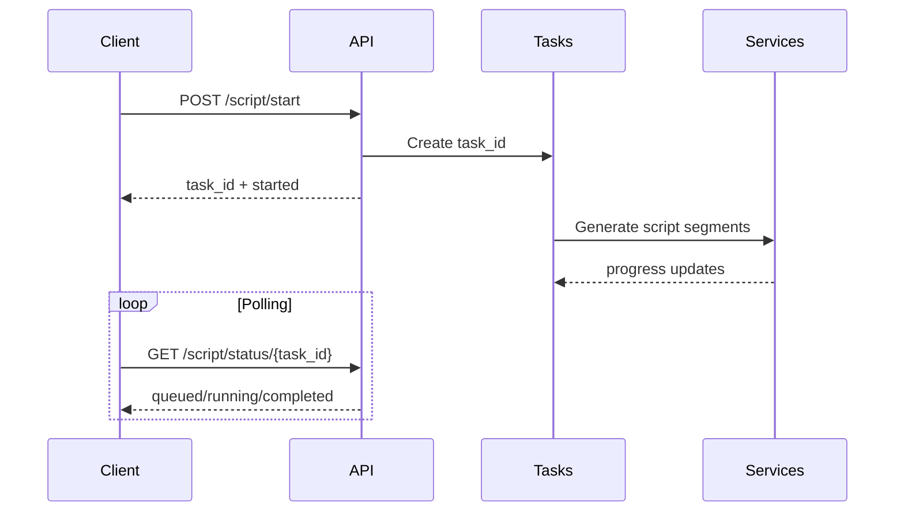

# Podcast Maker API Reference

Complete API reference for Podcast Maker planning, script generation, narration, and episode packaging.

## Base URL

All endpoints are prefixed with `/api/podcast`

## Authentication

All endpoints require bearer authentication.

```http
Authorization: Bearer YOUR_ACCESS_TOKEN
```

## API Surface

| Category | Endpoint | Description |
|---|---|---|
| Planning | `POST /api/podcast/plan` | Generate episode brief and structure |
| Scripting | `POST /api/podcast/script/start` | Start async script generation |
| Scripting | `GET /api/podcast/script/status/{task_id}` | Poll script generation status |
| Voice | `POST /api/podcast/voice/render` | Render narration audio |
| Metadata | `POST /api/podcast/metadata/generate` | Build title, notes, chapters, tags |
| Export | `POST /api/podcast/export` | Export full episode package |
| Health | `GET /api/podcast/health` | Service status |

## Request/Response Flow



## Planning Endpoint

**Endpoint**: `POST /api/podcast/plan`

**Request Example**:

```json
{
  "topic": "AI copilots for small marketing teams",
  "target_audience": "growth marketers",
  "episode_goal": "educate and capture demo signups",
  "duration_minutes": 18,
  "persona_id": "b2b_marketer"
}
```

**Response Fields**:

| Field | Type | Description |
|---|---|---|
| `brief` | object | Episode positioning and angle |
| `outline` | array | Ordered segment plan |
| `suggested_titles` | array | SEO-aware title options |
| `cta_options` | array | Recommended CTA language |

## Common Errors

| Code | Meaning | Typical Fix |
|---|---|---|
| 400 | Invalid request payload | Validate required fields and types |
| 401 | Unauthorized | Refresh access token |
| 409 | Task conflict | Retry with a new task or wait for active one |
| 422 | Unsupported voice profile | Use a valid profile ID |
| 500 | Internal failure | Retry and inspect task logs |
