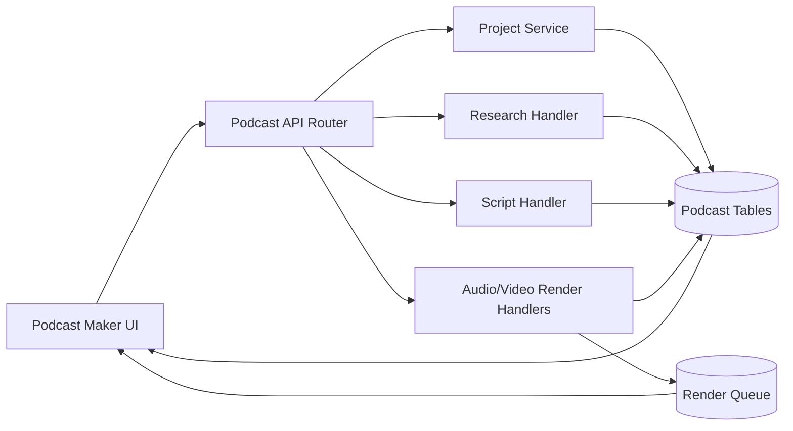

# Podcast Maker Implementation Overview

Podcast Maker orchestrates a multi-stage content pipeline: project configuration, research grounding, script composition, media rendering, and publish-state tracking.

## Architecture & Data Flow

## Component Responsibilities

- **UI layer**: captures project metadata, persona settings, and script/editor actions.
- **API router**: central endpoint registration and request dispatch.
- **Research and script handlers**: generate, validate, and persist episode knowledge and narration assets.
- **Render handlers**: combine narration, visuals, and scene timing into draft/final media outputs.
- **Storage + queue**: maintain immutable version history and asynchronous job state.
