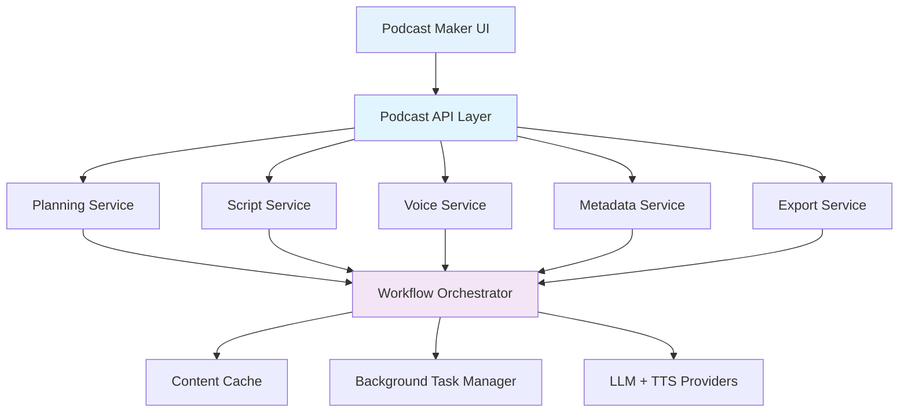

# Podcast Maker Implementation Overview

This document describes the high-level architecture and delivery model for Podcast Maker.

## Architecture Summary

Podcast Maker follows a modular orchestration pattern similar to ALwrity's other generation workflows.

## Core Services

| Service | Responsibility | Typical Output |
|---|---|---|
| Planning Service | Topic framing, episode angles, audience mapping | Episode brief + angle shortlist |
| Script Service | Segment generation and continuity checks | Segment scripts + host cues |
| Voice Service | TTS conversion and narration options | Audio assets + timing metadata |
| Metadata Service | Titles, descriptions, chapters, tags | Publishing package |
| Export Service | Bundled assets and integration payloads | ZIP/JSON payloads for channels |

## Data Flow

1. User submits a brief (topic, persona, duration, CTA).
2. Planner generates candidate structures and recommends one.
3. Script service produces segments with continuity memory.
4. Voice service renders selected script with voice settings.
5. Metadata service composes show notes and platform fields.
6. Export service returns publish-ready assets.

## Persona-Aware Design

Podcast Maker uses persona profiles to adjust:

- Vocabulary complexity
- Story style and pacing
- CTA framing and conversion intent
- Intro/outro brand consistency

## Reliability & Operations

- **Async jobs** for long-running generation
- **Idempotent task IDs** to safely retry
- **Segment-level regeneration** to avoid full reruns
- **Structured logging** for script/voice pipeline debugging

## Related Docs

- [Workflow Guide](workflow-guide.md)
- [API Reference](api-reference.md)
- [Troubleshooting](troubleshooting.md)
