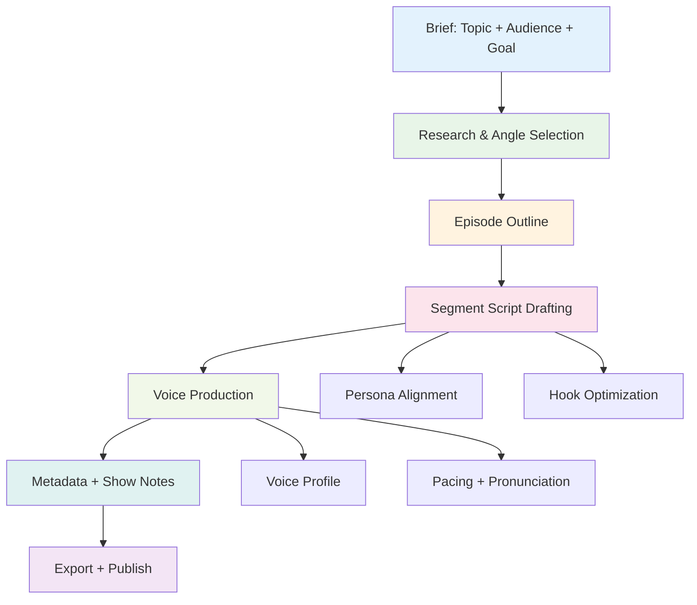

# Podcast Maker Overview

ALwrity Podcast Maker helps you plan, script, voice, and package podcast episodes from one workflow. It is designed for creators, marketers, and teams that want production speed without sacrificing narrative quality.

## What is Podcast Maker?

Podcast Maker is a feature hub for end-to-end episode production:

- **Episode planning** from audience and goal inputs
- **AI-assisted scripting** with segment-level controls
- **Voice production** with multiple narration styles
- **Show notes and metadata** for distribution
- **Repurposing outputs** for blog, social, and newsletter channels

## Key Capabilities

### 🎙️ Script-First Audio Production
- Topic-to-outline generation
- Segment templates (intro, story, interview, CTA)
- Tone controls (educational, conversational, executive)
- Persona-aware language adaptation

### 🔊 Voice & Delivery Controls
- Multi-speaker script formatting
- Voice profile selection
- Pronunciation and pacing hints
- Regeneration by segment instead of full episode

### 📣 Distribution-Ready Packaging
- Episode title options and subtitle variants
- Show notes with key takeaways and chapter markers
- Platform metadata (Spotify/Apple/YouTube)
- Cross-channel snippets for social and blog

## How It Works

```mermaid
flowchart TD
    A[Brief: Topic + Audience + Goal] --> B[Research & Angle Selection]
    B --> C[Episode Outline]
    C --> D[Segment Script Drafting]
    D --> E[Voice Production]
    E --> F[Metadata + Show Notes]
    F --> G[Export + Publish]

    D --> D1[Persona Alignment]
    D --> D2[Hook Optimization]
    E --> E1[Voice Profile]
    E --> E2[Pacing + Pronunciation]

    style A fill:#e3f2fd
    style B fill:#e8f5e8
    style C fill:#fff3e0
    style D fill:#fce4ec
    style E fill:#f1f8e9
    style F fill:#e0f2f1
    style G fill:#f3e5f5
```

## Who Benefits Most

### For Solopreneurs
- Turn a weekly idea into a polished episode quickly
- Keep voice and positioning consistent
- Reuse each episode as multi-platform content

### For Content Teams
- Standardize recurring episode formats
- Assign outline/script/review responsibilities clearly
- Improve turnaround time with reusable segment templates

### For Marketing & SEO Teams
- Align episodes to campaign themes and keyword targets
- Generate optimized titles and metadata at scale
- Integrate podcast output into blog and social funnels

## Next Steps

- Read the [Implementation Overview](implementation-overview.md)
- Follow the [Workflow Guide](workflow-guide.md)
- Integrate with the [API Reference](api-reference.md)
- Apply the [Best Practices](best-practices.md)
