# Podcast Maker Overview

ALwrity Podcast Maker is a comprehensive AI-powered platform for creating professional podcasts from concept to publication, featuring intelligent research, script generation, voice synthesis, and multimedia integration.

## What is Podcast Maker?

Podcast Maker is an AI-powered audio content creation platform that transforms your podcast ideas into professional audio episodes. From intelligent research and scripting to high-quality voice synthesis and audio production, it handles every aspect of podcast creation while maintaining your unique voice and brand.

```mermaid
graph TD
    A[🎙️ Podcast Maker] --> B[🔍 Research Phase]
    A --> C[✍️ Script Phase]
    A --> D[🎭 Audio Production Phase]
    A --> E[📤 Publishing Phase]

    B --> F[Multi-Source Research]
    B --> G[Fact Verification]
    B --> H[Query Generation]

    C --> I[AI Script Generation]
    C --> J[Scene Approval]
    C --> K[TTS Preview]

    D --> L[Voice Synthesis]
    D --> M[Audio Rendering]
    D --> N[HD Quality Support]

    E --> O[Asset Library]
    E --> P[Cross-Platform]
    E --> Q[Analytics Integration]

    style A fill:#e3f2fd
```



### Key Benefits

- **AI-Powered Research**: Comprehensive topic research with fact verification using Google Grounding and Exa AI
- **Professional Scripting**: Engaging scripts tailored to your podcast style with scene-based structure
- **Voice Synthesis**: Natural-sounding narration with Minimax voice cloning and WaveSpeed audio enhancement
- **Multi-speaker Support**: HD quality audio with multiple voice options for interviews and discussions
- **Cost Optimization**: Transparent pricing with quality tiers and subscription safeguards
- **Workflow Efficiency**: Streamlined 4-step process from research to publish

## Target Users

### Primary: Podcasters & Content Creators
- Independent podcasters creating solo shows
- Podcast networks managing multiple shows
- Content creators expanding to audio format
- Educators creating educational audio content

### Secondary: Business Professionals
- Thought leaders creating branded podcasts
- Marketing teams producing promotional content
- Consultants sharing expert insights
- Corporate communicators creating internal podcasts

### Tertiary: Teams & Organizations
- Media companies scaling podcast production
- Educational institutions creating course content
- Non-profits sharing stories and information
- Enterprises building internal communication channels

## Core Features

### Content Creation Pipeline

```mermaid
graph TD
    A[🎙️ Podcast Maker] --> B[🔍 Research Phase]
    A --> C[✍️ Script Phase]
    A --> D[🎭 Production Phase]
    A --> E[📤 Publishing Phase]

    B --> F[Multi-Source Research]
    B --> G[Fact Verification]
    B --> H[Query Generation]

    C --> I[AI Script Generation]
    C --> J[Scene Approval]
    C --> K[TTS Preview]

    D --> L[Voice Synthesis]
    D --> M[Audio Rendering]
    D --> N[HD Quality Support]

    E --> O[Asset Library]
    E --> P[Cross-Platform]
    E --> Q[Analytics Integration]
```



### AI-Powered Research Engine


### Comprehensive Workflow Pipeline

#### 4-Phase Content Creation Process


### Research Phase (Text Foundation)

#### Intelligent Multi-Source Research
- **Google Grounding Integration**: Factual research with web-grounding capabilities
- **Exa AI Integration**: Advanced web search and content analysis
- **Query Generation**: AI-generated research questions for comprehensive coverage
- **Fact Verification**: Automated credibility scoring and source validation

#### Research Workflow
```json
{
  "research_process": {
    "step_1": "User inputs topic and podcast goals",
    "step_2": "AI generates targeted research queries (text output)",
    "step_3": "Parallel search across Google and Exa APIs",
    "step_4": "Fact extraction and credibility scoring",
    "step_5": "Structured research cards for script integration (text foundation)"
  },
  "research_providers": ["google_grounding", "exa_ai"],
  "output_formats": ["research_cards", "fact_lists", "source_citations"],
  "verification_levels": ["basic", "comprehensive", "expert"]
}
```

### Script Phase (Text to Structure)

#### AI-Powered Script Generation
- **Gemini Integration**: Advanced script generation using Google's Gemini AI
- **Scene-Based Structure**: Scripts divided into manageable scenes with approval workflow
- **TTS-Compatible Formatting**: Optimized for text-to-speech and text-to-video conversion
- **Multi-format Optimization**: Scripts designed for audio narration and video presentation

#### Script Management Features


- **Scene Approval System**: Individual scene approval with backend persistence
- **TTS Preview**: Real-time voice preview using Minimax integration
- **Script Refinement**: Iterative improvement with AI assistance
- **Multi-speaker Support**: Dialogue formatting for interviews and discussions
- **Video Script Adaptation**: Automatic formatting for visual presentation

### Production Phase (Content Rendering)

#### Audio Production Pipeline


#### Advanced Voice Synthesis
- **Minimax Integration**: High-quality voice synthesis with emotional expression
- **WaveSpeed Audio**: Professional audio rendering and enhancement
- **Voice Cloning**: Custom voice creation from 30-second audio samples
- **Multi-language Support**: Voice synthesis in 20+ languages and accents

#### Audio Quality Options
```json
{
  "quality_tiers": {
    "standard": {
      "sample_rate": "44.1kHz",
      "bit_depth": "16-bit",
      "format": "MP3 VBR",
      "cost_multiplier": 1.0,
      "best_for": "Distribution and streaming"
    },
    "hd": {
      "sample_rate": "48kHz",
      "bit_depth": "24-bit",
      "format": "WAV lossless",
      "cost_multiplier": 2.0,
      "best_for": "Professional editing and archiving"
    },
    "enhancement_features": [
      "AI-powered noise reduction",
      "Dynamic range compression",
      "Professional EQ optimization",
      "Stereo field enhancement",
      "De-essing and plosive control"
    ]
  },
  "voice_options": {
    "pre_built_voices": "100+ professional voices across categories",
    "voice_cloning": "Create custom voices from audio samples",
    "multi_speaker_support": "Up to 5 different voices per episode",
    "emotional_expression": "Context-aware tone and emotion",
    "accent_customization": "Regional accent and speaking style options"
  }
}
```

### Publishing & Asset Management

#### Asset Library Integration
- **Automatic Storage**: All generated audio saved to [ALwrity Asset Library](../image-studio/asset-library.md)
- **Metadata Tracking**: Comprehensive metadata for organization and search
- **Usage Analytics**: Track downloads, plays, and engagement metrics
- **Cross-Platform Access**: Access episodes across all ALwrity features

#### Export & Distribution
- **Multiple Formats**: MP3, WAV, AAC, and FLAC export options
- **Platform Publishing**: Direct integration with major podcast platforms
- **RSS Feed Generation**: Automatic feed creation and management
- **Batch Operations**: Bulk export and publishing capabilities

## Content Types Supported

## Content Types Supported

### Solo Podcasts
- **Educational Content**: In-depth explanations and tutorials
- **Personal Stories**: Narrative storytelling and memoirs
- **Expert Insights**: Professional knowledge sharing
- **Current Events**: News analysis and commentary

### Interview Podcasts
- **Expert Interviews**: Industry leader discussions
- **Guest Conversations**: Diverse perspectives and experiences
- **Panel Discussions**: Multi-person conversations
- **Q&A Sessions**: Audience interaction and engagement

### Narrative Podcasts
- **Storytelling**: Fictional and non-fictional narratives
- **Documentary Style**: Investigative and research-based content
- **Series Content**: Multi-episode story arcs
- **Character-Driven**: Personality-focused content

### Business & Marketing Podcasts
- **Brand Storytelling**: Corporate narratives and messaging
- **Product Education**: Feature explanations and use cases
- **Industry Analysis**: Market trends and insights
- **Thought Leadership**: Executive perspectives and strategies

## Technical Architecture

### Complete AI Integration Pipeline

#### Research Engine (Text Foundation)


#### Script Generation Engine (Text Processing)


#### Audio Rendering Engine (Voice Synthesis)


#### Audio Rendering Engine (Voice Synthesis)


### Content Processing Pipeline

#### Voice Synthesis Workflow
1. **Text Analysis**: Linguistic and emotional content analysis
2. **Voice Selection**: Optimal voice matching for content and style
3. **Prosody Generation**: Natural speech rhythm and intonation
4. **Audio Rendering**: High-quality waveform generation
5. **Post-Processing**: Enhancement and optimization

#### Quality Enhancement
- **Sample Rate**: 44.1kHz or 48kHz for professional audio
- **Bit Depth**: 16-bit or 24-bit for dynamic range
- **Normalization**: Consistent loudness levels
- **Dithering**: Noise shaping for bit depth reduction

## Quality Tiers & Cost Structure

### Subscription Tiers

#### Starter Tier ($19/month)
```json
{
  "monthly_credits": 500,
  "features": [
    "Basic research (5 sources max)",
    "Standard voice synthesis",
    "MP3 export only",
    "Single speaker only",
    "Basic analytics"
  ],
  "limitations": [
    "480p video previews",
    "Limited voice options",
    "No commercial licensing",
    "Community support only"
  ]
}
```

#### Professional Tier ($49/month)
```json
{
  "monthly_credits": 2000,
  "features": [
    "Advanced research (unlimited sources)",
    "Premium voice synthesis",
    "All export formats",
    "Multi-speaker support",
    "Voice cloning",
    "Advanced analytics",
    "Commercial licensing"
  ],
  "bonus_features": [
    "Priority rendering",
    "Custom voice training",
    "API access"
  ]
}
```

#### Enterprise Tier (Custom)
```json
{
  "custom_credits": "5000+",
  "features": [
    "All Professional features",
    "Unlimited voice cloning",
    "Custom AI model training",
    "Dedicated success manager",
    "SLA guarantees",
    "Advanced integrations",
    "White-label options"
  ],
  "support": "24/7 enterprise support"
}
```

### Cost Optimization

#### Credit Consumption Examples
```json
{
  "research_operations": {
    "basic_query": 2,
    "comprehensive_research": 8,
    "fact_verification": 3,
    "source_integration": 1
  },
  "script_generation": {
    "basic_script": 5,
    "detailed_script": 12,
    "multi_scene_script": 18
  },
  "audio_production": {
    "per_minute_standard": 8,
    "per_minute_hd": 15,
    "voice_cloning_setup": 25,
    "multi_speaker_minute": 12
  }
}
```

## Integration Ecosystem

### ALwrity Platform Integration

#### Content Strategy Integration
- **Topic Research**: Leverage existing content research
- **Audience Insights**: Use persona data for content optimization
- **Brand Consistency**: Maintain voice across all content types
- **Performance Tracking**: Unified analytics across platforms

#### Copilot Integration
- **Conversational Research**: Natural language research queries
- **Script Refinement**: AI-assisted script editing and improvement
- **Voice Optimization**: Copilot-guided voice selection
- **Performance Analysis**: AI-powered content performance insights

### Third-Party Integrations

#### Podcast Platforms
- **Spotify for Podcasters**: Direct publishing and analytics
- **Apple Podcasts**: Enhanced metadata and discovery
- **Google Podcasts**: Cross-platform distribution
- **Amazon Music**: Additional distribution channel

#### Content Management
- **WordPress Integration**: Automatic blog post creation
- **Social Media Tools**: Cross-posting to social platforms
- **Email Marketing**: Episode promotion and newsletters
- **Analytics Platforms**: Advanced listener analytics

## Getting Started

### Quick Start (5 minutes)
1. **Access Podcast Maker**: Navigate to `/podcast-maker` in your ALwrity dashboard
2. **Create Project**: Enter your podcast topic and target audience
3. **AI Research**: Let AI gather comprehensive research and facts
4. **Generate Script**: Create engaging podcast script with natural dialogue
5. **Produce Audio**: Generate professional audio with voice synthesis
6. **Export & Publish**: Download final podcast and publish to platforms

### Workflow Overview

#### Step 1: Project Setup
- Define podcast topic and goals
- Select target audience and style
- Choose duration and format preferences
- Set quality tier and budget parameters

#### Step 2: Research Phase
- Generate comprehensive research queries
- Execute multi-source research with fact verification
- Review and approve research findings
- Extract key facts and narratives for scripting

#### Step 3: Script Generation
- Create structured podcast script
- Add engaging hooks and transitions
- Optimize for listener engagement
- Include calls-to-action and key takeaways

#### Step 4: Audio Production
- Select voices for narration and interviews
- Generate high-quality audio with natural speech
- Apply audio enhancement and effects
- Review and approve final audio

#### Step 5: Publishing & Distribution
- Export in optimal format for your platform
- Generate show notes and metadata
- Publish to podcast directories
- Track performance and engagement

## Success Metrics

### Content Quality Metrics
- **Engagement Rate**: Average listen-through rate vs. industry benchmarks
- **Download Growth**: Consistent download increases over time
- **Review Ratings**: Average listener ratings and feedback
- **Social Sharing**: Episode shares and social media mentions

### Production Efficiency Metrics
- **Time to Episode**: From concept to published episode
- **Cost per Episode**: Credits used vs. content value
- **Quality Consistency**: Maintained quality across episodes
- **Workflow Efficiency**: Time saved vs. traditional production

### Business Impact Metrics
- **Audience Growth**: Listener base expansion over time
- **Revenue Generation**: Sponsorships, merchandise, premium content
- **Brand Authority**: Increased thought leadership recognition
- **Content Scalability**: Ability to produce more content efficiently

## Advanced Features

### AI-Powered Optimization

#### Listener Engagement Prediction
- **Hook Effectiveness**: AI analysis of opening engagement potential
- **Content Flow Analysis**: Optimal pacing and structure recommendations
- **CTA Optimization**: Best practices for calls-to-action placement
- **Length Optimization**: Ideal episode duration for audience retention

#### Voice & Style Personalization
- **Brand Voice Training**: Custom voice models trained on your content
- **Style Consistency**: Maintain consistent tone across episodes
- **Audience Adaptation**: Content optimization for listener preferences
- **Multi-Host Coordination**: Natural dialogue flow for co-hosted shows

### Analytics & Insights

#### Performance Tracking
- **Episode Analytics**: Individual episode performance metrics
- **Listener Demographics**: Audience characteristics and preferences
- **Geographic Distribution**: Global reach and regional popularity
- **Device & Platform Usage**: Listening platform preferences

#### Optimization Recommendations
- **Content Strategy**: Topics and formats that perform best
- **Timing Optimization**: Best publishing times for maximum reach
- **Promotion Effectiveness**: Which promotion channels drive most downloads
- **Series Planning**: Content arcs and series that maintain engagement

---

*Ready to create professional podcasts with AI assistance? Start with our [Getting Started Guide](getting-started.md) and transform your ideas into engaging audio content!*

[:octicons-arrow-right-24: Advanced Integrations](advanced-integrations.md)