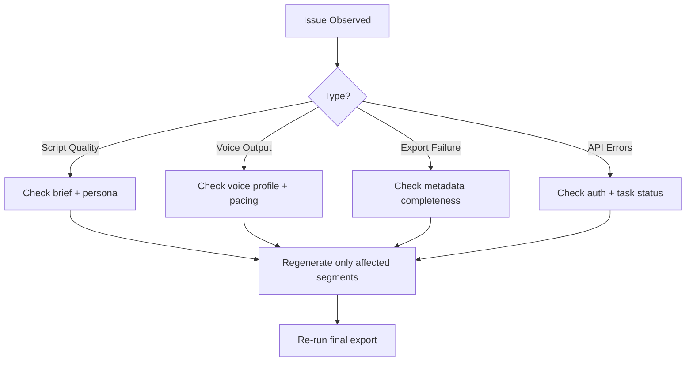

# Podcast Maker Troubleshooting

Use this guide to quickly diagnose and resolve common Podcast Maker issues.

## Quick Diagnostic Flow

## Common Issues

### 1) Script feels generic

**Symptoms**:
- Weak hooks
- Repetitive language
- Limited audience relevance

**Fixes**:
- Provide explicit audience + persona in brief
- Add 2–3 must-cover points in outline
- Regenerate specific segments, not full script

### 2) Voice sounds unnatural

**Symptoms**:
- Robotic transitions
- Mispronounced terms
- Inconsistent pacing

**Fixes**:
- Reduce sentence complexity
- Add pronunciation hints
- Lower pace for technical segments

### 3) Export package missing metadata

**Symptoms**:
- Missing chapters/tags
- Empty description field

**Fixes**:
- Run metadata generation before export
- Validate required fields in export request
- Retry export with same task ID if generation succeeded

### 4) Long-running task stalls

**Symptoms**:
- Status remains `running` without progress

**Fixes**:
- Poll `/script/status/{task_id}` for last update time
- Retry from last successful stage
- Check service health endpoint before rerun

## Escalation Checklist

- [ ] Task ID captured
- [ ] Request payload saved
- [ ] Last successful stage identified
- [ ] Error code and timestamp logged
- [ ] Health endpoint status confirmed
