# ALwrity Researcher Overview

ALwrity Researcher is an advanced AI-powered research engine that goes beyond traditional search to provide intent-driven, personalized research results. Using sophisticated natural language understanding and multi-source data integration, it delivers comprehensive, actionable insights tailored to your specific needs.

## What is ALwrity Researcher?

ALwrity Researcher transforms how you conduct research by understanding your intent before searching, then delivering precisely what you need - whether it's statistics, quotes, case studies, competitor analysis, or comprehensive market intelligence. Unlike traditional search engines, Researcher analyzes your goals and provides structured, actionable research results.

### Key Benefits

- **Intent-Driven Analysis**: AI understands your research goals before searching
- **Multi-Source Integration**: Combines data from Exa AI, Tavily, Google, and more
- **Personalized Results**: Research tailored to your industry, audience, and objectives
- **Structured Deliverables**: Organized results in formats you can immediately use
- **Competitor Intelligence**: Automated competitor analysis and market insights
- **Research Persona**: AI-generated personas for audience understanding

## Target Users

### Primary: Content Creators & Researchers
- Bloggers and writers needing comprehensive topic research
- Journalists requiring fact-checked, multi-source information
- Content marketers researching industry trends and data
- Academic researchers gathering comprehensive literature reviews

### Secondary: Business Professionals
- Marketing professionals conducting market research
- Consultants preparing client reports and analysis
- Entrepreneurs researching business opportunities
- Sales professionals gathering prospect intelligence

### Tertiary: Teams & Enterprises
- Research teams requiring systematic data collection
- Marketing agencies serving multiple client research needs
- Enterprises conducting competitive intelligence
- Organizations building knowledge bases and insights

## Core Features

```mermaid
graph TD
    A[ALwrity Researcher] --> B[🎯 Intent Analysis]
    A --> C[🔍 Multi-Source Research]
    A --> D[👤 Research Persona]
    A --> E[📊 Structured Results]
    A --> F[🤖 AI Enhancement]

    B --> G[Goal Understanding]
    B --> H[Query Generation]
    B --> I[Parameter Optimization]

    C --> J[Exa AI]
    C --> K[Tavily]
    C --> L[Google Search]
    C --> M[Additional Sources]

    D --> N[Persona Generation]
    D --> O[Audience Insights]
    D --> P[Demographic Analysis]

    E --> Q[Statistics & Data]
    E --> R[Quotes & Citations]
    E --> S[Case Studies]
    E --> T[Market Insights]

    F --> U[Fact Verification]
    F --> V[Source Credibility]
    F --> W[Relevance Scoring]

    style A fill:#e3f2fd
    style B fill:#e8f5e8
    style C fill:#fff3e0
    style D fill:#fce4ec
    style E fill:#f1f8e9
    style F fill:#f3e5f5
```

## Intent-Driven Research Process

### How It Works

**Step 1: Intent Analysis**

- **Natural Language Understanding**: AI comprehends your research objectives
- **Context Awareness**: Considers your industry, role, and previous research
- **Goal Inference**: Determines whether you need statistics, quotes, trends, or analysis
- **Query Optimization**: Generates precise search queries for maximum relevance

**Step 2: Multi-Source Research**

- **Provider Priority**: Intelligent selection of search providers based on content type
- **Source Diversity**: Multiple data sources for comprehensive coverage
- **Real-time Updates**: Access to current information and breaking news
- **Geographic Coverage**: Global and local search capabilities

**Step 3: Intent-Aware Analysis**

- **Content Filtering**: Results filtered through your original intent lens
- **Relevance Scoring**: AI-determined importance and usefulness
- **Structured Output**: Information organized in usable formats
- **Actionable Insights**: Research presented for immediate application

## Research Personas

### AI-Generated Audience Profiles

**Persona Creation:**
- **Demographic Analysis**: Age, location, income, education, interests
- **Behavioral Insights**: Online habits, content preferences, decision drivers
- **Psychographic Profiling**: Values, motivations, pain points, aspirations
- **Journey Mapping**: Customer journey stages and touchpoints

**Research Enhancement:**
- **Audience-Targeted Results**: Research filtered for your specific audience
- **Persona-Based Insights**: Information relevant to your user profiles
- **Segmentation Analysis**: Different insights for different user segments
- **Personalization Opportunities**: Content tailored to persona preferences

## Research Types & Deliverables

### Statistical Research
- **Market Data**: Industry statistics, growth rates, market size
- **Trend Analysis**: Emerging trends, adoption rates, technology shifts
- **Demographic Insights**: Audience characteristics, behavior patterns
- **Performance Metrics**: Industry benchmarks, success rates, KPIs

### Qualitative Research
- **Expert Quotes**: Industry leader opinions and insights
- **Case Studies**: Real-world examples and success stories
- **Customer Testimonials**: User experiences and satisfaction data
- **Narrative Content**: Stories, anecdotes, and qualitative insights

### Competitive Intelligence
- **Competitor Analysis**: Strategy, positioning, strengths, weaknesses
- **Market Positioning**: How competitors are perceived and ranked
- **Product Comparisons**: Feature analysis, pricing, differentiation
- **Opportunity Identification**: Market gaps and underserved segments

### Content Research
- **Topic Authority**: Comprehensive coverage of subjects
- **Source Credibility**: Verification of information accuracy
- **Content Gaps**: Identification of underserved topics
- **Trend Integration**: Current and emerging topic relevance

## Technical Architecture

### Unified Research Analyzer

**Single AI Call Architecture:**
- **Intent + Queries + Parameters**: One comprehensive AI analysis
- **Optimization Efficiency**: Reduced API calls while maintaining quality
- **Context Preservation**: Maintains research intent throughout the process
- **Quality Assurance**: Consistent analysis standards across all research

### Provider Integration

**Multi-Source Intelligence:**
- **Exa AI**: Advanced web search with content analysis
- **Tavily**: Structured data extraction and API-first search
- **Google Search**: Comprehensive web and news coverage
- **Specialized Sources**: Industry-specific databases and publications

**Intelligent Routing:**
- **Content-Type Matching**: Routes queries to best-suited providers
- **Quality Optimization**: Balances speed, cost, and result quality
- **Fallback Mechanisms**: Automatic failover to alternative providers
- **Cost Management**: Optimized provider selection for budget efficiency

### Research Persona System

**Dynamic Persona Generation:**
- **Industry-Specific**: Tailored to your business sector and market
- **Role-Based**: Different personas for different organizational roles
- **Behavioral Modeling**: Realistic user behaviors and decision processes
- **Scalable Creation**: Generate multiple personas for comprehensive coverage

**Data Integration:**
- **Market Research**: Industry reports, demographic data, trend analysis
- **Social Intelligence**: Social media behavior and preference patterns
- **Competitive Insights**: Competitor customer analysis and positioning
- **Internal Data**: CRM data, analytics, and customer feedback integration

## Integration Ecosystem

### ALwrity Platform Integration
- **Blog Writer**: Research integration for fact-based content creation
- **Content Strategy**: Research-driven content planning and topic identification
- **SEO Dashboard**: Research-powered keyword and competitor analysis
- **Copilot**: AI-assisted research refinement and expansion

### Third-Party Integrations
- **Content Management**: WordPress, Medium, Ghost integration
- **CRM Systems**: Salesforce, HubSpot research data integration
- **Analytics Tools**: Google Analytics, Adobe Analytics data enrichment
- **Project Management**: Asana, Trello research task integration

## Getting Started

### Quick Setup (5 minutes)
1. **Access Researcher**: Navigate to `/researcher` in your ALwrity dashboard
2. **Enter Research Topic**: Describe what you want to research in natural language
3. **Configure Options**: Choose research depth, sources, and persona inclusion
4. **Execute Research**: Let AI analyze your intent and gather comprehensive data
5. **Review Results**: Explore organized research results and insights

### Research Workflow
1. **Intent Definition**: Clearly articulate your research goals and objectives
2. **Parameter Configuration**: Select research depth, sources, and personalization
3. **AI Analysis**: Let the system understand and optimize your research approach
4. **Data Collection**: Automated multi-source research with quality verification
5. **Result Organization**: Structured presentation of findings and insights
6. **Action Planning**: Use research insights to inform decisions and strategies

## Best Practices

### Effective Research Queries
- **Specific Intent**: "Find statistics about remote work adoption in tech companies"
- **Clear Objectives**: "Research competitor pricing strategies in SaaS"
- **Audience Context**: "Find content ideas for millennials interested in sustainable fashion"
- **Actionable Goals**: "Identify market opportunities in the electric vehicle industry"

### Research Optimization
- **Iterative Refinement**: Start broad, then narrow based on initial results
- **Source Diversity**: Combine multiple research types for comprehensive insights
- **Persona Integration**: Include audience personas for more relevant results
- **Regular Updates**: Re-run research periodically to capture new developments

### Quality Assurance
- **Source Verification**: Always check the credibility of research sources
- **Fact Checking**: Cross-reference important statistics and claims
- **Bias Awareness**: Consider potential biases in research sources
- **Context Evaluation**: Ensure research results fit your specific context

## Advanced Features

### Custom Research Templates
- **Industry Templates**: Pre-configured research setups for specific sectors
- **Role-Based Templates**: Templates optimized for different organizational roles
- **Project Templates**: Standardized research approaches for recurring projects
- **Compliance Templates**: Research setups meeting regulatory requirements

### Research Automation
- **Scheduled Research**: Automated recurring research on important topics
- **Alert Systems**: Notifications when new information becomes available
- **Trend Monitoring**: Continuous tracking of industry developments
- **Competitive Watch**: Ongoing monitoring of competitor activities

### Team Collaboration
- **Shared Research**: Team access to research projects and findings
- **Collaborative Analysis**: Multi-user review and annotation of research
- **Knowledge Base**: Centralized storage of research insights and learnings
- **Access Controls**: Role-based permissions for sensitive research data

## Success Metrics

Track your Researcher success:

- **Research Quality**: Accuracy, comprehensiveness, and actionability of results
- **Time Efficiency**: Reduction in research time compared to manual methods
- **Insight Generation**: Number of actionable insights and strategic decisions
- **Content Impact**: Improved content quality and audience engagement
- **ROI Measurement**: Business value generated from research insights

## Enterprise Features

### Advanced Analytics
- **Research Performance**: Track research effectiveness and user satisfaction
- **Knowledge Management**: Enterprise-wide research database and insights
- **Compliance Tracking**: Audit trails for regulatory compliance
- **Cost Optimization**: Advanced budgeting and usage optimization

### Custom Integrations
- **API Access**: Direct integration with enterprise systems
- **SSO Integration**: Enterprise authentication and access management
- **Custom Sources**: Integration with proprietary data sources
- **White-Label Options**: Branded research interfaces for client portals

### Governance & Security
- **Data Privacy**: Enterprise-grade data protection and privacy controls
- **Access Controls**: Granular permissions for sensitive research data
- **Audit Logging**: Complete activity tracking for compliance requirements
- **Data Retention**: Configurable data retention and archival policies

---

*Ready to revolutionize your research process? Start with the [Intent-Driven Research Guide](intent-research-guide.md) and discover how AI can transform your research capabilities!*

[:octicons-arrow-right-24: Intent Research Guide](intent-research-guide.md)
[:octicons-arrow-right-24: Research Personas](research-personas.md)
[:octicons-arrow-right-24: Advanced Features](advanced-features.md)