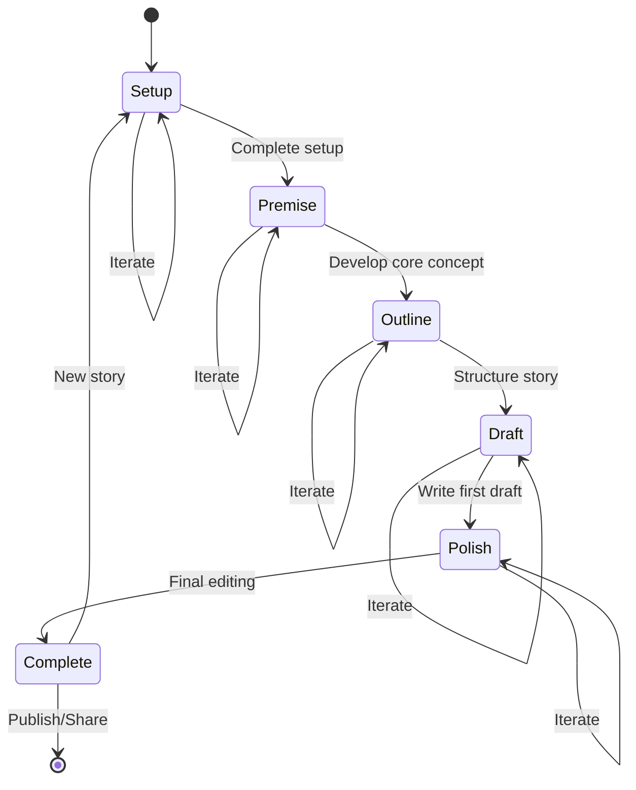

# Story Writer Phase Navigation

Comprehensive guide to navigating through ALwrity Story Writer's 5-phase creative process, including phase transitions, iterative workflows, and multimedia integration options.

## Overview

Story Writer's 5-phase workflow provides a structured yet flexible approach to story creation. This guide explains how to navigate through each phase, understand phase transitions, and leverage multimedia integration for enhanced storytelling.

## Phase Structure Overview

### The 5-Phase Creative Process



### Phase Characteristics

| Phase | Focus | AI Role | User Control | Output |
|-------|-------|---------|--------------|--------|
| **Setup** | Foundation | Guidance | High | Story parameters |
| **Premise** | Core concept | Generation | Medium | Story premise |
| **Outline** | Structure | Assistance | Medium | Story outline |
| **Draft** | Content creation | Heavy lifting | Low | First draft |
| **Polish** | Refinement | Editing support | High | Final story |

## Phase-by-Phase Navigation

### Phase 1: Setup

#### Phase Objective
Establish the foundational elements of your story including genre, style, characters, and narrative parameters.

#### Navigation Interface

**Setup Dashboard:**
```
┌─────────────────────────────────────────────────┐
│ Story Writer - Phase 1: Setup                   │
├─────────────────────────────────────────────────┤
│                                                 │
│ 📝 Story Basics                                 │
│   └─ Title: [Enter story title]                 │
│   └─ Genre: [Fiction ▼] [Select from dropdown]  │
│   └─ Target Length: [Short Story ▼]             │
│                                                 │
│ 👥 Characters                                   │
│   ├─ Add Main Character [+]                      │
│   ├─ Add Supporting Character [+]                │
│   └─ Character Relationships [Define]           │
│                                                 │
│ 🏞️  Setting                                      │
│   └─ Time Period: [Modern]                       │
│   └─ Location: [Urban environment]               │
│   └─ Atmosphere: [Contemporary, relatable]      │
│                                                 │
│ 🎭 Style & Tone                                 │
│   └─ Narrative Style: [First-person limited]    │
│   └─ Tone: [Intimate, reflective]               │
│   └─ Target Audience: [Young adults 25-35]      │
│                                                 │
│ 🎯 Story Goals                                  │
│   └─ Theme: [Personal growth, relationships]    │
│   └─ Emotional Arc: [Growth through challenge]  │
│   └─ Key Message: [Resilience matters]          │
│                                                 │
├─────────────────────────────────────────────────┤
│ [◀ Previous] [Save Progress] [Next: Premise ▶]  │
└─────────────────────────────────────────────────┘
```

#### Key Decisions in Setup

**Genre Selection:**
- **Fiction**: Novels, short stories, flash fiction
- **Marketing**: Brand stories, customer journeys, testimonials
- **Educational**: Case studies, teaching narratives, examples
- **Business**: Leadership stories, company narratives, vision stories

**Length Considerations:**
- **Flash Fiction**: 100-1,000 words
- **Short Story**: 1,000-7,500 words
- **Novella**: 7,500-40,000 words
- **Novel**: 40,000+ words

#### Setup Validation

Before proceeding to Phase 2, the system validates:
- ✅ At least one main character defined
- ✅ Basic setting established
- ✅ Genre and tone selected
- ✅ Target audience identified

### Phase 2: Premise

#### Phase Objective
Develop the core concept and hook that will drive your story's narrative.

#### Navigation Interface

**Premise Development:**
```
┌─────────────────────────────────────────────────┐
│ Story Writer - Phase 2: Premise                 │
├─────────────────────────────────────────────────┤
│                                                 │
│ 🎯 Core Concept                                 │
│   └─ What if [protagonist] had to [conflict]    │
│   └─ But [complication] stood in their way      │
│                                                 │
│ 🪝 Story Hook                                   │
│   └─ Opening line or scenario that grabs        │
│     attention                                   │
│                                                 │
│ 📋 Premise Statement                            │
│   └─ [Character] wants [goal], but [obstacle]   │
│     forces them to [action]                     │
│                                                 │
│ 🔍 AI Suggestions                               │
│   ├─ Generate premise ideas [+]                 │
│   ├─ Refine current premise [+]                 │
│   └─ Test premise strength [+]                  │
│                                                 │
│ 📊 Premise Analysis                             │
│   └─ Conflict Level: ████████░░ 80%             │
│   └─ Engagement Potential: ███████░░░ 70%       │
│   └─ Originality Score: ████████░░ 80%          │
│                                                 │
├─────────────────────────────────────────────────┤
│ [◀ Setup] [Save Progress] [Next: Outline ▶]     │
└─────────────────────────────────────────────────┘
```

#### Premise Development Tools

**AI-Powered Premise Generation:**
```python
class PremiseGenerator:
    async def generate_premise_ideas(
        self,
        setup_data: StorySetup,
        count: int = 5
    ) -> List[PremiseIdea]:

        # Analyze setup parameters
        character_analysis = await self._analyze_characters(setup_data.characters)
        setting_analysis = await self._analyze_setting(setup_data.setting)
        genre_patterns = await self._get_genre_patterns(setup_data.genre)

        # Generate premise variations
        premises = []
        for i in range(count):
            premise = await self.gemini.generate_structured_content({
                "task": "generate_story_premise",
                "genre": setup_data.genre,
                "characters": character_analysis,
                "setting": setting_analysis,
                "patterns": genre_patterns,
                "creativity_level": "balanced",
                "originality_weight": 0.7
            })

            # Validate premise strength
            analysis = await self._analyze_premise_strength(premise)
            premise.analysis = analysis

            premises.append(premise)

        return premises
```

**Premise Refinement Options:**
- **Strengthen Conflict**: Increase stakes and obstacles
- **Deepen Character Motivation**: Make character goals more compelling
- **Add Unique Elements**: Incorporate distinctive story elements
- **Test Market Appeal**: Evaluate commercial viability

### Phase 3: Outline

#### Phase Objective
Create a detailed structural framework that guides the story development.

#### Navigation Interface

**Outline Builder:**
```
┌─────────────────────────────────────────────────┐
│ Story Writer - Phase 3: Outline                │
├─────────────────────────────────────────────────┤
│                                                 │
│ 📖 Story Structure                              │
│   ├─ Act 1: Setup (25%)                         │
│   │  ├─ Introduction                            │
│   │  ├─ Inciting Incident                       │
│   │  └─ Plot Point 1                            │
│   ├─ Act 2: Confrontation (50%)                │
│   │  ├─ Rising Action                           │
│   │  ├─ Midpoint                                │
│   │  ├─ Crisis                                  │
│   │  └─ Plot Point 2                            │
│   └─ Act 3: Resolution (25%)                   │
│      ├─ Falling Action                          │
│      ├─ Climax                                  │
│      └─ Resolution                              │
│                                                 │
│ 🎭 Character Arcs                               │
│   ├─ Protagonist Journey                        │
│   ├─ Supporting Character Development           │
│   └─ Antagonist Role                            │
│                                                 │
│ 🎯 Key Scenes                                  │
│   ├─ Opening Hook Scene                         │
│   ├─ Major Conflict Scenes                      │
│   ├─ Emotional Peak Scenes                      │
│   └─ Resolution Scenes                          │
│                                                 │
│ 📝 Scene Details                                │
│   └─ [Expandable scene details]                 │
│                                                 │
├─────────────────────────────────────────────────┤
│ [◀ Premise] [Save Progress] [Next: Draft ▶]     │
└─────────────────────────────────────────────────┘
```

#### Outline Customization Options

**Structural Frameworks:**
- **Three-Act Structure**: Classic setup, confrontation, resolution
- **Hero's Journey**: Monomyth structure with archetypal stages
- **Five-Act Structure**: More detailed dramatic structure
- **Custom Framework**: User-defined structural approach

**Scene Planning Tools:**
- **Scene Cards**: Visual planning with key elements
- **Conflict Mapping**: Track rising action and complications
- **Pacing Calculator**: Ensure proper story rhythm
- **Character Checkpoints**: Track character development milestones

### Phase 4: Draft

#### Phase Objective
Generate the complete first draft of your story using AI assistance.

#### Navigation Interface

**Draft Generation:**
```
┌─────────────────────────────────────────────────┐
│ Story Writer - Phase 4: Draft                  │
├─────────────────────────────────────────────────┤
│                                                 │
│ ✍️  Draft Generation                            │
│   ├─ Writing Mode: [AI-Assisted ▼]              │
│   ├─ Chapter/Section: [Auto-generate all]       │
│   └─ Writing Style: [Maintain voice consistency]│
│                                                 │
│ 📊 Generation Progress                          │
│   ├─ Outline Analysis: ██████████ 100%          │
│   ├─ Character Development: ████████░░ 80%      │
│   ├─ Scene Generation: ███████░░░ 70%           │
│   └─ Overall Progress: ███████░░░ 70%           │
│                                                 │
│ 🔧 Generation Controls                          │
│   ├─ Pause/Resume [+]                           │
│   ├─ Adjust Parameters [+]                      │
│   └─ Preview Sections [+]                       │
│                                                 │
│ 📝 Draft Preview                                │
│   └─ [Live preview of generated content]        │
│                                                 │
├─────────────────────────────────────────────────┤
│ [◀ Outline] [Save Progress] [Next: Polish ▶]    │
└─────────────────────────────────────────────────┘
```

#### Draft Generation Options

**Writing Modes:**
- **Full AI Generation**: Complete story written by AI
- **AI-Assisted**: AI generates sections, user reviews and approves
- **Collaborative**: AI suggests, user writes final versions
- **Hybrid**: Mix of AI and human writing

**Generation Parameters:**
```json
{
  "writing_mode": "ai_assisted",
  "voice_consistency": 0.9,
  "creativity_level": "balanced",
  "detail_level": "comprehensive",
  "pacing_control": "adaptive",
  "character_voice_accuracy": 0.95,
  "factual_accuracy": 0.98
}
```

### Phase 5: Polish

#### Phase Objective
Refine and perfect the story through iterative editing and enhancement.

#### Navigation Interface

**Polishing Dashboard:**
```
┌─────────────────────────────────────────────────┐
│ Story Writer - Phase 5: Polish                 │
├─────────────────────────────────────────────────┤
│                                                 │
│ ✨ Editing Tools                               │
│   ├─ Grammar & Style Check [+]                  │
│   ├─ Readability Analysis [+]                   │
│   ├─ Character Consistency [+]                  │
│   └─ Plot Hole Detection [+]                    │
│                                                 │
│ 🔄 Revision Tracking                            │
│   ├─ Version History                            │
│   ├─ Change Highlights                          │
│   └─ Collaboration Notes                        │
│                                                 │
│ 📊 Quality Metrics                             │
│   ├─ Readability Score: ████████░░ 80%          │
│   ├─ Engagement Potential: ███████░░░ 70%       │
│   ├─ Character Development: ████████░░ 80%      │
│   └─ Overall Quality: ███████░░░ 70%            │
│                                                 │
│ 🎨 Enhancement Options                          │
│   ├─ Add Multimedia [+]                         │
│   ├─ Generate Cover [+]                         │
│   └─ Export Options [+]                         │
│                                                 │
├─────────────────────────────────────────────────┤
│ [◀ Draft] [Save Progress] [Complete Story ▶]    │
└─────────────────────────────────────────────────┘
```

## Multimedia Integration

### Story Enhancement Features

#### Visual Story Elements

**Cover Art Generation:**
```python
class StoryCoverGenerator:
    async def generate_story_cover(
        self,
        story_title: str,
        genre: str,
        key_elements: List[str],
        style_preference: str = "professional"
    ) -> CoverArt:

        # Analyze story elements
        visual_themes = await self._analyze_story_themes(story_title, genre)

        # Generate cover concept
        concept = await self._generate_cover_concept(
            visual_themes, key_elements, style_preference
        )

        # Create cover image
        cover_image = await ideogram.generate(
            prompt=concept.prompt,
            style=style_preference,
            aspect_ratio="3:4",  # Book cover ratio
            enhance_prompt=True
        )

        # Add title and author text
        final_cover = await self._add_text_overlay(
            cover_image, story_title, concept.text_placement
        )

        return CoverArt(
            image_url=final_cover.url,
            thumbnail_url=final_cover.thumbnail,
            concept=concept.description,
            generated_at=datetime.utcnow()
        )
```

#### Chapter Illustrations

**Automated Visual Enhancement:**
- **Scene Illustrations**: Key moment visualizations
- **Character Portraits**: Main character depictions
- **Setting Visualizations**: Location and atmosphere representations
- **Mood Boards**: Visual theme collections

#### Audio Integration

**Story Narration:**
```python
class StoryNarrationGenerator:
    async def generate_audio_narration(
        self,
        story_text: str,
        voice_profile: VoiceProfile,
        pacing_settings: PacingSettings
    ) -> AudioNarration:

        # Split text into narratable segments
        segments = await self._segment_text(story_text)

        # Generate audio for each segment
        audio_segments = []
        for segment in segments:
            audio = await minimax_voice.generate(
                text=segment.text,
                voice_id=voice_profile.id,
                speed=pacing_settings.speed,
                emotion=segment.emotion
            )
            audio_segments.append(audio)

        # Combine segments with transitions
        final_audio = await self._combine_segments(
            audio_segments, pacing_settings.transitions
        )

        # Add background music if requested
        if pacing_settings.background_music:
            final_audio = await self._add_background_music(
                final_audio, pacing_settings.music_style
            )

        return AudioNarration(
            audio_url=final_audio.url,
            duration=final_audio.duration,
            segments=len(audio_segments),
            voice_profile=voice_profile.name
        )
```

### Interactive Story Features

#### Branching Narratives
Create choose-your-own-adventure style stories with multiple paths.

#### Multimedia Chapters
Chapters that incorporate images, audio, and video elements.

#### Interactive Elements
- **Decision Points**: Reader choices that affect story outcome
- **Embedded Media**: Images, audio clips, and video segments
- **Interactive Quizzes**: Knowledge checks and engagement elements

## Phase Navigation Best Practices

### Iterative Workflow

**Phase Jumping:**
- **Forward Movement**: Complete phases in order, but can preview next phases
- **Backward Iteration**: Return to earlier phases to make foundational changes
- **Parallel Development**: Work on multiple aspects simultaneously

**Progress Saving:**
- **Auto-save**: Automatic saving every 30 seconds
- **Manual Checkpoints**: User-defined save points
- **Version Control**: Track changes and revert if needed

### Quality Assurance

**Phase Completion Checklist:**

**Setup Phase:**
- [ ] Genre and style clearly defined
- [ ] Main characters well-developed
- [ ] Setting and atmosphere established
- [ ] Target audience identified
- [ ] Story goals articulated

**Premise Phase:**
- [ ] Core conflict compelling
- [ ] Story hook engaging
- [ ] Premise statement clear
- [ ] Emotional stakes established

**Outline Phase:**
- [ ] Story structure logical
- [ ] Character arcs defined
- [ ] Key scenes identified
- [ ] Pacing appropriate

**Draft Phase:**
- [ ] Content matches outline
- [ ] Voice consistency maintained
- [ ] Character development clear
- [ ] Plot progression smooth

**Polish Phase:**
- [ ] Grammar and style polished
- [ ] Readability optimized
- [ ] Character consistency verified
- [ ] Overall quality high

### Performance Optimization

**Generation Speed:**
- **Progressive Loading**: Show results as they generate
- **Background Processing**: Long tasks run in background
- **Caching**: Reuse generated content intelligently

**Memory Management:**
- **Chunked Generation**: Break large stories into manageable sections
- **Progressive Saving**: Save work frequently to prevent data loss
- **Resource Monitoring**: Track system resource usage

## Export and Publishing

### Final Output Options

**Text Formats:**
- **Manuscript Format**: Standard publishing format
- **EPUB**: Digital book format
- **PDF**: Print-ready format
- **HTML**: Web publishing format

**Multimedia Packages:**
- **Enhanced eBook**: Text with embedded images and audio
- **Audiobook**: Complete audio narration
- **Interactive Story**: Web-based interactive experience

**Publishing Integration:**
- **Direct Publishing**: Send to platforms like Amazon KDP
- **Social Media**: Generate promotional content
- **Email Marketing**: Create promotional campaigns

## Troubleshooting

### Common Phase Issues

**Setup Phase Problems:**
- **Unclear Vision**: Use AI prompts to clarify story direction
- **Character Conflicts**: Resolve character inconsistencies early
- **Setting Confusion**: Get specific about time and place

**Premise Phase Problems:**
- **Weak Conflict**: Strengthen stakes and obstacles
- **Unengaging Hook**: Test multiple hook variations
- **Generic Premise**: Add unique, distinctive elements

**Outline Phase Problems:**
- **Structural Issues**: Use templates for proven structures
- **Pacing Problems**: Adjust scene lengths and timing
- **Character Arc Gaps**: Ensure consistent character development

**Draft Phase Problems:**
- **Voice Inconsistency**: Review and adjust voice parameters
- **Plot Holes**: Use AI analysis to identify and fix issues
- **Pacing Issues**: Adjust generation parameters

**Polish Phase Problems:**
- **Quality Issues**: Use multiple editing passes
- **Readability Problems**: Simplify complex language
- **Engagement Gaps**: Add emotional depth and conflict

---

[:octicons-arrow-right-24: Back to Overview](overview.md)
[:octicons-arrow-right-24: Setup Guide](setup-guide.md)
[:octicons-arrow-right-24: Writing Process](writing-process.md)