# Video Studio Overview

ALwrity Video Studio is a comprehensive AI-powered video creation, editing, and optimization platform designed for content creators, marketers, and businesses. Built on [WaveSpeed AI](../wavespeed/overview.md) and other leading providers, it provides professional video capabilities without the complexity.

## What is Video Studio?

Video Studio consolidates all video operations into one unified platform, from creation to publishing. It combines advanced AI video models with intuitive interfaces, making professional video content accessible to everyone.

### Key Benefits

- **Unified Platform**: All video operations in one seamless workflow
- **AI-Powered Creation**: Generate videos from text, images, or existing videos
- **Professional Editing**: Advanced editing tools with AI assistance
- **Multi-Platform Optimization**: One-click optimization for all social platforms
- **Cost Transparency**: Clear pricing with quality tiers and cost estimates
- **Creator-Friendly**: Guided workflows for successful results

## Target Users

### Primary: Content Creators & Marketers
- Need professional video content for campaigns
- Want to scale video production efficiently
- Require platform-optimized deliverables
- Value time and cost efficiency

### Secondary: Small Businesses & Agencies
- Can't afford professional video production
- Need DIY video content capabilities
- Require consistent brand visuals
- Want to reduce production costs

### Tertiary: Enterprise Teams
- Manage multiple video campaigns
- Need collaborative video workflows
- Require governance and compliance
- Want advanced analytics and reporting

## Core Modules

Video Studio consists of **7 core modules** covering the complete video workflow:

```mermaid
graph TD
    A[🎬 Video Studio Hub] --> B[🎨 Create Studio]
    A --> C[🎭 Avatar Studio]
    A --> D[✂️ Edit Studio]
    A --> E[✨ Enhance Studio]
    A --> F[🔄 Transform Studio]
    A --> G[📱 Social Optimizer]
    A --> H[📚 Asset Library]

    B --> I[📝 Text-to-Video]
    B --> J[🖼️ Image-to-Video]
    B --> K[🔗 Video Extension]

    C --> L[🎭 Talking Avatars]
    C --> M[🔄 Face Swap]
    C --> N[🌐 Voice Translation]

    D --> O[⏰ Trim & Speed]
    D --> P[🎯 Object Editing]
    D --> Q[🎨 Color Grading]

    E --> R[⬆️ Upscaling]
    E --> S[🧹 Quality Enhancement]
    E --> T[🎬 Frame Rate Boost]

    F --> U[📐 Format Conversion]
    F --> V[🎨 Style Transfer]
    F --> W[📏 Aspect Ratio]

    G --> X[📘 Platform Packs]
    G --> Y[📍 Safe Zones]
    G --> Z[🗜️ Compression]

    H --> AA[🏷️ AI Tagging]
    H --> BB[📊 Analytics]
    H --> CC[🔒 Secure Sharing]

    style A fill:#e3f2fd
    style B fill:#e8f5e8
    style C fill:#fff3e0
    style D fill:#fce4ec
    style E fill:#f1f8e9
    style F fill:#e0f2f1
    style G fill:#f3e5f5
    style H fill:#ede7f6
```

### 1. **Create Studio** ✅
Generate videos from text or images with AI-powered creation tools. Features templates, motion presets, and audio integration.

**Route**: `/video-studio/create`

### 2. **Avatar Studio** ✅
Create talking avatars and character videos with voice cloning and translation capabilities.

**Route**: `/video-studio/avatar`

### 3. **Edit Studio** ✅
Professional video editing with trim, speed control, stabilization, and AI-powered enhancements.

**Route**: `/video-studio/edit`

### 4. **Enhance Studio** ✅
Upscale resolution, improve quality, boost frame rates, and enhance video performance.

**Route**: `/video-studio/enhance`

### 5. **Transform Studio** ✅
Convert formats, change aspect ratios, apply style transfers, and restyle videos.

**Route**: `/video-studio/transform`

### 6. **Social Optimizer** ✅
One-click platform optimization for Instagram, TikTok, YouTube, LinkedIn, and Twitter.

**Route**: `/video-studio/social-optimizer`

### 7. **Asset Library** ✅
Unified video asset management with AI tagging, versioning, analytics, and governed sharing.

**Route**: `/video-studio/asset-library`

## AI Models & Capabilities

### Text-to-Video Generation
- **Hunyuan Video**: High-quality 5-10 second videos from text
- **LTX-2 Pro**: Fast generation with professional quality
- **WaveSpeed WAN**: Advanced text-to-video with motion control

### Image-to-Video Conversion
- **Kandinsky5 Pro**: Convert static images to dynamic videos
- **LTX-2 Fast**: Quick image-to-video with motion
- **Video Extension**: Extend short clips with continuity

### Avatar & Character Creation
- **Hunyuan Avatar**: Professional talking head videos
- **InfiniteTalk**: Long-form avatar content up to 10 minutes
- **Face Swap**: Character replacement and animation

### Video Enhancement
- **FlashVSR**: AI-powered upscaling to 4K resolution
- **Video Outpainter**: Extend videos with temporal consistency
- **Quality Enhancement**: Denoise, sharpen, and stabilize

### Audio & Voice
- **Voice Cloning**: Create custom voice profiles
- **Text-to-Speech**: Generate natural-sounding narration
- **Audio Enhancement**: Improve audio quality and sync

## Key Features

### AI-Powered Generation
- **Multi-Provider Support**: WaveSpeed, LTX, Alibaba, HeyGen, and more
- **Quality Tiers**: Draft, Standard, and Premium options
- **Cost Estimation**: Transparent pricing before generation
- **Guided Templates**: Pre-built templates for common use cases

### Professional Editing
- **Timeline Editing**: Precise trim, cut, and speed control
- **AI Enhancements**: Automatic stabilization and quality improvement
- **Object Manipulation**: Remove, replace, or modify video elements
- **Color Grading**: Professional color correction and enhancement

### Platform Optimization
- **Social Media Packs**: Optimized versions for each platform
- **Safe Zones**: Content placement for platform requirements
- **Compression**: Optimized file sizes for web delivery
- **Thumbnail Generation**: AI-generated video thumbnails

### Asset Management
- **AI Tagging**: Automatic content categorization and tagging
- **Version Control**: Track changes and revisions
- **Usage Analytics**: Monitor asset performance and engagement
- **Collaborative Sharing**: Secure sharing with governance controls

## Technical Architecture

### Provider Abstraction
- **Unified API**: Single interface for multiple AI providers
- **Auto-Routing**: Intelligent provider selection based on requirements
- **Cost Optimization**: Automatic selection of most cost-effective options
- **Quality Assurance**: Provider failover and quality validation

### Performance & Scalability
- **Async Processing**: Background processing for long-running tasks
- **Progressive Loading**: Real-time progress updates and previews
- **CDN Delivery**: Fast, reliable video delivery worldwide
- **Storage Optimization**: Efficient storage with automatic cleanup

### Security & Governance
- **User Ownership**: Strict ownership controls and access management
- **Audit Logging**: Complete audit trails for compliance
- **Content Safety**: AI-powered content moderation and filtering
- **Enterprise Controls**: Organization-wide policy enforcement

## Use Cases

### Social Media Content
- **Short-form Videos**: 5-15 second clips for TikTok, Instagram Reels
- **Platform Stories**: Vertical video content optimized for mobile
- **Brand Stories**: Company narratives and product showcases

### Marketing & Advertising
- **Product Demos**: Interactive product demonstrations
- **Testimonials**: Customer testimonial videos with avatars
- **Explainer Videos**: Complex concept simplification

### Content Creation
- **Blog to Video**: Convert written content to video format
- **Educational Content**: Training videos and tutorials
- **Personal Branding**: Professional headshots and introductions

### Business Communications
- **Internal Training**: Employee training and onboarding videos
- **Client Presentations**: Professional presentation content
- **Team Updates**: Company news and announcements

## Quality Tiers & Pricing

### Draft Tier ($0.02-0.05/second)
- **Resolution**: 480p-720p
- **Duration**: Up to 10 seconds
- **Processing**: Fast generation (30-60 seconds)
- **Use Case**: Quick drafts and testing

### Standard Tier ($0.05-0.15/second)
- **Resolution**: 720p-1080p
- **Duration**: Up to 30 seconds
- **Processing**: Balanced speed and quality
- **Use Case**: Social media and marketing content

### Premium Tier ($0.15-0.30/second)
- **Resolution**: 1080p-4K
- **Duration**: Up to 60 seconds
- **Processing**: High-quality, slower processing
- **Use Case**: Professional and broadcast content

## Integration Ecosystem

### ALwrity Platform Integration
- **Content Strategy**: Video content in strategic planning
- **SEO Dashboard**: Video optimization for search
- **Image Studio**: Image-to-video conversion workflows
- **Asset Library**: Unified media asset management

### Third-Party Integrations
- **Social Platforms**: Direct publishing to all major platforms
- **CMS Systems**: WordPress, Wix, and other content management
- **Marketing Tools**: Integration with email and CRM platforms
- **Analytics**: Performance tracking and engagement metrics

## Getting Started

### Quick Start (5 minutes)
1. **Access Video Studio**: Navigate to `/video-studio` in your ALwrity dashboard
2. **Choose Module**: Select your starting point (Create, Edit, Enhance, etc.)
3. **Select Template**: Pick a template or start from scratch
4. **Generate Content**: Use AI to create or enhance your video
5. **Optimize & Export**: Apply platform optimization and export

### Best Practices
- **Start Small**: Begin with short videos to learn the platform
- **Use Templates**: Templates provide proven starting points
- **Preview Often**: Check progress and make adjustments early
- **Optimize for Platform**: Use Social Optimizer for best results
- **Version Control**: Save versions as you iterate

---

*Ready to create amazing video content? Start with our [Create Studio Guide](create-studio.md) and transform your video production workflow!*

[:octicons-arrow-right-24: Create Studio Guide](create-studio.md)
[:octicons-arrow-right-24: Avatar Studio Guide](avatar-studio.md)
[:octicons-arrow-right-24: Edit Studio Guide](edit-studio.md)
[:octicons-arrow-right-24: Technical Specifications](technical-specs.md)