# WaveSpeed AI Features Overview

WaveSpeed AI integration brings cutting-edge artificial intelligence capabilities to ALwrity, enabling advanced video creation, avatar technology, voice cloning, and enhanced image generation. These features represent the next generation of AI-powered content creation tools.

## What is WaveSpeed AI?

WaveSpeed AI is a comprehensive AI platform that provides state-of-the-art models for multimedia content creation. Integrated throughout ALwrity's platform, WaveSpeed features enable creators to produce professional-quality content that was previously impossible or prohibitively expensive.

### Key Capabilities

- **Advanced Video Generation**: Text-to-video and image-to-video with cinematic quality
- **AI Avatar Technology**: Photorealistic talking avatars with perfect lip-sync
- **Voice Cloning**: Clone voices for consistent brand audio across all content
- **Enhanced Image Generation**: Photorealistic and creative image creation
- **Multilingual Support**: Content creation in multiple languages
- **Personalization at Scale**: Custom content for individual users or segments

## Core Features

```mermaid
graph TD
    A[WaveSpeed AI Hub] --> B[🎬 Video Generation]
    A --> C[🎭 Avatar Creation]
    A --> D[🗣️ Voice Technology]
    A --> E[🖼️ Enhanced Images]
    A --> F[🌐 Multilingual]

    B --> G[WAN 2.5 Text-to-Video]
    B --> H[WAN 2.5 Image-to-Video]

    C --> I[Hunyuan Avatar]
    C --> J[InfiniteTalk]

    D --> K[Minimax Voice Clone]
    D --> L[Voice Synthesis]

    E --> M[Ideogram V3 Turbo]
    E --> N[Qwen Image]

    F --> O[Multilingual Video]
    F --> P[Voice Translation]

    style A fill:#e3f2fd
    style B fill:#e8f5e8
    style C fill:#fff3e0
    style D fill:#fce4ec
    style E fill:#f1f8e9
    style F fill:#f3e5f5
```

## Advanced Video Generation

### WAN 2.5 Text-to-Video

- **High-Quality Output**: Professional video quality up to 1080p resolution
- **Synchronized Audio**: Automatically generated audio that matches video content
- **Flexible Duration**: Create videos from 5-10 seconds for optimal engagement
- **Cost-Effective**: More affordable than competing AI video solutions
- **Multilingual**: Generate videos in multiple languages with native speakers

### WAN 2.5 Image-to-Video
- **Static to Dynamic**: Transform any image into engaging video content
- **Motion Intelligence**: AI determines optimal camera movements and effects
- **Seamless Animation**: Smooth transitions and professional motion graphics
- **Brand Consistency**: Maintain visual branding across animated content

## AI Avatar Technology

### Hunyuan Avatar (Short-Form)

- **Photorealistic Avatars**: Create talking avatars from single photos
- **Perfect Lip-Sync**: Advanced AI ensures mouth movements match audio perfectly
- **Emotional Intelligence**: Avatars convey appropriate emotions and expressions
- **Short-Form Content**: Ideal for social media, testimonials, and quick messages
- **Customizable Appearance**: Adjust facial features, hair, and clothing

### InfiniteTalk (Long-Form)
- **Extended Content**: Create talking avatar videos up to 10 minutes long
- **Consistent Performance**: Maintain avatar quality and lip-sync throughout
- **Professional Applications**: Course content, presentations, training videos
- **Multi-Angle Support**: Dynamic camera work with consistent avatar appearance

## Voice Cloning Technology

### Minimax Voice Clone

- **Professional Cloning**: Create high-fidelity voice clones from short samples
- **Brand Voice Consistency**: Maintain consistent audio branding across all content
- **Emotional Range**: Cloned voices can convey different emotions and tones
- **Multilingual Support**: Voice cloning works across multiple languages
- **Privacy Protected**: Secure voice data handling with enterprise-grade security

### Applications
- **Brand Messaging**: Consistent voice across videos, podcasts, and audio content
- **Personal Branding**: Create professional audio presence for thought leaders
- **Accessibility**: Voice alternatives for text content
- **Global Content**: Localized voice cloning for international markets

## Enhanced Image Generation

### Ideogram V3 Turbo
- **Photorealistic Quality**: Ultra-realistic image generation with fine details
- **Creative Freedom**: Artistic and imaginative image creation
- **High Resolution**: Generate images up to 4K resolution
- **Fast Processing**: Rapid generation for iterative creative work

### Qwen Image
- **Versatile Styles**: Support for various artistic and photographic styles
- **Quality Optimization**: Advanced algorithms for image enhancement
- **Batch Processing**: Generate multiple variations simultaneously
- **Integration Ready**: Seamless integration with existing ALwrity workflows

## Multilingual Content Creation

### Video Translation
- **Automatic Translation**: Convert videos to different languages
- **Cultural Adaptation**: Adjust content for local markets and customs
- **Lip-Sync Preservation**: Maintain perfect lip-sync in translated videos
- **Voice Consistency**: Use cloned voices for consistent branding

### Voice Localization
- **Accent Adaptation**: Natural accent and pronunciation adjustments
- **Cultural Nuance**: Appropriate tone and expression for target cultures
- **Quality Assurance**: Professional-grade voice quality across languages

## Technical Integration

### API Architecture
- **RESTful Endpoints**: Clean, documented APIs for all WaveSpeed features
- **Async Processing**: Background processing for complex AI operations
- **Cost Tracking**: Transparent pricing and usage monitoring
- **Error Handling**: Robust error recovery and user feedback

### Performance Optimization
- **Edge Computing**: Global CDN for fast content delivery
- **Caching Strategy**: Intelligent caching to reduce processing time
- **Batch Operations**: Process multiple requests efficiently
- **Quality Scaling**: Automatic quality adjustments based on requirements

## Use Cases & Applications

### Content Marketing
- **Blog-to-Video**: Transform written content into engaging video format
- **Personalized Campaigns**: Custom video content for different audience segments
- **Multi-Platform Publishing**: Create variations optimized for each platform

### E-Learning & Education
- **Avatar Instructors**: Professional teaching avatars for online courses
- **Multilingual Education**: Content accessible in multiple languages
- **Interactive Learning**: Dynamic educational content with avatar presenters

### Brand & Advertising
- **Consistent Branding**: Unified visual and audio brand presence
- **Personalized Advertising**: Custom video ads for individual customers
- **Global Campaigns**: Multilingual marketing content at scale

### Entertainment & Media
- **Content Repurposing**: Transform existing content into new formats
- **Rapid Prototyping**: Quick concept visualization for media projects
- **Global Distribution**: Content creation for international markets

## Cost Structure

### Transparent Pricing
- **Pay-Per-Use**: Only pay for what you generate
- **Volume Discounts**: Reduced rates for high-volume users
- **Quality Tiers**: Different pricing for different quality levels
- **Subscription Credits**: Monthly credits for regular users

### Cost Optimization
- **Smart Caching**: Reuse generated content to reduce costs
- **Batch Processing**: More efficient pricing for multiple items
- **Quality Selection**: Choose appropriate quality levels for your needs
- **Usage Analytics**: Track and optimize spending patterns

## Getting Started

### Access WaveSpeed Features
1. **Check Subscription**: Ensure you have access to WaveSpeed features
2. **Navigate to Tools**: Find WaveSpeed features in relevant ALwrity tools
3. **Start Creating**: Begin with simple requests to understand capabilities
4. **Scale Up**: Gradually incorporate advanced features into your workflow

### Best Practices
- **Start Simple**: Begin with basic features to understand the technology
- **Quality First**: Choose appropriate quality levels for your use case
- **Cost Awareness**: Monitor usage and optimize for efficiency
- **Creative Iteration**: Use AI capabilities to explore creative possibilities

## Enterprise Features

### Advanced Customization
- **Brand Voice Training**: Train custom voice models for your brand
- **Avatar Customization**: Create branded avatar characters
- **Style Guides**: Implement custom visual and audio style guidelines
- **Workflow Integration**: Seamless integration with enterprise systems

### Governance & Compliance
- **Content Moderation**: AI-powered content safety and compliance checking
- **Usage Analytics**: Detailed reporting on feature usage and costs
- **Access Controls**: Role-based access to different WaveSpeed capabilities
- **Audit Trails**: Complete logging for compliance and security

## Future Roadmap

### Phase 3: Advanced Capabilities (Q4 2025)
- **Real-time Interaction**: Live avatar conversations and interactions
- **Advanced Personalization**: Hyper-personalized content at massive scale
- **3D Content Creation**: Three-dimensional content generation
- **Cross-Modal Generation**: Convert between text, image, video, and audio seamlessly

---

*Ready to explore the future of AI content creation? WaveSpeed features are available now across ALwrity's platform. Start with [Video Studio](https://docs.alwrity.com/features/video-studio/) to experience advanced AI video creation!*

[:octicons-arrow-right-24: Video Generation Guide](video-generation.md)
[:octicons-arrow-right-24: Avatar Creation Guide](avatar-creation.md)
[:octicons-arrow-right-24: Voice Cloning Guide](voice-cloning.md)