# YouTube Studio Overview

ALwrity YouTube Studio is a comprehensive AI-powered platform designed specifically for YouTube creators, helping you plan, create, and optimize video content that engages audiences and grows your channel. From concept to upload, YouTube Studio provides the tools and AI assistance you need to create professional-quality videos efficiently.

## What is YouTube Studio?

YouTube Studio is ALwrity's specialized content creation suite for YouTube creators, combining AI-powered planning, scene building, video generation, and optimization tools. Built on [WaveSpeed AI](../wavespeed/overview.md) integration, it transforms scripts into professional videos with intelligent scene planning and cost-optimized rendering.

### Key Benefits

- **AI-Powered Planning**: Generate comprehensive video plans from topics or existing content
- **Intelligent Scene Building**: Convert plans into structured video scenes with timing optimization
- **WAN 2.5 Video Generation**: Professional video creation with multiple resolution options
- **Audio Integration**: Seamless voice synthesis and music integration
- **Cost Optimization**: Minimizes AI calls through batching and intelligent scene reuse
- **Performance Optimization**: AI-driven recommendations for YouTube algorithm success

## Target Users

### Primary: YouTube Creators & Channels
- Independent YouTubers creating regular content
- Educational content creators and educators
- Tech reviewers and product demonstration creators
- Lifestyle and vlog content creators
- Small business owners creating branded video content

### Secondary: Marketing Teams & Agencies
- Brands creating YouTube marketing campaigns
- Agencies managing multiple client channels
- Social media teams expanding to video content
- Content marketers using video for SEO and engagement

### Tertiary: Enterprises & Organizations
- Companies creating thought leadership content
- Educational institutions producing video courses
- Non-profits sharing mission and impact stories
- Corporations building internal video libraries

## Content Formats Supported

### YouTube Shorts (15-60 seconds)
- **Vertical Format**: 9:16 aspect ratio optimized for mobile
- **Fast-Paced Content**: Quick, engaging clips designed for algorithm favor
- **Hook-Driven**: Strong opening seconds to capture attention
- **Trending Audio**: Integration with viral sounds and music

### Standard Videos (1-15 minutes)
- **Horizontal Format**: 16:9 aspect ratio for traditional viewing
- **Educational Content**: Tutorials, reviews, and how-to videos
- **Narrative Content**: Storytelling videos with clear structure
- **Product Demos**: Feature demonstrations and reviews

### Long-Form Content (15+ minutes)
- **In-Depth Tutorials**: Comprehensive guides and courses
- **Documentaries**: Investigative and storytelling content
- **Panel Discussions**: Multi-speaker interviews and conversations
- **Live Event Recordings**: Extended content with professional production

## Core Features

```mermaid
graph TD
    A[YouTube Studio Hub] --> B[📝 Script Writing]
    A --> C[🎬 Scene Planning]
    A --> D[🎥 Video Generation]
    A --> E[🎵 Audio Production]
    A --> F[📊 Optimization]

    B --> G[AI Script Generation]
    B --> H[Format Adaptation]
    B --> I[Audience Targeting]

    C --> J[Scene Breakdown]
    C --> K[Timing Optimization]
    C --> L[Visual Planning]

    D --> M[Video Rendering]
    D --> N[Style Customization]
    D --> O[Quality Control]

    E --> P[Voice Synthesis]
    E --> Q[Music Integration]
    E --> R[Sound Effects]

    F --> S[SEO Optimization]
    F --> T[Thumbnail Generation]
    F --> U[Performance Analytics]

    style A fill:#e3f2fd
    style B fill:#e8f5e8
    style C fill:#fff3e0
    style D fill:#fce4ec
    style E fill:#f1f8e9
    style F fill:#f3e5f5
```



## AI-Powered Workflow

### 1. Video Planning (AI-Powered Strategy)

**Comprehensive Planning Engine:**


- **Persona Integration**: Adapts content to creator's brand voice and audience
- **Duration Optimization**: Tailored plans for Shorts (15-60s), Medium (1-15min), Long-form (15min+)
- **Reference Content**: Converts blog posts, scripts, or existing content to video format
- **Source Material Support**: Integrates images and existing assets into video planning

### 2. Scene Building (Intelligent Structure)

**Scene Builder Technology:**


- **Script Parsing**: Advanced parsing with emphasis tags (hook, main_content, cta)
- **Narration Generation**: AI-generated voice-over scripts for each scene
- **Visual Enhancement**: Automatic visual prompt generation for video creation
- **Custom Script Support**: Handles user-provided scripts with intelligent parsing

### 3. Video Rendering (WAN 2.5 Integration)

**Professional Video Generation:**


- **WAN 2.5 Integration**: State-of-the-art text-to-video generation
- **Resolution Options**: 480p, 720p, 1080p with quality/speed trade-offs
- **Scene Rendering**: Individual video generation for each scene
- **Concatenation Logic**: Seamless combination of video scenes
- **Audio Sync**: Automatic synchronization with generated narration

### 4. Audio Production (Voice & Music)

**Complete Audio Pipeline:**
- **Voice Synthesis**: Professional narration with emotional expression
- **Voice Selection**: Multiple voice options with customization
- **Background Music**: Royalty-free music library with mood matching
- **Audio Enhancement**: Professional mixing and mastering

### 5. Optimization & Publishing

**YouTube Algorithm Optimization:**


- **SEO Optimization**: Keyword research and content optimization
- **Thumbnail Generation**: AI-created eye-catching thumbnails
- **Performance Forecasting**: Predict video success metrics before publishing
- **Publishing Integration**: Direct upload with metadata optimization

## Technical Architecture

### Backend Services Architecture

**Service Layer Breakdown:**


#### YouTube Planner Service (`backend/services/youtube/planner.py`)
- **AI-Powered Planning**: Gemini AI integration for comprehensive video planning
- **Persona Integration**: Adapts content to creator's brand voice and audience
- **Duration Optimization**: Specialized planning for different video lengths
- **Source Content Conversion**: Transforms blog posts and existing content into video plans

#### YouTube Scene Builder Service (`backend/services/youtube/scene_builder.py`)
- **Script Segmentation**: Intelligent breakdown of scripts into video scenes
- **Narration Generation**: AI-generated voice-over scripts for each scene
- **Visual Prompt Enhancement**: Automatic generation of detailed visual descriptions
- **Custom Script Parsing**: Handles user-provided scripts with emphasis tag recognition

#### YouTube Video Renderer Service (`backend/services/youtube/renderer.py`)
- **WAN 2.5 Integration**: Professional video generation with multiple resolutions
- **Scene-by-Scene Rendering**: Individual video creation for optimal quality control
- **Audio Synchronization**: Seamless integration of narration and background music
- **Cost Tracking**: Comprehensive usage monitoring and credit calculation

### API Endpoints

**Complete API Suite:**
```json
{
  "planning_endpoints": {
    "POST /api/youtube/plan": "Generate comprehensive video plan",
    "GET /api/youtube/plan/{id}": "Retrieve existing video plan"
  },
  "scene_endpoints": {
    "POST /api/youtube/scenes": "Build scenes from video plan",
    "POST /api/youtube/scenes/{id}/update": "Update individual scene",
    "GET /api/youtube/scenes/{id}": "Retrieve scene details"
  },
  "rendering_endpoints": {
    "POST /api/youtube/render": "Start async video rendering",
    "GET /api/youtube/render/{task_id}": "Get render status and progress",
    "GET /api/youtube/videos/{filename}": "Serve generated video file"
  }
}
```

### Cost Optimization Engine

**AI Call Minimization:**
- **Shorts Mode**: Single AI call combining planning and scene generation
- **Standard Videos**: Optimized batching reducing calls by 60%
- **Long-form Content**: Intelligent scene reuse and parallel processing
- **Batch Processing**: Groups similar operations for efficiency

**Performance Metrics:**
```json
{
  "cost_efficiency": {
    "shorts_optimization": "1 AI call total (vs 3-5 previously)",
    "standard_videos": "40-60% reduction in API calls",
    "batch_processing": "25-35% cost savings on similar content",
    "scene_reuse": "Up to 50% reduction for similar scenes"
  },
  "quality_maintenance": {
    "consistency_score": "95%+ quality preservation",
    "fallback_success": "99% graceful error handling",
    "quality_gates": "Automatic validation before rendering"
  }
}
```

### Asset Management Integration

**Comprehensive Asset Tracking:**
- **Automatic Storage**: All generated videos stored in Asset Library
- **Metadata Enrichment**: Comprehensive tagging and organization
- **Usage Analytics**: Download tracking and performance metrics
- **Cross-Platform Access**: Available across all ALwrity features

## Integration Ecosystem

### ALwrity Platform Integration
- **Content Strategy**: YouTube-specific content planning and calendar integration
- **Video Studio**: Enhanced video creation with YouTube optimization
- **SEO Dashboard**: YouTube SEO tracking and performance analytics
- **Copilot**: AI assistance for YouTube content creation and optimization

### YouTube Platform Integration
- **Direct Upload**: Seamless publishing to YouTube with metadata
- **Analytics Integration**: YouTube Analytics data import and analysis
- **Channel Management**: Multi-channel support for agency users
- **API Integration**: Official YouTube API integration for enhanced features

### Third-Party Integrations
- **Video Editing Software**: Export for professional post-production
- **Thumbnail Tools**: Integration with advanced thumbnail creation tools
- **Analytics Platforms**: Connection with YouTube analytics and reporting tools
- **Social Media Management**: Cross-platform content scheduling and management

## Getting Started

### Quick Setup (5 minutes)
1. **Access YouTube Studio**: Navigate to `/youtube-studio` in your ALwrity dashboard
2. **Configure Channel**: Set up your YouTube channel preferences and goals
3. **Choose Format**: Select Shorts, standard video, or long-form content
4. **AI Planning**: Let AI help plan your video concept and script
5. **Generate Content**: Create your video with AI assistance

### Content Creation Workflow
1. **Topic & Planning**: Define your video concept and target audience
2. **Script Generation**: Create an engaging script with AI assistance
3. **Scene Building**: Break down script into optimized video segments
4. **Video Rendering**: Generate video content with professional quality
5. **Audio Enhancement**: Add voice, music, and sound effects
6. **SEO Optimization**: Optimize for YouTube algorithm and discoverability
7. **Publishing**: Upload directly to YouTube with all metadata

## Best Practices

### Content Strategy
- **Audience Research**: Understand your viewers' preferences and behaviors
- **Trend Analysis**: Stay current with YouTube trends and viral content
- **Consistency**: Maintain regular posting schedule for algorithm favor
- **Engagement Focus**: Create content that encourages comments and shares

### Technical Optimization
- **Video Quality**: Use appropriate resolution and bitrate for your content
- **Audio Excellence**: Ensure clear, professional-sounding audio
- **Thumbnail Impact**: Create compelling thumbnails that stand out
- **SEO Fundamentals**: Optimize titles, descriptions, and tags properly

### Performance Monitoring
- **Analytics Review**: Regularly analyze video performance and engagement
- **Audience Insights**: Understand what content resonates with viewers
- **Algorithm Adaptation**: Adjust strategy based on YouTube algorithm changes
- **A/B Testing**: Test different approaches to optimize performance

## Success Metrics

Track your YouTube Studio success:

- **Video Production Speed**: Time from concept to published video
- **Content Quality**: Viewer engagement and retention rates
- **SEO Performance**: Search rankings and organic traffic growth
- **Channel Growth**: Subscriber acquisition and overall growth
- **Monetization Impact**: Revenue generation from video content

## Advanced Features

### Custom Workflows
- **Template Library**: Save and reuse successful video templates
- **Brand Guidelines**: Enforce consistent branding across all videos
- **Team Collaboration**: Multi-user content creation and review
- **Batch Processing**: Create multiple videos simultaneously

### Analytics & Insights
- **Performance Forecasting**: Predict video success before publishing
- **Competitive Analysis**: Compare performance against similar channels
- **Trend Prediction**: Anticipate upcoming YouTube trends and opportunities
- **Audience Segmentation**: Detailed viewer demographic analysis

### Enterprise Capabilities
- **Multi-Channel Management**: Handle multiple YouTube channels
- **White-Label Options**: Custom branding for agency clients
- **Advanced Permissions**: Role-based access control for teams
- **Compliance Tools**: Content compliance and copyright management

---

*Ready to transform your YouTube content creation? Start with the [Planning Guide](planning-guide.md) and let ALwrity YouTube Studio help you create videos that grow your channel!*

[:octicons-arrow-right-24: Planning Guide](planning-guide.md)
[:octicons-arrow-right-24: Script Writing](script-writing.md)
[:octicons-arrow-right-24: Video Generation](video-generation.md)