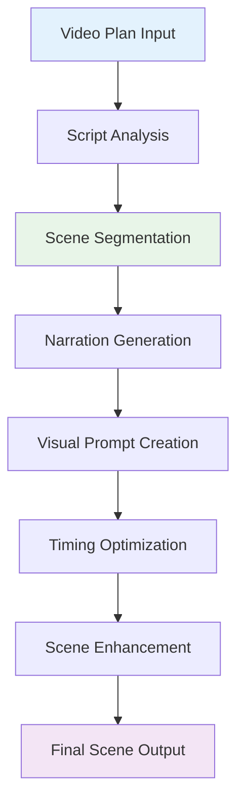
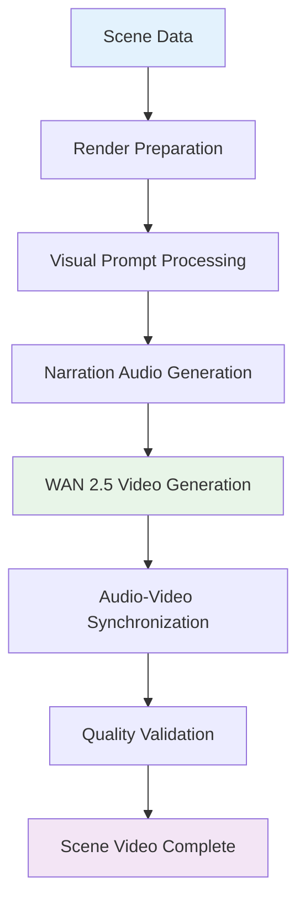

# YouTube Studio Scene Building Guide

Comprehensive guide to ALwrity's intelligent scene building technology that transforms video plans into structured, optimized video scenes with professional timing and visual planning.

## Overview

Scene Building is the core technology that converts your video plan into a structured sequence of video scenes, each optimized for engagement, timing, and visual impact. Using advanced AI, it automatically segments scripts, generates narration, and creates visual prompts for professional video production.

## How Scene Building Works

### The Scene Building Pipeline



### 1. Script Analysis & Segmentation

**Intelligent Script Parsing:**
```python
class ScriptAnalyzer:
    async def analyze_and_segment_script(
        self,
        script_text: str,
        video_duration: int,
        emphasis_tags: List[str] = None
    ) -> ScriptAnalysis:

        # Parse emphasis tags (hook, main_content, cta)
        parsed_script = await self._parse_emphasis_tags(script_text, emphasis_tags)

        # Analyze content structure and flow
        content_structure = await self._analyze_content_structure(parsed_script)

        # Calculate optimal scene breaks
        scene_breaks = await self._calculate_scene_breaks(
            content_structure, video_duration
        )

        # Generate scene segments
        scenes = await self._generate_scene_segments(
            parsed_script, scene_breaks, content_structure
        )

        return ScriptAnalysis(
            scenes=scenes,
            total_scenes=len(scenes),
            average_scene_length=sum(s.duration for s in scenes) / len(scenes),
            content_flow_score=await self._calculate_flow_score(scenes)
        )
```

**Emphasis Tag System:**
- **`<hook>`**: Opening content that grabs attention (first 5-10 seconds)
- **`<main_content>`**: Core message and value delivery
- **`<cta>`**: Call-to-action and next steps
- **`<transition>`**: Smooth connections between scenes

### 2. Narration Generation

**AI-Powered Voice-Over Script Creation:**
```python
class NarrationGenerator:
    async def generate_scene_narration(
        self,
        scene_content: str,
        scene_type: str,
        target_duration: int,
        voice_profile: VoiceProfile
    ) -> SceneNarration:

        # Analyze content for optimal pacing
        pacing_analysis = await self._analyze_content_pacing(scene_content)

        # Generate natural narration script
        narration_script = await self._generate_natural_script(
            scene_content, pacing_analysis, voice_profile
        )

        # Optimize for target duration
        optimized_script = await self._optimize_for_duration(
            narration_script, target_duration, voice_profile.speaking_rate
        )

        # Add emotional cues and emphasis
        enhanced_script = await self._add_emotional_cues(
            optimized_script, scene_type
        )

        return SceneNarration(
            script=enhanced_script,
            estimated_duration=self._calculate_duration(enhanced_script, voice_profile),
            word_count=len(enhanced_script.split()),
            pacing_profile=pacing_analysis
        )
```

### 3. Visual Prompt Enhancement

**Detailed Visual Description Generation:**
```python
class VisualPromptGenerator:
    async def generate_visual_prompts(
        self,
        scene_content: str,
        narration_script: str,
        scene_type: str,
        style_preferences: Dict[str, Any]
    ) -> VisualPrompt:

        # Extract key visual elements from content
        visual_elements = await self._extract_visual_elements(scene_content)

        # Analyze narration for visual cues
        narration_cues = await self._analyze_narration_visuals(narration_script)

        # Generate comprehensive visual prompt
        detailed_prompt = await self._create_detailed_prompt(
            visual_elements, narration_cues, scene_type, style_preferences
        )

        # Optimize for video generation AI
        optimized_prompt = await self._optimize_for_video_ai(detailed_prompt)

        return VisualPrompt(
            primary_prompt=optimized_prompt,
            visual_elements=visual_elements,
            style_modifiers=style_preferences,
            estimated_complexity=self._calculate_complexity_score(optimized_prompt)
        )
```

## Scene Types & Optimization

### Hook Scenes (Opening 5-10 seconds)

**Critical First Impression:**
```json
{
  "scene_type": "hook",
  "optimization_goals": {
    "attention_grab": "Maximum immediate engagement",
    "brand_introduction": "Establish creator identity",
    "value_preview": "Hint at content value"
  },
  "timing_constraints": {
    "minimum_duration": 3,
    "maximum_duration": 10,
    "ideal_duration": 7
  },
  "visual_priorities": {
    "high_contrast": true,
    "dynamic_movement": true,
    "text_overlay": "Minimal, high-impact"
  }
}
```

**Hook Scene Best Practices:**
- Start with surprising fact, question, or bold statement
- Include creator's face/energy for personal connection
- Use high-energy music and fast-paced visuals
- End with clear transition to main content

### Main Content Scenes

**Value Delivery Core:**
```json
{
  "scene_type": "main_content",
  "optimization_goals": {
    "information_delivery": "Clear, digestible content chunks",
    "engagement_maintenance": "Sustained viewer attention",
    "learning_optimization": "Optimal information absorption"
  },
  "content_structure": {
    "chunk_size": "15-30 second segments",
    "transition_frequency": "Every 45-60 seconds",
    "visual_variety": "Mix of b-roll, graphics, and presenter"
  }
}
```

### Call-to-Action Scenes

**Conversion Optimization:**
```json
{
  "scene_type": "cta",
  "optimization_goals": {
    "action_motivation": "Clear desired next steps",
    "urgency_creation": "Encourage immediate action",
    "value_reminder": "Reinforce content benefits"
  },
  "cta_elements": {
    "primary_action": "Subscribe, like, comment, or share",
    "secondary_actions": "Related content or channel links",
    "social_proof": "Include engagement prompts"
  }
}
```

## Advanced Scene Building Features

### Batch Scene Optimization

**Efficiency Through Intelligence:**
```python
class BatchSceneOptimizer:
    async def optimize_scene_batch(
        self,
        scenes: List[Scene],
        optimization_goals: Dict[str, Any]
    ) -> OptimizedSceneBatch:

        # Analyze scene relationships
        scene_relationships = await self._analyze_scene_relationships(scenes)

        # Identify optimization opportunities
        optimization_opportunities = await self._identify_optimizations(
            scenes, scene_relationships, optimization_goals
        )

        # Apply intelligent batching
        batched_scenes = await self._apply_batch_optimizations(
            scenes, optimization_opportunities
        )

        # Calculate efficiency gains
        efficiency_metrics = await self._calculate_efficiency_gains(
            scenes, batched_scenes
        )

        return OptimizedSceneBatch(
            scenes=batched_scenes,
            efficiency_metrics=efficiency_metrics,
            optimization_applied=len(optimization_opportunities),
            estimated_time_savings=efficiency_metrics.time_saved
        )
```

### Scene Timing Intelligence

**Perfect Pacing Algorithm:**
```python
class SceneTimingOptimizer:
    async def optimize_scene_timing(
        self,
        scenes: List[Scene],
        total_target_duration: int,
        content_type: str
    ) -> TimedSceneSequence:

        # Analyze content density
        content_density = await self._analyze_content_density(scenes)

        # Calculate optimal scene durations
        optimal_durations = await self._calculate_optimal_durations(
            scenes, total_target_duration, content_density
        )

        # Apply attention curve optimization
        attention_optimized = await self._apply_attention_curve(
            optimal_durations, content_type
        )

        # Validate total duration
        final_timing = await self._validate_total_duration(
            attention_optimized, total_target_duration
        )

        return TimedSceneSequence(
            scenes=scenes,
            timing=final_timing,
            attention_curve=await self._generate_attention_curve(final_timing),
            pacing_score=await self._calculate_pacing_score(final_timing)
        )
```

## Scene Editing Interface

### Interactive Scene Management

**Real-Time Scene Editing:**
```
┌─────────────────────────────────────────────────┐
│ YouTube Creator - Scene Building                │
├─────────────────────────────────────────────────┤
│ Scene 1/5: Hook Scene (0:00-0:07)               │
│ ┌─────────────────────────────────────────────┐ │
│ │ [🎬] Scene Preview                          │ │
│ │                                             │ │
│ │ [Edit Script] [Regenerate Visual] [Timing]  │ │
│ └─────────────────────────────────────────────┘ │
│                                                 │
│ Script: "Did you know that 90% of startups..."   │
│ Visual: "Dynamic startup graphics, energetic"   │
│                                                 │
│ [◀ Previous] [Save Changes] [Next Scene ▶]      │
├─────────────────────────────────────────────────┤
│ Bulk Actions: [Regenerate All] [Optimize Timing]│
│ [Enable/Disable Scenes] [Batch Visual Update]   │
└─────────────────────────────────────────────────┘
```

### Scene Control Options

**Individual Scene Controls:**
- **Enable/Disable**: Include or exclude scenes from final video
- **Regenerate Content**: Re-create script, visuals, or narration
- **Timing Adjustment**: Modify scene duration and placement
- **Visual Customization**: Override AI-generated visual prompts
- **Narration Editing**: Modify or replace generated narration

**Bulk Operations:**
- **Batch Regenerate**: Re-create multiple scenes simultaneously
- **Timing Optimization**: Automatically adjust all scene timings
- **Visual Style Update**: Apply new visual style across all scenes
- **Narration Voice Change**: Update voice across all scenes

## Quality Assurance & Validation

### Scene Quality Validation

**Automated Quality Checks:**
```python
class SceneQualityValidator:
    async def validate_scene_quality(
        self,
        scene: Scene,
        quality_standards: Dict[str, Any]
    ) -> QualityValidation:

        # Content quality assessment
        content_score = await self._assess_content_quality(scene.script)

        # Visual quality evaluation
        visual_score = await self._evaluate_visual_quality(scene.visual_prompt)

        # Narration quality analysis
        narration_score = await self._analyze_narration_quality(scene.narration)

        # Timing appropriateness check
        timing_score = await self._validate_timing_appropriateness(scene.timing)

        # Overall quality calculation
        overall_score = self._calculate_overall_score([
            content_score, visual_score, narration_score, timing_score
        ])

        return QualityValidation(
            overall_score=overall_score,
            component_scores={
                'content': content_score,
                'visual': visual_score,
                'narration': narration_score,
                'timing': timing_score
            },
            quality_issues=self._identify_quality_issues(scene),
            improvement_suggestions=self._generate_suggestions(scene),
            meets_standards=overall_score >= quality_standards.minimum_score
        )
```

### Performance Prediction

**Scene-Level Engagement Forecasting:**
```python
class ScenePerformancePredictor:
    async def predict_scene_performance(
        self,
        scene: Scene,
        target_audience: AudienceProfile,
        platform_context: str = "youtube"
    ) -> ScenePerformancePrediction:

        # Analyze scene engagement potential
        engagement_potential = await self._analyze_engagement_potential(
            scene, target_audience
        )

        # Predict attention retention
        attention_curve = await self._predict_attention_curve(scene)

        # Calculate completion likelihood
        completion_probability = await self._calculate_completion_probability(
            attention_curve, scene.timing
        )

        # Estimate social sharing potential
        sharing_potential = await self._estimate_sharing_potential(scene)

        return ScenePerformancePrediction(
            engagement_potential=engagement_potential,
            attention_curve=attention_curve,
            completion_probability=completion_probability,
            sharing_potential=sharing_potential,
            optimization_score=self._calculate_optimization_score(scene),
            improvement_recommendations=self._generate_improvements(scene)
        )
```

## Integration with Video Rendering

### Seamless Hand-off to WAN 2.5

**Scene-to-Video Pipeline:**


### Cost Optimization in Scene Building

**Intelligent Batching Strategy:**
```json
{
  "batching_optimization": {
    "scene_similarity_analysis": "Groups similar scenes for batch processing",
    "visual_prompt_consolidation": "Reuses common visual elements",
    "narration_batch_generation": "Generates multiple narrations simultaneously",
    "cost_reduction_metrics": {
      "api_calls_saved": "30-50%",
      "processing_time_reduced": "40-60%",
      "quality_maintained": "95%+"
    }
  }
}
```

## Best Practices

### Scene Building Optimization

1. **Content-First Approach**: Focus on compelling content before visual optimization
2. **Attention Curve Awareness**: Structure scenes to maintain viewer engagement
3. **Visual-Content Alignment**: Ensure visuals directly support and enhance content
4. **Timing Precision**: Optimize scene lengths for content type and audience
5. **Quality Iteration**: Use quality validation to iteratively improve scenes

### Technical Considerations

1. **Prompt Engineering**: Craft detailed, specific visual prompts for best results
2. **Narration Timing**: Match narration length to visual content pacing
3. **Transition Planning**: Design smooth transitions between scenes
4. **Platform Optimization**: Adapt scenes for target platform requirements
5. **Performance Monitoring**: Track scene performance to refine future creations

### Workflow Efficiency

1. **Template Utilization**: Start with proven scene structures and customize
2. **Batch Operations**: Use bulk operations for similar scene types
3. **Quality Gates**: Implement validation checkpoints before rendering
4. **Version Control**: Track scene iterations and improvements
5. **Collaboration**: Share scene reviews and feedback loops

---

[:octicons-arrow-right-24: Back to Overview](overview.md)
[:octicons-arrow-right-24: Planning Guide](planning-guide.md)
[:octicons-arrow-right-24: Video Generation](video-generation.md)