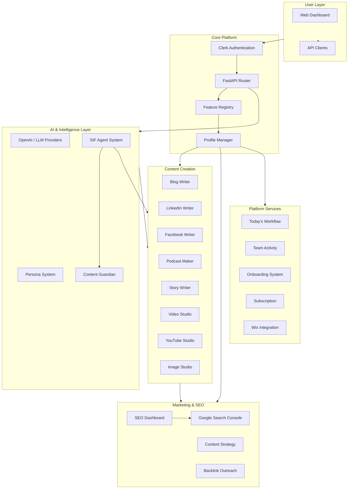
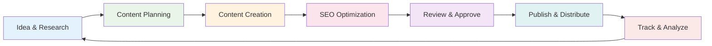

# Welcome to ALwrity Documentation

ALwrity is an AI-powered digital marketing platform that revolutionizes content creation and SEO optimization. This documentation covers everything from quick start guides to detailed API references.

## Platform Architecture

## Content Workflow

## Feature Overview

-   :material-rocket-launch:{ .lg .middle } **Getting Started**

    ---

    Set up ALwrity and create your first content

    [:octicons-arrow-right-24: Quick Start](getting-started/quick-start.md)
    [:octicons-arrow-right-24: Installation](getting-started/installation.md)
    [:octicons-arrow-right-24: Configuration](getting-started/configuration.md)

-   :material-pencil:{ .lg .middle } **Blog Writer**

    ---

    AI-powered blog post creation with SEO analysis

    [:octicons-arrow-right-24: Overview](features/blog-writer/overview.md)
    [:octicons-arrow-right-24: Workflow Guide](features/blog-writer/workflow-guide.md)

-   :material-linkedin:{ .lg .middle } **LinkedIn Writer**

    ---

    Professional LinkedIn content creation

    [:octicons-arrow-right-24: Overview](features/linkedin-writer/overview.md)

-   :material-facebook:{ .lg .middle } **Facebook Writer**

    ---

    Engaging Facebook post generation

    [:octicons-arrow-right-24: Overview](features/blog-writer/overview.md)

-   :material-microphone:{ .lg .middle } **Podcast Maker**

    ---

    AI-powered podcast creation and publishing

    [:octicons-arrow-right-24: Overview](features/podcast-maker/workflow-guide.md)

-   :material-book-open-variant:{ .lg .middle } **Story Writer**

    ---

    Brand storytelling and case study builder

    [:octicons-arrow-right-24: Overview](features/story-writer/overview.md)

-   :material-video:{ .lg .middle } **Video Studio**

    ---

    AI video creation and editing platform

    [:octicons-arrow-right-24: Overview](features/video-studio/overview.md)

-   :material-youtube:{ .lg .middle } **YouTube Studio**

    ---

    YouTube content optimization and channel management

    [:octicons-arrow-right-24: Overview](features/youtube-studio/overview.md)

-   :material-image:{ .lg .middle } **Image Studio**

    ---

    AI image creation, editing, and optimization

    [:octicons-arrow-right-24: Overview](features/image-studio/overview.md)
    [:octicons-arrow-right-24: Modules](features/image-studio/modules.md)

-   :material-chart-line:{ .lg .middle } **SEO Dashboard**

    ---

    Comprehensive SEO analysis and optimization

    [:octicons-arrow-right-24: Overview](features/seo-dashboard/overview.md)
    [:octicons-arrow-right-24: Quick Start](features/seo-dashboard/quick-start.md)

-   :material-link:{ .lg .middle } **Backlink Outreach**

    ---

    AI-powered backlink discovery and outreach

    [:octicons-arrow-right-24: Overview](features/backlink-outreach/overview.md)
    [:octicons-arrow-right-24: Workflow Guide](features/backlink-outreach/workflow-guide.md)

-   :material-account:{ .lg .middle } **Persona System**

    ---

    AI-powered personalized writing assistants

    [:octicons-arrow-right-24: Overview](features/persona/overview.md)

-   :material-target:{ .lg .middle } **Content Strategy**

    ---

    AI-driven persona development and planning

    [:octicons-arrow-right-24: Overview](features/content-strategy/overview.md)

-   :material-robot:{ .lg .middle } **SIF & AI Agents**

    ---

    Intelligent agent system for content quality

    [:octicons-arrow-right-24: Overview](features/sif-agents/overview.md)

-   :material-calendar:{ .lg .middle } **Today's Workflow**

    ---

    Daily content operations and task management

    [:octicons-arrow-right-24: Overview](features/todays-workflow/overview.md)

-   :material-account-group:{ .lg .middle } **User Journeys**

    ---

    Role-based guides for different user types

    [:octicons-arrow-right-24: Choose Your Journey](user-journeys/overview.md)

-   :material-api:{ .lg .middle } **API Reference**

    ---

    Complete API documentation and authentication

    [:octicons-arrow-right-24: API Overview](api/overview.md)

-   :material-widgets:{ .lg .middle } **Integrations**

    ---

    Platform integrations including Wix

    [:octicons-arrow-right-24: Wix Integration](features/integrations/wix/overview.md)

-   :material-currency-usd:{ .lg .middle } **Subscription**

    ---

    Plans, pricing, and billing

    [:octicons-arrow-right-24: Overview](features/subscription/overview.md)

## Quick Links

| Category | Links |
|---|---|
| **Getting Started** | [Installation](getting-started/installation.md) · [Configuration](getting-started/configuration.md) · [First Steps](getting-started/first-steps.md) |
| **Content Creation** | [Blog Writer](features/blog-writer/overview.md) · [LinkedIn Writer](features/linkedin-writer/overview.md) · [Podcast Maker](features/podcast-maker/workflow-guide.md) · [Story Writer](features/story-writer/overview.md) |
| **Media Production** | [Image Studio](features/image-studio/overview.md) · [Video Studio](features/video-studio/overview.md) · [YouTube Studio](features/youtube-studio/overview.md) |
| **SEO & Marketing** | [SEO Dashboard](features/seo-dashboard/overview.md) · [Backlink Outreach](features/backlink-outreach/overview.md) · [Content Strategy](features/content-strategy/overview.md) |
| **Platform** | [Today's Workflow](features/todays-workflow/overview.md) · [AI Agents](features/sif-agents/overview.md) · [Persona System](features/persona/overview.md) |
| **Reference** | [API](api/overview.md) · [Troubleshooting](guides/troubleshooting.md) · [Best Practices](guides/best-practices.md) |

---

*Ready to transform your content creation workflow? Start with our [Quick Start Guide](getting-started/quick-start.md) or [learn more about ALwrity](about.md).*
