# User Journey Overview

Welcome to ALwrity! This guide helps you find the perfect path based on your role, experience level, and goals. Choose your user type below to get started with a personalized journey designed specifically for you.

## 🎯 Choose Your User Type

-   :material-account-edit:{ .lg .middle } **Non-Tech Content Creators**

    ---

    Bloggers, writers, small business owners, and freelancers who want to create quality content without technical complexity.

    [:octicons-arrow-right-24: Start Your Journey](non-tech-creators/overview.md)

-   :material-code-tags:{ .lg .middle } **Developers**

    ---

    Software developers, technical writers, and dev teams who need API access, customization, and integration capabilities.

    [:octicons-arrow-right-24: Start Your Journey](developers/overview.md)

-   :material-chart-line:{ .lg .middle } **Tech Marketers**

    ---

    Marketing professionals in tech companies, growth hackers, and digital marketers who need data-driven insights and performance tracking.

    [:octicons-arrow-right-24: Start Your Journey](tech-marketers/overview.md)

-   :material-rocket-launch:{ .lg .middle } **Solopreneurs**

    ---

    Individual entrepreneurs, consultants, coaches, and course creators who need to build their personal brand and grow their audience.

    [:octicons-arrow-right-24: Start Your Journey](solopreneurs/overview.md)

-   :material-account-group:{ .lg .middle } **Content Teams**

    ---

    Marketing teams, content agencies, and editorial teams who need collaboration features and workflow management.

    [:octicons-arrow-right-24: Start Your Journey](content-teams/overview.md)

-   :material-domain:{ .lg .middle } **Enterprise Users**

    ---

    Large organizations, enterprise marketing teams, and C-suite executives who need enterprise-grade solutions and compliance.

    [:octicons-arrow-right-24: Start Your Journey](enterprise/overview.md)

## 🗺️ ALwrity Ecosystem Overview

```mermaid
graph TB
    subgraph "🤖 AI-Powered Core"
        COPILOT[ALwrity Copilot<br/>Conversational AI Assistant]
        STORY[Story Writer<br/>AI Storytelling Platform]
        VIDEO[Video Studio<br/>AI Video Creation Suite]
    end

    subgraph "📝 Content Creation"
        BLOG[Blog Writer<br/>SEO-Optimized Blog Posts]
        LINKEDIN[LinkedIn Writer<br/>Professional Social Content]
        FACEBOOK[Facebook Writer<br/>Engaging Social Posts]
    end

    subgraph "🎨 Media & Visuals"
        IMAGE[Image Studio<br/>AI Image Generation & Editing]
        TRANSFORM[Transform Studio<br/>Video & Image Transformation]
    end

    subgraph "📊 Strategy & Analytics"
        STRATEGY[Content Strategy<br/>AI-Driven Planning]
        SEO[SEO Dashboard<br/>Performance Analytics]
        CALENDAR[Content Calendar<br/>Automated Scheduling]
    end

    COPILOT --> BLOG
    COPILOT --> STORY
    COPILOT --> VIDEO
    COPILOT --> SEO
    COPILOT --> STRATEGY

    BLOG --> CALENDAR
    VIDEO --> IMAGE
    STORY --> STRATEGY
    IMAGE --> TRANSFORM

    style COPILOT fill:#e3f2fd
    style STORY fill:#f3e5f5
    style VIDEO fill:#e8f5e8
    style BLOG fill:#fff3e0
    style IMAGE fill:#fce4ec
```

## 🗺️ User Journey Map

```mermaid
graph TB
    subgraph "User Discovery"
        A[Find ALwrity] --> B[Choose User Type]
        B --> C[Start Personalized Journey]
    end

    subgraph "Onboarding Phase"
        D[Quick Setup] --> E[Enable Copilot]
        E --> F[Create First Content]
        F --> G[See AI Magic ✨]
    end

    subgraph "Growth Phase"
        H[Explore Features] --> I[Master Video Studio]
        I --> J[Try Story Writer]
        J --> K[Optimize Workflows]
        K --> L[Scale Operations]
    end

    subgraph "Mastery Phase"
        M[Advanced AI Features] --> N[Custom Copilot]
        N --> O[Enterprise Solutions]
        O --> P[Community Leadership]
    end

    C --> D
    G --> H
    L --> M

    style A fill:#e1f5fe
    style D fill:#e8f5e8
    style H fill:#fff3e0
    style M fill:#f3e5f5
```

## 📊 User Type Comparison

| User Type | Primary Goal | Key Features | Tech Comfort | Time Investment |
|-----------|--------------|--------------|--------------|--------------|-----------------|
| **Non-Tech Content Creators** | Create quality content easily | ALwrity Copilot, Instagram Editor, Story Writer, YouTube Studio, guided workflows | Low-Medium | 30 min setup |
| **Developers** | Integrate and customize | APIs, webhooks, SDKs, Copilot integration, Video Studio APIs, Researcher APIs | High | 2-4 hours setup |
| **Tech Marketers** | Optimize performance | Analytics, Video Studio, Podcast Maker, Content Calendar, YouTube Studio, ROI tracking | Medium-High | 1-2 hours setup |
| **Solopreneurs** | Build personal brand | Persona system, automation, Instagram Editor, WaveSpeed features, YouTube Studio | Medium | 45 min setup |
| **Content Teams** | Collaborate efficiently | Team features, Copilot collaboration, Facebook Writer, Content Calendar, approval workflows | Medium-High | 1-3 hours setup |
| **Enterprise Users** | Scale securely | Enterprise features, compliance, custom Copilot, Podcast Maker, ALwrity Researcher | Mixed | 1-2 weeks setup |

## 🚀 Quick Start by User Type

### For Non-Tech Content Creators
1. **[Simple Setup](non-tech-creators/getting-started.md)** - 5-minute guided setup
2. **[Enable ALwrity Copilot](features/copilot/getting-started.md)** - Your AI content assistant
3. **[Create First Content](non-tech-creators/first-content.md)** - Your first blog post or story
4. **[Try Story Writer](features/story-writer/setup-guide.md)** - Create compelling narratives
5. **[Optimize Your Content](non-tech-creators/content-optimization.md)** - Improve quality and SEO

### For Developers
1. **[API Quickstart](developers/api-quickstart.md)** - Get started with APIs
2. **[Copilot Integration](features/copilot/overview.md)** - AI-powered development assistance
3. **[Video Studio APIs](features/video-studio/technical-specs.md)** - Video generation endpoints
4. **[Integration Guide](developers/integration-guide.md)** - Build custom integrations
5. **[Advanced Usage](developers/advanced-usage.md)** - Advanced API features

### For Tech Marketers
1. **[Strategy Setup](tech-marketers/strategy-setup.md)** - Plan your content strategy
2. **[Video Studio Overview](features/video-studio/overview.md)** - Professional video creation
3. **[Copilot for Marketing](features/copilot/overview.md)** - AI marketing assistance
4. **[Team Onboarding](tech-marketers/team-onboarding.md)** - Onboard your team
5. **[Analytics & ROI](tech-marketers/analytics.md)** - Track performance and ROI

### For Solopreneurs
1. **[Brand Strategy](solopreneurs/brand-strategy.md)** - Define your brand voice
2. **[Story Writer](features/story-writer/setup-guide.md)** - Create compelling brand stories
3. **[Video Studio](features/video-studio/create-studio.md)** - Professional video content
4. **[ALwrity Copilot](features/copilot/getting-started.md)** - Your AI business assistant
5. **[Content Production](solopreneurs/content-production.md)** - Create content efficiently
6. **[Audience Growth](solopreneurs/audience-growth.md)** - Grow your audience

### For Content Teams
1. **[Workflow Setup](content-teams/workflow-setup.md)** - Design your content workflow
2. **[ALwrity Copilot](features/copilot/overview.md)** - Team collaboration and AI assistance
3. **[Video Studio](features/video-studio/overview.md)** - Professional video production
4. **[Story Writer](features/story-writer/overview.md)** - Collaborative storytelling
5. **[Team Management](content-teams/team-management.md)** - Manage your team
6. **[Brand Consistency](content-teams/brand-consistency.md)** - Maintain brand standards

### For Enterprise Users
1. **[Enterprise Setup](enterprise/implementation.md)** - Enterprise implementation
2. **[Copilot Enterprise](features/copilot/overview.md)** - Custom AI assistants for teams
3. **[Video Studio Enterprise](features/video-studio/overview.md)** - Scalable video production
4. **[Security & Compliance](enterprise/security-compliance.md)** - Security and compliance
5. **[Analytics & Reporting](enterprise/analytics.md)** - Enterprise analytics
6. **[Custom Integrations](enterprise/custom-solutions.md)** - Tailored enterprise solutions

## 🎯 Success Metrics by User Type

### Non-Tech Content Creators
- **Time to First Content**: Faster content creation with AI assistance
- **Content Quality**: Enhanced quality through AI-powered optimization
- **Multi-Platform Support**: Create content for various social platforms
- **Guided Workflows**: Step-by-step assistance for all content types

### Developers
- **API Integration**: Comprehensive REST API access
- **Copilot Integration**: AI-powered development assistance
- **Video Studio APIs**: Video generation and processing endpoints
- **Advanced AI Features**: Access to cutting-edge AI capabilities
- **Documentation**: Complete technical documentation and guides

### Tech Marketers
- **Video Content Creation**: Professional video production tools
- **Multi-Platform Publishing**: Distribute content across platforms
- **Analytics Integration**: Performance tracking and optimization
- **Team Collaboration**: Enhanced team workflows and productivity

### Solopreneurs
- **Content Variety**: Multiple content formats and types
- **AI-Powered Creation**: Automated content generation and optimization
- **Brand Consistency**: Maintain consistent branding across content
- **Audience Engagement**: Tools to increase audience interaction

### Content Teams
- **Collaborative Workflows**: Team-based content creation and review
- **Brand Consistency**: Unified brand standards across all content
- **Workflow Efficiency**: Streamlined content production processes
- **Quality Assurance**: Built-in quality checks and approvals

### Enterprise Users
- **Scalable Solutions**: Enterprise-grade content production capacity
- **Security & Compliance**: Enterprise security and governance features
- **Custom Integrations**: Tailored solutions for large organizations
- **Advanced Analytics**: Comprehensive reporting and insights

## 🔄 Journey Progression

## 🆘 Need Help Choosing?

### Quick Assessment Questions

**1. What's your primary goal with ALwrity?**
- **A)** Create content easily without technical complexity → [Non-Tech Content Creators](non-tech-creators/overview.md)
- **B)** Integrate ALwrity into existing systems → [Developers](developers/overview.md)
- **C)** Optimize content performance and track ROI → [Tech Marketers](tech-marketers/overview.md)
- **D)** Build my personal brand and grow my audience → [Solopreneurs](solopreneurs/overview.md)
- **E)** Collaborate with a team on content creation → [Content Teams](content-teams/overview.md)
- **F)** Implement enterprise-grade solutions → [Enterprise Users](enterprise/overview.md)

**2. What's your technical comfort level?**
- **Low-Medium**: [Non-Tech Content Creators](non-tech-creators/overview.md) or [Solopreneurs](solopreneurs/overview.md)
- **Medium-High**: [Tech Marketers](tech-marketers/overview.md) or [Content Teams](content-teams/overview.md)
- **High**: [Developers](developers/overview.md)
- **Mixed (decision makers vs. users)**: [Enterprise Users](enterprise/overview.md)

**3. How much time can you invest in setup?**
- **< 1 hour**: [Non-Tech Content Creators](non-tech-creators/overview.md) or [Solopreneurs](solopreneurs/overview.md)
- **1-4 hours**: [Tech Marketers](tech-marketers/overview.md) or [Content Teams](content-teams/overview.md)
- **4+ hours**: [Developers](developers/overview.md)
- **1-2 weeks**: [Enterprise Users](enterprise/overview.md)

## 🎉 Ready to Start?

Choose your user type above and begin your personalized ALwrity journey. Each path is designed to help you achieve your specific goals with the right level of technical detail and support.

---

*Not sure which path is right for you? [Contact our support team](https://github.com/AJaySi/ALwrity/discussions) for personalized guidance!*
