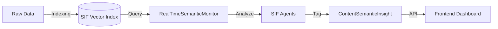

# SIF SEO Dashboard Insights

**Last Updated**: 2025-03-01
**Component**: Semantic Intelligence Dashboard (Frontend/Backend)

---

## 🔍 Overview

The **SEO Dashboard** is the user's window into the Semantic Intelligence Framework (SIF). It visualizes the data stored in the `txtai` vector index, translating complex semantic relationships into actionable marketing insights.

Unlike traditional SEO tools that rely on keyword volume, SIF analyzes **topical authority** and **semantic distance**.

---

## 🏗️ Data Flow

---

## 📊 Key Insight Modules

### 1. Semantic Health Score
*   **What it is**: A 0-100 score representing how well the user's content covers their target niche compared to competitors.
*   **Calculation**:
    *   `Topic Coverage`: % of core industry topics present in user index.
    *   `Content Freshness`: Recency of indexed documents.
    *   `Competitor Overlap`: Semantic similarity score vs. top competitors.

### 2. Content Pillars (The Strategy)
*   **Visual**: Cards showing core themes (e.g., "AI Marketing", "SEO Tools").
*   **Agent**: **Strategy Architect**.
*   **Logic**:
    1.  `txtai` clusters all user content.
    2.  Clusters with >5 documents become "Pillars".
    3.  Relevance score is calculated based on cluster density.

### 3. Semantic Gaps (The Opportunity)
*   **Visual**: Accordion list of missing topics.
*   **Agent**: **Content Strategist**.
*   **Logic**:
    1.  Compare User Vector Space vs. Competitor Vector Space.
    2.  Identify dense clusters in Competitor space that are empty in User space.
    3.  Flag these as "Gaps" (e.g., "Competitors write about 'Voice Search', you don't").

### 4. AI Insights (The Action)
*   **Visual**: A feed of prioritized recommendations.
*   **Agents involved**: All.
*   **Types**:
    *   **Trend**: "Interest in 'Vector Database' is rising." (Source: Content Strategist)
    *   **Optimization**: "Low CTR on 'Pricing' page." (Source: SEO Specialist)
    *   **Threat**: "Competitor X launched a new guide." (Source: Competitor Analyst)

---

## 🕵️ Agent Attribution

To build trust, every insight in the dashboard is attributed to a specific AI agent:

*   **"Identified by Strategy Architect"**: Found a structural issue.
*   **"Spotted by Content Strategist"**: Found a creative opportunity.
*   **"Flagged by SEO Specialist"**: Found a technical error.

This connects the dashboard back to the "Team" concept introduced during onboarding.

---

## 🔄 Real-Time Monitoring

The `RealTimeSemanticMonitor` service runs periodically (default: daily or on-demand).
1.  **Polls SIF**: Checks for new indexed documents.
2.  **Runs Agents**: Executes agent logic against the fresh index.
3.  **Generates Alerts**: If a critical threshold is breached (e.g., Health < 50%), it sends a system notification.
