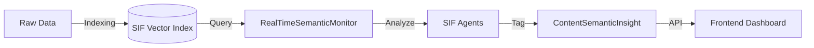

# SIF SEO Dashboard Insights

**Last Updated**: 2025-03-01
**Component**: Semantic Intelligence Dashboard (Frontend/Backend)

---

## 🔍 Overview

The **SEO Dashboard** is the user's window into the Semantic Intelligence Framework (SIF). It visualizes the data stored in the `txtai` vector index, translating complex semantic relationships into actionable marketing insights.

Unlike traditional SEO tools that rely on keyword volume, SIF analyzes **topical authority** and **semantic distance**.

---

## 🏗️ Data Flow

---

## 📊 Key Insight Modules

### 1. Semantic Health Score
*   **What it is**: A 0-100 score representing how well the user's content covers their target niche compared to competitors.
*   **Calculation**:
    *   `Topic Coverage`: % of core industry topics present in user index.
    *   `Content Freshness`: Recency of indexed documents.
    *   `Competitor Overlap`: Semantic similarity score vs. top competitors.

### 2. Content Pillars (The Strategy)
*   **Visual**: Cards showing core themes (e.g., "AI Marketing", "SEO Tools").
*   **Agent**: **Strategy Architect**.
*   **Logic**:
    1.  `txtai` clusters all user content.
    2.  Clusters with >5 documents become "Pillars".
    3.  Relevance score is calculated based on cluster density.

### 3. Semantic Gaps (The Opportunity)
*   **Visual**: Accordion list of missing topics.
*   **Agent**: **Content Strategist**.
*   **Logic**:
    1.  Compare User Vector Space vs. Competitor Vector Space.
    2.  Identify dense clusters in Competitor space that are empty in User space.
    3.  Flag these as "Gaps" (e.g., "Competitors write about 'Voice Search', you don't").

### 4. AI Insights (The Action)
*   **Visual**: A feed of prioritized recommendations.
*   **Agents involved**: All.
*   **Types**:
    *   **Trend**: "Interest in 'Vector Database' is rising." (Source: Content Strategist)
    *   **Optimization**: "Low CTR on 'Pricing' page." (Source: SEO Specialist)
    *   **Threat**: "Competitor X launched a new guide." (Source: Competitor Analyst)

---

## 🕵️ Agent Attribution

To build trust, every insight in the dashboard is attributed to a specific AI agent:

*   **"Identified by Strategy Architect"**: Found a structural issue.
*   **"Spotted by Content Strategist"**: Found a creative opportunity.
*   **"Flagged by SEO Specialist"**: Found a technical error.

This connects the dashboard back to the "Team" concept introduced during onboarding.

---

## 🔄 Real-Time Monitoring

The `RealTimeSemanticMonitor` service runs periodically (default: daily or on-demand).
1.  **Polls SIF**: Checks for new indexed documents.
2.  **Runs Agents**: Executes agent logic against the fresh index.
3.  **Generates Alerts**: If a critical threshold is breached (e.g., Health < 50%), it sends a system notification.

---

## 🤝 Team Huddle

The SEO Dashboard includes a dedicated **Team Huddle** stream that translates agent orchestration into a user-readable operational timeline.

### Data Contract
Each huddle item conforms to a normalized event envelope so the widget, activity page, and notification system render the same source of truth.

| Contract Block | Required Fields | Notes |
|---|---|---|
| `status` | `agent_id`, `state`, `started_at`, `last_heartbeat_at` | `state` enum: `idle`, `running`, `blocked`, `waiting_approval`, `degraded`. |
| `run` | `run_id`, `workflow_type`, `trigger`, `started_at`, `ended_at`, `duration_ms`, `outcome` | `trigger` enum: `scheduled`, `manual`, `event_driven`. |
| `event` | `event_id`, `run_id`, `agent_id`, `event_type`, `severity`, `summary`, `created_at` | `event_type` enum: `insight`, `task`, `system`, `handoff`. |
| `alert` | `alert_id`, `event_id`, `threshold_key`, `threshold_value`, `observed_value`, `created_at`, `is_acknowledged` | Used by in-product banners and digest notifications. |
| `approval` | `approval_id`, `run_id`, `action_label`, `requested_by`, `requested_at`, `expires_at`, `approval_state` | `approval_state` enum: `pending`, `approved`, `rejected`, `expired`. |

### Refresh + Stream Semantics
- **Initial load**: fetch the latest 50 Team Huddle rows for the active workspace.
- **Near real-time stream**: server-sent events (SSE) push deltas every 1-3 seconds when new events exist.
- **Polling fallback**: if SSE disconnects, poll every 15 seconds with `since=<last_event_timestamp>`.
- **Ordering rule**: sort by `created_at DESC`, break ties using monotonically increasing `event_id`.
- **Idempotency**: clients de-duplicate using `event_id` to prevent duplicate cards during reconnect.

### Latency Targets
- **P50 ingest-to-display**: <= 2 seconds for `status` and `event` updates.
- **P95 ingest-to-display**: <= 5 seconds under normal load.
- **Critical alerts**: banner render in <= 3 seconds P95 after alert creation.
- **Approval state changes**: reflected in UI in <= 2 seconds P95.

### Failure + Fallback Behavior
- If stream transport fails, show a non-blocking "Live updates paused" badge and automatically switch to polling.
- If both stream and polling fail, keep last known data, mark timestamp as stale, and expose a "Retry" action.
- If huddle payload validation fails, quarantine invalid records and render a generic "system event" row instead of crashing the feed.
- If agent status heartbeats are missing for >2 intervals, render agent as `degraded` with tooltip context.

### User-Visible Detail Tiers + Security Constraints
- **Tier 1 (Overview)**: summary text, agent name, timestamp, severity color.
- **Tier 2 (Operational)**: run metadata (`run_id`, trigger, duration, outcome), alert thresholds, approval state.
- **Tier 3 (Debug/Admin)**: correlation IDs, raw payload excerpt, retry metadata, trace IDs.
- Access controls:
  - Tier 1 is available to all workspace members.
  - Tier 2 requires analyst/editor role.
  - Tier 3 requires admin role and is excluded from exported reports by default.
- Sensitive fields (tokens, secrets, external auth headers, personal identifiers) must be redacted prior to persistence and never emitted in SSE payloads.

### Acceptance Criteria: View Full Team Activity
- "View Full Team Activity" opens a full-page activity timeline filtered to the currently selected date range and workspace.
- Expected row fields: `event_id`, `created_at`, `agent_id`, `event_type`, `severity`, `summary`, `run_id`, `workflow_type`, `outcome`, `approval_state` (if present), `alert_id` (if present).
- Interaction flow:
  1. User clicks **View Full Team Activity** from Team Huddle widget.
  2. System opens Activity page and preserves dashboard filters (date, agent, severity).
  3. User expands a row to view Tier 2 details; admins can toggle Tier 3 diagnostics.
  4. User can acknowledge alerts inline and approve/reject pending approvals where authorized.
  5. Returning to Dashboard restores previous scroll position and active widget tab.
- Empty state behavior: show "No team activity in this range" plus quick actions to clear filters or jump to last 24 hours.
