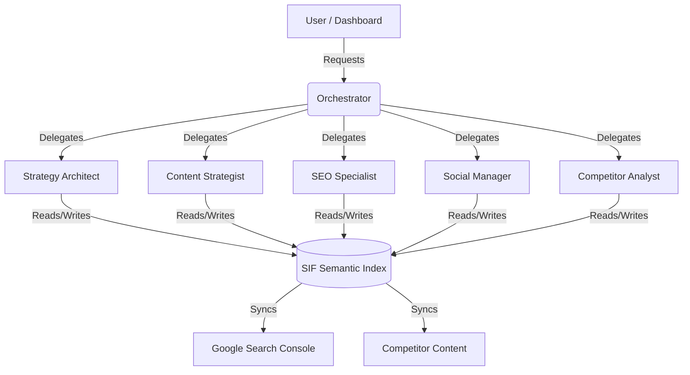

# SIF AI Agents Team - Architecture & Capabilities

**Last Updated**: 2025-03-01
**Component**: Semantic Intelligence Framework (SIF) Agents

---

## 🧠 Executive Summary

The **SIF Agents Team** is a multi-agent system built on top of the Semantic Intelligence Framework (SIF). Unlike generic AI assistants, these agents are "grounded" in a shared semantic index (`txtai`) containing the user's content, competitor data, and search console metrics.

Each agent acts as a specialized "Department Head," continuously monitoring the index to surface insights, propose tasks, and execute workflows autonomously.

---

## 🏗️ Architecture

### The "Committee" Model
Instead of a single "God Mode" AI, we use a committee of specialized agents orchestrated by a central Manager.



### Shared Brain (SIF Index)
All agents share the same memory (the SIF Index). 
- **Example**: If the *Competitor Analyst* indexes a new rival blog post, the *Content Strategist* immediately sees it as a "Content Gap" without needing a manual update.

---

## 🤖 The Agent Roster

### 1. Strategy Architect Agent (Lead)
*   **Role**: The "VP of Content." Responsible for high-level direction.
*   **Key Capabilities**:
    *   **Pillar Discovery**: Clusters content to find de-facto pillars.
    *   **Strategy Health**: Warns when content deviates from core goals.
    *   **Planning**: Proposes quarterly themes based on performance.
*   **SIF Integration**: Queries `txtai` for cluster density and topic coherence.

### 2. Content Strategist Agent (Creative)
*   **Role**: The "Editor-in-Chief." Focuses on what to write next.
*   **Key Capabilities**:
    *   **Gap Analysis**: Identifies topics competitors cover but you don't.
    *   **Trend Spotting**: Detects rising keywords in the industry.
    *   **Brief Generation**: Creates detailed outlines for writers.
*   **SIF Integration**: Compares user vector space vs. competitor vector space.

### 3. SEO Specialist Agent (Technical)
*   **Role**: The "Technical SEO." Ensures visibility and health.
*   **Key Capabilities**:
    *   **Rank Monitoring**: Watches SERP movements for key pages.
    *   **Health Checks**: Flags 404s, slow pages, or missing meta tags.
    *   **Opportunity Finding**: "Low hanging fruit" (e.g., high impression, low CTR).
*   **SIF Integration**: Analyzes GSC performance data mapped to content embeddings.

### 4. Social Manager Agent (Engagement)
*   **Role**: The "Social Media Manager." Handles distribution and community.
*   **Key Capabilities**:
    *   **Repurposing**: Turns blog posts into LinkedIn threads/Tweets.
    *   **Schedule Optimization**: Predicts best times to post.
    *   **Engagement**: Drafts replies to high-value comments.
*   **SIF Integration**: Matches social trends to existing content library.

### 5. Competitor Analyst Agent (Intelligence)
*   **Role**: The "Spy." Watches the market 24/7.
*   **Key Capabilities**:
    *   **Change Detection**: Alerts when a competitor updates their pricing or homepage.
    *   **Counter-Strategy**: Suggests moves to block competitor launches.
*   **SIF Integration**: Continuously indexes competitor sitemaps into the shared brain.

---

## 🛠️ Technical Implementation

### Base Agent Interface
All agents inherit from `BaseALwrityAgent` and implement standard methods:
```python
class SpecializedAgent(BaseALwrityAgent):
    async def propose_daily_tasks(self, context) -> List[TaskProposal]:
        # Domain specific logic
        pass

    async def analyze_sif_data(self, query) -> Dict[str, Any]:
        # Semantic search logic
        pass
```

### Task Proposal Protocol
Agents don't just "chat"; they submit structured `TaskProposal` objects:
- **Title**: Actionable name.
- **Priority**: High/Medium/Low.
- **Reasoning**: "Why?" (e.g., "Because competitor X did Y").
- **Source**: Agent Name (displayed in UI).

---

## 📊 UI Visibility

The agents are visible to the user in three key areas:
1.  **Team Huddle Widget**: Real-time status (Active/Thinking) in the Main Dashboard.
2.  **Today's Tasks**: Each task card shows the agent's badge and reasoning.
3.  **SEO Dashboard**: Insights are tagged with "Identified by [Agent Name]".

---

## 🚀 Future Roadmap

*   **Inter-Agent Chat**: Allow agents to debate strategy (e.g., SEO Agent vs. Creative Agent).
*   **Auto-Execution**: Allow agents to *perform* tasks (e.g., fix a broken link) with user approval.
*   **Voice Interface**: Daily standup meeting via voice.
