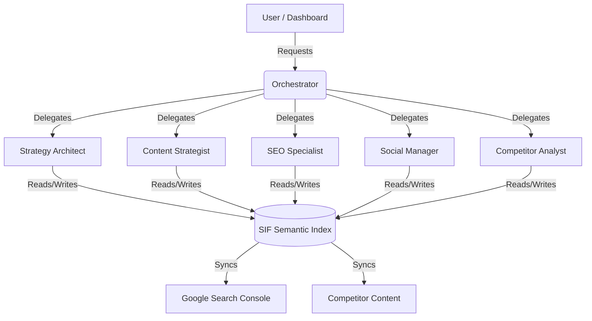

# SIF AI Agents Team - Architecture & Capabilities

**Last Updated**: 2025-03-01
**Component**: Semantic Intelligence Framework (SIF) Agents

---

## 🧠 Executive Summary

The **SIF Agents Team** is a multi-agent system built on top of the Semantic Intelligence Framework (SIF). Unlike generic AI assistants, these agents are "grounded" in a shared semantic index (`txtai`) containing the user's content, competitor data, and search console metrics.

Each agent acts as a specialized "Department Head," continuously monitoring the index to surface insights, propose tasks, and execute workflows autonomously.

---

## 🏗️ Architecture

### The "Committee" Model
Instead of a single "God Mode" AI, we use a committee of specialized agents orchestrated by a central Manager.



### Shared Brain (SIF Index)
All agents share the same memory (the SIF Index). 
- **Example**: If the *Competitor Analyst* indexes a new rival blog post, the *Content Strategist* immediately sees it as a "Content Gap" without needing a manual update.

---

## 🤖 The Agent Roster

### 1. Strategy Architect Agent (Lead)
*   **Role**: The "VP of Content." Responsible for high-level direction.
*   **Key Capabilities**:
    *   **Pillar Discovery**: Clusters content to find de-facto pillars.
    *   **Strategy Health**: Warns when content deviates from core goals.
    *   **Planning**: Proposes quarterly themes based on performance.
*   **SIF Integration**: Queries `txtai` for cluster density and topic coherence.

### 2. Content Strategist Agent (Creative)
*   **Role**: The "Editor-in-Chief." Focuses on what to write next.
*   **Key Capabilities**:
    *   **Gap Analysis**: Identifies topics competitors cover but you don't.
    *   **Trend Spotting**: Detects rising keywords in the industry.
    *   **Brief Generation**: Creates detailed outlines for writers.
*   **SIF Integration**: Compares user vector space vs. competitor vector space.

### 3. SEO Specialist Agent (Technical)
*   **Role**: The "Technical SEO." Ensures visibility and health.
*   **Key Capabilities**:
    *   **Rank Monitoring**: Watches SERP movements for key pages.
    *   **Health Checks**: Flags 404s, slow pages, or missing meta tags.
    *   **Opportunity Finding**: "Low hanging fruit" (e.g., high impression, low CTR).
*   **SIF Integration**: Analyzes GSC performance data mapped to content embeddings.

### 4. Social Manager Agent (Engagement)
*   **Role**: The "Social Media Manager." Handles distribution and community.
*   **Key Capabilities**:
    *   **Repurposing**: Turns blog posts into LinkedIn threads/Tweets.
    *   **Schedule Optimization**: Predicts best times to post.
    *   **Engagement**: Drafts replies to high-value comments.
*   **SIF Integration**: Matches social trends to existing content library.

### 5. Competitor Analyst Agent (Intelligence)
*   **Role**: The "Spy." Watches the market 24/7.
*   **Key Capabilities**:
    *   **Change Detection**: Alerts when a competitor updates their pricing or homepage.
    *   **Counter-Strategy**: Suggests moves to block competitor launches.
*   **SIF Integration**: Continuously indexes competitor sitemaps into the shared brain.

---

## 🛠️ Technical Implementation

### Base Agent Interface
All agents inherit from `BaseALwrityAgent` and implement standard methods:
```python
class SpecializedAgent(BaseALwrityAgent):
    async def propose_daily_tasks(self, context) -> List[TaskProposal]:
        # Domain specific logic
        pass

    async def analyze_sif_data(self, query) -> Dict[str, Any]:
        # Semantic search logic
        pass
```

### Task Proposal Protocol
Agents don't just "chat"; they submit structured `TaskProposal` objects:
- **Title**: Actionable name.
- **Priority**: High/Medium/Low.
- **Reasoning**: "Why?" (e.g., "Because competitor X did Y").
- **Source**: Agent Name (displayed in UI).

---

## 📊 UI Visibility

The agents are visible to the user in three key areas:
1.  **Team Huddle Widget**: Real-time status (Active/Thinking) in the Main Dashboard.
2.  **Today's Tasks**: Each task card shows the agent's badge and reasoning.
3.  **SEO Dashboard**: Insights are tagged with "Identified by [Agent Name]".

---

## 🤝 Team Huddle (System Contract)

The Team Huddle is the canonical operational surface for multi-agent coordination. It must stay consistent across dashboard widget, notifications, and the full activity view.

### Event/Data Contract
All orchestration updates are emitted as typed records under a shared schema:

- **`status`**
  - `agent_id`, `state`, `started_at`, `last_heartbeat_at`, `run_id?`
  - State enum: `idle`, `running`, `blocked`, `waiting_approval`, `degraded`.
- **`run`**
  - `run_id`, `workflow_type`, `trigger`, `started_at`, `ended_at`, `duration_ms`, `outcome`
  - Trigger enum: `scheduled`, `manual`, `event_driven`.
- **`event`**
  - `event_id`, `run_id`, `agent_id`, `event_type`, `severity`, `summary`, `created_at`, `metadata`
  - Event type enum: `insight`, `task`, `system`, `handoff`.
- **`alert`**
  - `alert_id`, `event_id`, `threshold_key`, `threshold_value`, `observed_value`, `created_at`, `is_acknowledged`
- **`approval`**
  - `approval_id`, `run_id`, `action_label`, `requested_by`, `requested_at`, `expires_at`, `approval_state`
  - Approval state enum: `pending`, `approved`, `rejected`, `expired`.

### Refresh + Stream Semantics
- Primary transport is SSE with incremental delivery for each record type.
- Clients bootstrap with latest N (default 50) records, then subscribe for deltas.
- On disconnect: exponential backoff reconnect; if retries exhausted, switch to 15-second polling.
- Feed ordering is deterministic by `created_at DESC`, tie-broken by `event_id`.
- Duplicate prevention uses idempotency key = `event_id` (`status` events key by `agent_id + last_heartbeat_at`).

### Latency SLOs
- P50 ingest-to-UI: <= 2s for status/event.
- P95 ingest-to-UI: <= 5s for all non-bulk events.
- Critical alert propagation: <= 3s P95.
- Approval decision reflection: <= 2s P95.

### Failure + Fallback Behavior
- If ingestion pipeline lags, emit synthetic `system` event with severity `warning` to inform users.
- If an agent misses two heartbeat windows, transition status to `degraded` and suspend dependent handoffs.
- If schema validation fails, route to dead-letter queue and emit sanitized `system` placeholder event.
- If transport unavailable, UI remains functional in read-only cached mode with manual refresh controls.

### User Detail Tiers + Security Constraints
- **Tier 1: Summary** — agent, summary, timestamp, severity.
- **Tier 2: Operational** — run context, thresholds, workflow outcome, approval state.
- **Tier 3: Diagnostic** — trace/correlation IDs, retry counters, raw sanitized metadata.
- Role mapping:
  - Workspace Member -> Tier 1
  - Analyst/Editor -> Tier 1-2
  - Admin/Owner -> Tier 1-3
- Security rules:
  - Secrets, credentials, API keys, and personal identifiers are redacted before persistence.
  - Tier 3 data is never included in default exports or external webhook mirrors.
  - Approval actions require explicit authorization and audit logging of actor + timestamp.

### Acceptance Criteria: View Full Team Activity
- The "View Full Team Activity" control navigates from widget to a dedicated timeline route and preserves filters.
- The timeline supports filtering by agent, event type, severity, status, and approval state.
- Minimum visible fields per row:
  - `event_id`, `created_at`, `agent_id`, `event_type`, `severity`, `summary`
  - `run_id`, `workflow_type`, `outcome`
  - `alert_id` (when present), `approval_id` + `approval_state` (when present)
- Row expansion reveals Tier 2 details; Tier 3 panel is visible only for admin/owner roles.
- Inline interactions:
  1. Acknowledge/unacknowledge alerts.
  2. Approve/reject pending approval requests.
  3. Jump from event row to related task/insight detail.
- Navigation continuity: returning to dashboard restores previous Team Huddle scroll position and active filters.

---

## 🚀 Future Roadmap

*   **Inter-Agent Chat**: Allow agents to debate strategy (e.g., SEO Agent vs. Creative Agent).
*   **Auto-Execution**: Allow agents to *perform* tasks (e.g., fix a broken link) with user approval.
*   **Voice Interface**: Daily standup meeting via voice.


## ⚡ Agent Fast-Context Layer (Onboarding Step 2)

To reduce latency for repetitive agent reads, Step 2 website analysis is now persisted to a per-user flat file in workspace:

- `workspace/workspace_<safe_user_id>/agent_context/step2_website_analysis.json`

**Read order for agents:**
1. Flat-file context (agent-only, fastest)
2. Relational database (`website_analyses`)
3. SIF semantic index retrieval

This preserves SIF intelligence workflows while giving agents deterministic, low-latency access to core onboarding context.
It also stores agent-optimized `quick_facts`, `retrieval_hints`, and full-fidelity raw payload blocks so both fast inference and deep-dive reasoning are supported.

Reference design docs: `docs/flat_file_context/STEP2_FLAT_FILE_CONTEXT_DESIGN.md`, `docs/flat_file_context/STEP3_FLAT_FILE_CONTEXT_DESIGN.md`, `docs/flat_file_context/STEP4_FLAT_FILE_CONTEXT_DESIGN.md`, `docs/flat_file_context/STEP5_FLAT_FILE_CONTEXT_DESIGN.md`, `docs/flat_file_context/FLAT_FILE_CONTEXT_FRAMEWORK_DESIGN.md`, `docs/flat_file_context/FLAT_FILE_CONTEXT_SECURITY_AND_ISOLATION.md`, and `docs/flat_file_context/FLAT_FILE_CONTEXT_PROGRESS_AND_QUICK_WINS.md`.
