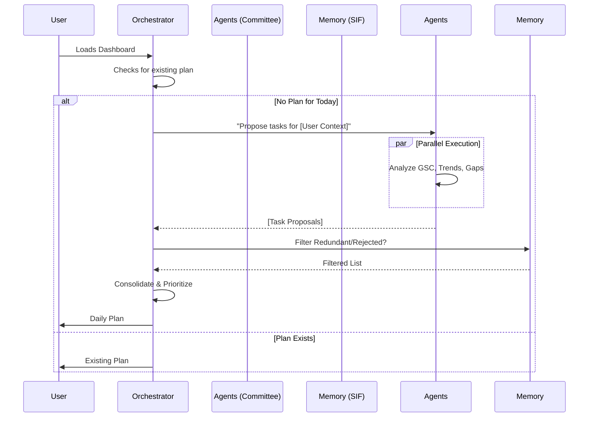

# Multi-Agent Today's Tasks Workflow

**Last Updated**: 2025-03-01
**Component**: Today's Workflow Service

---

## 📅 Overview

The **Today's Tasks Workflow** is an automated, intelligent system that generates a personalized daily to-do list for the user. Unlike static templates or generic AI prompts, this system uses a **Multi-Agent Committee** to analyze real-time data and propose high-value actions.

## 🏗️ Architecture: The "Committee" Model

The workflow follows a **Manager-Worker** pattern where the `TodayWorkflowGenerator` acts as the Orchestrator.



---

## 🧠 The Intelligence Layer

### 1. Proposal Phase (The "Workers")
Each agent submits proposals based on its domain:

| Agent | Data Source | Sample Proposal |
| :--- | :--- | :--- |
| **Strategy Architect** | Content Pillars | "Review 'AI Trends' pillar - performance dropped 10%." |
| **Content Strategist** | Competitor Content | "Draft post on 'Vector Search' (Competitor Gap)." |
| **SEO Specialist** | Search Console | "Fix 404 error on /pricing page." |
| **Social Manager** | Engagement Metrics | "Reply to 3 comments on LinkedIn post." |
| **Competitor Analyst** | Market Signals | "Competitor X launched feature Y. Monitor impact." |

### 2. Orchestration Phase (The "Manager")
The `TodayWorkflowGenerator`:
1.  **Gathers**: Collects all proposals via `asyncio.gather`.
2.  **Deduplicates**: Merges similar tasks (e.g., if SEO and Content agents both suggest the same blog update).
3.  **Formats**: Converts raw proposals into the frontend-ready `TodayTask` schema.

### 3. Self-Learning Phase (The "Brain")
The system uses `TaskMemoryService` and `txtai` to improve over time.
-   **Rejected Tasks**: If a user dismisses a task, it is indexed as "negative feedback." The system semantically checks future proposals against this index to avoid nagging.
-   **Completed Tasks**: Completed tasks are recorded to prevent suggesting the same non-recurring task too soon.

---

## 🛠️ Data Models

### TaskProposal (Internal)
```python
@dataclass
class TaskProposal:
    title: str
    description: str
    pillar_id: str          # plan, generate, publish, analyze, engage, remarket
    priority: str           # high, medium, low
    estimated_time: int     # minutes
    source_agent: str       # e.g., "SEOOptimizationAgent"
    reasoning: str          # "Detected 404 error spike"
    context_data: Dict      # Payload for the action button
```

### TaskHistory (Database)
Tracks the lifecycle for learning:
-   `task_hash`: SHA-256 of title+desc for fast deduplication.
-   `status`: completed / dismissed.
-   `feedback`: User provided notes.
-   `vector_id`: Link to the semantic index entry.

---

## 🎨 UI Experience

1.  **The Card**: Each task appears as a card in the "Today's Workflow" modal.
2.  **Transparency**: 
    -   **Badge**: "Suggested by [Agent Name]"
    -   **Tooltip**: "Why? [Reasoning]" (e.g., "Because traffic dropped 15%").
3.  **Feedback**:
    -   **Complete**: Triggers positive reinforcement learning.
    -   **Dismiss**: Triggers negative reinforcement learning.

---

## 🔄 Lifecycle & Triggers

-   **Daily Reset**: The plan is generated once per day (UTC).
-   **Persistence**: Tasks remain "in progress" until marked done or the day ends.
-   **On-Demand**: Users can manually trigger a regeneration if the day's plan is empty or irrelevant.
