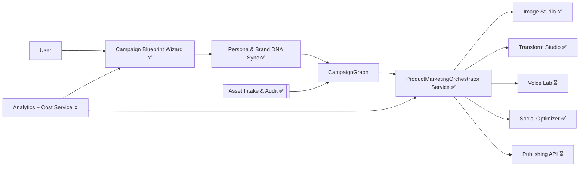

# AI Product Marketing Suite – Complete Feature Plan & Implementation Guide

**Last Updated**: December 2024  
**Status**: ~60% Complete - Core infrastructure in place, workflow completion needed

---

## Executive Summary

The **AI Product Marketing Suite** turns ALwrity into a full-funnel product launch platform that delivers consistent, personalized brand storytelling across every digital touchpoint. It combines the Image Studio stack, WaveSpeed AI models (`WAN 2.5`, `Hunyuan Avatar`, `Ideogram V3`, `Qwen Image`, `Minimax Voice Clone`), and the existing AI Persona system to:

- Guide non-designers and marketing pros through a structured campaign blueprint.
- Generate or enhance every marketing asset (text, image, video, avatar, voice) even when the user has zero inputs.
- Enforce brand voice, tone, and visual identity automatically via the Persona graph.
- Publish tailored variants for each platform (social, ads, landing pages, marketplaces, email) with analytics loops.

**Current State**: The Product Marketing Suite has a **solid foundation** with most backend services and APIs implemented (100% backend services, 100% APIs, 80% frontend components). The main gap is **workflow completion** - connecting the pieces to create a smooth end-to-end user journey. The MVP is achievable within 1-2 weeks with focused effort.

---

## Vision & Goals

| Goal | Description | Alignment |
|------|-------------|-----------|
| **Unified Campaign Orchestration** | One workspace orchestrates assets, copy, formats, approvals, and publishing. | Builds on Image Studio workflow guides & Social Optimizer |
| **Always-On Brand Consistency** | Persona DNA (voice, tone, visuals, vocabulary) drives every generated asset. | Uses persona system + Minimax + Hunyuan Avatar |
| **Asset-Agnostic Onboarding** | Whether the user has zero assets or a full library, ALwrity leads the journey. | Leverages Asset Library + WaveSpeed ingestion |
| **Cross-Platform Delivery** | Auto-tailored packages for Instagram, TikTok, YouTube, LinkedIn, Shopify, Amazon, email & paid ads. | Uses Templates, Social Optimizer, upcoming Transform Studio |
| **Closed-Loop Optimization** | Engagement + conversion insights feed back into prompts, providers, and templates. | Extends Cost/Analytics services |

---

## Implementation Status

**Overall Progress**: ~60% Complete | **MVP Timeline**: 1-2 weeks remaining

### ✅ What's Fully Implemented

#### Backend Services (100%)

1. **ProductMarketingOrchestrator** ✅
   - Campaign blueprint creation
   - Asset proposal generation
   - Asset generation (via Image Studio)
   - Pre-flight validation
   - Location: `backend/services/product_marketing/orchestrator.py`

2. **BrandDNASyncService** ✅
   - Extracts brand DNA from onboarding data
   - Normalizes persona, writing style, target audience
   - Channel-specific adaptations
   - Location: `backend/services/product_marketing/brand_dna_sync.py`

3. **ProductMarketingPromptBuilder** ✅
   - Marketing image prompt enhancement
   - Marketing copy prompt enhancement
   - Brand DNA injection
   - Channel optimization
   - Location: `backend/services/product_marketing/prompt_builder.py`

4. **ChannelPackService** ✅
   - Platform-specific templates
   - Copy frameworks
   - Optimization tips
   - Multi-channel pack building
   - Location: `backend/services/product_marketing/channel_pack.py`

5. **AssetAuditService** ✅
   - Image quality assessment
   - Enhancement recommendations
   - Batch auditing
   - Location: `backend/services/product_marketing/asset_audit.py`

6. **CampaignStorageService** ✅
   - Campaign persistence
   - Proposal persistence
   - Campaign listing/retrieval
   - Status updates
   - Location: `backend/services/product_marketing/campaign_storage.py`

#### Backend APIs (100%)

All endpoints implemented in `backend/routers/product_marketing.py`:

- ✅ `POST /api/product-marketing/campaigns/create-blueprint`
- ✅ `POST /api/product-marketing/campaigns/{campaign_id}/generate-proposals`
- ✅ `POST /api/product-marketing/assets/generate`
- ✅ `GET /api/product-marketing/brand-dna`
- ✅ `GET /api/product-marketing/brand-dna/channel/{channel}`
- ✅ `POST /api/product-marketing/assets/audit`
- ✅ `GET /api/product-marketing/channels/{channel}/pack`
- ✅ `GET /api/product-marketing/campaigns`
- ✅ `GET /api/product-marketing/campaigns/{campaign_id}`
- ✅ `GET /api/product-marketing/campaigns/{campaign_id}/proposals`

#### Database Models (100%)

All models defined in `backend/models/product_marketing_models.py`:

- ✅ `Campaign` - Campaign blueprint storage
- ✅ `CampaignProposal` - Asset proposals
- ✅ `CampaignAsset` - Generated assets

**⚠️ Action Required**: Database migration needs to be created and run.

#### Frontend Components (80%)

1. **ProductMarketingDashboard** ✅ - Main dashboard, journey selection, campaign listing
2. **CampaignWizard** ✅ - Multi-step wizard, campaign creation flow
3. **ProposalReview** ✅ - Asset proposal review (may need UI refinements)
4. **AssetAuditPanel** ✅ - Asset upload and audit
5. **ChannelPackBuilder** ✅ - Component exists (may need integration testing)
6. **CampaignFlowIndicator** ✅ - Progress visualization

#### Frontend Hooks (100%)

**useProductMarketing** hook (`frontend/src/hooks/useProductMarketing.ts`):
- ✅ All API methods implemented
- ✅ State management, error handling, loading states

### ⚠️ What Needs Completion

#### High Priority (MVP Blockers) 🔴

1. **Proposal Persistence Flow**
   - **Issue**: Proposals are generated but not automatically saved to database
   - **Location**: `backend/routers/product_marketing.py::generate_asset_proposals`
   - **Fix**: Call `campaign_storage.save_proposals()` after generating proposals
   - **Impact**: Critical - proposals won't persist between sessions

2. **Database Migration**
   - **Issue**: Models exist but tables may not be created in database
   - **Action**: Create Alembic migration for `product_marketing_campaigns`, `product_marketing_proposals`, `product_marketing_assets`
   - **Impact**: Critical - no data persistence without tables

3. **Asset Generation Workflow** 🟡
   - **Issue**: Endpoint exists but frontend integration may be incomplete
   - **Location**: `ProposalReview.tsx` - verify "Generate Asset" button calls API
   - **Impact**: High - users can't generate assets from proposals

4. **Text Generation Integration** 🟡
   - **Issue**: Text asset generation is placeholder
   - **Location**: `orchestrator.py::generate_asset()` - text generation returns placeholder
   - **Fix**: Integrate `llm_text_gen` service similar to image generation
   - **Impact**: Medium - text assets (captions, CTAs) won't work

5. **Pre-flight Validation UI** 🟡
   - **Issue**: Backend validation exists but frontend may not show cost/limits
   - **Location**: Campaign wizard - add validation step before proposal generation
   - **Impact**: Medium - users may hit subscription limits unexpectedly

#### Medium Priority (UX Improvements) 🟢

6. **Proposal Review UI Enhancements** - Add prompt editing, better cost display, batch actions
7. **Campaign Progress Tracking** - Enhanced visual progress indicators
8. **Channel Pack Builder Integration** - Connect to Social Optimizer API, multi-variant generation

#### Low Priority (Future Enhancements) 🔵

9. **Approval Board (Kanban)** - Trello-like board (Phase 2)
10. **Performance Loop** - Analytics integration, optimization suggestions (Phase 2)
11. **Batch Asset Generation** - Generate multiple assets at once (Phase 2)

### 📊 Implementation Completeness

| Component | Status | Completeness |
|-----------|--------|--------------|
| Backend Services | ✅ | 100% |
| Backend APIs | ✅ | 100% |
| Database Models | ✅ | 100% |
| Database Migration | ⚠️ | 0% (needs creation) |
| Frontend Components | ✅ | 80% |
| Frontend Hooks | ✅ | 100% |
| Workflow Integration | ⚠️ | 60% (needs connection) |
| **Overall MVP** | ⚠️ | **~60%** |

---

## Onboarding Intelligence Inputs

The onboarding stack (`backend/models/onboarding.py`, `services/onboarding/*.py`) already captures rich brand context we can reuse instead of presenting generic templates.

| Source | Key Fields (examples) | How It Personalizes Campaigns |
|--------|-----------------------|-------------------------------|
| `onboarding_sessions` + `api_keys` | `user_id`, progress, connected providers | Keeps provider access ready and remembers which services each user trusts. |
| `website_analyses` | `website_url`, `writing_style.tone`, `content_characteristics`, `target_audience.demographics/industry/expertise`, `content_type`, `recommended_settings`, optional `brand_analysis`, `style_guidelines` | Seeds tone, vocabulary, CTA language, and visual cues for all creative proposals. |
| `research_preferences` | `research_depth`, `content_types`, `auto_research`, `factual_content`, mirrored style fields | Dictates how deep scripts/briefs go and whether to auto-run research for each asset. |
| `persona_data` | `core_persona`, `platform_personas`, `selected_platforms`, `quality_metrics`, cached `research_persona` | Determines voice clone parameters, avatar demeanor, and channel prioritization. |
| `competitor_analyses` | `competitor_url`, `analysis_data` | Supplies differentiators and guardrails when recommending hooks and CTAs. |

```49:152:backend/models/onboarding.py
# WebsiteAnalysis + ResearchPreferences store detailed writing style, content types, target audiences,
# recommended settings, and metadata needed to drive channel-specific prompts.
```

```154:192:backend/models/onboarding.py
# PersonaData captures selected platforms, platform personas, quality metrics, and cached research personas
# that we can reuse to keep voice, avatar, and channel choices aligned.
```

`OnboardingDataService.get_personalized_ai_inputs()` composes these records into ready-to-use prompt scaffolds (writing style, competitor list, gap analysis, keyword targets, research directives). That same service exposes helper methods to fetch raw website analysis and research preferences so Product Marketing Suite flows can stay user-scoped without reimplementing queries.

```97:165:backend/services/onboarding/data_service.py
# get_personalized_ai_inputs() loads website analysis + research preferences and emits AI-ready structures
# including tone, audience, competitor suggestions, gap analysis, and keyword starters.
```

### Personalization Hooks
1. **Campaign graph defaults** from `persona_data.selected_platforms` and onboarding launch goals.
2. **Prompt builders** auto-inject `website_analyses.writing_style` + `target_audience` descriptors into Create/Transform prompts.
3. **Voice/avatar mapping** keeps Minimax + Hunyuan settings aligned with `core_persona` and `platform_personas`.
4. **Research automation** respects `research_preferences.research_depth` and `auto_research` flags when generating scripts or briefs.
5. **Gap detection** compares `competitor_analyses.analysis_data` with current assets to propose differentiated concepts.

---

## User Personas & Scenarios

1. **Zero-Asset Founder** – Has a product idea + rough notes. Needs help from naming to launch visuals.  
2. **Resource-Strapped Marketer** – Has some copy/images but needs cross-platform consistency, voice alignment, and faster production.  
3. **Digital Team Lead** – Has brand library, wants automation + governance so teammates stay on-brand.

---

## Feature Pillars

### 1. Campaign Blueprint Wizard
- Interactive workflow (Mermaid-style UI) collects product info, target persona, launch goals, channels, timelines.
- Outputs a **Campaign Graph**: phases (teaser, launch, retention) + required assets per channel.
- Each node is linked to templates, cost estimates, and recommended AI providers.

### 2. Brand DNA Sync
- Pulls Persona voice, tone sliders, vocabulary, approved colors, typography, reference assets.
- Trains/links Minimax voice clone + future avatar assets to persona automatically.
- Maintains **Brand DNA tokens** (JSON schema) reused in prompts, style presets, safe words.

### 3. Asset Onboarding & Enhancement
- **Drop Zone**: upload photos, videos, PDFs, packaging files. Auto-tag in Asset Library.
- Smart audit classifies assets: *usable as-is*, *enhance*, *replace*, *missing*.
- Enhancement actions route to Image Studio (edit/upscale), Transform (image-to-video, avatar), Audio (voice clean-up).

### 4. Creation & Transformation Hub
- **Create Studio** for new hero shots, product renders, lifestyle scenes via Ideogram/Qwen/Stability.
- **Transform Studio** (planned) generates product animations, avatar explainers, 3D models.
- **Voice Lab** spins up voice clones, writes scripts, generates narration tied to persona.
- **Script-to-Scene** builder: Story Writer scenes + Transform outputs = product story videos.

### 5. Channel Orchestrator
- Channel packs: Instagram, TikTok, LinkedIn, X, Pinterest, YouTube, Shopify PDP, Amazon A+ content, email drips, ads.
- Each pack auto-selects templates, dimensions, copy tone, compliance hints.
- Batch export (images, videos, captions, CTAs) plus API hooks (Buffer, HubSpot, Shopify).

### 6. Performance Loop
- Campaign dashboard aggregates metrics per asset & channel (import via APIs).
- Feedback cycle: low-performing assets flagged → wizard suggests new variations, provider switches, or persona adjustments.
- Cost vs. ROI view to surface efficient providers (e.g., Qwen for drafts, Ideogram for finals).

---

## AI Prompt Builders & Intelligent Defaults

Once onboarding is complete, the suite should auto-generate prompts, presets, and provider choices instead of asking users to tune sliders manually.

### Prompt Context Layers

| Layer | Data Feed | Usage |
|-------|-----------|-------|
| **Brand DNA Token** | `website_analyses.writing_style`, `target_audience`, `brand_analysis`, persona lexicon | Injected into Create/Transform prompts, script writers, CTA suggestions. |
| **Channel Persona Modulation** | `persona_data.platform_personas`, `selected_platforms` | Swaps tone/CTA defaults per platform (e.g., B2B authoritative on LinkedIn, playful on TikTok). |
| **Research Depth Controls** | `research_preferences.research_depth`, `auto_research`, `content_types` | Determines whether prompts call for stats, citations, or quick riffs. |
| **Competitor Differentiators** | `competitor_analyses.analysis_data` | Adds “contrast vs X competitor” instructions automatically. |
| **Asset Quality Targets** | Past asset metadata + analytics | Adjusts provider choice (Qwen for drafts vs Ideogram/Stability for finals) and prompt strictness. |

### Default Selection Matrix

1. **Providers & Models**  
   - Use `ImagePromptOptimizer` (see `services/image_studio/create_service.py`) to score prompts, then pick provider/model from `CreateStudioService.PROVIDER_MODELS` based on quality tier and budget.  
   - Auto-upgrade to WAN 2.5 / Hunyuan when persona indicates heavy video usage and budget allows.

2. **Prompt Templates**  
   - Maintain prompt blueprints in a shared registry (e.g., `PromptCatalog[asset_type][channel]`).  
   - Each blueprint exposes slots (tone, hook, CTA, focal subject, shot type) filled with onboarding data before passing into the prompt optimizer.

3. **Control Defaults**  
   - For Edit/Transform operations, infer mask/region settings based on asset audit tags (e.g., “product_centered”).  
   - For Transform Studio, auto-select motion preset + audio voice clone using persona mood + research depth.

4. **Safety Guardrails**  
   - Run every generated prompt through `ai_prompt_optimizer` with persona-specific guardrails (forbidden phrases, compliance tags).  
   - Log prompt provenance for later auditing.

### User Interaction Pattern

1. Show the AI-generated proposal (prompt summary, provider, cost, expected output).  
2. Offer “Edit advanced settings” drawer for power users.  
3. Default action is **Approve**—which triggers the backend with the pre-filled prompt + settings.  
4. Any manual change feeds back into the prompt optimizer to improve future defaults for that user.

---

## User Journeys & Guided Flows

> The user has already completed onboarding, shared brand guidelines, product catalog, preferred channels, and connected social/commerce accounts. Templates become optional because we now operate from *personalized brand data* (Persona DNA + existing digital footprint).

### Journey A – “Launch Net-New Campaign from Personalized Blueprint”

| Step | What ALwrity Asks/Does | Onboarding Signals Used | User Action |
|------|-----------------------|-------------------------|-------------|
| 1. **Campaign Kickoff** | Wizard preloads campaign goal, hero offer, ICP, and tone. | `persona_data.core_persona`, `website_analyses.target_audience`, `research_preferences.content_types` | Confirm KPI or tweak launch window. |
| 2. **Persona & Brand DNA Sync** | Pulls Minimax voice clone + Hunyuan avatar mood plus approved palette/CTA language from crawl. | `persona_data.platform_personas`, `website_analyses.writing_style`, `brand_analysis`, `style_guidelines` | Toggle tone per channel if desired. |
| 3. **Blueprint Draft** | Generates campaign graph (teaser → launch → nurture) aligned to prioritized channels. | `persona_data.selected_platforms`, `competitor_analyses.analysis_data` (to avoid overlaps) | Approve blueprint or reorder stages. |
| 4. **AI Proposal Review** | For each asset node, generates hook, media type, provider choice referencing competitive gaps and research depth. | `research_preferences.research_depth`, `website_analyses.content_type`, `competitor_analyses.analysis_data` | Accept, tweak, or request alternate angle. |
| 5. **Asset Autopilot** | Runs Create/Edit/Transform using pre-selected providers + brand tokens; auto-writes captions/voiceovers with persona vocabulary. | `website_analyses.writing_style`, `persona_data.core_persona`, `api_keys` | Review and approve results; edits propagate downstream. |
| 6. **Approval Board** | Trello-like kanban auto-populated with cost estimates and recommended publish dates. | Asset metadata, cost service, onboarding timeline | Approve/push back. |
| 7. **Distribution Pack** | Builds scheduling bundle and maps channel-specific copy using platform personas; warns if cadence conflicts with prior campaigns. | `persona_data.platform_personas`, analytics baseline | Approve publish plan or reschedule. |
| 8. **Performance Loop** | Compares live metrics vs onboarding KPIs and suggests next experiments (“Avatar video for TikTok?”). | Analytics + stored onboarding baselines | Approve next iteration. |

**Key Principle**: Every step is personalized; user primarily approves AI suggestions. No template hunting—ALwrity already knows the brand’s aesthetic, messaging pillars, and asset gaps.

---

### Journey B – “Enhance & Reuse Existing Assets with Minimal Input”

| Step | System Behavior | Onboarding Signals Used | User Action |
|------|-----------------|-------------------------|-------------|
| 1. **Asset Inventory Sync** | Pulls connected drives + Shopify + historical crawl snapshots for baseline comparison. | `website_analyses.crawl_result`, existing asset metadata | Spot-check flagged “needs attention” items. |
| 2. **Quality & Consistency Audit** | Scores tone/visual consistency against stored guidelines & persona lexicon. | `website_analyses.style_guidelines`, `persona_data.core_persona`, `brand_analysis` | Approve suggested fixes (e.g., recolor, rephrase). |
| 3. **Enhancement Pipeline** | Routes ops (Edit, Upscale, Transform) with preferred providers and cost tiers remembered from onboarding/API keys. | `api_keys`, `research_preferences.content_types` | Monitor progress; intervene only if requested. |
| 4. **Variant Generation** | Auto-creates derivatives for each selected platform (square carousel, TikTok vertical, Amazon A+). | `persona_data.selected_platforms`, `platform_personas` | Approve variant packages; toggle channels on/off. |
| 5. **Smart Suggestions** | Identifies missing steps vs campaign plan using competitor gaps + research depth. | `research_preferences.research_depth`, `competitor_analyses.analysis_data` | Approve or request edits. |
| 6. **One-Click Publish** | Batch schedule/export, logging lineage back to persona + onboarding records. | Persona metadata, publishing APIs | Approve deployment queue. |

---

### Journey C – “Always-On Optimization Companion”

Designed for digital teams that run overlapping campaigns.

1. **Pulse Check** – Dashboard compares live KPIs to onboarding benchmarks (e.g., `research_preferences` goals, persona engagement targets).  
2. **Insight Cards** – “LinkedIn thought-leadership posts are outperforming Instagram videos by 2.3x; suggest repurposing using the LinkedIn platform persona voice.”  
3. **Actionable Playbooks** – Each insight links to an AI task seeded with stored `website_analyses` tone + `competitor_analyses` differentiators (e.g., convert top blog into avatar video with existing voice clone).  
4. **Approval Stream** – User confirms; ALwrity generates the asset, schedules it, and feeds the results back into the persona record for future optimization.  

This loop ensures marketing teams approve curated ideas instead of starting from blank prompts or templates.


---

## AI & Provider Mapping

| Need | Provider(s) | Module |
|------|-------------|--------|
| Net-new product imagery | WaveSpeed Ideogram V3, Stability Ultra/Core | Create Studio |
| Fast draft visuals | WaveSpeed Qwen Image | Create Studio (draft tier) |
| Asset cleanup/enhancement | Stability Edit/Upscale | Edit + Upscale Studio |
| Product animation | WaveSpeed WAN 2.5 image-to-video | Transform Studio |
| Avatar explainers | Hunyuan Avatar / InfiniteTalk | Transform Studio |
| Voice consistency | Minimax Voice Clone | Persona Voice Lab |
| Template packs | TemplateManager + Social Optimizer | Channel Orchestrator |

---

## System Architecture



**Legend**: ✅ Implemented | ⏳ Planned

### Services

1. **`ProductMarketingOrchestrator`** ✅ (backend)  
   - Location: `backend/services/product_marketing/orchestrator.py`
   - Builds campaign graph, tracks asset states, orchestrates provider calls.  
   - Interfaces with ImageStudioManager, TransformStudioService, Persona services.
   - Status: Fully implemented

2. **`BrandDNASyncService`** ✅  
   - Location: `backend/services/product_marketing/brand_dna_sync.py`
   - Normalizes persona data (voice embeddings, tone sliders, color palettes) into reusable JSON.  
   - Provides "brand token" to all prompt builders.
   - Status: Fully implemented

3. **`AssetAuditService`** ✅  
   - Location: `backend/services/product_marketing/asset_audit.py`
   - Uses Vision + metadata to classify uploads.  
   - Suggests enhancement operations (remove background, upscale, transform).
   - Status: Fully implemented

4. **`ChannelPackService`** ✅  
   - Location: `backend/services/product_marketing/channel_pack.py`
   - Maps channels → templates, copy frameworks, safe zones, scheduling metadata.  
   - Works with Social Optimizer + upcoming Batch Processor.
   - Status: Fully implemented

5. **`PerformanceInsightsService`** ⏳  
   - Aggregates metrics via integrations (Meta, TikTok, Shopify, ESPs).  
   - Feeds insights into Orchestrator for iteration suggestions.
   - Status: Planned (Phase 2)

### Frontend Components
- `ProductMarketingDashboard.tsx` – overall campaign cockpit (uses global default themes).  
- `CampaignWizard.tsx` – multi-step guided setup (reuses Image Studio UI patterns).  
- `AssetAuditPanel.tsx` – ingestion + enhancement recommendations.  
- `ChannelPackBuilder.tsx` – preview channel-specific outputs.  
- `PerformanceLoop.tsx` – show KPI trends + actionable prompts.

---

## Backend API Reuse & Integration

### Existing APIs to Reuse

The Product Marketing Suite **reuses existing backend APIs** rather than creating new endpoints. This ensures consistency, subscription validation, and asset tracking.

#### Image Generation APIs

**Primary Endpoint**: `POST /api/image-studio/create`
- **Service**: `ImageStudioManager.create_image()`
- **Request Model**: `CreateStudioRequest` (supports `use_persona`, `enhance_prompt`, `template_id`)
- **Subscription Check**: Built-in via `PricingService` in `generate_image()` flow
- **Asset Tracking**: Automatic via `save_asset_to_library()` in `backend/api/images.py`
- **Usage**: Product Marketing Suite calls this with **specialized marketing prompts** (see below)

**Alternative**: `POST /api/images/generate` (legacy, but still functional)
- Also includes subscription validation and asset tracking
- Can be used for simpler image generation needs

#### Image Editing APIs

**Primary Endpoint**: `POST /api/image-studio/edit/process`
- **Service**: `ImageStudioManager.edit_image()`
- **Operations**: `remove_background`, `inpaint`, `outpaint`, `search_replace`, `search_recolor`, `general_edit`
- **Subscription Check**: Built-in
- **Asset Tracking**: Automatic
- **Usage**: Enhance existing product photos, remove backgrounds, add product variations

#### Image Upscaling APIs

**Primary Endpoint**: `POST /api/image-studio/upscale`
- **Service**: `ImageStudioManager.upscale_image()`
- **Modes**: `fast`, `conservative`, `creative`
- **Subscription Check**: Built-in
- **Asset Tracking**: Automatic
- **Usage**: Upscale product images for print, high-res social, or e-commerce

#### Social Optimization APIs

**Primary Endpoint**: `POST /api/image-studio/social/optimize`
- **Service**: `ImageStudioManager.optimize_for_social()`
- **Features**: Multi-platform optimization, smart cropping, safe zones
- **Subscription Check**: Built-in
- **Asset Tracking**: Automatic (tracks each platform variant)
- **Usage**: Generate platform-specific variants from single source image

#### Text Generation APIs

**Service**: `services/llm_providers/main_text_generation.py::llm_text_gen()`
- **Subscription Check**: Built-in via `PricingService`
- **Persona Integration**: Supports persona-enhanced prompts (see `FacebookWriterBaseService._build_persona_enhanced_prompt()`)
- **Usage**: Generate marketing copy, captions, CTAs, email content, product descriptions
- **Asset Tracking**: Use `save_and_track_text_content()` from `utils/text_asset_tracker.py`

#### Video Generation APIs (Planned)

**Story Writer Endpoints**: `POST /api/story-writer/generate-video`
- **Service**: `StoryWriterService` (will integrate WaveSpeed WAN 2.5)
- **Subscription Check**: Built-in
- **Asset Tracking**: Automatic
- **Usage**: Product demo videos, explainer videos, social video content

#### Audio/Voice APIs (Planned)

**Voice Cloning**: Minimax integration (planned)
- **Service**: `services/minimax/` (to be created)
- **Subscription Check**: Via `PricingService`
- **Asset Tracking**: Via `save_asset_to_library()` with `asset_type="audio"`
- **Usage**: Consistent brand voice for all video content

### Subscription Pre-Flight Validation

**All API calls go through pre-flight validation** using existing infrastructure:

1. **Pre-Flight Endpoint**: `POST /api/subscription/preflight-check`
   - Validates subscription tier, usage limits, cost estimates
   - Returns detailed error if limits exceeded
   - Used by frontend before making generation requests

2. **Service-Level Validation**: `services/subscription/preflight_validator.py`
   - `validate_research_operations()` pattern can be extended for marketing workflows
   - Validates entire campaign graph before any API calls
   - Prevents wasted API calls if subscription limits would block later steps

3. **Built-in Validation**: Most generation services already call `PricingService.check_comprehensive_limits()`
   - Image Studio: Validates in `generate_image()` flow
   - Story Writer: Validates in media generation endpoints
   - Text Generation: Validates in `llm_text_gen()`

**Product Marketing Suite Integration**:
- Call `preflight-check` before starting campaign wizard
- Validate entire campaign graph (all assets) upfront
- Show cost breakdown and subscription status before generation
- Block workflow if limits exceeded (with clear upgrade prompts)

### Asset Library Integration

**All generated assets automatically appear in Asset Library** via existing tracking:

1. **Image Assets**: 
   - Tracked via `save_asset_to_library()` in `backend/api/images.py`
   - Metadata includes: `source_module="product_marketing"`, `prompt`, `provider`, `cost`, `tags`
   - Appears in Asset Library dashboard with filtering by `source_module`

2. **Text Assets**:
   - Tracked via `save_and_track_text_content()` in `utils/text_asset_tracker.py`
   - Saves to `.txt` or `.md` files, tracks in database
   - Metadata includes: `source_module="product_marketing"`, `title`, `description`, `tags`

3. **Video/Audio Assets**:
   - Tracked via `save_asset_to_library()` with `asset_type="video"` or `"audio"`
   - Metadata includes: `source_module="product_marketing"`, generation details, cost

4. **Asset Library API**: `GET /api/content-assets/`
   - Filter by `source_module="product_marketing"`
   - Filter by `asset_type`, `tags`, `campaign_id` (if added to metadata)
   - Supports favorites, bulk operations, usage tracking

**Product Marketing Suite Integration**:
- All generated assets tagged with `campaign_id`, `asset_type`, `channel`
- Campaign dashboard shows all assets from Asset Library filtered by campaign
- Users can browse, favorite, and reuse assets across campaigns
- Asset Library becomes the single source of truth for all marketing content

---

## Specialized Marketing Prompt Builders

### Marketing-Specific Prompt Enhancement

The Product Marketing Suite uses **specialized prompt builders** that inject onboarding data, persona DNA, and marketing context into all AI generation requests.

#### Image Generation Prompts

**Service**: `ProductMarketingPromptBuilder` (new service, extends `AIPromptOptimizer`)

**Prompt Structure**:
```
[Base Product Description]
+ [Brand DNA Tokens] (from onboarding: writing_style, target_audience, brand_analysis)
+ [Persona Visual Style] (from persona_data: visual_identity, color_palette, aesthetic_preferences)
+ [Channel Optimization] (from platform_personas: Instagram vs LinkedIn vs TikTok)
+ [Competitive Differentiation] (from competitor_analyses: unique positioning)
+ [Quality Descriptors] (professional photography, high quality, detailed, sharp focus)
+ [Marketing Context] (product launch, social media, e-commerce, email campaign)
```

**Example Enhanced Prompt**:
```
Original: "Modern laptop on desk"

Enhanced for Instagram (photorealistic, brand-aligned):
"Modern minimalist laptop on clean desk, professional photography, high quality, detailed, sharp focus, natural lighting, [brand color palette: #2C3E50, #3498DB], [brand tone: professional yet approachable], [target audience: tech professionals], [differentiator: premium quality focus], Instagram-optimized composition, product showcase style, marketing photography"
```

**Implementation**:
- Extends `CreateStudioService._enhance_prompt()` with marketing context
- Uses `OnboardingDataService.get_personalized_ai_inputs()` for brand DNA
- Uses `PersonaDataService` for visual identity
- Uses `CompetitorAnalysis` for differentiation cues

#### Text Generation Prompts

**Service**: Extends persona prompt builders (`PersonaPromptBuilder`, `LinkedInPersonaPrompts`, etc.)

**Prompt Structure**:
```
[Base Content Request]
+ [Persona Linguistic Fingerprint] (from persona_data: sentence_length, vocabulary, go-to_words)
+ [Platform Optimization] (from platform_personas: character_limit, hashtag_strategy, engagement_patterns)
+ [Brand Voice] (from website_analyses.writing_style: tone, voice, complexity)
+ [Target Audience] (from website_analyses.target_audience: demographics, expertise_level)
+ [Marketing Goal] (awareness, conversion, retention, launch)
+ [Competitive Positioning] (from competitor_analyses: differentiation, unique value props)
```

**Example Enhanced Prompt**:
```
Original: "Write Instagram caption for product launch"

Enhanced (persona-aware, brand-aligned):
"Write Instagram caption for product launch following [persona_name] persona:
- Linguistic fingerprint: [average_sentence_length] words, [vocabulary_level], use [go-to_words], avoid [avoid_words]
- Platform optimization: [character_limit] limit, [hashtag_strategy], [engagement_patterns]
- Brand voice: [tone], [voice], [complexity]
- Target audience: [demographics], [expertise_level]
- Marketing goal: Product launch awareness
- Competitive positioning: [differentiation], [unique_value_props]
- Product: [product_description]
Generate caption that matches persona style, optimizes for Instagram engagement, and differentiates from competitors."
```

**Implementation**:
- Extends `FacebookWriterBaseService._build_persona_enhanced_prompt()` pattern
- Uses `OnboardingDataService` for brand voice and audience
- Uses `PersonaDataService` for linguistic fingerprint
- Uses `CompetitorAnalysis` for positioning

#### Video Generation Prompts (Planned)

**Service**: `ProductMarketingVideoPromptBuilder` (new service)

**Prompt Structure**:
```
[Base Video Concept]
+ [Brand DNA] (visual style, tone, color palette)
+ [Persona Voice] (voice clone parameters, emotion, pacing)
+ [Channel Optimization] (duration, aspect ratio, platform-specific hooks)
+ [Marketing Goal] (demo, explainer, testimonial, launch)
+ [Product Context] (features, benefits, use cases)
```

**Implementation**:
- Integrates with WaveSpeed WAN 2.5 text-to-video
- Uses Minimax voice clone for narration
- Uses Hunyuan Avatar for talking head videos
- Applies platform-specific optimizations

### Prompt Optimization Service Integration

**Existing Service**: `services/ai_prompt_optimizer.py::AIPromptOptimizer`

**Extension**: `ProductMarketingPromptOptimizer` (extends `AIPromptOptimizer`)

**New Prompt Templates**:
- `product_hero_image`: Optimized for product photography, e-commerce, social
- `marketing_copy`: Optimized for captions, CTAs, email, ads
- `video_script`: Optimized for product demos, explainers, testimonials
- `avatar_narration`: Optimized for talking head videos, brand spokesperson
- `social_caption`: Platform-specific (Instagram, LinkedIn, TikTok, etc.)

**Usage**:
- Product Marketing Suite calls `ProductMarketingPromptOptimizer.optimize_marketing_prompt()`
- Service injects onboarding data, persona DNA, competitive insights
- Returns fully enhanced prompt ready for AI generation
- Tracks prompt variations for A/B testing

---

## Frontend Implementation

### Global Theme Reuse

**Frontend components use existing global default themes** from Image Studio and Story Writer:

1. **UI Components**:
   - Reuse `GlassyCard`, `SectionHeader`, `StatusChip` from Image Studio
   - Reuse `AsyncStatusBanner`, `ZoomablePreview` patterns
   - Reuse form patterns from Story Writer wizard

2. **Layout Patterns**:
   - Reuse `ImageStudioLayout` structure for dashboard
   - Reuse wizard step patterns from onboarding
   - Reuse approval board patterns from Story Writer

3. **Theme System**:
   - Use existing Tailwind/CSS theme variables
   - Maintain visual consistency with Image Studio
   - No custom theme overrides (unless absolutely necessary)

### Component Structure

```
frontend/src/components/ProductMarketing/
├── ProductMarketingDashboard.tsx      # Main dashboard (reuses ImageStudioLayout)
├── CampaignWizard/
│   ├── CampaignWizard.tsx            # Multi-step wizard (reuses onboarding patterns)
│   ├── CampaignGoalStep.tsx          # Step 1: Goal & KPI
│   ├── BrandDNASyncStep.tsx          # Step 2: Persona sync
│   ├── BlueprintDraftStep.tsx        # Step 3: Campaign graph
│   └── AIProposalReviewStep.tsx      # Step 4: Asset proposals
├── AssetAuditPanel.tsx               # Asset intake & recommendations
├── ChannelPackBuilder.tsx            # Platform-specific previews
├── ApprovalBoard.tsx                 # Trello-like kanban (reuses Story Writer patterns)
└── PerformanceLoop.tsx                # Analytics & optimization suggestions
```

### API Integration Pattern

**All frontend components call existing backend APIs** with specialized prompts:

```typescript
// Example: Generate product hero image
const generateProductImage = async (productInfo, campaignContext) => {
  // 1. Build specialized marketing prompt
  const enhancedPrompt = await buildMarketingPrompt({
    base: productInfo.description,
    onboardingData: userOnboardingData,
    personaData: userPersonaData,
    channel: 'instagram',
    assetType: 'hero_image'
  });

  // 2. Call existing Image Studio API
  const response = await fetch('/api/image-studio/create', {
    method: 'POST',
    body: JSON.stringify({
      prompt: enhancedPrompt,
      template_id: 'instagram_feed_square',
      use_persona: true,
      enhance_prompt: true,
      quality: 'premium',
      provider: 'wavespeed',
      model: 'ideogram-v3-turbo'
    })
  });

  // 3. Asset automatically tracked in Asset Library
  // 4. Subscription validated automatically
  // 5. Result appears in campaign dashboard
};
```

---

## Handling Asset Availability

| User State | ALwrity Response |
|------------|------------------|
| **No assets** | Wizard requests minimal info → auto-generates hero copy, product visuals, digital spokesperson, launch kit. |
| **Partial assets** | Audit identifies gaps, recommends AI-generation or enhancement flows. |
| **Full library** | Enforces persona alignment, creates derivatives per channel, links to analytics for optimization. |

Guided **Asset Trails** (progress indicators) show users exactly what is left: e.g., “Hero Image ✓, Launch Video ▢, Email Kit ▢”.

---

## Roadmap

| Phase | Timeline | Focus | Key Deliverables | Status |
|-------|----------|-------|------------------|--------|
| **MVP** | 1-2 weeks remaining | Workflow completion + critical fixes | Proposal persistence, database migration, asset generation integration, text generation | ⚠️ In Progress (60%) |
| **Beta** | 2-4 weeks | Video & avatar automation | Transform Studio image-to-video ✅, InfiniteTalk avatar pipeline ✅, voice clone onboarding | 🔵 Planned |
| **GA** | 4-8 weeks | Commerce + automation | Shopify/Amazon packs, email drip builder, analytics loop, auto-refresh suggestions | 🔵 Planned |

Dependencies: WaveSpeed APIs ✅, Transform Studio ✅, Template expansions ✅, Publishing partner APIs (Buffer, Shopify, Klaviyo) 🔵.

---

## Success Metrics

- **Campaign Completion Rate**: % of users who finish all required assets per campaign.  
- **Brand Consistency Score**: Automated rating of tone/style adherence pre- and post-suite.  
- **Time-to-Launch**: Average days from wizard start → published assets (target: <3 days).  
- **Cross-Channel Coverage**: Number of channels activated per campaign.  
- **Revenue Impact**: Upsell/conversion to Pro/Enterprise tiers due to multimedia features.  
- **Engagement Lift**: CTR/engagement improvements vs. baseline campaigns using analytics loop.

---

## Implementation Next Steps & Quick Fixes

### 🚀 Critical Fixes (Priority Order)

#### 1. Fix Proposal Persistence (30 minutes)

**Issue**: Proposals are generated but not automatically saved to database.

```python
# backend/routers/product_marketing.py
# Around line 195, after generating proposals:

proposals = orchestrator.generate_asset_proposals(...)

# ADD THIS:
campaign_storage = get_campaign_storage()
campaign_storage.save_proposals(user_id, campaign_id, proposals)

return proposals
```

#### 2. Create Database Migration (1 hour)

```bash
cd backend
alembic revision --autogenerate -m "Add product marketing tables"
alembic upgrade head
```

#### 3. Test End-to-End Flow

1. Create campaign via wizard
2. Generate proposals
3. Review proposals
4. Generate assets
5. Verify assets in Asset Library
6. Check campaign status updates

### 📋 Phase 1: MVP Completion (1-2 weeks)

**Week 1: Core Workflow Fixes**

1. **Fix Proposal Persistence** (1 day) - See above
2. **Create Database Migration** (1 day) - See above
3. **Complete Asset Generation Flow** (2 days)
   - Test ProposalReview → Generate Asset → Asset Library flow
   - Add loading states
   - Handle errors gracefully
   - Update campaign status after generation
4. **Integrate Text Generation** (2 days)
   - Update `orchestrator.py::generate_asset()` for text assets
   - Use `llm_text_gen` service
   - Save text assets to Asset Library
   - Test with campaign workflow

**Week 2: UX Polish**

5. **Add Pre-flight Validation UI** (1 day)
   - Show cost estimates in wizard
   - Validate before proposal generation
   - Clear subscription limit warnings
6. **Enhance Proposal Review** (2 days)
   - Editable prompts
   - Better cost display
   - Batch actions
   - Status indicators
7. **Testing & Bug Fixes** (2 days)
   - End-to-end workflow testing
   - Fix any discovered issues
   - Polish UI/UX

### 📋 Phase 2: Enhanced Features (2-3 weeks)

- Approval board/Kanban
- Performance analytics
- Batch generation
- Advanced channel packs

### 🔍 Code Review Checklist

Before considering MVP complete, verify:

- [ ] Proposals save to database automatically
- [ ] Database tables exist and migrations run
- [ ] Asset generation works from proposal review
- [ ] Text generation works for captions/CTAs
- [ ] Pre-flight validation shows in UI
- [ ] Campaign progress updates correctly
- [ ] Assets appear in Asset Library with proper metadata
- [ ] Error handling covers all edge cases
- [ ] Subscription limits are enforced
- [ ] Brand DNA loads from onboarding data

---

## Notes & References

- All backend services are well-structured and follow existing patterns
- Frontend components use consistent UI patterns from Image Studio
- Integration points with Image Studio are clean and maintainable
- The foundation is solid - main work is connecting the pieces

**References**: `WAVESPEED_AI_FEATURE_PROPOSAL.md`, `WAVESPEED_AI_FEATURE_SUMMARY.md`, `WAVESPEED_IMPLEMENTATION_ROADMAP.md`, AI Image Studio documentation suite.
