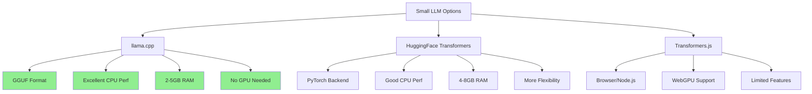
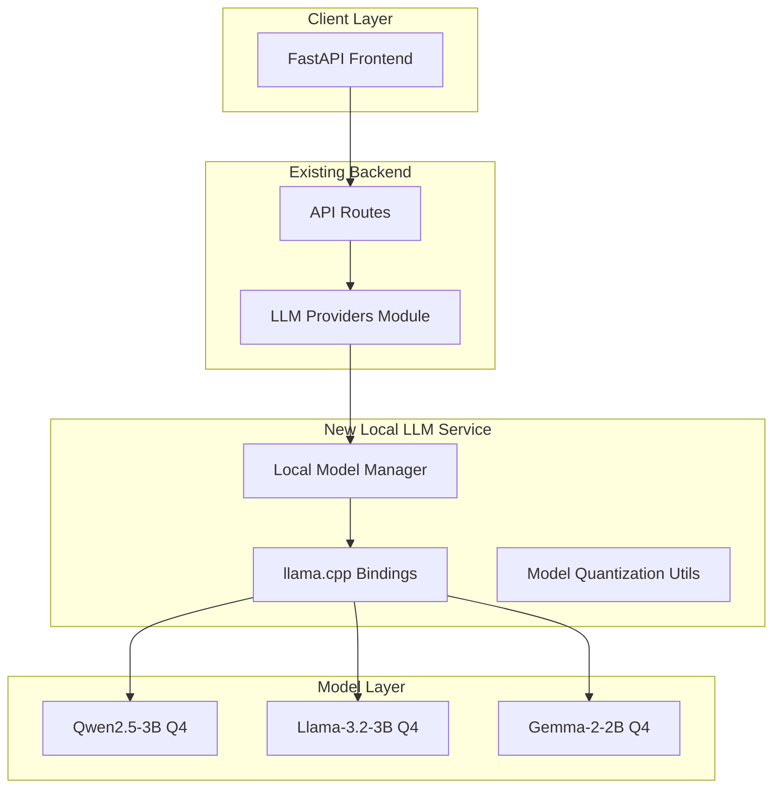

# Small Language Models for Structured Output - Architectural Plan

## Executive Summary

This document outlines the architectural plan for implementing local small language model (SLM) inference with structured output capabilities on a modest CPU-based laptop with 8GB RAM. Based on the Reddit research, the optimal model size is **3B to 7B parameters**, with lower sizes not working great and higher sizes being too resource-intensive.

## 1. Analysis of Existing Codebase

### Current AI/LLM Integration Points

The existing backend already has comprehensive AI integrations:

| Provider | Module | Structured Output Support |
|----------|--------|-------------------------|
| Google Gemini | [`backend/services/llm_providers/gemini_provider.py`](backend/services/llm_providers/gemini_provider.py:300) | ✅ `gemini_structured_json_response()` |
| HuggingFace | [`backend/services/llm_providers/huggingface_provider.py`](backend/services/llm_providers/huggingface_provider.py:235) | ✅ `huggingface_structured_json_response()` |
| OpenAI | Via HuggingFace router | ✅ |
| Anthropic | Via API | ✅ |

### Key Integration Points Identified

1. **Main text generation service**: [`backend/services/llm_providers/main_text_generation.py`](backend/services/llm_providers/main_text_generation.py)
2. **Structured output functions**: `gemini_structured_json_response()`, `huggingface_structured_json_response()`
3. **Existing Pydantic models**: Multiple response models in [`backend/api/`](backend/api/)
4. **Subscription/usage tracking**: Already handles provider switching

---

## 2. Recommended Small Language Models

### For 8GB RAM CPU-based laptops, the following models are recommended:

### Option A: llama.cpp with GGUF Models (Recommended)

| Model | Parameters | Quantization | RAM Usage | Structured Output Quality |
|-------|-----------|--------------|-----------|--------------------------|
| Qwen2.5-3B | 3B | Q4_K_M | ~2GB | Good |
| Phi-3.5-mini | 3.8B | Q4_K_M | ~2.5GB | Good |
| Llama-3.2-3B | 3B | Q4_K_M | ~2GB | Very Good |
| Gemma-2-2B | 2B | Q4_K_M | ~1.5GB | Good |
| Qwen2.5-7B | 7B | Q5_K_L | ~5GB | Excellent |

### Option B: HuggingFace Transformers

| Model | Parameters | RAM (FP16) | RAM (Int4/8) |
|-------|-----------|-----------|--------------|
| Qwen2.5-3B-Instruct | 3B | ~6GB | ~2GB |
| Phi-3.5-mini-instruct | 3.8B | ~8GB | ~2.5GB |
| Llama-3.2-3B-Instruct | 3B | ~6GB | ~2GB |
| Gemma-2-2B-it | 2B | ~4GB | ~1.5GB |

### Recommendation

**Primary**: Use `llama.cpp` with Qwen2.5-3B or Llama-3.2-3B (GGUF format, Q4_K_M quantization)
- Better CPU optimization
- Lower memory usage
- Faster inference on CPU
- Excellent structured output with proper prompting

---

## 3. llama.cpp vs HuggingFace Transformers Comparison



### Decision: **llama.cpp is recommended** for:
- ✅ Significantly better CPU performance
- ✅ Lower memory footprint (2-5GB vs 4-8GB)
- ✅ No GPU required
- ✅ Excellent structured output via prompting
- ✅ Model files are compact (1-4GB)

---

## 4. Architecture Design

### System Architecture



### Component Design

#### 4.1 Local Model Manager (`backend/services/llm_providers/local_model_manager.py`)

```python
class LocalModelManager:
    """Manages local small language models for inference."""
    
    def __init__(self, model_path: str, model_type: str = "llama.cpp"):
        self.model_path = model_path
        self.model_type = model_type
        self._model = None
        self._tokenizer = None
    
    async def generate_structured(
        self,
        prompt: str,
        schema: Dict[str, Any],
        temperature: float = 0.3,
        max_tokens: int = 2048
    ) -> Dict[str, Any]:
        """Generate structured JSON output."""
        # Implementation details...
    
    async def generate_text(
        self,
        prompt: str,
        temperature: float = 0.7,
        max_tokens: int = 2048
    ) -> str:
        """Generate plain text output."""
        # Implementation details...
```

#### 4.2 Model Downloader Service

- Use `huggingface_hub` to download GGUF models
- Models stored in `~/.cache/huggingface/hub/` or custom path
- Support for multiple model variants

#### 4.3 Structured Output Parser

- Build on existing schema patterns from [`gemini_provider.py`](backend/services/llm_providers/gemini_provider.py)
- Use JSON prompting techniques
- Implement retry logic with fallback parsing

---

## 5. Structured Output Schema Framework

### Existing Schema Pattern (to extend)

```python
# Current pattern in gemini_provider.py
schema = {
    "type": "object",
    "properties": {
        "field_name": {
            "type": "string",
            "description": "Field description"
        }
    },
    "required": ["field_name"]
}
```

### New Local LLM Schema Handler

```python
from pydantic import BaseModel, Field
from typing import Dict, Any, Optional, List

class LocalLLMSchema(BaseModel):
    """Schema definition for local LLM structured output."""
    
    schema_definition: Dict[str, Any]
    prompt_template: str
    temperature: float = Field(default=0.3, ge=0.0, le=1.0)
    max_tokens: int = Field(default=2048, ge=256, le=8192)
    json_mode: bool = Field(default=True)
```

### Schema Examples for Common Tasks

```python
# Blog Outline Schema
BLOG_OUTLINE_SCHEMA = {
    "type": "object",
    "properties": {
        "title": {"type": "string"},
        "sections": {
            "type": "array",
            "items": {
                "type": "object",
                "properties": {
                    "heading": {"type": "string"},
                    "content_points": {"type": "array", "items": {"type": "string"}}
                }
            }
        }
    }
}

# Persona Schema  
PERSONA_SCHEMA = {
    "type": "object",
    "properties": {
        "name": {"type": "string"},
        "writing_style": {"type": "string"},
        "tone": {"type": "string"},
        "expertise_areas": {"type": "array", "items": {"type": "string"}}
    }
}
```

---

## 6. Model Quantization & Optimization for 8GB RAM

### Quantization Levels

| Quantization | Bits | File Size | RAM Usage | Quality |
|--------------|------|-----------|-----------|---------|
| Q2_K | 2 | ~1GB | ~1GB | Poor |
| Q3_K_S | 3 | ~1.5GB | ~1.5GB | Low |
| Q4_K_M | 4 | ~2GB | ~2GB | Good ⭐ |
| Q5_K_S | 5 | ~2.5GB | ~2.5GB | Very Good |
| Q5_K_M | 5 | ~3GB | ~3GB | Very Good |
| Q6_K | 6 | ~3.5GB | ~3.5GB | Excellent |
| Q8_0 | 8 | ~4GB | ~4GB | Near FP16 |

### Recommended Configuration for 8GB RAM

```python
MODEL_CONFIG = {
    "model_name": "Qwen2.5-3B-Instruct-GGUF",
    "quantization": "q4_k_m",  # ~2GB RAM
    "n_ctx": 2048,             # Context length
    "n_threads": 4,           # CPU threads
    "n_gpu_layers": 0,         # No GPU
    "batch_size": 512,        # Prompt processing
    "rope_scaling": "yarn",   # Extended context
}
```

### Memory Management

```python
# Memory-safe loading
def load_model_safely():
    """Load model with memory constraints."""
    import gc
    gc.collect()  # Clear memory before loading
    
    # Use memory-mapped files for efficiency
    params = {
        "use_mmap": True,
        "use_mlock": True,  # Keep in RAM
        "numa": "auto",     # NUMA awareness
    }
```

---

## 7. API Integration Design

### New Endpoint Pattern

```python
# backend/api/local_llm.py
from fastapi import APIRouter, Depends
from pydantic import BaseModel
from typing import Dict, Any, Optional

router = APIRouter(prefix="/api/local-llm", tags=["local-llm"])

class LocalLLMRequest(BaseModel):
    prompt: str
    schema: Optional[Dict[str, Any]] = None
    temperature: float = 0.3
    max_tokens: int = 2048
    model: str = "qwen2.5-3b"

class LocalLLMResponse(BaseModel):
    success: bool
    data: Optional[Dict[str, Any]] = None
    error: Optional[str] = None
    model_used: str
    inference_time_ms: float

@router.post("/generate", response_model=LocalLLMResponse)
async def generate_local(request: LocalLLMRequest):
    """Generate response using local small language model."""
    # Implementation...
```

### Integration with Existing LLM Router

```python
# Extend backend/services/llm_providers/main_text_generation.py
def llm_text_gen(
    prompt: str,
    json_struct: Optional[Dict[str, Any]] = None,
    provider: str = "auto",  # Add "local" option
    model: str = "auto",
    # ... existing params
):
    """Extended to support local provider."""
    
    if provider == "local" or (provider == "auto" and not has_api_keys):
        return local_model_manager.generate_structured(
            prompt=prompt,
            schema=json_struct,
            temperature=temperature
        )
    
    # Existing logic...
```

---

## 8. Implementation Roadmap

### Phase 1: Core Infrastructure

- [ ] **1.1** Add llama.cpp Python bindings to requirements.txt
  - Package: `llama-cpp-python`
  
- [ ] **1.2** Create `LocalModelManager` class
  - File: `backend/services/llm_providers/local_model_manager.py`
  - Methods: `load_model()`, `generate_text()`, `generate_structured()`
  
- [ ] **1.3** Implement model download utility
  - Use `huggingface_hub` to download GGUF files
  - Support model caching

### Phase 2: Structured Output

- [ ] **2.1** Create schema builder utilities
  - Convert Pydantic models to JSON schemas
  - Build prompt templates with schema context
  
- [ ] **2.2** Implement JSON parsing with fallback
  - Retry with relaxed parsing
  - Handle partial responses
  
- [ ] **2.3** Add temperature/tokens configuration
  - Low temperature (0.1-0.3) for structured output
  - Appropriate max_tokens for response size

### Phase 3: API Integration

- [ ] **3.1** Create FastAPI endpoints
  - `POST /api/local-llm/generate`
  - `GET /api/local-llm/models`
  - `POST /api/local-llm/chat`
  
- [ ] **3.2** Integrate with existing `llm_text_gen()`
  - Add "local" to provider options
  - Handle local-first when API keys unavailable
  
- [ ] **3.3** Add usage tracking
  - Track local inference calls
  - Log inference time

### Phase 4: Optimization

- [ ] **4.1** Model caching and warmup
  - Pre-load model on startup
  - Keep model in memory
  
- [ ] **4.2** Batch processing support
  - Process multiple prompts
  - Optimize for throughput
  
- [ ] **4.3** Response streaming
  - Stream tokens for long outputs
  - Progress indicators

---

## 9. Required Dependencies

### New packages to add to requirements.txt

```txt
# Local LLM Inference
llama-cpp-python>=0.2.0

# Optional: Better JSON parsing
orjson>=3.9.0

# Optional: Model management
huggingface-hub>=0.20.0
```

### System Requirements

```bash
# For llama-cpp-python (with AVX2 support)
# Linux:
pip install llama-cpp-python --verbose --build-dir /tmp/llama_build

# Or use pre-built wheels:
pip install llama-cpp-python
```

---

## 10. Example Usage

### Basic Structured Output

```python
from backend.services.llm_providers.local_model_manager import LocalModelManager

# Initialize (loads model once)
manager = LocalModelManager(
    model_path="Qwen2.5-3B-Instruct-Q4_K_M.gguf",
    model_type="llama.cpp"
)

# Generate structured JSON
result = await manager.generate_structured(
    prompt="""
    Analyze this blog post and provide feedback.
    
    Blog: {blog_content}
    
    Return a JSON object with:
    - overall_score (1-10)
    - strengths (array of strings)
    - improvements (array of strings)
    - suggestions (array of strings)
    """,
    schema={
        "type": "object",
        "properties": {
            "overall_score": {"type": "integer"},
            "strengths": {"type": "array", "items": {"type": "string"}},
            "improvements": {"type": "array", "items": {"type": "string"}},
            "suggestions": {"type": "array", "items": {"type": "string"}}
        }
    },
    temperature=0.2
)

print(result)
# {'overall_score': 8, 'strengths': [...], 'improvements': [...], 'suggestions': [...]}
```

---

## 11. Model Download Commands

```bash
# Download Qwen2.5-3B GGUF (Q4_K_M quantization - ~2GB)
from huggingface_hub import hf_hub_download

model_path = hf_hub_download(
    repo_id="Qwen/Qwen2.5-3B-Instruct-GGUF",
    filename="qwen2.5-3b-instruct-q4_k_m.gguf",
    local_dir="./models/"
)

# Download Llama-3.2-3B GGUF
model_path = hf_hub_download(
    repo_id="meta-llama/Llama-3.2-3B-Instruct-GGUF",
    filename="llama-3.2-3b-instruct-q4_k_m.gguf",
    local_dir="./models/"
)
```

---

## 12. Summary

This plan provides a complete architectural solution for running small language models locally with structured output capabilities:

| Aspect | Recommendation |
|--------|----------------|
| **Model Size** | 3B parameters (optimal: Qwen2.5-3B or Llama-3.2-3B) |
| **Framework** | llama.cpp (GGUF format) |
| **Quantization** | Q4_K_M (~2GB RAM) |
| **Structured Output** | JSON via prompting with schema |
| **Integration Point** | Extend existing `llm_providers` module |
| **API Pattern** | Follow existing FastAPI patterns |

### Key Benefits

1. **No API costs** - Run locally without OpenAI/Gemini bills
2. **Privacy** - Data stays on the laptop
3. **Offline capability** - Works without internet
4. **Structured output** - JSON schemas maintained from existing code
5. **Fast inference** - <5 seconds for typical tasks on modern CPU
